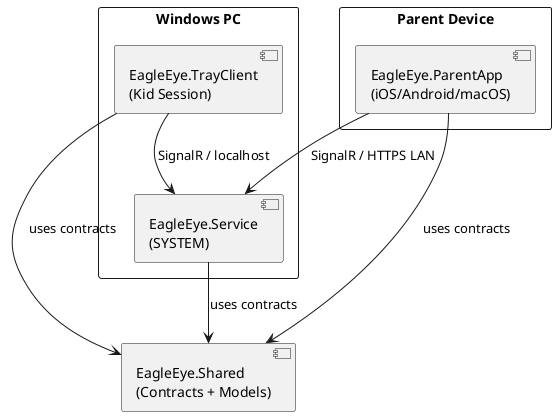

# EagleEye — System Architecture

*Template: arc42 v8 | Status: Draft — to be completed by ARC agent in Phase 2*
*Maintainer: ARC Agent | Last Updated: —*

---

## 1. Introduction and Goals

### 1.1 Requirements Overview

EagleEye is a parental control solution for Windows. It enables parents to:
- Control which applications their children can use on Windows
- Set daily time budgets (in minutes) per application per child user account
- Configure daily pause windows (time-of-day blocks) per weekday
- Monitor application usage statistics remotely

The solution consists of a Windows service, a Windows tray client, and a cross-platform parent app (iOS, Android, macOS).

### 1.2 Quality Goals

| Priority | Quality Goal | Scenario |
|----------|-------------|---------|
| 1 | Reliability | The service must enforce rules even after system reboots |
| 2 | Security | Parent configuration must not be accessible or modifiable by the kid |
| 3 | Usability | Parents must be able to configure the system without technical knowledge |
| 4 | Performance | Process monitoring must not noticeably impact system performance |
| 5 | Maintainability | Code follows clean code principles; each component has a single responsibility |

### 1.3 Stakeholders

| Role | Expectation |
|------|-------------|
| Parent | Remote configuration, usage visibility, reliable enforcement |
| Kid (standard user) | Clear notifications, no unexpected shutdowns without warning |
| Developer | Clean architecture, testable components, clear integration contracts |

---

## 2. Architecture Constraints

| Constraint | Rationale |
|-----------|-----------|
| .NET 10 for all components | Decided in technology_selection.md |
| .NET MAUI for ParentApp | Single codebase for iOS, Android, macOS |
| SignalR for all communication | Covers queries, event push, and pub/sub |
| Windows service runs as SYSTEM | Required for cross-session process monitoring |
| Self-signed TLS, non-expiring | Zero certificate management for end user |
| Local LAN only (Phase 1) | Remote access deferred |
| PowerShell 7.6 for all scripts | Cross-platform on macOS dev machine |
| Inno Setup for Windows installer | Selected installer technology |
| VSCode as primary IDE | Selected IDE |

---

## 3. System Scope and Context

*To be completed by ARC agent — include a context diagram using PlantUML.*

```plantuml
@startuml EagleEye System Context
!include https://raw.githubusercontent.com/plantuml-stdlib/C4-PlantUML/master/C4_Context.puml

' TODO: ARC agent to complete this diagram
Person(parent, "Parent", "Configures rules and views statistics")
Person(kid, "Kid", "Uses Windows PC under parental rules")
System(eagleeye, "EagleEye", "Parental control solution")
System_Ext(windows, "Windows 11", "Kid's PC (standard user account)")

Rel(parent, eagleeye, "Configures via mobile/macOS app", "SignalR/HTTPS LAN")
Rel(eagleeye, kid, "Enforces rules, shows notifications")
Rel(eagleeye, windows, "Monitors processes, enforces restrictions")
@enduml
```

---

## 4. Solution Strategy

*To be completed by ARC agent.*

Key decisions:
- **API-first**: `EagleEye.Shared/Contracts/` defines all SignalR interfaces — changed before any implementation
- **Component architecture**: Each functional area is an explicit component with a single responsibility
- **Trunk-based development**: Short-lived feature branches merged to `main`

---

## 5. Building Block View

*To be completed by ARC agent — component diagram with responsibilities.*

### Level 1 — System Overview



---

## 6. Runtime View

*To be completed by ARC agent — key runtime scenarios as sequence diagrams.*

---

## 7. Deployment View

*To be completed by ARC agent — deployment diagram.*

Key deployment facts:
- `EagleEye.Service` and `EagleEye.TrayClient` installed on Windows 11 (64-bit) via Inno Setup
- `EagleEye.ParentApp` deployed to macOS via .dmg, to iOS/Android via sideloading
- Development: MacBook Air (macOS 26+), Windows 11 in VMware Fusion

---

## 8. Cross-cutting Concepts

*To be completed by ARC agent.*

Topics to cover:
- TLS / certificate management
- Authentication between parent app and Windows service
- Per-user configuration storage on Windows
- Time tracking and budget reset at midnight
- Logging strategy

---

## 9. Architecture Decisions

See `02_Implementation/docs/architecture/decisions/` for individual ADRs.

---

## 10. Quality Requirements

*To be completed by ARC agent — quality scenarios and acceptance criteria.*

---

## 11. Risks and Technical Debt

| Risk | Probability | Impact | Mitigation |
|------|-------------|--------|------------|
| Self-signed cert rejected by iOS/Android | Medium | High | Investigate platform-specific trust mechanisms early |
| Process monitoring performance impact | Low | Medium | Profile during first DEV iteration |
| MAUI limitations on macOS (Catalyst) | Medium | Medium | Validate on real hardware in early iterations |

---

## 12. Glossary

| Term | Definition |
|------|-----------|
| Kid | Standard Windows user account managed by EagleEye |
| Parent | Administrative user who configures EagleEye |
| Pause window | A configured time range per weekday during which no apps are allowed |
| Time budget | Daily allowance in minutes for a specific application |
| TrayClient | The lightweight EagleEye process running in the kid's Windows session |
