# EagleEye — System Architecture

*Template: arc42 v8 | Status: Draft — for Michael's review*
*Maintainer: ARC Agent | Last Updated: 2026-10-03*

> **Amendment 2026-10-03 (ADR-007)**: Windows desktop target added to the ParentApp; two-machine development; manual acceptance testing. Affected: §1.1, §2.1, §2.2, §3.2, §4.2, §5.5, §7, §8.10, §9. Approved status of the 2026-09-20 version is unchanged; the amendments are pending Michael's review.

---

## 1. Introduction and Goals

### 1.1 Requirements Overview

EagleEye is a parental control solution for Windows PCs. It gives parents remote control over which applications their children may use and for how long. The system consists of four components built on .NET 10:

| Component | Role |
|-----------|------|
| **EagleEye.Service** | Windows service (SYSTEM) — process monitoring, enforcement, SignalR hub, data persistence |
| **EagleEye.TrayClient** | Windows tray app (kid's session) — remaining-time display, notifications, pairing code display |
| **EagleEye.ParentApp** | MAUI app (Android + iOS primary for production; Windows client for initial testing; macOS) — remote configuration, statistics, event feed |
| **EagleEye.Shared** | Class library — SignalR contracts, domain models, shared constants |

Core capabilities:

- **Allow-list enforcement**: only parent-approved applications may run; everything else is terminated
- **Time budgets**: per-application, per-weekday daily limits in minutes
- **Pause windows**: per-weekday time-of-day blocks during which all apps are denied
- **Real-time notifications**: budget warnings, enforcement events, pairing codes
- **Remote configuration**: parents manage rules from a mobile or macOS app over the LAN
- **Multi-user**: independent rules and statistics per Windows standard-user account
- **Usage statistics**: 90-day daily-granularity usage history per app per user

### 1.2 Quality Goals

| Priority | Quality Goal | Key Scenario |
|----------|-------------|--------------|
| 1 | **Reliability** | Service survives reboots, session changes, and parent-app disconnects without losing enforcement state or tracked time |
| 2 | **Security** | A standard-user child cannot stop, configure, or bypass the service; only authenticated parent apps may change rules |
| 3 | **Diagnosability** | Every component writes structured log files; debug mode exposes detailed traces with full stack traces and parameter values for rapid root-cause analysis |
| 4 | **Usability** | A non-technical parent can install EagleEye, pair their phone, and configure rules without CLI or certificate management |
| 5 | **Performance** | Process monitoring adds negligible CPU/memory overhead; tray overlay causes no visible frame drops |
| 6 | **Maintainability** | Component architecture with clear boundaries; API-first contracts; testable via DI and interfaces |

### 1.3 Stakeholders

| Role | Expectations |
|------|-------------|
| Parent | Easy remote configuration, reliable enforcement, usage visibility, real-time alerts |
| Kid | Fair warning before shutdowns, clear remaining-time display, no unexpected data loss |
| Developer (Michael) | Clean architecture, testable components, clear contracts, incremental buildability |

---

## 2. Architecture Constraints

### 2.1 Technical Constraints

| Constraint | Source |
|-----------|--------|
| .NET 10 for all components | `technology_selection.md` |
| .NET MAUI for ParentApp (Android, iOS, Windows via WinUI, macOS via Catalyst) | `technology_selection.md`, ADR-007 |
| Each build target is built on its owning machine: Windows machine (Service, TrayClient, ParentApp Windows + Android), MacBook (ParentApp Mac Catalyst) | ADR-007 |
| SignalR (ASP.NET Core) for all inter-component communication | `technology_selection.md`, ADR-001 |
| Windows service runs under SYSTEM account | `questions_and_answers.md` Q2.3 |
| Self-signed TLS certificate, auto-generated, non-expiring | `questions_and_answers.md` Q1.2 |
| Local LAN only (v1) — architecture must not block future WAN | `questions_and_answers.md` Q1.3 |
| PowerShell 7.6 for all scripts and automation | `technology_selection.md` |
| Inno Setup for Windows installer | `technology_selection.md` |
| xUnit + Moq for unit tests | ARC decision |
| SQLite for all persisted application data | Michael's decision (2026-09-20) |
| YAML for application configuration (one file per application) | Michael's decision (2026-09-20) |
| No CI/CD — local PowerShell builds only | `questions_and_answers.md` Q8.1 |

### 2.2 Organizational Constraints

| Constraint | Source |
|-----------|--------|
| Trunk-based development on `main` | `questions_and_answers.md` Q6.2 |
| Monorepo for all components | `questions_and_answers.md` Q6.1 |
| API-first: `EagleEye.Shared/Contracts/` defines interfaces before any implementation | `technology_selection.md` |
| Incremental user-story delivery — one story fully completed before starting the next | `technology_selection.md` |
| Two dev machines (Windows Developer Machine + MacBook) share one repo; the Windows machine is the manual test station | ADR-007 |
| Acceptance/E2E testing is manual (Michael), guided by TES; only unit tests are automated | ADR-007 |
| Android and iOS are the primary production platforms; the Windows parent app is the initial testing vehicle | Product requirements §3.3 (Michael, 2026-10-03) |

### 2.3 Conventions

| Convention | Detail |
|-----------|--------|
| Documentation format | Markdown |
| Diagrams | PlantUML (local Docker server at `http://localhost:8080`) |
| Decision records | ADR format in `docs/architecture/decisions/` |
| Localization | German (default) + English; all user-facing text externalized |

---

## 3. System Scope and Context

### 3.1 Business Context

The system operates entirely within a home LAN. The parent interacts through a mobile/desktop app; the child interacts through the Windows PC. There are no external systems, cloud services, or internet dependencies.

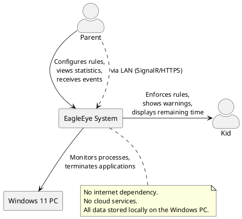
```plantuml
@startuml EagleEye Business Context
skinparam actorStyle awesome
skinparam packageStyle rectangle

actor "Parent" as parent
actor "Kid" as kid

rectangle "EagleEye System" as ee {
}

rectangle "Windows 11 PC" as winpc {
}

parent -right-> ee : Configures rules,\nviews statistics,\nreceives events
ee -right-> kid : Enforces rules,\nshows warnings,\ndisplays remaining time
ee --> winpc : Monitors processes,\nterminates applications
parent ..> ee : via LAN (SignalR/HTTPS)

note bottom of ee
  No internet dependency.
  No cloud services.
  All data stored locally on the Windows PC.
end note
@enduml
```

| Actor / System | Interaction |
|---------------|-------------|
| **Parent** | Connects from mobile/macOS app over LAN. Configures allow-lists, time budgets, pause windows. Views usage statistics. Receives real-time event notifications. |
| **Kid** | Logs into Windows with a standard-user account. Sees tray icon with remaining time. Receives budget/pause warnings. Subject to enforcement. |
| **Windows 11 OS** | Provides process information, user-account discovery, session events. Target of process termination calls. |

### 3.2 Technical Context

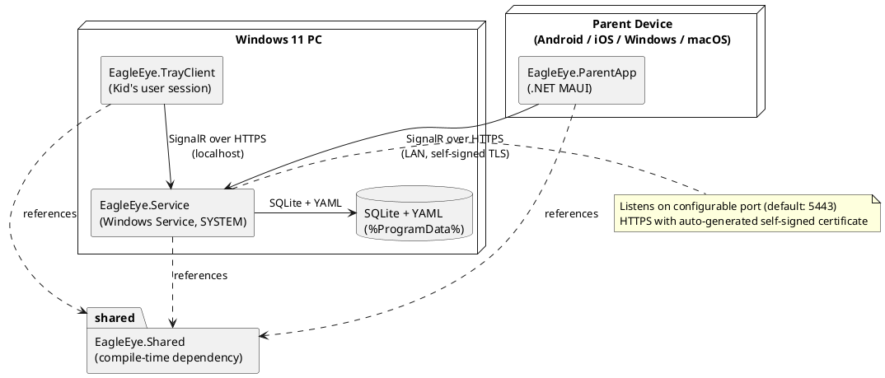
```plantuml
@startuml EagleEye Technical Context
skinparam componentStyle rectangle

node "Windows 11 PC" as winbox {
  component "EagleEye.Service\n(Windows Service, SYSTEM)" as svc
  component "EagleEye.TrayClient\n(Kid's user session)" as tray
  database "SQLite + YAML\n(%ProgramData%)" as store
}

node "Parent Device\n(Android / iOS / Windows / macOS)" as parentdev {
  component "EagleEye.ParentApp\n(.NET MAUI)" as app
}

package "EagleEye.Shared\n(compile-time dependency)" as shared {
}

app -down-> svc : SignalR over HTTPS\n(LAN, self-signed TLS)
tray -down-> svc : SignalR over HTTPS\n(localhost)
svc -right-> store : SQLite + YAML
svc ..> shared : references
app ..> shared : references
tray ..> shared : references

note right of svc
  Listens on configurable port (default: 5443)
  HTTPS with auto-generated self-signed certificate
end note
@enduml
```

| Channel | Protocol | Security | Direction |
|---------|----------|----------|-----------|
| ParentApp → Service | SignalR (WebSocket over HTTPS) | Self-signed TLS + pairing-based auth token | Bidirectional (hub pattern) |
| TrayClient → Service | SignalR (WebSocket over HTTPS) | Self-signed TLS, localhost only, session-identity auth | Bidirectional (hub pattern) |
| Service → Local Storage | SQLite database + YAML config file | Windows ACLs (SYSTEM-owned) | Read/Write |

---

## 4. Solution Strategy

### 4.1 Architecture Approach

| Strategy | Rationale |
|----------|-----------|
| **API-first contracts** | `EagleEye.Shared` defines all SignalR hub interfaces and DTOs before any component implements them. This decouples service and client development and makes the interface specification the single source of truth. |
| **Component-based service** | `EagleEye.Service` is decomposed into internal components by functional area (monitoring, enforcement, configuration, statistics, communication, certificates). Each component has a single responsibility and is injected via DI. |
| **SignalR as the universal transport** | One technology handles all three communication patterns: (1) data queries (parent→server→parent via hub method return values), (2) event pushes (server→clients via client callback interfaces), (3) state synchronization (server broadcasts full state snapshots to all connected clients on every mutation). Two hubs (`ParentHub`, `TrayHub`) separate the authenticated parent-app API from the read-only tray-client API. |
| **Server-authoritative state** | The Windows service is the single source of truth for all state. Clients never cache state as authoritative. Every state mutation triggers a full-state broadcast to all connected clients. On connect/reconnect, the server pushes a complete state snapshot. No delta synchronization — full snapshots eliminate ordering bugs and stale-cache drift. |
| **Localhost separation for TrayClient** | The TrayClient runs in the kid's unprivileged session and connects to the service on `localhost`. It is a display-only client — it cannot modify configuration. |
| **SQLite persistence** | All application data (per-user configuration, statistics, pairing credentials, app-name cache) is stored in a SQLite database per component, located in the OS-standard application data directory. SQLite provides ACID transactions, schema evolution, and efficient queries without an external database server. |
| **YAML application configuration** | Each application has exactly one YAML configuration file (named after the application) that provides all runtime parameters. YAML config files are also stored in the OS-standard application data directory. This separates deployment-time configuration (YAML, human-editable) from runtime application data (SQLite, machine-managed). |
| **Graceful-then-force termination** | Applications are terminated with `WM_CLOSE` first, then `Process.Kill()` after a configurable timeout. This gives users time to save work. |
| **Self-signed TLS, zero-touch** | The service generates a self-signed X.509 certificate on first run and stores it locally. All SignalR connections use HTTPS. No user action required. |

### 4.2 Technology Mapping

| Concern | Technology |
|---------|-----------|
| Service hosting | `Microsoft.Extensions.Hosting.WindowsServices` + Kestrel |
| SignalR server | ASP.NET Core SignalR |
| SignalR client (TrayClient, ParentApp) | `Microsoft.AspNetCore.SignalR.Client` |
| Process monitoring | `System.Diagnostics.Process` + Win32 API (via P/Invoke where needed) |
| TLS certificates | `System.Security.Cryptography.X509Certificates` |
| Cross-platform UI | .NET MAUI (Android, iOS, WinUI, Mac Catalyst) |
| TrayClient UI | WinForms (`NotifyIcon`, `Form` for overlay) |
| Data persistence | SQLite via `Microsoft.Data.Sqlite` (all application data) |
| Application configuration | YAML via `YamlDotNet` (one file per application for runtime parameters) |
| Logging | `Microsoft.Extensions.Logging` with .NET 10 built-in file logging provider |
| DI container | `Microsoft.Extensions.DependencyInjection` (built-in) |
| Unit testing | xUnit + Moq |
| Installer | Inno Setup |

---

## 5. Building Block View

### 5.1 Level 1 — System Decomposition

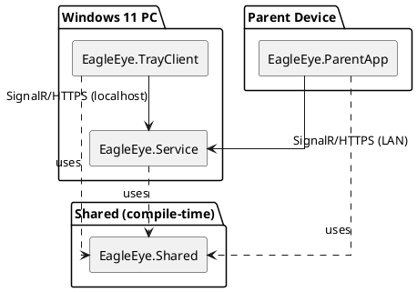
```plantuml
@startuml EagleEye Level 1
skinparam componentStyle rectangle
skinparam linetype ortho

package "Windows 11 PC" {
  component [EagleEye.Service] as SVC {
  }
  component [EagleEye.TrayClient] as TRAY {
  }
}

package "Parent Device" {
  component [EagleEye.ParentApp] as APP {
  }
}

package "Shared (compile-time)" {
  component [EagleEye.Shared] as SHARED {
  }
}

APP --> SVC : SignalR/HTTPS (LAN)
TRAY --> SVC : SignalR/HTTPS (localhost)

SVC ..> SHARED : uses
APP ..> SHARED : uses
TRAY ..> SHARED : uses
@enduml
```

| Component | Responsibility | Technology |
|-----------|---------------|------------|
| **EagleEye.Service** | Process monitoring, enforcement, configuration management, statistics collection, SignalR hub, TLS certificate management, user account discovery, pairing, logging | .NET 10 Windows Service (Kestrel + SignalR) |
| **EagleEye.TrayClient** | System tray icon, remaining-time display, budget/pause notifications, optional overlay, pairing code display | .NET 10 WinForms |
| **EagleEye.ParentApp** | Connection management, pairing flow, allow-list configuration, budget/pause configuration, statistics display, event feed | .NET 10 MAUI |
| **EagleEye.Shared** | SignalR hub/client interface definitions, DTOs, domain models, shared constants, version info | .NET 10 class library (netstandard-compatible TFMs as needed) |

### 5.2 Level 2 — EagleEye.Service Internal Components

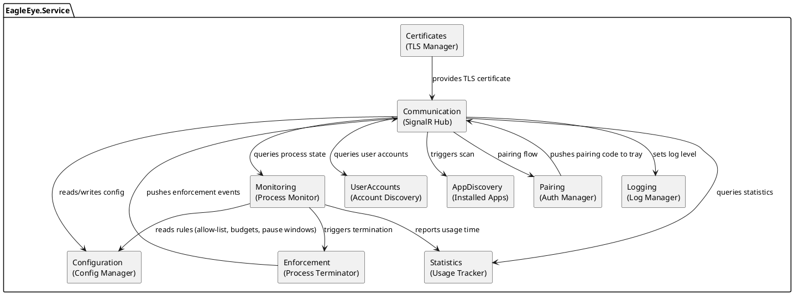
```plantuml
@startuml EagleEye Service Level 2
skinparam componentStyle rectangle

package "EagleEye.Service" {
  component [Communication\n(SignalR Hub)] as COMM
  component [Monitoring\n(Process Monitor)] as MON
  component [Enforcement\n(Process Terminator)] as ENF
  component [Configuration\n(Config Manager)] as CONF
  component [Statistics\n(Usage Tracker)] as STATS
  component [Certificates\n(TLS Manager)] as CERT
  component [UserAccounts\n(Account Discovery)] as USERS
  component [Pairing\n(Auth Manager)] as PAIR
  component [AppDiscovery\n(Installed Apps)] as APPS
  component [Logging\n(Log Manager)] as LOG
}

COMM --> CONF : reads/writes config
COMM --> STATS : queries statistics
COMM --> USERS : queries user accounts
COMM --> APPS : triggers scan
COMM --> PAIR : pairing flow
COMM --> MON : queries process state
COMM --> LOG : sets log level

MON --> ENF : triggers termination
MON --> STATS : reports usage time
MON --> CONF : reads rules (allow-list, budgets, pause windows)

ENF --> COMM : pushes enforcement events

CERT --> COMM : provides TLS certificate

PAIR --> COMM : pushes pairing code to tray
@enduml
```

| Internal Component | Responsibility |
|-------------------|---------------|
| **Communication** | Hosts two SignalR hubs on Kestrel: `ParentHub` (`/hubs/parent`) for authenticated parent apps and `TrayHub` (`/hubs/tray`) for tray clients. Routes incoming queries to the appropriate component, returns results. Pushes events and full-state snapshots to connected clients via SignalR groups (`Parents`, `Tray:{userSid}`). Broadcasts updated state to all clients after every mutation. Pushes complete state snapshot on client connect/reconnect. |
| **Monitoring** | Polls running processes at a configurable interval. Classifies processes as ignored/allowed/blocked. Tracks active usage time per allowed app. Detects pause-window and budget-expiry transitions. |
| **Enforcement** | Terminates processes using the two-phase graceful-then-force pattern (ADR-006): sends `WM_CLOSE` first, waits up to the configurable timeout (default 30s), then calls `Process.Kill(entireProcessTree: true)`. Used for blocked-app kills (immediate, no warning), budget-expiry shutdowns (after budget warnings), and pause-window shutdowns (after pause warnings). Pushes enforcement events to all connected clients. |
| **Configuration** | Reads and writes per-user configuration in the SQLite database (allow-lists, budgets, pause windows). Reads general settings from the YAML config file. Validates changes. Notifies other components on config update. |
| **Statistics** | Accumulates per-user, per-app daily usage minutes. Persists to SQLite. Serves historical data (up to 90 days). Purges old data. |
| **Certificates** | Generates a self-signed X.509 certificate on first run. Loads and provides the certificate for Kestrel HTTPS binding. |
| **UserAccounts** | Discovers local standard (non-admin) Windows user accounts via Win32 API. Provides the list to the Communication component for parent-app queries. |
| **Pairing** | Manages the pairing lifecycle: generates 6-digit codes, enforces 5-minute expiry, validates submissions, stores paired-device credentials in SQLite. Rejects unpaired clients. |
| **AppDiscovery** | Scans installed applications (registry, Start Menu, file metadata). Resolves human-readable display names. Caches the name dictionary. Supports re-scan on demand. |
| **Logging** | Configures the `Microsoft.Extensions.Logging` pipeline for file output. Supports runtime log-level switching (normal ↔ debug) via parent app command. Manages rolling log files (50 MB max, 3 files retained). In debug mode, logs method traces with parameter values and full stack traces. Never logs sensitive data. |

### 5.3 Level 2 — EagleEye.Shared

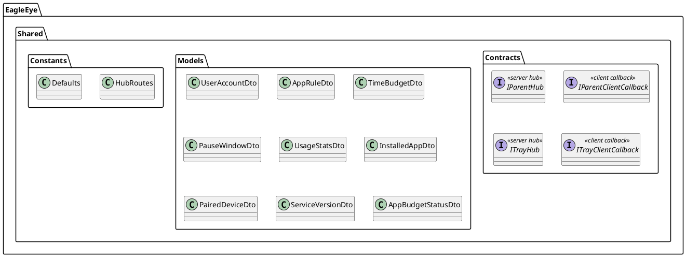
```plantuml
@startuml EagleEye Shared Level 2
skinparam componentStyle rectangle

package "EagleEye.Shared" {
  package "Contracts" {
    interface IParentHub <<server hub>>
    interface IParentClientCallback <<client callback>>
    interface ITrayHub <<server hub>>
    interface ITrayClientCallback <<client callback>>
  }
  package "Models" {
    class UserAccountDto
    class AppRuleDto
    class TimeBudgetDto
    class PauseWindowDto
    class UsageStatsDto
    class InstalledAppDto
    class PairedDeviceDto
    class ServiceVersionDto
    class AppBudgetStatusDto
  }
  package "Constants" {
    class HubRoutes
    class Defaults
  }
}
@enduml
```

| Package | Contents |
|---------|----------|
| **Contracts** | `IParentHub` — methods the server exposes to parent apps (data queries with `Task<T>` return values, config/rule update commands, pairing). `IParentClientCallback` — callbacks the server invokes on parent apps (enforcement events, state-change broadcasts, pairing codes). `ITrayHub` — methods the server exposes to tray clients (session registration, version query). `ITrayClientCallback` — callbacks the server invokes on tray clients (budget updates, warnings, pairing code display, enforcement notices). |
| **Models** | DTOs for all data exchanged over SignalR: user accounts, app rules, budgets, pause windows, statistics, installed apps, paired devices, version info, budget status. All used as full-state snapshots in server broadcasts. |
| **Constants** | Hub route paths (`/hubs/parent`, `/hubs/tray`), default values (timeouts, warning thresholds, port numbers). |

### 5.4 Level 2 — EagleEye.TrayClient

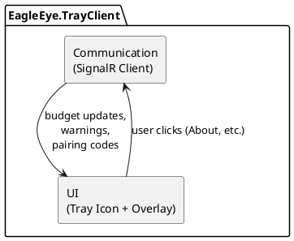
```plantuml
@startuml EagleEye TrayClient Level 2
skinparam componentStyle rectangle

package "EagleEye.TrayClient" {
  component [Communication\n(SignalR Client)] as TC_COMM
  component [UI\n(Tray Icon + Overlay)] as TC_UI
}

TC_COMM --> TC_UI : budget updates,\nwarnings,\npairing codes
TC_UI --> TC_COMM : user clicks (About, etc.)
@enduml
```

| Internal Component | Responsibility |
|-------------------|---------------|
| **Communication** | Connects to the service on `localhost`. Receives budget updates, warnings, pairing codes. Sends version query. Handles reconnect on disconnect. |
| **UI** | Manages the `NotifyIcon` (system tray), popup notifications (balloon tips), remaining-time summary window, optional topmost overlay, About dialog, connection-status indicator. |

### 5.5 Level 2 — EagleEye.ParentApp

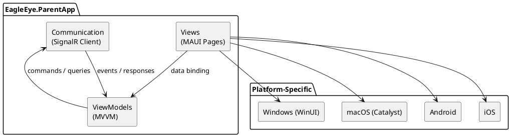
```plantuml
@startuml EagleEye ParentApp Level 2
skinparam componentStyle rectangle

package "EagleEye.ParentApp" {
  component [Communication\n(SignalR Client)] as PA_COMM
  component [ViewModels\n(MVVM)] as PA_VM
  component [Views\n(MAUI Pages)] as PA_VIEWS
}

package "Platform-Specific" {
  component [Windows (WinUI)] as WIN
  component [macOS (Catalyst)] as MAC
  component [Android] as AND
  component [iOS] as IOS
}

PA_VIEWS --> PA_VM : data binding
PA_VM --> PA_COMM : commands / queries
PA_COMM --> PA_VM : events / responses
PA_VIEWS --> WIN
PA_VIEWS --> MAC
PA_VIEWS --> AND
PA_VIEWS --> IOS
@enduml
```

| Internal Component | Responsibility |
|-------------------|---------------|
| **Communication** | Manages the SignalR connection to the service (connect, reconnect, disconnect). Handles pairing handshake. Sends configuration commands. Receives events and data responses. |
| **ViewModels** | MVVM view models for each screen. Expose commands (save rules, trigger re-scan) and observable properties (user list, app list, stats). |
| **Views** | MAUI ContentPages for: connection/pairing, user selection, allow-list management, budget configuration, pause-window configuration, statistics, event feed, paired-devices management. |
| **Platform-Specific** | Android/iOS (primary production platforms): portrait lock, platform entry points. macOS (Catalyst) and Windows (WinUI): desktop window sizing. Windows + Android targets are built on the Windows machine; Mac Catalyst + iOS on the MacBook (ADR-007). |

**Windows parent app** (product requirements §3.3.9): the initial testing vehicle for parent-side features. It is a normal `ParentHub` client with no special local access path. On the service PC it connects through the same TLS + pairing flow as a remote client (to `localhost` or the machine's own hostname). It is deployed by copying a single executable.

---

## 6. Runtime View

### 6.1 Parent App Pairing

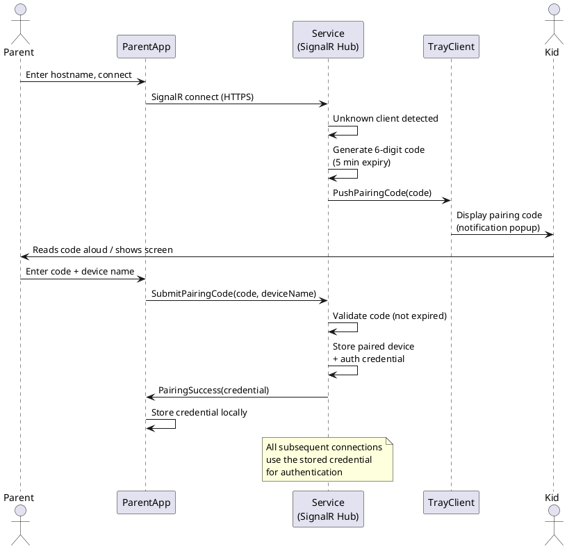
```plantuml
@startuml Pairing Sequence
actor Parent
participant "ParentApp" as APP
participant "Service\n(SignalR Hub)" as SVC
participant "TrayClient" as TRAY
actor Kid

Parent -> APP : Enter hostname, connect
APP -> SVC : SignalR connect (HTTPS)
SVC -> SVC : Unknown client detected
SVC -> SVC : Generate 6-digit code\n(5 min expiry)
SVC -> TRAY : PushPairingCode(code)
TRAY -> Kid : Display pairing code\n(notification popup)
Kid -> Parent : Reads code aloud / shows screen
Parent -> APP : Enter code + device name
APP -> SVC : SubmitPairingCode(code, deviceName)
SVC -> SVC : Validate code (not expired)
SVC -> SVC : Store paired device\n+ auth credential
SVC -> APP : PairingSuccess(credential)
APP -> APP : Store credential locally

note over SVC
  All subsequent connections
  use the stored credential
  for authentication
end note
@enduml
```

### 6.2 Process Monitoring and Enforcement

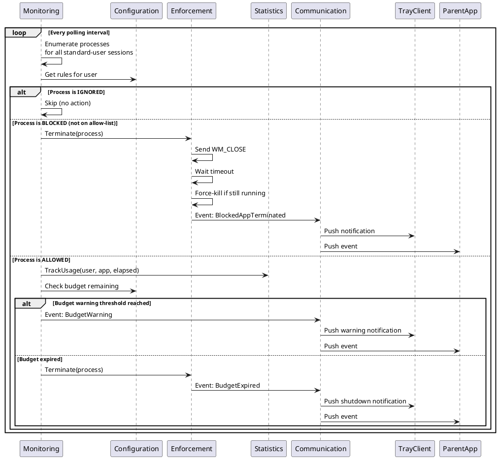
```plantuml
@startuml Process Monitoring
participant "Monitoring" as MON
participant "Configuration" as CONF
participant "Enforcement" as ENF
participant "Statistics" as STATS
participant "Communication" as COMM
participant "TrayClient" as TRAY
participant "ParentApp" as APP

loop Every polling interval
  MON -> MON : Enumerate processes\nfor all standard-user sessions
  MON -> CONF : Get rules for user
  
  alt Process is IGNORED
    MON -> MON : Skip (no action)
  else Process is BLOCKED (not on allow-list)
    MON -> ENF : Terminate(process)
    ENF -> ENF : Send WM_CLOSE
    ENF -> ENF : Wait timeout
    ENF -> ENF : Force-kill if still running
    ENF -> COMM : Event: BlockedAppTerminated
    COMM -> TRAY : Push notification
    COMM -> APP : Push event
  else Process is ALLOWED
    MON -> STATS : TrackUsage(user, app, elapsed)
    MON -> CONF : Check budget remaining
    
    alt Budget warning threshold reached
      MON -> COMM : Event: BudgetWarning
      COMM -> TRAY : Push warning notification
      COMM -> APP : Push event
    else Budget expired
      MON -> ENF : Terminate(process)
      ENF -> COMM : Event: BudgetExpired
      COMM -> TRAY : Push shutdown notification
      COMM -> APP : Push event
    end
  end
end
@enduml
```

### 6.3 Pause Window Enforcement

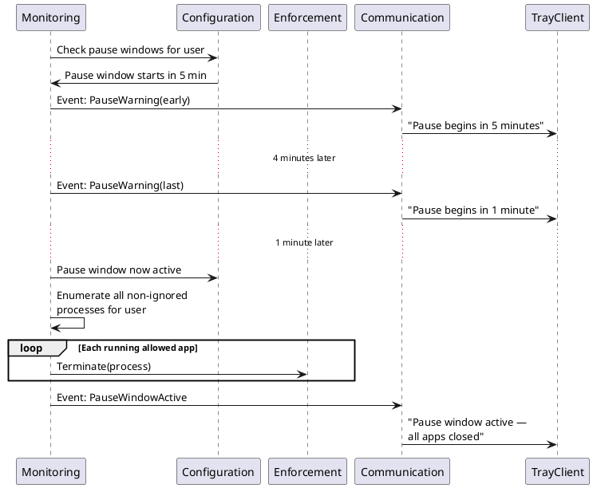
```plantuml
@startuml Pause Window
participant "Monitoring" as MON
participant "Configuration" as CONF
participant "Enforcement" as ENF
participant "Communication" as COMM
participant "TrayClient" as TRAY

MON -> CONF : Check pause windows for user
CONF -> MON : Pause window starts in 5 min

MON -> COMM : Event: PauseWarning(early)
COMM -> TRAY : "Pause begins in 5 minutes"

... 4 minutes later ...

MON -> COMM : Event: PauseWarning(last)
COMM -> TRAY : "Pause begins in 1 minute"

... 1 minute later ...

MON -> CONF : Pause window now active
MON -> MON : Enumerate all non-ignored\nprocesses for user
loop Each running allowed app
  MON -> ENF : Terminate(process)
end
MON -> COMM : Event: PauseWindowActive
COMM -> TRAY : "Pause window active —\nall apps closed"
@enduml
```

### 6.4 Configuration Update from Parent App

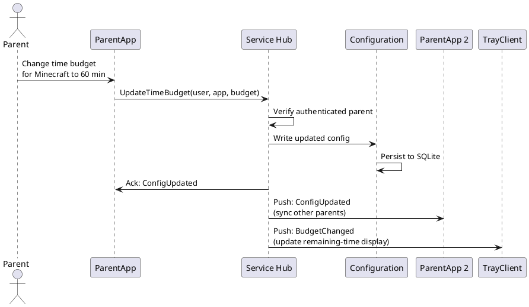
```plantuml
@startuml Config Update
actor Parent
participant "ParentApp" as APP
participant "Service Hub" as SVC
participant "Configuration" as CONF
participant "ParentApp 2" as APP2
participant "TrayClient" as TRAY

Parent -> APP : Change time budget\nfor Minecraft to 60 min
APP -> SVC : UpdateTimeBudget(user, app, budget)
SVC -> SVC : Verify authenticated parent
SVC -> CONF : Write updated config
CONF -> CONF : Persist to SQLite
SVC -> APP : Ack: ConfigUpdated
SVC -> APP2 : Push: ConfigUpdated\n(sync other parents)
SVC -> TRAY : Push: BudgetChanged\n(update remaining-time display)
@enduml
```

### 6.5 TrayClient Startup and Reconnect

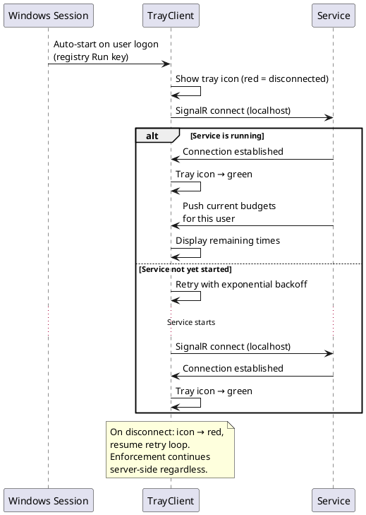
```plantuml
@startuml TrayClient Startup
participant "Windows Session" as WIN
participant "TrayClient" as TRAY
participant "Service" as SVC

WIN -> TRAY : Auto-start on user logon\n(registry Run key)
TRAY -> TRAY : Show tray icon (red = disconnected)
TRAY -> SVC : SignalR connect (localhost)

alt Service is running
  SVC -> TRAY : Connection established
  TRAY -> TRAY : Tray icon → green
  SVC -> TRAY : Push current budgets\nfor this user
  TRAY -> TRAY : Display remaining times
else Service not yet started
  TRAY -> TRAY : Retry with exponential backoff
  ... Service starts ...
  TRAY -> SVC : SignalR connect (localhost)
  SVC -> TRAY : Connection established
  TRAY -> TRAY : Tray icon → green
end

note over TRAY
  On disconnect: icon → red,
  resume retry loop.
  Enforcement continues
  server-side regardless.
end note
@enduml
```

---

## 7. Deployment View

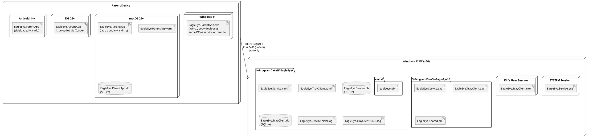
```plantuml
@startuml EagleEye Deployment
skinparam nodeStyle rectangle

node "Windows 11 PC (x64)" as winpc {
  node "SYSTEM Session" {
    artifact "EagleEye.Service.exe" as svc_exe
  }
  node "Kid's User Session" {
    artifact "EagleEye.TrayClient.exe" as tray_exe
  }
  folder "%ProgramFiles%\\EagleEye\\" as install {
    artifact "EagleEye.Service.exe"
    artifact "EagleEye.TrayClient.exe"
    artifact "EagleEye.Shared.dll"
  }
  folder "%ProgramData%\\EagleEye\\" as data {
    artifact "EagleEye.Service.yaml" as svc_yaml
    artifact "EagleEye.TrayClient.yaml" as tray_yaml
    database "EagleEye.Service.db\n(SQLite)" as svc_db
    database "EagleEye.TrayClient.db\n(SQLite)" as tray_db
    artifact "EagleEye.Service-NNN.log" as svc_log
    artifact "EagleEye.TrayClient-NNN.log" as tray_log
    folder "certs/" {
      artifact "eagleeye.pfx"
    }
  }
}

node "Parent Device" as parentdev {
  node "Windows 11" {
    artifact "EagleEye.ParentApp.exe\n(WinUI, copy-deployed)\nsame PC as service or remote"
  }
  node "macOS 26+" {
    artifact "EagleEye.ParentApp\n(.app bundle via .dmg)"
    artifact "EagleEye.ParentApp.yaml" as mac_yaml
    database "EagleEye.ParentApp.db\n(SQLite)" as mac_db
  }
  node "iOS 26+" {
    artifact "EagleEye.ParentApp\n(sideloaded via Xcode)"
  }
  node "Android 14+" {
    artifact "EagleEye.ParentApp\n(sideloaded via adb)"
  }
}

parentdev --> winpc : HTTPS (SignalR)\nPort 5443 (default)\nLAN only
@enduml
```

### 7.1 Windows Installation Layout

| Path | Contents | Owner |
|------|----------|-------|
| `%ProgramFiles%\EagleEye\` | Service executable, TrayClient executable, shared DLLs, dependencies | Installer (admin) |
| `%ProgramData%\EagleEye\EagleEye.Service.yaml` | Service runtime configuration (port, timeouts, warning thresholds, log level) | SYSTEM (r/w), admin (r/w) |
| `%ProgramData%\EagleEye\EagleEye.TrayClient.yaml` | TrayClient runtime configuration (service URL, overlay preferences) | SYSTEM (r/w), admin (r/w) |
| `%ProgramData%\EagleEye\EagleEye.Service.db` | SQLite database — per-user config, statistics, paired devices, app-name cache | SYSTEM (r/w) |
| `%ProgramData%\EagleEye\EagleEye.TrayClient.db` | SQLite database — cached display state (optional, lightweight) | Standard user (r/w) |
| `%ProgramData%\EagleEye\EagleEye.Service-NNN.log` | Service rolling log files (50 MB max, 3 files) | SYSTEM (r/w) |
| `%ProgramData%\EagleEye\EagleEye.TrayClient-NNN.log` | TrayClient rolling log files (50 MB max, 3 files) | Standard user (r/w) |
| `%ProgramData%\EagleEye\certs\` | Auto-generated self-signed certificate `eagleeye.pfx` | SYSTEM (r/w) |

### 7.1.1 Parent App Data Locations

Each parent app instance stores its YAML config and SQLite database in the OS-standard application data directory:

| Platform | Config File | Database | Location |
|----------|------------|----------|----------|
| Windows | `EagleEye.ParentApp.yaml` | `EagleEye.ParentApp.db` | `%LocalAppData%\EagleEye\` (per parent user) |
| macOS | `EagleEye.ParentApp.yaml` | `EagleEye.ParentApp.db` | `~/Library/Application Support/EagleEye/` |
| iOS | `EagleEye.ParentApp.yaml` | `EagleEye.ParentApp.db` | App sandbox `Documents/` |
| Android | `EagleEye.ParentApp.yaml` | `EagleEye.ParentApp.db` | App internal storage |

### 7.2 Windows Service Registration

- Registered via Inno Setup as an auto-start Windows service under the SYSTEM account
- Service name: `EagleEyeService`
- Start type: Automatic (starts on boot)
- Recovery: Restart on failure (first, second, subsequent)

### 7.3 TrayClient Auto-Start

- Registered via Inno Setup in `HKCU\Software\Microsoft\Windows\CurrentVersion\Run` for each standard user, or via `HKLM` with a per-user launch mechanism
- Starts automatically when a standard-user session begins
- Does not require admin privileges to run

### 7.4 Parent App Distribution

| Platform | Distribution | Package |
|----------|-------------|---------|
| Windows 11 | Copy deployment: single executable, no installer (FR-APP-092). Runs on the service PC or remotely. | `EagleEye.ParentApp.exe` |
| macOS 26+ | Direct download | `.dmg` with `.app` bundle |
| iOS 26+ (built on MacBook) | Sideload | Xcode / `ios-deploy` |
| Android 14+ | Sideload (built on Windows machine) | `adb install` APK |

---

## 8. Cross-cutting Concepts

### 8.1 TLS and Certificate Management

The service uses HTTPS for all SignalR connections. On first startup:

1. **Generate**: Create a self-signed X.509 certificate (RSA 2048+ or ECDSA P-256) with `CN=EagleEye`, no expiration (or 100-year validity)
2. **Store**: Save as `%ProgramData%\EagleEye\certs\eagleeye.pfx` (password-protected, password derived from machine-specific data)
3. **Bind**: Configure Kestrel to use the certificate for HTTPS on the configured port (default 5443)
4. **Subsequent starts**: Load the existing certificate from disk

The ParentApp and TrayClient must accept the self-signed certificate. The SignalR client is configured with `HttpClientHandler.ServerCertificateCustomValidationCallback` to trust the service's certificate (the ParentApp can optionally pin the certificate thumbprint after first successful pairing).

### 8.2 Authentication and Authorization

See ADR-004 for the full rationale and pairing flow details.

| Client | Auth Mechanism | Permissions |
|--------|---------------|------------|
| **Paired ParentApp** | Persistent token (256-bit, cryptographically random) issued during pairing | Full: read/write config, read stats, read users, manage pairings, set log level |
| **Unpaired ParentApp** | None (anonymous) | Only: invoke `SubmitPairingCode` on `ParentHub` |
| **TrayClient** | Session identity (localhost + user SID) | Read-only: receive own user's budget info, warnings, pairing codes. No config changes. |

**Pairing flow**: Unknown client connects → service generates a 6-digit code (5-minute expiry) → code displayed via TrayClient popup (or written to Windows Event Log if no TrayClient is connected) → parent enters code + device name → service validates → issues a 256-bit token → both sides store it.

**Token security**: Tokens are generated via `System.Security.Cryptography.RandomNumberGenerator`. The service stores only the **SHA-256 hash** of each token in the `PairedDevices` SQLite table, never the plaintext. The parent app stores the plaintext token locally. Tokens are transmitted only over TLS and never appear in logs.

**Subsequent connections**: The parent app includes its token in the SignalR handshake. The service hashes it, looks up the hash in `PairedDevices`, and authenticates the connection if found. Unmatched tokens are rejected — the client is treated as unpaired.

**Device management**: Multiple parent apps may be paired simultaneously. Any paired app can view all paired devices and de-register any device (including itself). De-registration deletes the token hash; the affected device must re-pair.

### 8.3 SignalR Communication Design

EagleEye uses two SignalR hubs, three communication patterns, and a server-authoritative state model. See ADR-003 for the full rationale.

#### Two Hubs

| Hub | Route | Client | Auth | Role |
|-----|-------|--------|------|------|
| `ParentHub` | `/hubs/parent` | ParentApp | Pairing credential required | Queries, commands, receives events and state broadcasts |
| `TrayHub` | `/hubs/tray` | TrayClient | Localhost + user SID | Registers session, receives budget info, warnings, pairing codes |

Both hubs run on the same Kestrel process, same port, same TLS certificate.

#### Pattern 1 — Data Queries (request/response)

Parent apps invoke methods on `ParentHub` that return `Task<T>`. The server processes the request and returns the result on the same connection. This covers: querying user accounts, configuration, statistics, installed apps, paired devices, and service version.

The TrayClient has no query methods beyond `RegisterSession` and `GetServiceVersion`. It receives all data via server push.

#### Pattern 2 — Event Pushes (server → clients)

The server pushes events to clients by invoking methods on the client callback interfaces (`IParentClientCallback`, `ITrayClientCallback`). Examples: enforcement events (blocked app terminated, budget expired), system events (user session started/ended), pairing code display. Pushes are targeted via SignalR groups:

| Group | Members | Purpose |
|-------|---------|---------|
| `Parents` | All authenticated parent app connections | Config changes, enforcement events, account/app list changes |
| `Tray:{userSid}` | TrayClient for a specific user session | Budget updates, warnings, pairing codes — scoped to that user |

#### Pattern 3 — State Synchronization (server-authoritative)

The Windows service is the **single source of truth**. Four rules govern synchronization:

1. **Every mutation triggers a broadcast.** When any state changes — parent command, internal event, timed action — the server broadcasts the updated state to all connected clients that need it. The calling parent app also receives the broadcast and replaces its local state with the server-confirmed version.

2. **Full state snapshots, not deltas.** Broadcasts carry the complete current state of the affected data (e.g., full `UserConfigDto`, full `List<PairedDeviceDto>`). No incremental deltas — this eliminates ordering bugs, missed-update drift, and reconciliation logic.

3. **Full state push on connect/reconnect.** When a client connects or reconnects, the server immediately pushes a complete state snapshot. Parent apps receive: all user accounts, config per user, today's stats, installed apps, paired devices. Tray clients receive: current budget status for their user, active pause-window state.

4. **Clients never cache state as authoritative.** Clients hold state in memory for display but never treat it as the source of truth. They send commands ("set budget to X"), and the server responds with the confirmed new state via broadcast. If a client needs current data, it uses what the server last pushed or invokes a query.

### 8.4 Data Persistence (SQLite)

All application data is stored in SQLite databases. Each EagleEye component has its own database file, located in the OS-standard application data directory for that platform.

**EagleEye.Service** (`EagleEye.Service.db`) tables include:

- **UserConfig** — per-user allow-list, per-app time budgets (7 weekdays), pause windows (7 weekdays). Keyed by Windows SID (survives username renames).
- **UsageStatistics** — per-user, per-app daily usage minutes. Indexed by date. Rows older than 90 days are purged automatically during the midnight maintenance cycle.
- **PairedDevices** — registered parent apps with device names and authentication credentials.
- **AppNameCache** — dictionary mapping executable names to resolved human-readable display names.
- **IgnoreList** — shipped list of essential Windows process names (read-only at runtime, seeded by installer/migration).

**EagleEye.ParentApp** (`EagleEye.ParentApp.db`) tables include:

- **ServerConnections** — stored service endpoints (hostname/IP) and pairing credentials for each connected service.
- **CachedState** — last-known configuration and statistics for offline display.

**EagleEye.TrayClient** (`EagleEye.TrayClient.db`) — optional, lightweight cache for display state.

SQLite is accessed via `Microsoft.Data.Sqlite`. All write operations use transactions. WAL (Write-Ahead Logging) mode is enabled for concurrent read performance. Schema migrations are versioned and applied automatically on startup.

### 8.5 Application Configuration (YAML)

Each application has exactly one YAML configuration file, named after the application, that provides all runtime parameters. YAML files are stored in the OS-standard application data directory alongside the SQLite database.

**Separation principle**: YAML files contain *deployment-time configuration* — values that an administrator might edit before or between runs (ports, paths, timeouts, feature toggles). SQLite databases contain *runtime application data* — values that the application creates and manages during operation (user rules, statistics, credentials).

**EagleEye.Service.yaml** — example structure:

```yaml
server:
  port: 5443
  graceful_shutdown_timeout_seconds: 30
enforcement:
  poll_interval_seconds: 5
  budget_early_warning_minutes: 5
  budget_last_warning_minutes: 1
  pause_early_warning_minutes: 5
  pause_last_warning_minutes: 1
logging:
  debug_mode: false     # true = Debug+Trace levels enabled
```

**EagleEye.TrayClient.yaml** — example structure:

```yaml
service:
  url: https://localhost:5443
overlay:
  enabled: false
  opacity: 0.8
logging:
  debug_mode: false
```

**EagleEye.ParentApp.yaml** — example structure:

```yaml
display:
  language: de    # de | en
logging:
  debug_mode: false
```

YAML files are parsed at startup using `YamlDotNet`. If a YAML file is missing, the application creates one with default values on first run.

### 8.6 Statistics Retention

Usage statistics in `EagleEye.Service.db` are retained for 90 days at daily granularity (minutes of use per application per day per user). Data older than 90 days is purged automatically during the daily midnight maintenance cycle.

### 8.7 Time Tracking and Budget Reset

- The Monitoring component tracks elapsed time per allowed process per user, accumulating at each poll interval
- Tracked time is persisted to the SQLite database periodically (every N minutes and on service shutdown) to survive service restarts
- At midnight (local time), all daily budgets reset. Unused time does not carry over. The midnight transition also triggers statistics persistence and old-data purge
- Budget countdown pauses during pause windows (time during pause does not consume budget)

### 8.8 Process Classification

See ADR-005 for the full rationale, ignore-list examples, and alternatives considered.

Every process running under a standard-user session is classified into exactly one of three tiers, evaluated in priority order:

| Tier | Category | Source | Matching | Action |
|------|----------|--------|----------|--------|
| 1 | **Ignored** | Shipped, developer-maintained, non-configurable | Executable name (case-insensitive) in `IgnoreList` SQLite table | Skip — never terminated, never tracked |
| 2 | **Allowed** | Parent-configured per user via parent app | Executable name (case-insensitive) in user's allow-list (`UserConfig` SQLite table) | Track usage time, enforce budget and pause rules |
| 3 | **Blocked** | Default — everything not in tiers 1 or 2 | N/A | Terminate immediately (graceful-then-force, ADR-006) |

**Evaluation**: Both the ignore list and allow-list are loaded into in-memory hash sets for O(1) lookup, refreshed on configuration change. Classification runs on every poll cycle for every process in every standard-user session. Admin sessions are never monitored (per MU-014).

**Deny-by-default**: the blocked tier is the default. Any new or unknown application is blocked unless the parent has explicitly allowed it. This guarantees no gaps in enforcement.

**Display-name resolution**: Handled by AppDiscovery (file version info → installed-programs registry → optional online lookup → executable name fallback). Cached in the SQLite `AppNameCache` table. Display names are for the parent-app UI only — classification always uses the executable file name.

### 8.9 Process Termination Pattern

See ADR-006 for the full rationale, alternatives considered, and the complete termination sequence.

All process terminations use a **two-phase graceful-then-force pattern**:

| Phase | Mechanism | Timeout |
|-------|-----------|---------|
| 1. Graceful | `WM_CLOSE` to the process's main window (via `Process.CloseMainWindow()`) | Configurable (default: 30s, min: 5s, max: 120s) |
| 2. Force | `Process.Kill(entireProcessTree: true)` — kills the process and all child processes | Immediate |

If the process has no main window, Phase 1 is skipped and Phase 2 executes immediately.

**Termination triggers and warning behavior**:

| Trigger | Pre-termination Warnings | Termination |
|---------|------------------------|-------------|
| **Blocked app** (Tier 3) | None — immediate | Graceful-then-force on detection |
| **Budget expired** | Early warning (default: 5 min before) + last warning (default: 1 min before) | Graceful-then-force when budget reaches zero |
| **Pause window** | Early warning (default: 5 min before) + last warning (default: 1 min before) | Graceful-then-force when pause window begins |

Warning thresholds are independently configurable for budget and pause scenarios via `EagleEye.Service.yaml`. Warnings are advisory — they do not delay enforcement.

The timeout is a global setting (`enforcement.graceful_shutdown_timeout_seconds` in `EagleEye.Service.yaml`), applied uniformly to all termination scenarios.

### 8.10 Logging Strategy

Diagnosability is a primary design principle: **every EagleEye component writes log files**. Logging is not optional or service-only — the Service, TrayClient, and ParentApp all log to files using the same framework and conventions.

#### Framework

- `Microsoft.Extensions.Logging` with the built-in .NET 10 file logging provider (no third-party sinks)
- All components use the standard `ILogger<T>` / `ILoggerFactory` abstractions via DI

#### Log Modes

Each application supports two modes, controlled via its YAML configuration file (`logging.debug_mode: true|false`):

| Mode | Levels Logged | Content |
|------|--------------|---------|
| **Normal** (default) | Error, Warning, Information | Operational events: enforcement actions, configuration changes, pairing events, connection lifecycle, startup/shutdown, errors with exception messages |
| **Debug** | Error, Warning, Information, Debug, Trace | Everything from normal mode plus: internal state transitions, method entry/exit traces with parameter values, full stack traces on all exceptions, SignalR message payloads, process enumeration details, SQL queries |

Debug mode can be toggled at runtime for the Service via a parent app command (no restart required). For TrayClient and ParentApp, changing the YAML setting requires an application restart.

#### File Management

| Setting | Value |
|---------|-------|
| Maximum file size | 50 MB per log file |
| Maximum file count | 3 rolling files per application (oldest deleted when a 4th would be created) |
| File location | Same OS-standard application data directory as the SQLite database and YAML config |
| Naming | `{ApplicationName}-{sequence}.log` (e.g., `EagleEye.Service-001.log`) |

Log file locations per component:

| Component | Log Directory |
|-----------|--------------|
| EagleEye.Service | `%ProgramData%\EagleEye\` |
| EagleEye.TrayClient | `%ProgramData%\EagleEye\` |
| EagleEye.ParentApp (Windows) | `%LocalAppData%\EagleEye\` |
| EagleEye.ParentApp (macOS) | `~/Library/Application Support/EagleEye/` |
| EagleEye.ParentApp (iOS) | App sandbox `Documents/` |
| EagleEye.ParentApp (Android) | App internal storage |

#### Security Rule

**Sensitive data must never be logged**, regardless of log level. This includes:

- Passwords, pairing codes, authentication tokens/credentials
- Certificate private keys
- Any value that could be used to impersonate a paired device

Sensitive values are replaced with `***` in log output. This rule is enforced by code review — there is no runtime redaction filter.

### 8.11 Error Handling and Resilience

| Scenario | Behavior |
|----------|----------|
| Service crash/restart | Budget tracking resumes from last persisted state. Configuration is intact in SQLite. |
| TrayClient crash | Service continues enforcing. TrayClient auto-restarts via session Run key. |
| ParentApp disconnects | Service continues enforcing stored rules. ParentApp reconnects automatically. |
| SignalR connection lost (LAN) | Clients retry with exponential backoff. Service pushes full state on reconnect. |
| Disk full / write error | Service logs error, continues enforcing from in-memory state. |

### 8.12 Dependency Injection

All service components are registered in the DI container and injected via constructor injection:

```
Host.CreateDefaultBuilder(args)
    .UseWindowsService()
    .ConfigureServices(services =>
    {
        services.AddSingleton<ICertificateManager, CertificateManager>();
        services.AddSingleton<IConfigurationManager, ConfigurationManager>();
        services.AddSingleton<IUserAccountDiscovery, UserAccountDiscovery>();
        services.AddSingleton<IAppDiscovery, AppDiscovery>();
        services.AddSingleton<IPairingManager, PairingManager>();
        services.AddSingleton<IStatisticsCollector, StatisticsCollector>();
        services.AddSingleton<IProcessMonitor, ProcessMonitor>();
        services.AddSingleton<IProcessEnforcer, ProcessEnforcer>();
        // SignalR, Kestrel, logging configured here
    });
```

Each component depends on interfaces, not concrete types, enabling unit testing with Moq.

### 8.13 Localization

- All user-facing strings (TrayClient notifications, ParentApp labels) are externalized into resource files
- Default language: German (`de`). Secondary: English (`en`)
- Service log messages are in English (developer audience)
- Resource files are per-component (`EagleEye.TrayClient/Resources/`, `EagleEye.ParentApp/Resources/`)

---

## 9. Architecture Decisions

All architectural decisions are recorded as ADRs in `02_Implementation/docs/architecture/decisions/`.

| ADR | Title | Status |
|-----|-------|--------|
| ADR-001 | Technology Selection | Accepted |
| ADR-002 | SQLite for Data Persistence, YAML for Application Configuration, .NET Logging for Diagnosability | Accepted |
| ADR-003 | SignalR Hub Design — Two Hubs, Three Communication Patterns, Server-Authoritative State | Accepted |
| ADR-004 | Pairing-Based Authentication for Parent Apps | Accepted |
| ADR-005 | Process Classification Strategy — Ignore, Allow, Block | Accepted |
| ADR-006 | Graceful-Then-Force Process Termination Pattern | Accepted |
| ADR-007 | Two-Machine Development and Manual Acceptance Testing | Accepted |

---

## 10. Quality Requirements

### 10.1 Quality Tree


```plantuml
@startuml Quality Tree
skinparam defaultTextAlignment center

rectangle "EagleEye\nQuality" as root

rectangle "Reliability" as rel
rectangle "Security" as sec
rectangle "Diagnosability" as diag
rectangle "Usability" as usa
rectangle "Performance" as perf
rectangle "Maintainability" as maint

root --> rel
root --> sec
root --> diag
root --> usa
root --> perf
root --> maint

rectangle "Survive reboot" as rel1
rectangle "Persist tracked time" as rel2
rectangle "Enforce without parent" as rel3
rel --> rel1
rel --> rel2
rel --> rel3

rectangle "Child cannot bypass" as sec1
rectangle "Auth for config changes" as sec2
rectangle "TLS for all comms" as sec3
sec --> sec1
sec --> sec2
sec --> sec3

rectangle "All components log" as diag1
rectangle "Debug mode with traces" as diag2
rectangle "No sensitive data in logs" as diag3
diag --> diag1
diag --> diag2
diag --> diag3

rectangle "Zero-touch TLS" as usa1
rectangle "Simple pairing" as usa2
rectangle "Clear warnings" as usa3
usa --> usa1
usa --> usa2
usa --> usa3

rectangle "Low CPU overhead" as perf1
rectangle "No frame drops" as perf2
perf --> perf1
perf --> perf2

rectangle "Component isolation" as maint1
rectangle "API-first contracts" as maint2
rectangle "DI + interfaces" as maint3
maint --> maint1
maint --> maint2
maint --> maint3
@enduml
```

### 10.2 Quality Scenarios

| ID | Quality | Scenario | Measure |
|----|---------|----------|---------|
| QS-01 | Reliability | The Windows PC reboots unexpectedly. After reboot, the service starts automatically and resumes enforcement with persisted budgets. | Budget drift ≤ polling interval (seconds of lost tracking) |
| QS-02 | Reliability | The parent app disconnects. The service continues enforcing all configured rules from local storage. | Zero enforcement gaps during disconnect |
| QS-03 | Security | A child attempts to kill `EagleEye.Service` via Task Manager. | Operation denied (SYSTEM service, standard user has no permission) |
| QS-04 | Security | An unauthenticated network client sends a configuration change. | Service rejects the request; no configuration modified |
| QS-05 | Diagnosability | A bug is reported. The developer enables debug mode in the YAML config and reproduces the issue. Log files contain full stack traces with parameter values for every method in the call chain. | Root cause identifiable from log files alone without attaching a debugger |
| QS-06 | Diagnosability | A credential-related flow is logged in debug mode. | No passwords, tokens, pairing codes, or private keys appear in any log file — all replaced with `***` |
| QS-07 | Usability | A parent installs EagleEye, pairs their phone, and configures one app rule. | Achievable in under 10 minutes with no CLI or certificate steps |
| QS-08 | Performance | The service monitors processes while the child plays a game. | CPU usage from EagleEye ≤ 2% average; no perceptible impact on game FPS |
| QS-09 | Performance | The tray overlay is visible during a borderless-windowed game. | No frame drops caused by the overlay |
| QS-10 | Maintainability | A developer adds a new SignalR method. | Change touches `EagleEye.Shared/Contracts/` first, then implementations — no shotgun surgery |

---

## 11. Risks and Technical Debt

| # | Risk | Probability | Impact | Mitigation |
|---|------|-------------|--------|------------|
| R-1 | Self-signed certificate rejected by iOS/Android MAUI clients | Medium | High | Validate `ServerCertificateCustomValidationCallback` on each platform early in development. Pin thumbprint after pairing. iOS/Android development is deferred — validate when those platforms are addressed. |
| R-2 | Process monitoring causes high CPU under heavy process churn | Low | Medium | Use efficient enumeration (snapshot-based, not per-process polling). Profile during first DEV iteration. Configurable poll interval as safety valve. |
| R-3 | MAUI limitations on macOS Catalyst | Medium | Medium | Validate tray-like features and window management on real hardware in the first user story. Fall back to menu-bar app pattern if needed. |
| R-4 | WinForms topmost overlay z-order lost in some fullscreen games | Medium | Low | Documented as v1 limitation (no DirectX overlay). Use `WS_EX_TOPMOST` + timer-based re-assertion. |
| R-5 | SQLite database corruption on service crash | Very Low | High | SQLite WAL mode provides crash resilience out of the box. Regular `PRAGMA integrity_check` on startup. |
| R-6 | Standard-user child kills TrayClient process | Low | Low | TrayClient is informational only; enforcement continues server-side. TrayClient restarts automatically. Consider process-protection techniques in later iterations. |
| R-7 | Clock manipulation by child to circumvent budget/pause | Low | Medium | Service uses monotonic timers for budget countdown (not wall-clock). Pause-window checks use wall clock but service runs as SYSTEM — standard user cannot change system time. |

---

## 12. Glossary

| Term | Definition |
|------|-----------|
| **Allow-list** | The set of applications a parent has explicitly permitted a child to use. Everything not on this list (and not ignored) is blocked. |
| **Blocked process** | A process that is neither on the ignore list nor the allow-list. Terminated on detection. |
| **Budget** | See *Time budget*. |
| **Enforcement** | The act of terminating a process because it is blocked, its budget expired, or a pause window is active. |
| **Graceful shutdown** | Sending `WM_CLOSE` to a process window, giving it a chance to save state before a force-kill. |
| **Ignore list** | A shipped, non-configurable list of essential Windows processes that are never terminated or tracked. |
| **Kid** | A child using a standard Windows user account, subject to EagleEye enforcement. |
| **Pairing** | The one-time process by which a parent app authenticates with the service using a 6-digit code displayed on the Windows PC. |
| **Pairing code** | A 6-digit numeric code, valid for 5 minutes, displayed by the TrayClient (or logged to Event Log) for a parent to enter in their app. |
| **Parent** | The adult who configures EagleEye rules via the ParentApp. |
| **Pause window** | A per-weekday time range (e.g., 20:00–09:00) during which all non-ignored applications are denied for a user, regardless of remaining budget. |
| **Poll interval** | The frequency at which the Monitoring component enumerates running processes. |
| **SID** | Windows Security Identifier — uniquely identifies a user account across renames. Used as the key for per-user config and stats files. |
| **Time budget** | A daily allowance in minutes for a specific application, configured per user and per weekday. Resets at midnight. Does not carry over. |
| **TrayClient** | The lightweight EagleEye executable running in the kid's Windows session, displaying notifications and remaining time. |

---

*End of System Architecture — Draft for review*
