# US-000: [Title]

**Status**: New | Analyzed | Implemented | Verified/Closed
**Created**: YYYY-MM-DD
**Component(s)**: EagleEye.Service | EagleEye.TrayClient | EagleEye.ParentApp | EagleEye.Shared

---

## User Story

As a **[parent | kid]**, I want to **[action]**, so that **[outcome / value]**.

---

## Background

[Provide context and motivation. Why does this story matter? What problem does it solve? Reference related requirements from `general-product-requirements.md` if applicable.]

---

## Acceptance Criteria

- [ ] **AC-1**: [Specific, testable criterion. Use "When X, then Y" format where possible.]
- [ ] **AC-2**: [Specific, testable criterion.]
- [ ] **AC-3**: [Add as many as needed — each must be independently verifiable by TES.]

---

## UI / Interaction Notes

[Optional: Describe the expected user interface or interaction flow. Use PlantUML for mockups or sequence diagrams.]

```plantuml
@startsalt
' Example UI mockup — replace or remove
{
  "EagleEye"
  ---
  [Button]
}
@endsalt
```

---

## Out of Scope

[Explicitly list what this story does NOT cover. Helps prevent scope creep and gives TES clear boundaries.]

- This story does not cover [X].
- [Y] will be addressed in a separate user story.

---

## Related

- Prerequisite stories: US-XXX
- Implementation Plan: `US-000/implementation-plan.md` (added by ARC)
- Issues: `US-000/issues/` (added by TES)
