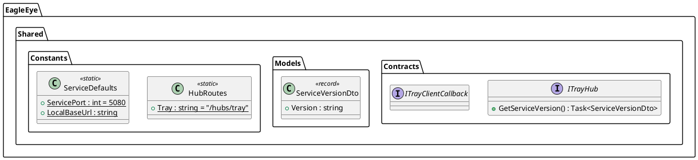
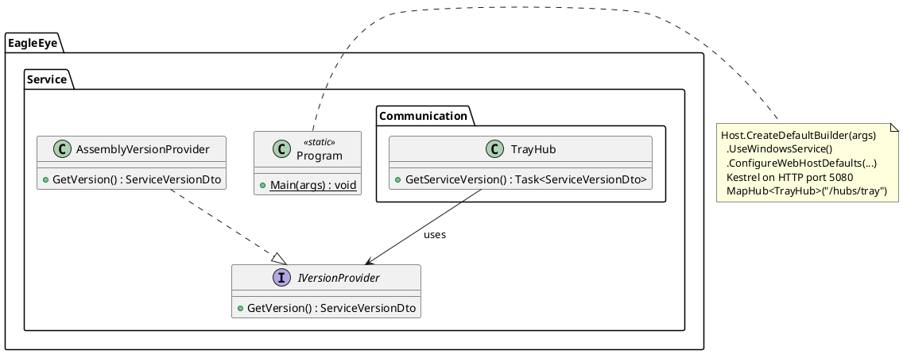
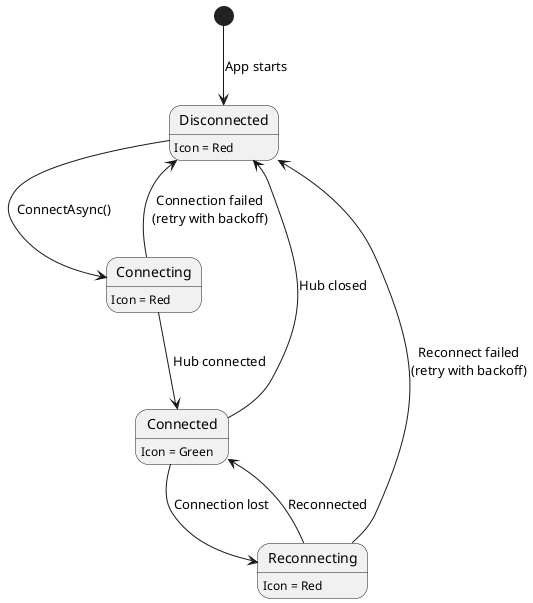

# Implementation Plan: US-001 — Basic Service Installation and Tray Client Connectivity

**Status**: Approved (2026-09-20; amendment of 2026-10-03 approved by Michael 2026-10-03)
**Date**: 2026-09-20, amended 2026-10-03

> **Amendment 2026-10-03 (ADR-007)**: adapted to the two-machine setup and manual testing. Changed: Impact table (solution/scripts already exist), new "Machine Assignment" section, Step 0, Step 4 (test project locations), Step 5 (installer path), Step 6 (smoke check + manual testing), new "Manual Verification Notes". The design itself (contracts, classes, behaviour) is unchanged.

---

## Machine Assignment

**All of US-001 runs on the Windows Developer Machine.** It touches only `EagleEye.Shared`, `EagleEye.Service`, `EagleEye.TrayClient`, the installer and the scripts. The MacBook is not involved.

---

## Impact Assessment

US-001 is the foundational story. It establishes the executable skeleton for three of the four EagleEye components and produces the first deployable installer. No existing production code is affected — all work is greenfield.

| Component | Impact |
|-----------|--------|
| **EagleEye.Shared** | New: minimal SignalR contracts (ITrayHub, ITrayClientCallback), ServiceVersionDto, hub route constants, version helper |
| **EagleEye.Service** | New: host builder with Kestrel + SignalR, TrayHub implementation, version provider |
| **EagleEye.TrayClient** | New: WinForms app with NotifyIcon, SignalR client, connection-status UI, About dialog |
| **EagleEye.ParentApp** | Not touched |
| **Installer** | New: Inno Setup script for service + tray client packaging |
| **Build scripts** | Existing, host-aware `build.ps1` / `test.ps1` / `package-windows.ps1`. DEV completes `package-windows.ps1`. |
| **Solution** | Existing: `02_Implementation/EagleEye.sln`, `02_Implementation/Directory.Build.props` (DEV adds version properties) |

---

## Architecture Changes

No changes to the system architecture document. US-001 implements a minimal subset of the architecture as-is.

**One deliberate simplification**: US-001 uses **HTTP** (not HTTPS) for the SignalR connection between TrayClient and Service. The user story explicitly states: *"This story does not cover TLS certificate generation (no remote network connections yet)."* Since both endpoints are on localhost and no remote (parent app) connectivity is in scope, HTTP is sufficient. HTTPS with self-signed TLS will be added in the story that introduces parent-app connectivity. The code is structured so that switching to HTTPS requires only Kestrel configuration changes and certificate setup — no SignalR contract or hub changes.

---

## New ADRs Required

None. All architectural decisions relevant to US-001 are covered by ADR-001 through ADR-006.

---

## API Changes (SignalR Contracts)

US-001 introduces the first SignalR contracts in `EagleEye.Shared`. Only the TrayHub contracts are needed — ParentHub is out of scope.

### New files in `EagleEye.Shared/Contracts/`

**`ITrayHub.cs`** — server-side hub interface (methods the tray client can invoke):

```csharp
namespace EagleEye.Shared.Contracts;

/// <summary>
/// Server-side hub interface for tray client connections.
/// The tray client invokes these methods on the service.
/// </summary>
public interface ITrayHub
{
    /// <summary>
    /// Returns the service version identifier (e.g., "EagleEye_v0.1").
    /// </summary>
    Task<ServiceVersionDto> GetServiceVersion();
}
```

**`ITrayClientCallback.cs`** — client-side callback interface (methods the server can invoke on the tray client):

```csharp
namespace EagleEye.Shared.Contracts;

/// <summary>
/// Client-side callback interface for tray clients.
/// The service invokes these methods on connected tray clients.
/// US-001 does not require any server-push callbacks — the interface
/// is defined here as the typed-hub contract placeholder.
/// Budget updates, warnings, and pairing codes will be added in later stories.
/// </summary>
public interface ITrayClientCallback
{
}
```

> **Note**: `ITrayClientCallback` is intentionally empty for US-001. It exists because `Hub<ITrayClientCallback>` requires a type parameter. Methods will be added in later stories (budget updates, warnings, pairing codes per ADR-003).

### New files in `EagleEye.Shared/Models/`

**`ServiceVersionDto.cs`**:

```csharp
namespace EagleEye.Shared.Models;

/// <summary>
/// Version information returned by the service.
/// Format: "EagleEye_vMAJOR.MINOR" (e.g., "EagleEye_v0.1").
/// </summary>
public sealed record ServiceVersionDto(string Version);
```

### New files in `EagleEye.Shared/Constants/`

**`HubRoutes.cs`**:

```csharp
namespace EagleEye.Shared.Constants;

/// <summary>
/// SignalR hub route paths. Used by both server (hub mapping) and clients (connection URL).
/// </summary>
public static class HubRoutes
{
    public const string Tray = "/hubs/tray";
}
```

**`ServiceDefaults.cs`**:

```csharp
namespace EagleEye.Shared.Constants;

/// <summary>
/// Default configuration values shared across components.
/// </summary>
public static class ServiceDefaults
{
    /// <summary>Default HTTP port for the service (used until TLS is implemented).</summary>
    public const int ServicePort = 5080;

    /// <summary>Default service base URL for localhost connections.</summary>
    public const string LocalBaseUrl = $"http://localhost:{ServicePort}";
}
```

> **Port choice**: US-001 uses port 5080 (HTTP). When TLS is added in a later story, the service will switch to port 5443 (HTTPS) as specified in the architecture. Using a distinct port avoids ambiguity about whether TLS is active.

---

## Component Design

### EagleEye.Shared



### EagleEye.Service



| Class | Responsibility |
|-------|---------------|
| `Program` | Configures the .NET host: Kestrel (HTTP, port 5080), SignalR, DI registrations, `UseWindowsService()`. Entry point for both console and Windows service modes. |
| `TrayHub` | Thin SignalR hub extending `Hub<ITrayClientCallback>`. Delegates `GetServiceVersion()` to the injected `IVersionProvider`. Logs connect/disconnect events. |
| `IVersionProvider` | Interface for retrieving the service version string. Enables unit testing of TrayHub without assembly reflection. |
| `AssemblyVersionProvider` | Reads the assembly's `InformationalVersion` (set via `Directory.Build.props`) and formats it as `EagleEye_vMAJOR.MINOR`. |

### EagleEye.TrayClient

```plantuml
@startuml US-001 TrayClient
skinparam componentStyle rectangle

package "EagleEye.TrayClient" {
  class Program <<static>> {
    +{static} Main() : void
  }
  package "Communication" {
    interface IServiceConnection {
      +IsConnected : bool
      +ConnectAsync(ct) : Task
      +GetServiceVersionAsync(ct) : Task<ServiceVersionDto>
      +ConnectionChanged : event
      +DisposeAsync() : ValueTask
    }
    class ServiceConnection {
      -_hubConnection : HubConnection
      +IsConnected : bool
      +ConnectAsync(ct) : Task
      +GetServiceVersionAsync(ct) : Task<ServiceVersionDto>
      +ConnectionChanged : event
      +DisposeAsync() : ValueTask
    }
  }
  package "UI" {
    class TrayApplicationContext {
      -_notifyIcon : NotifyIcon
      -_serviceConnection : IServiceConnection
      +TrayApplicationContext(connection)
    }
    class AboutDialog <<Form>> {
      -_versionLabel : Label
      +AboutDialog(version)
    }
  }
}

ServiceConnection ..|> IServiceConnection
TrayApplicationContext --> IServiceConnection : uses
TrayApplicationContext --> AboutDialog : creates

note right of ServiceConnection
  Uses HubConnectionBuilder
  with .WithAutomaticReconnect()
  Connects to localhost:5080/hubs/tray
  Fires ConnectionChanged on
  state transitions
end note

note right of TrayApplicationContext
  NotifyIcon with green/red icon
  ContextMenuStrip with "About"
  Subscribes to ConnectionChanged
  to update icon state
end note
@enduml
```



| Class | Responsibility |
|-------|---------------|
| `Program` | Entry point. Creates `ServiceConnection` and `TrayApplicationContext`, runs `Application.Run()`. |
| `IServiceConnection` | Interface for the SignalR connection to the service. Exposes connection state, connect/disconnect, version query, and a `ConnectionChanged` event. |
| `ServiceConnection` | Implements `IServiceConnection` using `Microsoft.AspNetCore.SignalR.Client.HubConnection`. Configures automatic reconnect with `WithAutomaticReconnect()`. Fires `ConnectionChanged` on `Reconnecting`, `Reconnected`, and `Closed` events. |
| `TrayApplicationContext` | `ApplicationContext` subclass managing the `NotifyIcon`. Creates the tray icon with green/red state, builds the context menu ("About"), subscribes to `IServiceConnection.ConnectionChanged` to toggle the icon. All UI updates marshalled to the UI thread via `SynchronizationContext`. |
| `AboutDialog` | Simple `Form` displaying "About EagleEye" with the server version string and an OK button. Opened when the user clicks "About" in the context menu — queries `IServiceConnection.GetServiceVersionAsync()` at that moment (live query per AC-12). |

### Connection Status State Machine



**Icon logic**: The tray icon is **green** only when `HubConnection.State == HubConnectionState.Connected`. All other states show **red**. This directly satisfies AC-6, AC-7, AC-8, and AC-9.

### Tray Icon Assets

DEV must create two `.ico` files (16x16 and 32x32 sizes embedded in each):

| File | Description |
|------|-------------|
| `UI/Resources/eagleeye-connected.ico` | Green circle on transparent background |
| `UI/Resources/eagleeye-disconnected.ico` | Red circle on transparent background |
| `UI/Resources/eagleeye.ico` | Application icon (used for the About dialog and .exe icon) — the disconnected (red) icon, so the default state before connection is visually consistent |

Icons can be created programmatically via `System.Drawing` during build, or as static assets. Static `.ico` files checked into the repo are preferred for simplicity.

---

## Data Model Changes

None. US-001 does not persist any data. No SQLite databases or YAML configuration files are introduced in this story.

---

## Implementation Steps

DEV must follow these steps in order. Steps within the same numbered group may be done in parallel.

### Step 0: Solution and Build Infrastructure

*Amended 2026-10-03: the solution, `Directory.Build.props` and the host-aware scripts already exist.*

1. Use the existing `02_Implementation/EagleEye.sln` (already references all projects).
2. Add the shared version to the existing `02_Implementation/Directory.Build.props` (keep `EnableWindowsTargeting`):

    ```xml
    <VersionPrefix>0.1.0</VersionPrefix>
    <Product>EagleEye</Product>
    <Company>EagleEye</Company>
    ```

3. Use the existing `02_Implementation/scripts/build.ps1` and `test.ps1`. They build and test the host's projects and skip projects without source. They exit non-zero on failure. Warnings fail the build through `TreatWarningsAsErrors` in the `.csproj` files.

### Step 1: API-First — EagleEye.Shared Contracts

*API-first: shared contracts are always implemented before any component.*

1. Create `EagleEye.Shared/Constants/` directory (remove `.gitkeep` if present).
2. Create `EagleEye.Shared/Constants/HubRoutes.cs`.
3. Create `EagleEye.Shared/Constants/ServiceDefaults.cs`.
4. Create `EagleEye.Shared/Models/ServiceVersionDto.cs` (remove `.gitkeep` from `Models/`).
5. Create `EagleEye.Shared/Contracts/ITrayHub.cs` (remove `.gitkeep` from `Contracts/`).
6. Create `EagleEye.Shared/Contracts/ITrayClientCallback.cs`.

### Step 2: EagleEye.Service

1. Update `EagleEye.Service.csproj`:
   - Change SDK to `Microsoft.NET.Sdk.Web` (required for Kestrel + SignalR hosting). Remove `<WindowsService>true</WindowsService>` property and instead use `UseWindowsService()` in code.
   - Add `PackageReference` for `Microsoft.Extensions.Hosting.WindowsServices`.
   - Keep `ProjectReference` to `EagleEye.Shared`.

2. Create `EagleEye.Service/IVersionProvider.cs`:
   - Interface with `ServiceVersionDto GetVersion()`.

3. Create `EagleEye.Service/AssemblyVersionProvider.cs`:
   - Reads the assembly's `AssemblyInformationalVersionAttribute` (set by `<VersionPrefix>` in `Directory.Build.props`).
   - Formats as `EagleEye_v{MAJOR}.{MINOR}`.
   - Falls back to `EagleEye_v0.0` if the attribute is missing.

4. Create `EagleEye.Service/Communication/TrayHub.cs`:
   - Extends `Hub<ITrayClientCallback>`.
   - Injects `IVersionProvider` and `ILogger<TrayHub>`.
   - Implements `GetServiceVersion()` — delegates to `IVersionProvider`.
   - Overrides `OnConnectedAsync()` and `OnDisconnectedAsync()` to log connect/disconnect events.

5. Create `EagleEye.Service/Program.cs`:
   - `Host.CreateDefaultBuilder(args)`
   - `.UseWindowsService()` — enables Windows service mode when installed as a service; runs as console app otherwise (development mode).
   - `.ConfigureWebHostDefaults(webBuilder => ...)`:
     - Configure Kestrel to listen on `http://0.0.0.0:{ServiceDefaults.ServicePort}` (all interfaces, for future parent-app connectivity; tray client uses localhost).
     - Add SignalR services.
     - Map `TrayHub` to `HubRoutes.Tray`.
   - Register DI services: `IVersionProvider` -> `AssemblyVersionProvider` (singleton).
   - Configure logging: console + file output. For US-001, console logging is sufficient; file logging will be added in a later story with the full logging infrastructure.

### Step 3: EagleEye.TrayClient

1. Update `EagleEye.TrayClient.csproj`:
   - Add `PackageReference` for `Microsoft.AspNetCore.SignalR.Client`.
   - Keep `ProjectReference` to `EagleEye.Shared`.

2. Create `EagleEye.TrayClient/Communication/IServiceConnection.cs`:
   - `bool IsConnected { get; }`
   - `Task ConnectAsync(CancellationToken ct)`
   - `Task<ServiceVersionDto> GetServiceVersionAsync(CancellationToken ct)`
   - `event Action<bool>? ConnectionChanged` — fires with `true` when connected, `false` when disconnected.
   - Extends `IAsyncDisposable`.

3. Create `EagleEye.TrayClient/Communication/ServiceConnection.cs`:
   - Constructor builds `HubConnection` via `HubConnectionBuilder`:
     - URL: `ServiceDefaults.LocalBaseUrl + HubRoutes.Tray`
     - `.WithAutomaticReconnect()` — uses default retry intervals (0s, 2s, 10s, 30s, then repeats 30s).
   - Subscribes to `_hubConnection.Reconnecting`, `_hubConnection.Reconnected`, and `_hubConnection.Closed` to fire `ConnectionChanged`.
   - `ConnectAsync()`: calls `_hubConnection.StartAsync()` in a retry loop — if the service is not running yet, catch `HttpRequestException` and retry after delay (exponential backoff: 1s, 2s, 4s, 8s, ..., capped at 30s). This handles AC-5 to AC-7 (service may not be running when the tray client starts).
   - `GetServiceVersionAsync()`: calls `_hubConnection.InvokeAsync<ServiceVersionDto>("GetServiceVersion")`.
   - `DisposeAsync()`: disposes the `HubConnection`.

4. Create icon assets in `EagleEye.TrayClient/UI/Resources/`:
   - `eagleeye-connected.ico` (green).
   - `eagleeye-disconnected.ico` (red).
   - `eagleeye.ico` (application icon — same as disconnected).
   - Add as embedded resources in `.csproj`.

5. Create `EagleEye.TrayClient/UI/AboutDialog.cs`:
   - Simple `Form` (300x150, fixed size, center screen, `FormBorderStyle.FixedDialog`, no minimize/maximize).
   - Title: "About EagleEye".
   - Displays: "Server Version: {version}" (or "Server Version: unavailable" if the query fails).
   - OK button to close.
   - The version is passed as a constructor parameter (fetched before showing the dialog).

6. Create `EagleEye.TrayClient/UI/TrayApplicationContext.cs`:
   - Extends `ApplicationContext`.
   - Constructor takes `IServiceConnection`.
   - Creates `NotifyIcon`:
     - Icon: disconnected (red) initially.
     - Text (tooltip): "EagleEye — Disconnected" initially.
     - `Visible = true`.
     - `ContextMenuStrip` with one item: "About".
   - Subscribes to `IServiceConnection.ConnectionChanged`:
     - On connected (`true`): set icon to green, tooltip to "EagleEye — Connected".
     - On disconnected (`false`): set icon to red, tooltip to "EagleEye — Disconnected".
     - All UI updates marshalled via `SynchronizationContext.Post()` or `notifyIcon.Invoke()`.
   - "About" click handler:
     - Calls `IServiceConnection.GetServiceVersionAsync()`.
     - If connected: shows `AboutDialog` with the returned version.
     - If not connected: shows `AboutDialog` with "unavailable".
   - On `ApplicationExit`: set `notifyIcon.Visible = false` and dispose.

7. Create `EagleEye.TrayClient/Program.cs`:
   - `[STAThread]` attribute.
   - `Application.EnableVisualStyles()` and `Application.SetHighDpiMode(HighDpiMode.SystemAware)`.
   - Create `ServiceConnection`.
   - Create `TrayApplicationContext(serviceConnection)`.
   - Start connection in background: `_ = Task.Run(() => serviceConnection.ConnectAsync(CancellationToken.None))`.
   - `Application.Run(trayApplicationContext)`.
   - Dispose `serviceConnection` on exit.

### Step 4: Unit Tests

*Amended 2026-10-03: use the existing per-component test projects in `02_Implementation/tests/`.*

1. In `tests/EagleEye.Shared.Tests/EagleEye.Shared.Tests.csproj` and `tests/EagleEye.Service.Tests/EagleEye.Service.Tests.csproj`, pin the PackageReferences `xunit`, `xunit.runner.visualstudio`, `Moq`, `Microsoft.NET.Test.Sdk` (currently commented out). Both projects are already in the solution.

2. Create test classes:

   **`tests/EagleEye.Shared.Tests/Models/ServiceVersionDtoTests.cs`**:
   - Verify `ServiceVersionDto` record equality and construction.

   **`tests/EagleEye.Service.Tests/AssemblyVersionProviderTests.cs`**:
   - `GetVersion_ReturnsFormattedVersionString` — verify the output matches `EagleEye_vMAJOR.MINOR`.

   **`tests/EagleEye.Service.Tests/Communication/TrayHubTests.cs`**:
   - `GetServiceVersion_ReturnsVersionFromProvider` — mock `IVersionProvider`, verify the hub returns its result.
   - `OnConnectedAsync_LogsConnectionEvent` — verify logging.
   - `OnDisconnectedAsync_LogsDisconnectionEvent` — verify logging.

3. `EagleEye.TrayClient.Tests` stays empty for US-001 (WinForms UI and the SignalR connection are verified manually; see below).

### Step 5: Installer (Inno Setup)

1. Complete the existing stub `02_Implementation/installer/windows/setup.iss` (amended 2026-10-03; replace the all-zero `AppId` with a real GUID):
   - App name: "EagleEye", version from `Directory.Build.props`.
   - Installs to `{autopf}\EagleEye`.
   - Files section: copies published Service and TrayClient output to the install directory.
   - Service registration: uses Inno Setup's `[Run]` section to register `EagleEye.Service.exe` as a Windows service via `sc.exe create EagleEyeService ...` (or a PowerShell helper script).
     - Service name: `EagleEyeService`.
     - Start type: auto.
     - Account: LocalSystem.
     - Recovery: restart on all failures.
   - Auto-start for TrayClient: writes `HKLM\Software\Microsoft\Windows\CurrentVersion\Run\EagleEyeTrayClient` pointing to the TrayClient executable path.
   - Uninstall section: stops and deletes the service, removes the registry run key.

2. Complete the existing stub `02_Implementation/scripts/package-windows.ps1`:
   - Publishes the Service and TrayClient (`dotnet publish`).
   - Invokes the Inno Setup compiler (`iscc.exe`) to build the installer into `03_Delivery/windows/`.
   - Runs on the Windows Developer Machine (Inno Setup 6 must be installed there).

### Step 6: Smoke Check and Handover to Manual Testing

*Amended 2026-10-03: acceptance testing is manual (ADR-007).*

1. DEV, on the Windows Developer Machine: run `build.ps1` and `test.ps1`, build the installer, install it, and confirm that the service starts and the tray icon appears for the admin session (smoke check only).
2. DEV writes the implementation report including the **"How to test"** section (installer path, version, service name `EagleEyeService`, Run-key name, log locations, how to uninstall).
3. TES writes `docs/testing/US-001/test-plan.md` covering AC-1 to AC-12. Michael executes it on the Windows Developer Machine using his admin account and a standard test account.

---

## Unit Test Requirements

### Coverage Targets

| Class | Test Focus | Key Scenarios |
|-------|-----------|---------------|
| `ServiceVersionDto` | Record construction and equality | Construction with version string; value equality between instances |
| `AssemblyVersionProvider` | Version string formatting | Correct `EagleEye_vMAJOR.MINOR` format from assembly metadata |
| `TrayHub` | Hub method delegation and logging | `GetServiceVersion` returns value from injected `IVersionProvider`; connect/disconnect events are logged |

### What Is NOT Unit-Tested in US-001

The following are verified by Michael's manual test run (TES test plan) rather than by automated unit tests:

- **WinForms UI** (`TrayApplicationContext`, `AboutDialog`): These depend on `System.Windows.Forms`, which requires a Windows desktop environment.
- **SignalR client connection** (`ServiceConnection`): Integration-level behavior (connecting to a real hub, reconnecting) is verified manually. The `IServiceConnection` interface enables mocking for any future consumer tests.
- **Installer**: Verified manually on the Windows Developer Machine.
- **Windows service registration**: Verified manually via `services.msc`.

---

## Manual Verification Notes

*Added 2026-10-03, for TES.*

| What | Where to observe |
|---|---|
| Service registration, account, start type | `services.msc` → `EagleEyeService` (Log On As: Local System; Startup type: Automatic) |
| Tray icon state | Notification area; tooltip `EagleEye — Connected` / `EagleEye — Disconnected` |
| Reconnect timing | Automatic reconnect intervals 0 s, 2 s, 10 s, 30 s, then every 30 s. A test should allow up to ~45 s before judging AC-9. |
| Auto-start key | `HKLM\Software\Microsoft\Windows\CurrentVersion\Run` |
| Version | About dialog: `Server Version: EagleEye_v0.1` |
| Logs | Console only in US-001 (no file logging yet). Run the service in console mode for diagnostics. |

---

*End of Implementation Plan*
