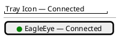
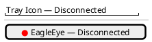
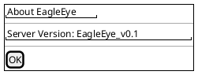

# US-001: Basic Service Installation and Tray Client Connectivity

**Status**: New
**Created**: 2026-09-15
**Component(s)**: EagleEye.Service, EagleEye.TrayClient

---

## User Story

As a **parent**, I want to install EagleEye on my Windows PC and see that the service is running and the tray client is connected, so that I can confirm the basic system is operational before configuring any rules.

---

## Background

This is the foundational story for the entire EagleEye system. Before any enforcement, configuration, or monitoring features can be built, the Windows service must install and run reliably, and the tray client must establish and display its connection to the service. This story covers the minimal end-to-end path: installer, service lifecycle, tray client auto-start, connection status, and version information.

References: FR-SVC-050, FR-TRAY-010, FR-TRAY-040, FR-TRAY-041, FR-TRAY-042, FR-TRAY-050, FR-TRAY-060, NFR-R-010.

---

## Acceptance Criteria

- [ ] **AC-1**: When the parent runs the EagleEye installer on a Windows 11 PC (Home or Pro) with default settings, both `EagleEye.Service` and `EagleEye.TrayClient` are installed successfully.
- [ ] **AC-2**: After installation, `EagleEye.Service` is registered as a Windows service running under the SYSTEM account.
- [ ] **AC-3**: `EagleEye.Service` starts automatically on system boot without manual intervention.
- [ ] **AC-4**: `EagleEye.Service` can be started and stopped using the standard Windows Services management tools (services.msc).
- [ ] **AC-5**: When a standard (non-admin) user logs into Windows, `EagleEye.TrayClient` starts automatically in that user's session.
- [ ] **AC-6**: The tray client displays a system tray icon with a connection status indicator (green = connected, red = disconnected).
- [ ] **AC-7**: When `EagleEye.Service` is running, the tray client shows a green (connected) status.
- [ ] **AC-8**: When `EagleEye.Service` is stopped (e.g. via services.msc), the tray client detects the disconnection and shows a red (disconnected) status.
- [ ] **AC-9**: When `EagleEye.Service` is restarted after being stopped, the tray client automatically reconnects and returns to green status.
- [ ] **AC-10**: `EagleEye.Service` exposes a version identifier in the format `EagleEye_vMAJOR.MINOR` (e.g. `EagleEye_v0.1`). The version correlates to the installer version.
- [ ] **AC-11**: Right-clicking the tray icon shows a context menu with an "About" entry.
- [ ] **AC-12**: Clicking "About" displays a dialog or popup that shows the server version, fetched via a live query to the service at that moment.

---

## UI / Interaction Notes

### Tray Icon States

### Tray Context Menu

```plantuml
@startsalt
{+
  "EagleEye"
  ---
  [About]
}
@endsalt
```

### About Dialog

---

## Out of Scope

- This story does not cover parent app connectivity or pairing.
- This story does not cover process monitoring, enforcement, or any configuration.
- This story does not cover TLS certificate generation (no remote network connections yet).
- This story does not cover the installer's repair or uninstall flows.
- Admin user sessions are not required to show the tray icon.

---

## Related

- Prerequisite stories: none (this is the first story)
- Implementation Plan: `US-001/implementation-plan.md` (added by ARC)
- Issues: `US-001/issues/` (added by TES)
