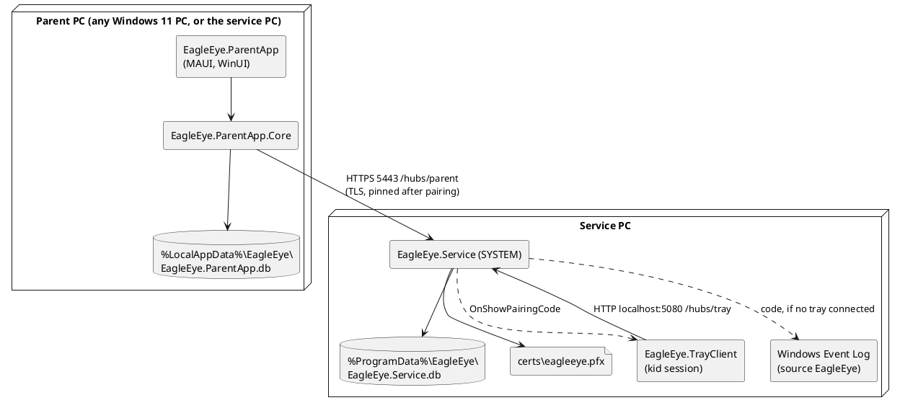
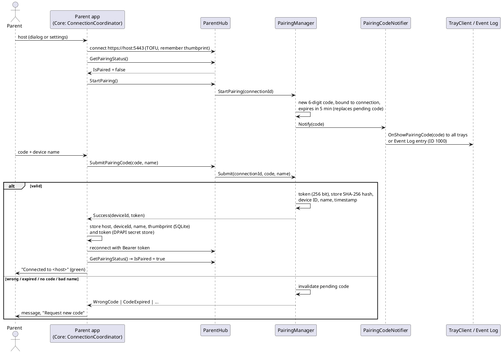
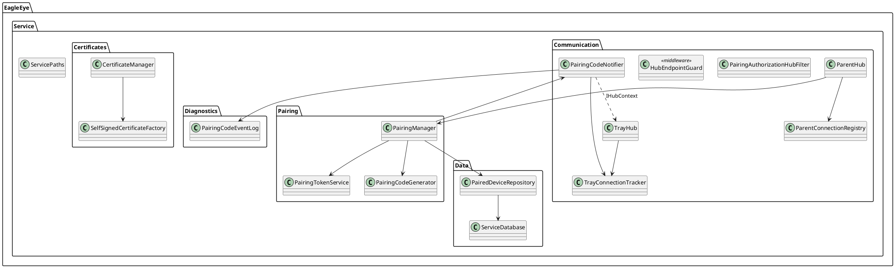
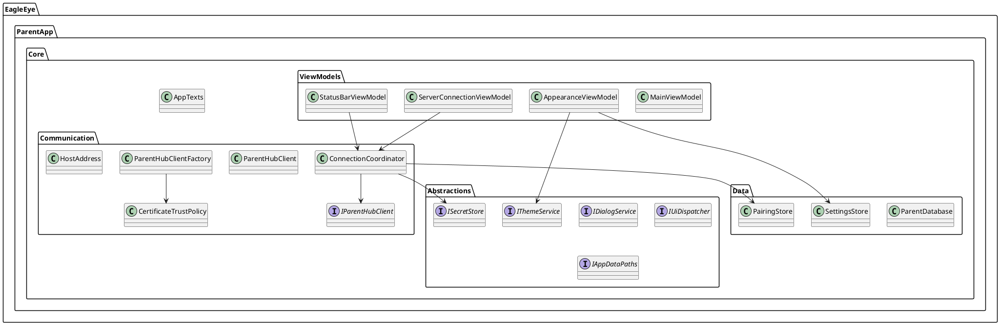
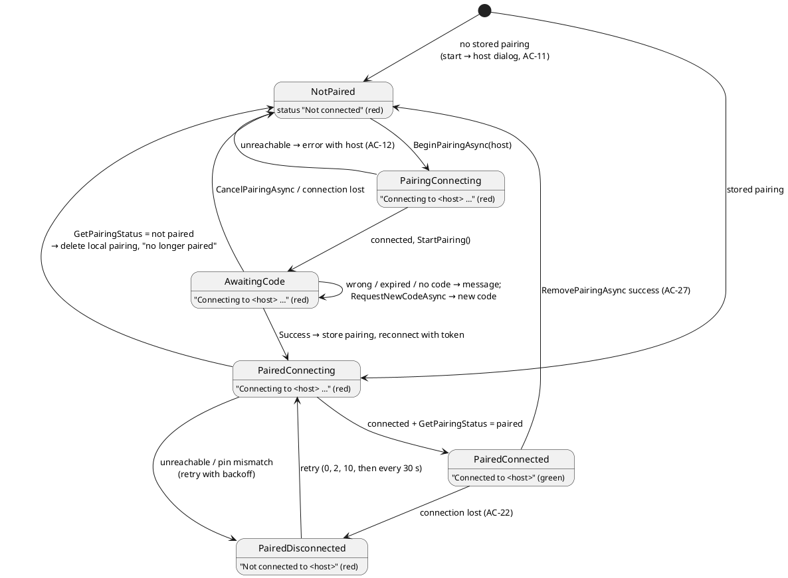

# Implementation Plan: US-002 — Windows Parent App: Installation, Connection and Pairing

**Status**: Approved by Michael (2026-10-04)
**Date**: 2026-10-04
**Author**: ARC
**User story**: `02_Implementation/docs/requirements/user-stories/US-002/user-story.md` (approved 2026-10-04, 30 ACs)
**New ADRs**: ADR-008 (connectivity, TLS, pairing protocol), ADR-009 (Windows packaging, `ParentApp.Core`), both `Accepted`

---

## Machine Assignment

**All implementation, packaging and smoke checks run on the Windows Developer Machine.** US-002 touches Shared, Service, TrayClient, the Windows target of the ParentApp and both Windows installers. Shared contract changes land first, on Windows (ADR-007).

| Work | Machine |
|---|---|
| This plan, ADR-008/009, arc42 and guideline updates (ARC) | MacBook (done here) |
| Steps 0 to 9 (DEV), `build.ps1` / `test.ps1`, both installers, smoke check | **Windows Developer Machine** |
| Manual test run (Michael) | Windows Developer Machine **plus a second Windows PC** in the LAN (AC-6, AC-23, AC-24) |
| MacBook | Not needed. Step 8 keeps `build.ps1` / `test.ps1` working on the MacBook (`ParentApp.Core` and its tests build without a MAUI workload). |

The Android target is built by `build.ps1` on Windows. The shared MAUI code must still compile for Android (zero warnings), but there is no Android-specific work and no Android test.

---

## Impact Assessment

| Component | Impact |
|---|---|
| **EagleEye.Shared** | New: `IParentHub`, `IParentClientCallback` (empty), pairing DTOs, `[AllowUnpaired]` attribute, ports/routes, `PairingRules`, shared SQLite base class, reconnect schedule (moved from TrayClient). Changed: `ITrayClientCallback` gets `OnShowPairingCode`. |
| **EagleEye.Service** | New: HTTPS endpoint 5443 with `ParentHub`, certificate management, SQLite database with `PairedDevices`, pairing manager, default-deny hub filter, hub-to-endpoint guard, pairing-code notifier (tray / Event Log). Changed: `Program`, `TrayHub` (connection tracking, loopback check). |
| **EagleEye.TrayClient** | New: pairing-code window. Changed: `ServiceConnection` (handles the new callback), reconnect timing now comes from Shared, new texts. |
| **EagleEye.ParentApp.Core** | **New project** (ADR-009): communication, certificate pinning, connection/pairing coordinator, SQLite storage, view models, texts. |
| **EagleEye.ParentApp** | First real code: `MauiProgram`, `App`, main window (menu, content, status bar), settings page, host dialog, light/dark theme, Windows platform services. csproj: unpackaged, self-contained. |
| **Installers** | Service installer: firewall rule, ACLs, version 0.2.0. New parent app installer (`parentapp-setup.iss`). |
| **Scripts** | `package-windows.ps1` builds both installers. `build.ps1` / `test.ps1` include `ParentApp.Core`; MacBook skips the MAUI head when the workload is missing. |
| **Version** | `Directory.Build.props` → `0.2.0` (service reports `EagleEye_v0.2`). |

---

## Architecture Changes

ADR-008 and ADR-009 hold the decisions. After Michael approves this plan, ARC applies these document updates on the feature branch:

| Document | Change |
|---|---|
| arc42 §5.3, §5.5 | `ParentApp.Core` library; Shared gets `Data/` (SQLite base) and `Communication/` (reconnect schedule) |
| arc42 §7, §7.4 | Deployment: parent app via its own per-user installer (no longer copy-deployed); ports 5080 (loopback, tray) and 5443 (LAN, parents) |
| arc42 §8.1 | PFX protection via ACL + DPAPI LocalMachine; parent app pins the thumbprint after pairing |
| arc42 §8.3 | Hubs bound to separate endpoints by local port (no longer "same port, same certificate") |
| arc42 §9 | ADR-008, ADR-009 in the table |
| ADR-007 §2 | Note: "Distribution" superseded by ADR-009 |
| Coding guidelines §12.2 | Pairing code shown in a topmost window, not a balloon tip |
| Coding guidelines §16.1 | Packaging per ADR-009; token storage via DPAPI `ISecretStore` (MAUI `SecureStorage` needs package identity on Windows) |

The Orchestrator updates the root `CLAUDE.md` and the `agents/arc/CLAUDE.md` constraint list, which still say "copy-deployed exe". DEV updates the ParentApp `README.md`.

---

## New ADRs Required

- **ADR-008** — Parent app connectivity: endpoints, TLS trust and pairing protocol (`docs/architecture/decisions/ADR-008-parent-connectivity-tls-and-pairing-protocol.md`)
- **ADR-009** — Windows parent app packaging and the `ParentApp.Core` library (`docs/architecture/decisions/ADR-009-windows-parent-app-packaging-and-parentapp-core.md`)

---

## API Changes (SignalR Contracts)

*API-first: DEV implements this section before anything else (Step 1).*

### `EagleEye.Shared/Contracts/IParentHub.cs` (new)

```csharp
namespace EagleEye.Shared.Contracts;

/// <summary>Server-side hub for parent apps (route <see cref="HubRoutes.Parent"/>, HTTPS only).
/// Every method requires a paired connection unless it is marked <see cref="AllowUnpairedAttribute"/>.</summary>
public interface IParentHub
{
    /// <summary>Whether this connection is authenticated as a paired device. Called after every (re)connect.</summary>
    [AllowUnpaired]
    Task<PairingStatusDto> GetPairingStatus();

    /// <summary>Generates a new pairing code bound to this connection and shows it on the service PC
    /// (tray clients, or the Event Log if none is connected). Replaces any pending code.</summary>
    [AllowUnpaired]
    Task StartPairing();

    /// <summary>Submits the code and the device name. Any failure invalidates the pending code.</summary>
    [AllowUnpaired]
    Task<PairingResultDto> SubmitPairingCode(string code, string deviceName);

    /// <summary>De-registers a paired device (FR-SVC-097). Other connections of that device are closed.</summary>
    Task RemovePairedDevice(string deviceId);
}
```

> `StartPairing` and `SubmitPairingCode` are callable only by **unpaired** connections. A paired connection gets a `HubException`. The filter enforces this; the attribute only marks methods as reachable without pairing.

### `EagleEye.Shared/Contracts/IParentClientCallback.cs` (new, empty)

Placeholder for `Hub<IParentClientCallback>`, exactly like `ITrayClientCallback` in US-001. Broadcasts start with device management (FR-APP-015).

### `EagleEye.Shared/Contracts/AllowUnpairedAttribute.cs` (new)

`[AttributeUsage(AttributeTargets.Method)] public sealed class AllowUnpairedAttribute : Attribute;`. The service filter reads it from the **hub implementation method** (the interface attribute documents it; `ParentHub` repeats it).

### `EagleEye.Shared/Contracts/ITrayClientCallback.cs` (changed)

```csharp
/// <summary>Shows a pairing code to the user at the service PC (FR-SVC-091, FR-TRAY-070).
/// The code is valid for <see cref="PairingRules.CodeLifetime"/>.</summary>
Task OnShowPairingCode(string code);
```

### `EagleEye.Shared/Models/` (new)

```csharp
public sealed record PairingStatusDto(bool IsPaired, string? DeviceId, string? DeviceName);

public enum PairingOutcome { Success, WrongCode, CodeExpired, NoPendingCode, InvalidDeviceName, InvalidCodeFormat }

/// <summary>On success, <see cref="DeviceId"/> and <see cref="Token"/> are set (token: 256-bit, Base64Url).</summary>
public sealed record PairingResultDto(PairingOutcome Outcome, string? DeviceId, string? Token);
```

### `EagleEye.Shared/Constants/` (changed / new)

| Constant | Value | Note |
|---|---|---|
| `HubRoutes.Parent` | `"/hubs/parent"` | new |
| `ServiceDefaults.ServicePort` | `5080` | unchanged (tray, loopback HTTP) |
| `ServiceDefaults.ParentPort` | `5443` | new (LAN, HTTPS) |
| `PairingRules.CodeLength` | `6` | new class `PairingRules` |
| `PairingRules.CodeLifetime` | 5 minutes | FR-SVC-093 |
| `PairingRules.DeviceNameMaxLength` | `50` | |
| `PairingRules.IsValidCodeFormat(string?)` | exactly 6 ASCII digits | used by service and app |
| `PairingRules.NormalizeDeviceName(string?)` | trimmed, or `null` if empty, too long or containing control characters | used by service and app |

---

## Component Design

### Overview



### Pairing sequence (US-002)



### EagleEye.Service



All classes are behind interfaces (`I<Name>`) and registered as singletons, except the hubs and the filter. Logic classes take `TimeProvider` where time matters.

| Class | Folder | Responsibility |
|---|---|---|
| `ServicePaths` | root | `%ProgramData%\EagleEye\` (via `Environment.SpecialFolder.CommonApplicationData`), `certs\`, database path. Creates the folders (ACLs come from the installer). |
| `SelfSignedCertificateFactory` | Certificates | Creates the ECDSA P-256 certificate (`CN=EagleEye`, SAN machine DNS name + `localhost`, server-auth EKU, 100 years). Pure, unit-tested. |
| `CertificateManager` | Certificates | `GetOrCreate()`: loads `certs\eagleeye.pfx` (DPAPI LocalMachine), or creates, protects and saves it. Unreadable file → warning, regenerate. Load with `X509KeyStorageFlags.MachineKeySet`, **not** `EphemeralKeySet` (SChannel cannot use ephemeral keys for a TLS server). File/DPAPI part tested manually. |
| `ServiceDatabase` | Data | Derives from Shared `SqliteDatabase`: `EagleEye.Service.db`, migration 1 creates `PairedDevices`. Initialized at startup; integrity-check failure → `Critical` log, service stops (coding guidelines §8.4). |
| `PairedDeviceRepository` | Data | `AddAsync`, `FindByTokenHashAsync`, `RemoveAsync(deviceId)` → bool. Parameterized SQL only. |
| `PairingCodeGenerator` | Pairing | `RandomNumberGenerator.GetInt32(0, 1_000_000)` formatted `D6`. |
| `PairingTokenService` | Pairing | `CreateToken()` (32 random bytes, Base64Url) and `Hash(token)` (SHA-256). |
| `PairingManager` | Pairing | Holds **one** pending code `{code, connectionId, expiresAt}` behind a lock. `StartPairing(connectionId)`, `SubmitAsync(connectionId, code, name)` (format → name → pending exists → same connection → not expired → equal; every failure clears the pending code), `AuthenticateAsync(token)` → device or null, `RemoveDeviceAsync(deviceId)`. Logs outcomes **without** code or token. |
| `PairingCodeNotifier` | Communication | If `TrayConnectionTracker.Count > 0`: `IHubContext<TrayHub, ITrayClientCallback>.Clients.All.OnShowPairingCode(code)`; otherwise `PairingCodeEventLog.Write(code)`. |
| `PairingCodeEventLog` | Diagnostics | Writes event ID 1000, Information, log `Application`, source `EagleEye` (creates the source if missing; the service runs as SYSTEM). Bilingual text, see Localization. Thin wrapper, not unit-tested. |
| `TrayConnectionTracker` | Communication | Thread-safe count of open tray connections (`Interlocked`). |
| `ParentConnectionRegistry` | Communication | `deviceId → set of HubCallerContext` for paired connections. `Register`, `Unregister`, `AbortAll(deviceId, exceptConnectionId)`. |
| `ParentHub` | Communication | `Hub<IParentClientCallback>, IParentHub`. `OnConnectedAsync`: read `Authorization: Bearer`, `AuthenticateAsync`, on success store device ID/name in `Context.Items`, add to group `Parents`, register. `OnDisconnectedAsync`: unregister. Methods are thin and delegate to `PairingManager`. Only `HubException` with safe messages reaches clients (guidelines §7.4). After `RemovePairedDevice` of its own device, the caller's `Context.Items` is cleared (unpaired). |
| `PairingAuthorizationHubFilter` | Communication | `IHubFilter` for `ParentHub` only. Method without `[AllowUnpaired]` + unpaired connection → `HubException("Not paired")`. `StartPairing`/`SubmitPairingCode` + paired connection → `HubException("Already paired")`. |
| `HubEndpointGuard` | Communication | Middleware: `/hubs/tray` only if `Connection.LocalPort == 5080`; `/hubs/parent` only if `== 5443`; otherwise 404 (ADR-008 §1). |
| `TrayHub` (changed) | Communication | `OnConnectedAsync`: abort if the remote address is not loopback; increment tracker. `OnDisconnectedAsync`: decrement. |
| `Program` (changed) | root | Kestrel: `ListenLocalhost(5080)` (HTTP) and `ListenAnyIP(5443, o => o.UseHttps(certificate))` with the certificate from `ICertificateManager`. DI registrations; `AddSignalR().AddHubOptions<ParentHub>(o => o.AddFilter<PairingAuthorizationHubFilter>())`; `UseMiddleware<HubEndpointGuard>()` before routing; `MapHub<ParentHub>(HubRoutes.Parent)`. Logging: `EventLogSettings.SourceName = "EagleEye"`; `EagleEye.*` at Information to the Event Log; `Microsoft.AspNetCore` at Warning. |

Package additions: `Microsoft.Data.Sqlite` (via Shared), `System.Diagnostics.EventLog` (if not already transitive), `System.Security.Cryptography.ProtectedData`. Pin current versions consistent with 10.0.12.

### EagleEye.TrayClient

| Class | Change |
|---|---|
| `Communication/IServiceConnection`, `ServiceConnection` | New event `PairingCodeReceived(string code)`, wired with `_hubConnection.On<string>(nameof(ITrayClientCallback.OnShowPairingCode), …)`. |
| `Communication/ServiceReconnectPolicy` | Delegates to Shared `ReconnectSchedule` (same timing as today). `ConnectBackoff` moves to Shared. |
| `UI/PairingCodeDialog` (new) | Small `Form`: `TopMost`, centered, fixed border, `ShowInTaskbar = true` (so it is findable). Shows title, code in large digits, instruction and validity. Closes itself when the code expires (`CodeLifetime`) or on OK. A new code replaces an open dialog. |
| `UI/TrayApplicationContext` | Subscribes to `PairingCodeReceived`, marshals to the UI thread, shows the dialog non-modally. |
| `UI/TrayTexts` + resx | New keys, see Localization. |

### EagleEye.ParentApp.Core (new project, ADR-009)

`src/EagleEye.ParentApp.Core/EagleEye.ParentApp.Core.csproj`: `net10.0`, `NeutralLanguage de`, `SatelliteResourceLanguages en`, `TreatWarningsAsErrors`, `InternalsVisibleTo EagleEye.ParentApp.Tests`. References Shared, `Microsoft.AspNetCore.SignalR.Client` 10.0.12, `CommunityToolkit.Mvvm`.



| Class | Responsibility |
|---|---|
| `HostAddress` | `TryParse(input)`: trims; accepts a DNS hostname (RFC 1123 labels) or an IPv4/IPv6 address; rejects schemes, ports, paths and spaces. `ToParentHubUri()` → `https://<host>:5443/hubs/parent` (IPv6 in brackets). `Display` = the input as typed (shown as `<host>`). |
| `CertificateTrustPolicy` | Validation callback state: mode *TrustOnFirstUse* (accept, capture SHA-256 thumbprint) or *Pinned(thumbprint)* (accept only an equal thumbprint; otherwise record `PinMismatch`). Pure, unit-tested. |
| `IParentHubClient` / `ParentHubClient` | Thin wrapper over `HubConnection`: `StartAsync`, `StopAsync`, the four hub calls, events `Reconnecting`/`Reconnected`/`Closed`. Built with `.WithUrl(uri, o => { o.AccessTokenProvider = …; o.HttpMessageHandlerFactory = …; o.WebSocketConfiguration = …; })`. **The trust callback must be set on both the HTTP handler and `ClientWebSocketOptions.RemoteCertificateValidationCallback`**, otherwise the WebSocket transport fails or ignores the pin. `WithAutomaticReconnect` with the Shared `ReconnectSchedule`. Not unit-tested (real SignalR); covered manually. |
| `ParentHubClientFactory` | `Create(HostAddress, token?, CertificateTrustPolicy)`. Lets the coordinator be tested with a mocked client. |
| `ConnectionCoordinator` | The parent app's state machine (diagram below). Public API: `State` snapshot (`ConnectionStatus`, `PairingStatus`, `Host`, `DeviceName`, `LastMessage`), event `StateChanged`, `InitializeAsync()`, `BeginPairingAsync(host)`, `RequestNewCodeAsync()`, `SubmitCodeAsync(code, deviceName)`, `CancelPairingAsync()`, `RemovePairingAsync()`. Never reports `Connected` unless `GetPairingStatus()` returned `IsPaired = true` for this connection (AC-20). Initial connect retries with Shared `ConnectBackoff` while paired. |
| `ParentDatabase` | Shared `SqliteDatabase`: `%LocalAppData%\EagleEye\EagleEye.ParentApp.db` (path from `IAppDataPaths`). Migration 1: `ServerConnections`, `AppSettings`, `Secrets`. |
| `PairingStore` | Load/save/delete **the** pairing (US-002 allows one): host, device ID, device name, certificate thumbprint, paired-at. The token is stored via `ISecretStore` under key `pairing-token`. Save and delete cover both. |
| `SettingsStore` | Key/value settings; US-002 uses `appearance.theme` = `light` / `dark` (absent = follow Windows). |
| `MainViewModel` | Navigation menu items (only "Settings"), selected page. |
| `StatusBarViewModel` | Indicator color state (green only for `Connected`) and the status text (AC-10). |
| `AppearanceViewModel` | `IsDarkMode` switch. Initial value from `SettingsStore` or `IThemeService.SystemTheme`. On change: apply via `IThemeService` immediately and store (AC-9). |
| `ServerConnectionViewModel` | Section texts and visibility per state: host entry (editable only when `NotPaired`, AC-25), code and device-name entry (device name prefilled with the PC name), `Pair`, `Request new code`, `Cancel`, `Remove pairing` (enabled only when paired and connected, otherwise shows the AC-30 hint), confirmation via `IDialogService`, errors from `LastMessage`. |
| `AppTexts` + `Resources/AppTexts.resx` / `.en.resx` | All parent-app texts (see Localization). Typed accessor like `TrayTexts`. |

**Platform abstractions** (implemented in the MAUI project):

| Interface | Windows implementation |
|---|---|
| `ISecretStore` | `WindowsSecretStore`: DPAPI `CurrentUser` (`ProtectedData`), protected bytes in the `Secrets` table. MAUI `SecureStorage` is **not** used on Windows: it needs package identity, and the app is unpackaged (ADR-009). Other platforms get `MauiSecureStorageSecretStore` (Keychain/Keystore, guidelines §14/§15). It is compiled but not exercised in US-002. |
| `IThemeService` | `MauiThemeService`: `Application.Current.UserAppTheme`; `SystemTheme` from `Application.Current.PlatformAppTheme`. |
| `IDialogService` | `MauiDialogService`: `DisplayPromptAsync` (host dialog, AC-11), `DisplayAlert` (confirmation, AC-26). |
| `IUiDispatcher` | `MainThread.BeginInvokeOnMainThread`. Coordinator events arrive on thread-pool threads. |
| `IAppDataPaths` | `Environment.SpecialFolder.LocalApplicationData` + `EagleEye` (guidelines §16.2). |

### Parent app state machine (`ConnectionCoordinator`)



**Unspecified case, decided by ARC (for PRO's information):** if the service no longer knows the stored pairing (e.g. after `RemovePairedDevice` from another app, or a service database reset), the app deletes its local pairing, shows "This PC is no longer paired with <host>" and returns to `NotPaired`. The host stays prefilled. The story does not cover this case.

### EagleEye.ParentApp (MAUI head)

| Item | Design |
|---|---|
| `EagleEye.ParentApp.csproj` | Add reference to `ParentApp.Core`. Windows TFM: `WindowsPackageType=None`, `WindowsAppSDKSelfContained=true`, `SelfContained=true`, `RuntimeIdentifier=win-x64`. `ApplicationDisplayVersion` = `$(VersionPrefix)`. `NeutralLanguage de`. Window title "EagleEye". |
| `MauiProgram` | DI: Core services (singletons), platform implementations, view models, pages. |
| `App` | Applies the stored theme (or follows the system) before the first window is shown. Calls `ConnectionCoordinator.InitializeAsync()`. When the result is `NotPaired`, shows the host dialog (AC-11). |
| `Views/MainPage` | Desktop layout (FR-APP-081): `Grid` with the navigation menu on the left (`CollectionView`, entry "Settings"), a content region on the right, and the **status bar** across the bottom (colored `Ellipse` + text). Chosen over `Shell`, because Shell has no bottom status bar on desktop. Mobile layouts come later (FR-APP-080). |
| `Views/SettingsView` | Two sections: "Visual appearance" (`Switch` with label "Light"/"Dark") and "Server connection" (state-dependent content bound to `ServerConnectionViewModel`). |
| `Views/StatusBarView` | Binds to `StatusBarViewModel`. |
| `Resources/Styles` | Colors via `AppThemeBinding` (light and dark), status green/red readable in both themes. |
| `Platforms/Windows` | `WindowsSecretStore`; minimum window size about 900×600. |
| Icons | Reuse the EagleEye eye motif from `TrayClient/UI/Resources/eagleeye.ico` as app and installer icon (MAUI `MauiIcon`). |

### Installers and scripts

**Service installer** `installer/windows/setup.iss` (changed), all in `[Code]`, idempotent so that upgrades work:

1. After install: create `%ProgramData%\EagleEye\` and `certs\`, then set ACLs with `icacls` using **SIDs** (German Windows!): `*S-1-5-18` (SYSTEM) and `*S-1-5-32-544` (Administrators) full control, `*S-1-5-32-545` (Users) read on the root; `certs\` with inheritance removed, SYSTEM and Administrators only.
2. Firewall: `netsh advfirewall firewall delete rule name="EagleEye Service (Parent apps)"`, then `add rule … dir=in action=allow protocol=TCP localport=5443 program="<app>\Service\EagleEye.Service.exe" remoteip=localsubnet profile=any`.
3. Uninstall: delete the firewall rule. `%ProgramData%\EagleEye` stays, so a reinstall keeps the certificate and the pairings. Removing it is a decision for a later story.

**Parent app installer** `installer/windows/parentapp-setup.iss` (new, ADR-009): own `AppId` (new GUID), `AppName` "EagleEye Parent App", publisher "Michael Adler", `PrivilegesRequired=lowest`, `DefaultDirName={autopf}\EagleEye Parent App` (resolves to `%LocalAppData%\Programs` without admin rights), Start menu entry, optional desktop icon (unchecked), languages German + English, `CloseApplications=yes`, `[UninstallDelete] Type: filesandordirs; Name: "{localappdata}\EagleEye"`. Output `03_Delivery/windows/EagleEye-ParentApp-Setup-<version>.exe`.

**`scripts/package-windows.ps1`**: new parameter `-Target All|Service|ParentApp` (default `All`). ParentApp publish: `dotnet publish src/EagleEye.ParentApp -f net10.0-windows10.0.19041.0 -c Release -r win-x64 --self-contained -p:WindowsPackageType=None -p:WindowsAppSDKSelfContained=true -o artifacts/publish/ParentApp`, then ISCC with `parentapp-setup.iss`.

**`scripts/build.ps1`**: build `EagleEye.ParentApp.Core` on both hosts. On macOS: build the Mac Catalyst head only if the `maui`/`maui-maccatalyst` workload is installed; otherwise print a yellow "skipped: MAUI workload missing" line (not a failure). The MacBook currently has no workload; installing it is not part of US-002.

**`EagleEye.sln`**: add `src/EagleEye.ParentApp.Core`.

---

## Data Model Changes

### Service — `%ProgramData%\EagleEye\EagleEye.Service.db` (new)

```sql
CREATE TABLE SchemaVersion (Version INTEGER NOT NULL);
CREATE TABLE PairedDevices (
    DeviceId     TEXT PRIMARY KEY NOT NULL,      -- GUID "D" format
    DeviceName   TEXT NOT NULL,
    TokenHash    BLOB NOT NULL UNIQUE,           -- SHA-256 of the token, never the token
    PairedAtUtc  TEXT NOT NULL                   -- ISO 8601
);
```

### Parent app — `%LocalAppData%\EagleEye\EagleEye.ParentApp.db` (new)

```sql
CREATE TABLE SchemaVersion (Version INTEGER NOT NULL);
CREATE TABLE ServerConnections (                 -- at most one row in US-002
    Host                  TEXT PRIMARY KEY NOT NULL,
    DeviceId              TEXT NOT NULL,
    DeviceName            TEXT NOT NULL,
    CertificateThumbprint TEXT NOT NULL,         -- SHA-256, hex
    PairedAtUtc           TEXT NOT NULL
);
CREATE TABLE AppSettings (Key TEXT PRIMARY KEY NOT NULL, Value TEXT NOT NULL);
CREATE TABLE Secrets (Key TEXT PRIMARY KEY NOT NULL, ProtectedValue BLOB NOT NULL);  -- Windows: DPAPI CurrentUser
```

### Shared — `EagleEye.Shared/Data/SqliteDatabase` (new, abstract)

Opens one long-lived connection, sets pragmas (WAL, `synchronous=NORMAL`, `busy_timeout=5000`, `foreign_keys=ON`), runs `PRAGMA integrity_check`, and applies the ordered migration list in a transaction (`SchemaVersion`). Same code for Service and ParentApp (guidelines §8, §10.2). Unit-tested with `Data Source=:memory:`.

---

## Localization Impact

*Required since US-001 (lessons learned). German is the neutral language (`*.resx`), English the satellite (`*.en.resx`). The Windows display language selects the language; any other language falls back to German. Texts in quotes are proposals that DEV puts into the resx files; Michael can adjust the wording in review.*

### Parent app (`ParentApp.Core/Resources/AppTexts*.resx`)

| Key | German (default) | English |
|---|---|---|
| `MenuSettings` | Einstellungen | Settings |
| `SectionAppearance` | Darstellung | Visual appearance |
| `ThemeLight` / `ThemeDark` | Hell / Dunkel | Light / Dark |
| `SectionServerConnection` | Serververbindung | Server connection |
| `PairingStatusLabel` | Kopplungsstatus | Pairing status |
| `PairingStatusNotPaired` / `…InProgress` / `…Paired` | Nicht gekoppelt / Kopplung läuft / Gekoppelt | Not paired / Pairing in progress / Paired |
| `HostLabel` | Hostname oder IP-Adresse des EagleEye-PCs | Hostname or IP address of the EagleEye PC |
| `HostPlaceholder` | z. B. kinder-pc | e.g. kid-pc |
| `HostDialogTitle` | Mit dem EagleEye-PC verbinden | Connect to the EagleEye PC |
| `ConnectButton` | Verbinden | Connect |
| `PairingInstruction` | Geben Sie den 6-stelligen Code ein, der auf dem EagleEye-PC angezeigt wird. | Enter the 6-digit code shown on the EagleEye PC. |
| `PairingCodeLabel` | Kopplungscode | Pairing code |
| `DeviceNameLabel` | Gerätename dieses PCs | Device name of this PC |
| `PairButton` / `NewCodeButton` / `CancelButton` | Koppeln / Neuen Code anfordern / Abbrechen | Pair / Request new code / Cancel |
| `PairedWithFormat` | Gekoppelt mit: {0} | Paired with: {0} |
| `ThisDeviceFormat` | Dieses Gerät: {0} | This device: {0} |
| `RemovePairingButton` | Kopplung aufheben | Remove pairing |
| `RemoveConfirmTitle` | Kopplung aufheben? | Remove pairing? |
| `RemoveConfirmMessageFormat` | Dieser PC wird von {0} getrennt. Für eine neue Verbindung ist ein neuer Kopplungscode nötig. | This PC will be detached from {0}. Connecting again requires a new pairing code. |
| `RemoveNeedsConnection` | Zum Aufheben der Kopplung ist eine Verbindung zum EagleEye-PC nötig. | Removing the pairing requires a connection to the EagleEye PC. |
| `StatusConnectedFormat` | Verbunden mit {0} | Connected to {0} |
| `StatusConnectingFormat` | Verbindung zu {0} wird hergestellt … | Connecting to {0} … |
| `StatusNotConnected` | Nicht verbunden | Not connected |
| `StatusNotConnectedFormat` | Nicht verbunden mit {0} | Not connected to {0} |
| `ErrorUnreachableFormat` | Verbindungsfehler: Keine Verbindung zum EagleEye-Dienst unter {0} möglich. | Connection error: could not connect to the EagleEye service at {0}. |
| `ErrorInvalidHost` | Bitte einen gültigen Hostnamen oder eine IP-Adresse eingeben. | Please enter a valid hostname or IP address. |
| `ErrorCodeFormat` | Der Kopplungscode besteht aus 6 Ziffern. | The pairing code has 6 digits. |
| `ErrorWrongCode` | Der Kopplungscode ist falsch. | The pairing code is wrong. |
| `ErrorCodeExpired` | Der Kopplungscode ist abgelaufen. | The pairing code has expired. |
| `ErrorNoPendingCode` | Kein gültiger Kopplungscode vorhanden. Bitte einen neuen Code anfordern. | No valid pairing code. Please request a new code. |
| `ErrorDeviceNameRequired` | Bitte einen Gerätenamen eingeben (höchstens 50 Zeichen). | Please enter a device name (up to 50 characters). |
| `ErrorCertificateChangedFormat` | Die Identität des EagleEye-PCs {0} hat sich geändert. Die Verbindung wurde abgelehnt. | The identity of the EagleEye PC {0} has changed. The connection was refused. |
| `InfoPairingLostFormat` | Dieser PC ist nicht mehr mit {0} gekoppelt. | This PC is no longer paired with {0}. |

The window title "EagleEye" is not translated.

### Tray client (`TrayClient/Resources/TrayTexts*.resx`, new keys)

| Key | German (default) | English |
|---|---|---|
| `PairingTitle` | EagleEye – Eltern-App koppeln | EagleEye – Pair a parent app |
| `PairingCodeFormat` | Kopplungscode: {0} | Pairing code: {0} |
| `PairingInstruction` | Geben Sie diesen Code in der EagleEye-Eltern-App ein. | Enter this code in the EagleEye parent app. |
| `PairingValidityFormat` | Der Code ist {0} Minuten gültig. | The code is valid for {0} minutes. |

### Service

- Event Log entry ID 1000 (shown to people, written by the service as SYSTEM, which has no user language): **bilingual**, e.g. `EagleEye-Kopplungscode / pairing code: 123456 — gültig 5 Minuten / valid for 5 minutes.`
- Operational log messages stay English (arc42 §8.13).

### Installers

- Both wizards: German (default) and English via Inno Setup language files. "EagleEye Parent App" is a product name and is not translated.

---

## Implementation Steps

All steps run on the **Windows Developer Machine**, on branch `feature/US-002-windows-parent-app-pairing`. Commit after each step (`US-002: …`) and push.

### Step 0: Preparation
1. `git fetch`, `git switch feature/US-002-windows-parent-app-pairing`, `git pull`.
2. `Directory.Build.props`: `VersionPrefix` → `0.2.0`.
3. Create `src/EagleEye.ParentApp.Core/` and add it to `EagleEye.sln`. `tests/EagleEye.ParentApp.Tests` references it (replacing the Shared-only reference; Shared comes transitively) and gets the same test packages as the other test projects.

### Step 1: API-first — EagleEye.Shared
1. Contracts: `IParentHub`, `IParentClientCallback`, `AllowUnpairedAttribute`, `ITrayClientCallback.OnShowPairingCode`.
2. Models: `PairingStatusDto`, `PairingResultDto`, `PairingOutcome`.
3. Constants: `HubRoutes.Parent`, `ServiceDefaults.ParentPort`, `PairingRules`.
4. `Communication/ReconnectSchedule` and `Communication/ConnectBackoff` (moved from TrayClient, behavior unchanged).
5. `Data/SqliteDatabase` (+ `Microsoft.Data.Sqlite` package).

### Step 2: EagleEye.Service
1. `ServicePaths`, `Certificates/*`, `Data/*`, `Pairing/*`, `Diagnostics/PairingCodeEventLog`.
2. `Communication/*`: tracker, registry, notifier, filter, endpoint guard, `ParentHub`; `TrayHub` changes.
3. `Program`: two endpoints, DI, filter, guard, logging configuration.
4. Console smoke check (non-elevated): note that `%ProgramData%\EagleEye` and Event Log source creation need rights. Allow `ServicePaths` to be overridden by an environment variable **only in Debug builds** (e.g. `EAGLEEYE_DATA_DIR`), so DEV can run the service unelevated.

### Step 3: EagleEye.TrayClient
1. `ServiceConnection` pairing-code event; reconnect via Shared.
2. `PairingCodeDialog`, `TrayApplicationContext` wiring, texts (de/en).

### Step 4: EagleEye.ParentApp.Core
1. `HostAddress`, `CertificateTrustPolicy`.
2. `ParentDatabase`, `PairingStore`, `SettingsStore`, abstractions.
3. `IParentHubClient`, `ParentHubClient`, `ParentHubClientFactory`.
4. `ConnectionCoordinator`.
5. View models; `AppTexts` + resx (de/en).

### Step 5: EagleEye.ParentApp (MAUI)
1. csproj (Core reference, unpackaged, self-contained, version, language).
2. `MauiProgram`, `App`, styles (light/dark), `MainPage`, `SettingsView`, `StatusBarView`.
3. Platform services (`WindowsSecretStore`, `MauiThemeService`, `MauiDialogService`, `IUiDispatcher`, `IAppDataPaths`), plus `MauiSecureStorageSecretStore` for non-Windows targets.
4. Verify: Windows **and Android** targets build with 0 warnings (`build.ps1`).

### Step 6: Service installer
`setup.iss`: ACLs, firewall rule (install/upgrade/uninstall).

### Step 7: Parent app installer and packaging
`parentapp-setup.iss`, `package-windows.ps1 -Target`.

### Step 8: Scripts
`build.ps1` (Core on both hosts; macOS head only with workload), `test.ps1` unchanged in its project list (ParentApp.Tests now has tests).

### Step 9: Smoke check, documentation, handover
1. `build.ps1`, `test.ps1`: 0 warnings, all green, 100 % branch coverage for the classes listed below.
2. Build both installers. Smoke check: install the parent app (no admin needed), start it, see the host dialog. The service installer needs admin, so DEV cannot run it (US-001 lesson). Instead, run the service in console mode (Debug data-dir override) and pair the parent app against `localhost` once.
3. Update `src/EagleEye.ParentApp/README.md`; add a README for `ParentApp.Core`.
4. Write `US-002/implementation-report.md` with the "How to test" section (see Manual Verification Notes), set the story to `Implemented`, push.

---

## Unit Test Requirements

100 % line and branch coverage (coverlet) for every class below. Not unit-tested, verified manually instead: `ParentHubClient`, `CertificateManager` (file/DPAPI part), `PairingCodeEventLog`, `ParentHub.OnConnectedAsync` header extraction where it needs a real `HttpContext` (extract the parsing into a testable static helper), the MAUI views and platform services, `PairingCodeDialog`, both `Program` classes, the installers.

| Class | Test project | Key scenarios |
|---|---|---|
| `PairingRules` | Shared.Tests | code format (6 digits OK; 5, 7, letters, spaces, null rejected); device name (trimmed, empty, whitespace, 50 OK, 51 rejected, control characters rejected) |
| `ReconnectSchedule`, `ConnectBackoff` | Shared.Tests | moved tests from TrayClient.Tests, unchanged expectations |
| `SqliteDatabase` | Shared.Tests | in-memory: pragmas applied, migrations applied once and in order, version stored, failing migration rolls back |
| DTO records | Shared.Tests | construction, equality |
| `SelfSignedCertificateFactory` | Service.Tests | CN, SANs, EKU server auth, validity ≥ 99 years, has private key, ECDSA P-256 |
| `PairingCodeGenerator`, `PairingTokenService` | Service.Tests | 6 digits with leading zeros; token 32 bytes / Base64Url; hash deterministic, 32 bytes, differs per token |
| `PairingManager` | Service.Tests | start creates code and notifies; second start replaces the first; submit success (stores hash, not token; returns ID + token); wrong code; expired (`FakeTimeProvider`, exactly 5:00 vs 5:01); no pending code; other connection; invalid format; invalid name; **every failure clears the pending code**; authenticate known/unknown/empty token; remove existing/unknown device |
| `PairedDeviceRepository` | Service.Tests | in-memory: add, find by hash, remove, unique hash |
| `PairingCodeNotifier` | Service.Tests | tray count > 0 → push to all trays, no Event Log; count 0 → Event Log, no push |
| `TrayConnectionTracker`, `ParentConnectionRegistry` | Service.Tests | increment/decrement; register/unregister; abort all except caller |
| `PairingAuthorizationHubFilter` | Service.Tests | unpaired + protected method → exception; unpaired + `[AllowUnpaired]` → passes; paired + `StartPairing`/`SubmitPairingCode` → exception; paired + protected → passes |
| `HubEndpointGuard` | Service.Tests | tray path on 5080 passes, on 5443 → 404; parent path on 5443 passes, on 5080 → 404; other paths pass |
| `ParentHub`, `TrayHub` | Service.Tests | delegation, group membership, items set/cleared, loopback check, tracker calls, `HubException` mapping |
| `HostAddress` | ParentApp.Tests | hostname, FQDN, IPv4, IPv6 (brackets in URI), trimmed input; rejects empty, scheme, port, path, spaces, invalid labels |
| `CertificateTrustPolicy` | ParentApp.Tests | TOFU accepts and captures; pinned accepts equal (case-insensitive hex), rejects different and records mismatch |
| `ConnectionCoordinator` | ParentApp.Tests | every transition in the state diagram with a mocked `IParentHubClient`/factory, stores and `TimeProvider`; never `Connected` without `IsPaired`; pairing lost → local data deleted; remove only when connected; remove failure keeps the pairing; token never in `State` |
| `PairingStore`, `SettingsStore`, `ParentDatabase` | ParentApp.Tests | in-memory SQLite + fake `ISecretStore`: save/load/delete incl. token, theme absent/light/dark |
| View models | ParentApp.Tests | status text and color per state (all four formats); appearance initial value (stored vs system), toggle applies and stores; server-connection visibility/enabled rules per state (host read-only when paired, remove disabled when disconnected), confirmation cancel/confirm |
| `AppTexts`, `TrayTexts` (new keys) | ParentApp.Tests, TrayClient.Tests | every key present in de and en, fallback to German, same key set (pattern of `TrayTextsTests`) |

---

## Manual Verification Notes

*For TES. What is observable, and what a test run needs. Not test cases.*

| What | Where / how |
|---|---|
| Artifacts | `03_Delivery/windows/EagleEye-Setup-0.2.0.exe` (service + tray, admin) and `03_Delivery/windows/EagleEye-ParentApp-Setup-0.2.0.exe` (parent app, per user, no admin) |
| Test setup | Service PC = Windows Developer Machine (admin account + standard account `eagleeye-kid`). **A second Windows 11 PC in the same LAN** for AC-6, AC-23, AC-24, plus a PC without any EagleEye/.NET installation for AC-2 (the second PC can serve both, if it has no .NET runtime). Two parent apps on different PCs for AC-24. |
| Service ports | 5443 (LAN, HTTPS), 5080 (loopback only). `netstat -ano \| findstr 5443` shows `0.0.0.0:5443` LISTENING. |
| Firewall rule | *Windows Defender Firewall mit erweiterter Sicherheit → Eingehende Regeln* → "EagleEye Service (Parent apps)", TCP 5443, *Lokales Subnetz*, all profiles |
| Certificate (AC-7) | Browser on the parent PC: `https://<service-pc>:5443/` → a certificate warning for `CN=EagleEye` proves TLS (the browser does not trust it; the app does). The app itself shows no certificate prompt. |
| Pairing code | Tray window "EagleEye – Eltern-App koppeln" in **every** session where a tray client runs. Note: the tray client currently also runs in **admin** sessions (HKLM Run key, US-001 report §5). For AC-15, no tray client may be running at all (log off all users, or end `EagleEye.TrayClient.exe` in every session). Event Viewer → *Windows-Protokolle → Anwendung*, source `EagleEye`, event ID 1000. |
| Code expiry | 5 minutes after the code appears. The tray window closes itself at expiry, which helps timing AC-19. |
| Parent app data | `%LocalAppData%\EagleEye\EagleEye.ParentApp.db` (per Windows user). Removed by uninstall (AC-5). Program files in `%LocalAppData%\Programs\EagleEye Parent App`. |
| Service data | `%ProgramData%\EagleEye\EagleEye.Service.db`, `certs\eagleeye.pfx` (not readable for standard users) |
| Reconnect timing | Retries at 0, 2, 10, then every 30 s: green within about 35 s after the service is back (AC-22 bound 60 s). A stopped service closes the connection at once (red within seconds); an unplugged service PC is detected within the 30 s server timeout. |
| Theme | Initial theme = *Einstellungen → Personalisierung → Farben → App-Modus* of the Windows user |
| Logs | Service: Event Viewer → *Anwendung*, source `EagleEye` (pairing success/failure, connections at Information level; no codes except event 1000, no tokens). No file logs yet. |
| Not covered by unit tests | Real TLS/WebSocket connection, pinning against a changed certificate, installers, firewall, Event Log, UI |

---

## Open Points for Michael

1. **Security consequence of Q-1 (not blocking US-002).** Because the code appears in the kid's tray, a kid can pair their own parent app: on the same PC (the per-user installer needs no admin rights) or from another device. In US-002 a paired app can do nothing but stay connected. **From the first configuration story on, a kid could change their own rules.** Recommendation: before the first configuration story, decide on a mitigation (e.g. code only in admin sessions / the Event Log, or an admin confirmation on the service PC).
2. **Tray client in admin sessions.** You said the tray should run only in the kid's account. It currently also starts in admin sessions (HKLM Run key, US-001 report §5). The plan leaves this unchanged (no AC requires it, and it lets you see the code when you pair at the service PC as admin). Should it be restricted? If yes, ARC adds a small step (the tray client ends itself in admin sessions) and TES adds a case.
3. **Second Windows PC.** AC-6, AC-23 and AC-24 need a second Windows 11 PC in the LAN. AC-2 needs a PC without a .NET runtime. Do you have one?
4. **Product name** of the parent app in the Start menu and *Installierte Apps*: "EagleEye Parent App". Alternatives such as "EagleEye Eltern-App" are a one-line change.

---

*End of Implementation Plan*
