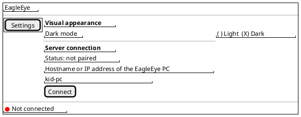
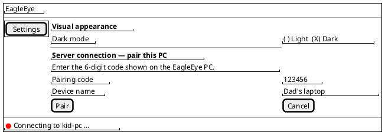
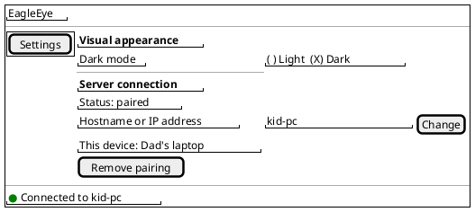
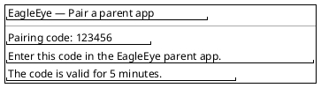
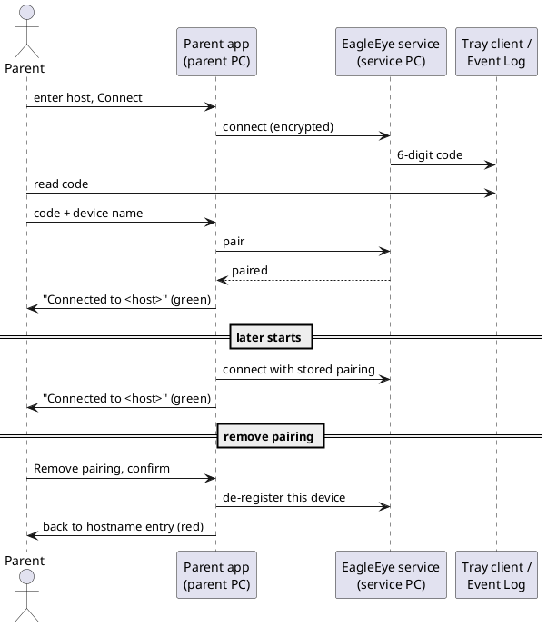

# US-002: Windows Parent App — Installation, Connection and Pairing

**Status**: New
**Created**: 2026-10-04
**Component(s)**: EagleEye.ParentApp, EagleEye.Service, EagleEye.TrayClient, EagleEye.Shared
**Platform(s)**: ParentApp Windows · Windows (service/tray)

---

## User Story

As a **parent**, I want to install the EagleEye parent app on any Windows PC in my home network, connect it to the EagleEye service by hostname or IP address and pair it once with a code shown on the kid's PC, so that from then on the app connects securely by itself and I can see at a glance whether it is connected, and choose a light or dark look for the app — and I can remove the pairing again when I no longer want this PC to have access.

---

## Background

US-001 delivered the service and the tray client on the kid's PC. Every parent-side feature (user accounts, allow-lists, budgets, statistics) needs a trusted connection from a parent app to the service first. This story builds that foundation with the Windows parent app, which is the initial testing vehicle for parent-side functionality (general product requirements §3.3).

Michael changed the distribution of the Windows parent app on 2026-10-04: it gets its own full, clean and self-contained installer instead of a copied executable (general product requirements v1.2, FR-APP-092).

References: FR-APP-010 to FR-APP-014, FR-APP-083 (v1.2, light/dark mode), FR-APP-015 (de-registration of the own device only), FR-APP-081, FR-APP-091, FR-APP-092 (v1.2), FR-SVC-050, FR-SVC-060 to FR-SVC-062, FR-SVC-090 to FR-SVC-098, FR-TRAY-070, CN-010 to CN-014, CN-016, NFR-L-010 to NFR-L-012, NFR-S-013, NFR-S-014, NFR-U-010, NFR-U-011, §9.5.

**Terms used in this story**

- *Service PC*: the Windows 11 PC with `EagleEye.Service` installed (the kid's PC).
- *Parent PC*: any Windows 11 PC in the same LAN on which the parent app is installed. This can be the service PC itself.
- *Pairing*: the one-time onboarding of a parent app with the 6-digit code (FR-SVC-090 to FR-SVC-095).
- *Removing the pairing* ("detach"): the parent app gives up its pairing, so that it starts with onboarding again (FR-SVC-097 for its own device).

---

## Acceptance Criteria

> **Language of UI texts** (NFR-L-010 to NFR-L-012): all UI texts quoted in these criteria and in the mockups are **English examples**, with the intended German wording in brackets where it was already agreed. The parent app and the tray client show every text, including error messages, in the Windows display language of the user: German (default) or English.

### A. Installer of the parent app

- [ ] **AC-1**: There is a separate installer for the EagleEye parent app, independent of the EagleEye service installer. It can be installed on any Windows 11 PC, with or without the EagleEye service installed. On the service PC it installs and behaves **exactly as on any other PC**: no difference in installation, use, connection or pairing. This includes the case where the parent uses the kid's PC under their own Windows account (e.g. an admin account) while the kid uses a standard account on the same PC.
- [ ] **AC-2**: The installer is a guided wizard. When the parent installs with default settings on a Windows 11 PC that has no other software installed for EagleEye (in particular no separately installed .NET runtime), the installation completes and the parent app starts from the Windows Start menu without any further installation step.
- [ ] **AC-3**: The installer and the installed app show the publisher "Michael Adler" and the EagleEye product version (e.g. in *Settings → Apps → Installed apps*).
- [ ] **AC-4**: When the parent runs the installer of the same or a newer version over an existing installation (repair or update), it completes without errors, and an existing pairing is kept: the app connects afterwards without a new pairing code.
- [ ] **AC-5**: When the parent uninstalls the parent app via *Settings → Apps → Installed apps*, the app is removed completely: no program files, no Start menu entry and no stored connection or pairing data of the app remain on the parent PC. (Removing the device on the service side is not part of uninstalling; see Open Question Q-2.)

### B. Service reachability

- [ ] **AC-6**: After the EagleEye service has been installed or updated with default settings, a parent app on another PC in the same LAN can reach the service without any manual configuration on the service PC (no firewall rules, no certificate steps).
- [ ] **AC-7**: The connection between parent app and service is encrypted (TLS). At no point is the parent shown a certificate warning or asked to accept, import or manage a certificate.

### C. Main window of the parent app

- [ ] **AC-8**: The parent app opens a desktop-style main window with a navigation menu on the left. The first menu entry is "Settings" ("Einstellungen"). Selecting it shows the settings page with two sections:
  1. "Visual appearance" ("Darstellung"), see AC-9
  2. "Server connection" ("Serververbindung"): shows the pairing status (not paired / paired with host and device name), lets the parent set or change the hostname or IP address of the service PC, and, when paired, lets the parent remove the pairing (AC-11, AC-16, AC-25, AC-26).
- [ ] **AC-9**: In the "Visual appearance" section, a switch selects light or dark mode ("Light" / "Dark"; German "Hell" / "Dunkel"). Changing the switch applies the mode to the whole app immediately, without a restart. The choice is kept across restarts of the app and across updates (AC-4). On the very first start, the app uses the Windows app mode (light or dark) of the current user, and the switch shows it.
- [ ] **AC-10**: The main window has a status bar at the bottom with a connection indicator (green = connected, red = not connected, like the tray client) and a status text naming the host:
  - connected: "Connected to <host>" ("Verbunden mit <host>"), green indicator
  - connection being established: "Connecting to <host> …", red indicator
  - not connected: "Not connected" or, if a host is stored, "Not connected to <host>", red indicator
  
  `<host>` is the hostname or IP address as entered by the parent.

### D. First connection and pairing

- [ ] **AC-11**: When the parent app is not paired, the "Server connection" section lets the parent enter the service PC's **hostname or IP address** and start the connection. Both a hostname and an IPv4 address work.
- [ ] **AC-12**: When the entered host cannot be reached (wrong name, PC off, service stopped), the parent app shows a connection error that names the host it tried to reach (English example: "Connection error: could not connect to the EagleEye service at kid-pc"). The indicator stays red, and the parent can correct the input and try again.
- [ ] **AC-13**: When the parent app connects to the service for the first time (not paired), the service generates a 6-digit numeric pairing code, and the parent app asks the parent for this code and for a device name for this PC (e.g. "Dad's laptop").
- [ ] **AC-14**: When a standard user is logged on to the service PC and the tray client is connected, the pairing code appears there as a popup of the tray client that shows the 6 digits and says that they are needed to pair a parent app.
- [ ] **AC-15**: When no tray client is connected on the service PC, the service writes the pairing code to the Windows Event Log of the service PC (application log, level "Information", source recognisable as EagleEye).
- [ ] **AC-16**: When the parent enters the correct code and a device name within 5 minutes, the pairing succeeds: the status bar turns green with "Connected to <host>", and the "Server connection" section shows the pairing status "paired", with the host and the device name.
- [ ] **AC-17**: The parent app does not accept a pairing attempt with an empty device name; it tells the parent that a device name is required.
- [ ] **AC-18**: When the parent enters a wrong code, the pairing is rejected with a clear message (English example: "The pairing code is wrong."), the app is not paired, and the parent can start a new attempt, for which a new code is generated.
- [ ] **AC-19**: When the parent enters the code after more than 5 minutes, the pairing is rejected with a clear message that the code has expired, and the parent can start a new attempt with a new code.
- [ ] **AC-20**: As long as the app is not paired, it never shows the status "Connected to <host>" (green). The service does not grant an unpaired app access to anything except pairing.

### E. Paired operation

- [ ] **AC-21**: When the parent starts a paired parent app, it connects to the stored host on its own, without a code or any other input, and shows "Connected to <host>" with a green indicator within 30 seconds after start (provided the service is running).
- [ ] **AC-22**: When the service is stopped while the parent app is connected, the parent app shows a red indicator and a not-connected status within 30 seconds. When the service is started again, the parent app reconnects without user action and shows green within 60 seconds.
- [ ] **AC-23**: Pairing and connection work in both setups with identical behaviour: parent app on the service PC itself (used from the parent's own Windows account), and parent app on another PC in the same LAN.
- [ ] **AC-24**: Two parent apps on two different PCs can be paired with the same service at the same time; both show "Connected to <host>".
- [ ] **AC-25**: When the app is paired, the parent can change the hostname or IP address in the "Server connection" section (e.g. because the service PC got a new IP address). The app then connects to the new address with its existing pairing. If it reaches the same EagleEye service, it shows "Connected to <new host>" without a new pairing code. If the service at the new address does not accept the pairing, the app tells the parent and starts the pairing flow (AC-13) with that service. (See Open Question Q-4.)

### F. Removing the pairing ("detach")

- [ ] **AC-26**: When the app is paired and connected, the "Server connection" section offers an action to remove the pairing (English example: "Remove pairing"; German: "Kopplung aufheben"). The app asks for confirmation before it removes anything.
- [ ] **AC-27**: After the parent confirms, the service no longer accepts this parent app as paired, and the parent app forgets the stored host and pairing. The app returns to the unpaired state (red indicator, hostname entry), and after a restart it starts with the hostname entry and onboarding again.
- [ ] **AC-28**: When the parent connects again after removing the pairing, a new pairing code is required; the former pairing is not accepted any more.
- [ ] **AC-29**: Removing the pairing of one parent app does not affect another paired parent app; it stays connected.
- [ ] **AC-30**: When the app is paired but not connected, removing the pairing is not offered (or not possible), and the app tells the parent that a connection to the service is required for it. (See Open Question Q-3.)

### Change Log

| Date | Change | Source |
|---|---|---|
| 2026-10-04 | Story created | Michael's scope, written by PRO |
| 2026-10-04 | AC-1, AC-23: no difference between service PC and other PCs, incl. parent and kid sharing one PC with separate Windows accounts | Michael, review feedback |
| 2026-10-04 | Menu entry "Connection" replaced by "Settings" with sections "Visual appearance" (new: light/dark mode switch, AC-9) and "Server connection" (pairing status, set/change host, remove pairing). New AC-25 (change host while paired). ACs renumbered; numbers in this log refer to the current numbering. | Michael, review feedback |

---

## UI / Interaction Notes

### Main window — Settings, not paired

### Pairing (after "Connect", app not yet paired)

### Main window — Settings, paired and connected

The light/dark control is drawn as two options here; it is a switch (toggle) in the app.

### Pairing code popup (tray client, service PC)

### Flow overview

---

## Out of Scope

- Parent app for Android, iOS and macOS. This story covers the **Windows** parent app only (built and tested on the Windows Developer Machine).
- Viewing the list of all paired devices and removing *other* devices (rest of FR-APP-015). Only the app's own pairing can be removed here.
- Every parent-side feature beyond the connection: user accounts, allow-lists, budgets, pause windows, statistics, events (FR-APP-020 and later). The navigation menu has only the "Settings" entry, and "Settings" has only the two sections of AC-8.
- Remote access outside the LAN (CN-017), automatic discovery of the service PC on the network.
- Changing the port or other service settings from the parent app.
- Showing the service version in the parent app.
- Service log files and debug mode (FR-SVC-100 to FR-SVC-103), beyond what is needed to diagnose this story.
- Signing the installers with a code-signing certificate.

---

## Open Questions (for Michael)

| ID | Question | PRO proposal (used in the ACs above) |
|---|---|---|
| Q-1 | **Where does the parent see the pairing code?** Per FR-SVC-091/092, the code goes to the tray client popup, otherwise to the Event Log. US-001 shows the tray client only in standard-user sessions. If the parent sits at the service PC as admin, the code only appears in the Event Log; if a kid is logged on, the **kid** sees the code. | Keep the approved requirements for US-002 (AC-14, AC-15). Revisit in a later story if it is a problem in practice. |
| Q-2 | **What does uninstalling the parent app do with the pairing?** The uninstaller cannot reach the service, so the service keeps the device as paired. | Uninstall removes all local data (AC-5). The orphaned entry on the service stays until a later story allows removing other devices (FR-APP-015). |
| Q-3 | **Removing the pairing while the service is unreachable.** | Only possible while connected (AC-30), so the service and the app never disagree. |
| Q-4 | **Changing the server address while paired.** Same service at a new address, or a different service? | Try the existing pairing at the new address; if it is not accepted, start pairing there (AC-25). The pairing with the previous service is then given up on the app side only. |
| Q-5 | **Default appearance on first start.** | Follow the Windows app mode of the current user (AC-9); afterwards the parent's choice wins. |

---

## Related

- Prerequisite stories: US-001 (service, tray client, installer)
- General product requirements: v1.2 amendment (FR-APP-092, §9.5) made together with this story
- Implementation Plan: `US-002/implementation-plan.md` (added by ARC)
- Issues: `US-002/issues/` (added by TES)
- Manual tests: `docs/testing/US-002/` (added by TES)
