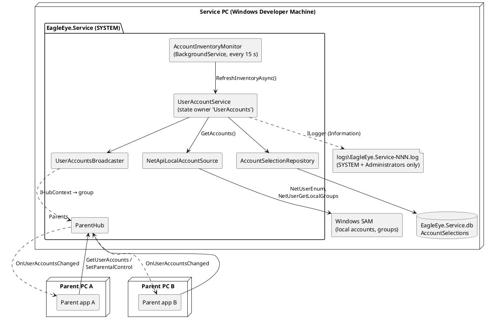
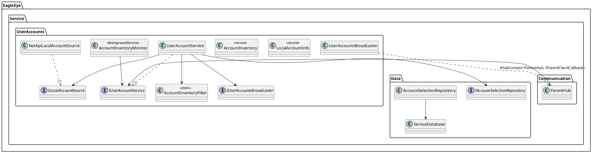
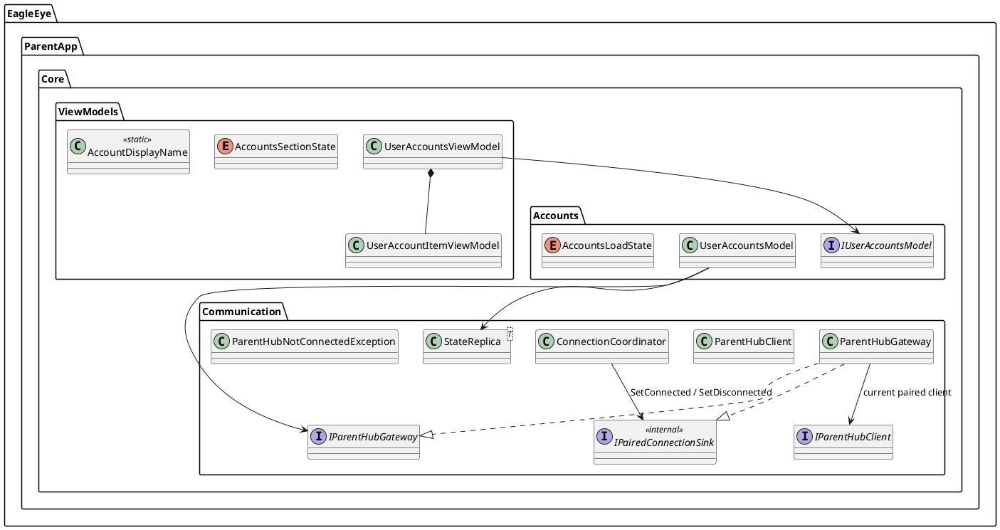
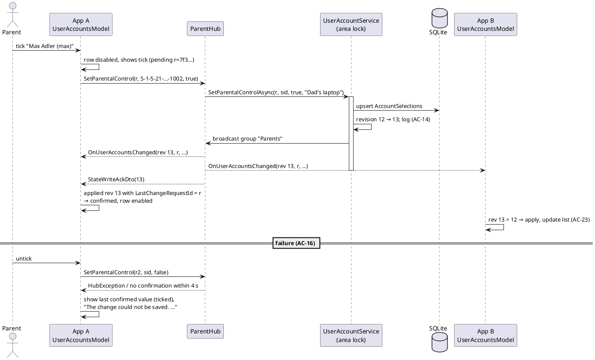
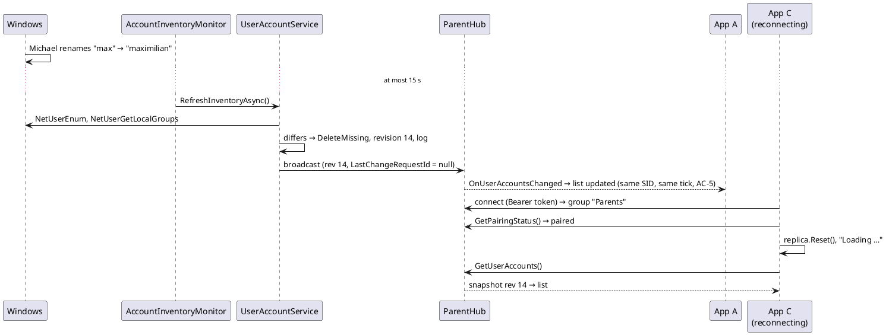

# Implementation Plan: US-003 — Account Inventory and Selection of Accounts under Parental Control

**Status**: Approved by Michael (2026-10-07); ADR-010 accepted
**Date**: 2026-10-07
**Author**: ARC
**User story**: `02_Implementation/docs/requirements/user-stories/US-003/user-story.md` (approved 2026-10-07, 24 ACs, OQ-1 to OQ-8 answered)
**Requirements**: `02_Implementation/docs/requirements/general-product-requirements.md` v1.3 (approved)
**New ADRs**: ADR-010 — Event-driven state propagation (`02_Implementation/docs/architecture/decisions/ADR-010-event-driven-state-propagation.md`), status *Accepted (approved by Michael, 2026-10-07)*
**Revision**: 2026-10-07 — Michael's answers to Q-1 to Q-6 recorded and the plan aligned (admin-only `logs\` folder, `defaultuser0` excluded); story AC-3/AC-14 and FR-SVC-070/FR-SVC-100 updated by PRO (commit `4c6d4ab`)

---

## Machine Assignment

**Everything runs on the Windows Developer Machine.** US-003 touches Shared, Service, `ParentApp.Core` and the Windows target of the ParentApp. Shared contract changes land first, on Windows (ADR-007). The MacBook is not needed.

| Work | Machine |
|---|---|
| This plan, ADR-010, arc42, ADR-002/ADR-003 notes, coding guidelines (ARC) | Windows Developer Machine (done here) |
| Steps 0 to 8 (DEV): code, unit tests, `build.ps1` / `test.ps1`, installers, smoke check | **Windows Developer Machine** |
| Manual test run (Michael) | Windows Developer Machine (service PC, with test accounts) **plus a second parent app** for AC-23/AC-24, ideally on the second Windows PC used for US-002 |
| MacBook | Not needed. `ParentApp.Core`, `Shared` and their tests stay free of Windows APIs, so `build.ps1` / `test.ps1` keep working there after the next `git pull`. No macOS or iOS work in this story. |

The Android target is built by `build.ps1` on Windows. The shared MAUI code (new settings section) must compile for Android with zero warnings; there is no Android-specific work and no Android test.

---

## Impact Assessment

| Component | Impact |
|---|---|
| **EagleEye.Shared** | New: `IParentHub.GetUserAccounts`, `IParentHub.SetParentalControl`, `IParentClientCallback.OnUserAccountsChanged`; DTOs `UserAccountDto`, `UserAccountListDto`, `StateWriteAckDto`; `Logging/` rolling file logger provider (needed for the AC-14 log file; reused by the other components later). |
| **EagleEye.Service** | New folder `UserAccounts/`: Windows account source (NetApi32), inventory filter, state owner `UserAccountService`, broadcaster, background check `AccountInventoryMonitor`. `Data/`: migration 2 (`AccountSelections`), `AccountSelectionRepository`. `ParentHub`: two methods. `Program`: file logging, DI, startup initialization. `ServicePaths`: log directory. |
| **EagleEye.ParentApp.Core** | `IParentHubClient`/`ParentHubClient`: new calls and the callback. New `ParentHubGateway` (current paired connection for feature models), `StateReplica<T>` (ADR-010 revision rule), `Accounts/UserAccountsModel`, view models `UserAccountsViewModel` + `UserAccountItemViewModel`, new texts. `ConnectionCoordinator`: four calls into the gateway. |
| **EagleEye.ParentApp** | `SettingsView`: third section "User accounts on the EagleEye PC". DI registrations. |
| **EagleEye.TrayClient** | None (story: out of scope). |
| **Installers** | Service installer: creates `%ProgramData%\EagleEye\logs\` with an admin-only ACL (like `certs\`). Parent app installer: no change. Version 0.3.0. Upgrade from 0.2.0 keeps `%ProgramData%\EagleEye\EagleEye.Service.db` (pairings) and applies migration 2 on first start. |
| **Scripts** | None. |
| **Version** | `Directory.Build.props` → `0.3.0` (service reports `EagleEye_v0.3`). |

---

## Architecture Changes

Applied on the feature branch. ADR-010 and the ADR-010-driven amendments are **accepted** (Michael, 2026-10-07); the US-003-specific amendments (inventory, `AccountSelections`, file logging, `logs\` folder) are approved together with this plan:

| Document | Change |
|---|---|
| `docs/architecture/decisions/ADR-010-event-driven-state-propagation.md` | **New** (Michael's general rule, see "New ADRs Required") |
| ADR-003 | Header note: Pattern 3 refined by ADR-010; Rule 3 (server push on connect) replaced by client fetch |
| ADR-002 | Implementation note: .NET has no built-in file logging provider; EagleEye uses its own small rolling file provider in `EagleEye.Shared/Logging` (still `Microsoft.Extensions.Logging`, still no third-party library); retention 3 files and 5 days; service log folder `logs\`, SYSTEM and Administrators only |
| arc42 §4.2, §5.2 | Technology mapping and Logging: own file provider; Communication: ADR-010 wording; UserAccounts: concrete design |
| arc42 §5.3, §5.5 | New DTOs, `Logging/` in Shared; `ParentHubGateway`, `StateReplica`, `Accounts/` in Core |
| arc42 §6.4 | Runtime view replaced: write path per ADR-010 (requestId, revision, broadcast incl. sender, ack) |
| arc42 §6.6 (new) | Service-originated change (account inventory) and (re)connect fetch |
| arc42 §8.3 | Pattern 3 rewritten to ADR-010 |
| arc42 §8.4 | Service table `AccountSelections` |
| arc42 §8.10 | Own file provider; service log in `%ProgramData%\EagleEye\` |
| arc42 §8.11 | "Service pushes full state on reconnect" → "client fetches (ADR-010)" |
| arc42 §9, §11 R-8, §12 | ADR-010 in the table; R-8 status after US-003 OQ-7; glossary "State area", "Revision" |
| Coding guidelines §7.2, §7.3, new §7.5, §9, §10.1 | Broadcast/fetch rules, checklist for a new state area, file provider, folder layout |

DEV updates the READMEs of Service, Shared, `ParentApp.Core` and ParentApp (Step 8).

---

## New ADRs Required

- **ADR-010 — Event-Driven State Propagation: Service Broadcasts with Revisions.** Records Michael's rule as a general architecture decision for all state parent apps read or change. Core rules:
  1. The service is the single source of truth; apps hold replicas only; no client polling, no client-to-client traffic.
  2. Writes go to the service with a client-generated `requestId`; the area's state owner serializes, stores, increments the area **revision**, logs, **broadcasts the full snapshot to all paired apps including the sender**, then returns `StateWriteAckDto(Revision)`. Last write received wins; every accepted write gives exactly one broadcast.
  3. The broadcast confirms the stored state; the ack confirms acceptance. The sender is confirmed when it applied a snapshot with its `requestId` or with `Revision ≥ ack`. Failure or no confirmation within the write timeout → revert to the last confirmed snapshot, error message, re-fetch if the outcome is unknown.
  4. Clients apply a snapshot only if its revision is higher than the last applied one; revisions are in memory, per area, and reset by the client on every new connection.
  5. After every (re)connect with confirmed pairing, the client **fetches** the full state (changes ADR-003 Rule 3, which had the server push on connect). Missed events are not replayed; the fetch is the recovery.
  6. Broadcasts go only to the `Parents` group (paired connections); queries and writes are behind the default-deny filter (ADR-008).
  7. Full snapshots per state area, no deltas (ADR-003 Rule 2 stays).

ADR-010 extends ADR-003 Pattern 3 and changes its Rule 3; it builds on ADR-008 §4/§5 without changing them, and on ADR-009 (client logic in Core). Details: the ADR, section "Relation to existing decisions".

No ADR is needed for the account change detection (an internal service mechanism, decided in this plan) or for the file logger (implementation note to ADR-002; the decision "`Microsoft.Extensions.Logging`, no third-party libraries" is unchanged).

---

## API Changes (SignalR Contracts)

*API-first: DEV implements this section before anything else (Step 1). Shape per ADR-010 §3; state area `UserAccounts`.*

### `EagleEye.Shared/Contracts/IParentHub.cs` (changed)

```csharp
/// <summary>
/// Returns the current inventory of standard accounts of the service PC with their selection
/// (state area "UserAccounts", ADR-010). Called by the app after every (re)connect.
/// </summary>
Task<UserAccountListDto> GetUserAccounts();

/// <summary>
/// Places an account under parental control or removes it (FR-SVC-072, FR-APP-022). The service
/// stores the value, broadcasts the new snapshot to all paired apps including the caller
/// (<see cref="IParentClientCallback.OnUserAccountsChanged"/>), and then returns the revision.
/// Last write wins. Throws <c>HubException</c> if the account is not in the inventory or the
/// value cannot be stored.
/// </summary>
/// <param name="requestId">Client-generated correlation id, echoed in <see cref="UserAccountListDto.LastChangeRequestId"/>.</param>
/// <param name="accountSid">The account's SID as delivered in <see cref="UserAccountDto.Sid"/>.</param>
/// <param name="isUnderParentalControl">The new state.</param>
Task<StateWriteAckDto> SetParentalControl(Guid requestId, string accountSid, bool isUnderParentalControl);
```

Neither method is `[AllowUnpaired]`: the existing default-deny filter (`PairingAuthorizationHubFilter`) rejects them for unpaired connections with `HubException("Not paired.")` (FR-SVC-098). No filter change is needed.

### `EagleEye.Shared/Contracts/IParentClientCallback.cs` (changed, first member)

```csharp
/// <summary>
/// The account inventory or a selection changed (state area "UserAccounts", ADR-010). Sent to
/// all paired apps, including the app whose write caused it. Apply only if
/// <see cref="UserAccountListDto.Revision"/> is higher than the last applied revision.
/// </summary>
Task OnUserAccountsChanged(UserAccountListDto snapshot);
```

### `EagleEye.Shared/Models/` (new)

```csharp
/// <summary>A standard account of the service PC (never an admin or built-in account).</summary>
/// <param name="Sid">Windows security identifier, e.g. "S-1-5-21-…-1001". The identity (FR-SVC-074).</param>
/// <param name="UserName">The logon name, e.g. "max".</param>
/// <param name="FullName">The full name as set in Windows, or null if empty.</param>
/// <param name="IsDisabled">Windows "Account is disabled" (AC-12).</param>
/// <param name="IsUnderParentalControl">The stored selection (default false, AC-18).</param>
public sealed record UserAccountDto(string Sid, string UserName, string? FullName, bool IsDisabled, bool IsUnderParentalControl);

/// <summary>Snapshot of the state area "UserAccounts" (ADR-010 §3).</summary>
/// <param name="Revision">Strictly increasing during one service run (ADR-010 §4).</param>
/// <param name="LastChangeRequestId">The requestId of the write that produced this revision; null if the service produced it.</param>
/// <param name="Accounts">All standard accounts, ordered by user name (ordinal, ignore case). The app sorts for display.</param>
public sealed record UserAccountListDto(long Revision, Guid? LastChangeRequestId, IReadOnlyList<UserAccountDto> Accounts);

/// <summary>Acknowledgement of an accepted write (ADR-010 §5). Shared by all state areas.</summary>
/// <param name="Revision">The revision the write produced.</param>
public sealed record StateWriteAckDto(long Revision);
```

The display text ("Max Adler (max)", "(disabled)") is built by the app, because it is localized. The service sends raw fields only.

### `EagleEye.Shared/Logging/` (new, not a contract)

`RollingFileLoggerProvider` (`ILoggerProvider`), `RollingFileLogger`, `RollingFileWriter`, `RollingFileOptions`, `LogLineFormatter`. Package: `Microsoft.Extensions.Logging.Abstractions` (10.0.x, consistent with 10.0.12). Details under Component Design.

---

## Component Design

### Overview



### Decision: how the service detects account changes (AC-19 to AC-22)

**Periodic reconciliation inside the service, every 15 s, with a push only when something changed.**

`AccountInventoryMonitor` (a `BackgroundService` with a `PeriodicTimer` on `TimeProvider`) calls `UserAccountService.RefreshInventoryAsync()` every 15 s. That method reads all local accounts from Windows, builds the inventory, compares it with the current one (SIDs, user names, full names, disabled flag, standard/admin), and only if it differs: updates the stored selections (AC-22), increments the revision, logs, and broadcasts the snapshot to all connected parent apps (ADR-010 §2 with `requestId = null`).

**60 s bound (AC-19 to AC-21)**: worst case = 15 s until the next check + enumeration (a few ms) + broadcast on the LAN (< 1 s) + UI dispatch ≈ **16 s**, well inside 60 s. Typical: about 8 s.

**Rationale and alternatives:**

| Option | Assessment |
|---|---|
| **Periodic reconciliation (chosen)** | Catches every kind of change with one mechanism: create, delete, rename, full-name change, disabled flag, and group membership changes (standard ↔ admin) — no matter which tool made them. Cost: one `NetUserEnum` plus one `NetUserGetLocalGroups` per account every 15 s, a few milliseconds (QS-08: ≤ 2 % CPU is not affected). Easy to unit-test with `FakeTimeProvider`. Self-healing: a missed change is caught by the next check. |
| Security event log (4720 created, 4726 deleted, 4738/4781 changed/renamed, 4732/4733 group membership) via `EventLogWatcher` | Depends on the audit policy ("Audit User Account Management", "Audit Security Group Management"), which a parent or a Windows update can change; needs privileged log access; several event IDs per change; still needs a full re-read for the actual state. More failure modes, no benefit for a 60 s bound. |
| Registry change notification on the SAM hive (`RegNotifyChangeKeyValue`) | Undocumented structure, notification only (still needs a full re-read), fires on unrelated SAM writes (e.g. logon counters). Fragile. |
| WMI event subscription (`__InstanceCreationEvent` on `Win32_UserAccount`) | WMI polls internally anyway (`WITHIN` clause), slower and heavier than NetApi; does not cover group membership changes. |

Michael's "event-driven" rule (ADR-010) concerns the propagation from the service to the apps, and that stays fully push-based: apps never poll. How the service learns about changes in Windows is internal; ADR-010 §1 states this explicitly. The interval is a constant (`AccountInventoryMonitor.CheckInterval`) until the service gets its YAML configuration (ADR-002).

### EagleEye.Service



All classes behind interfaces and registered as singletons (except the hub and the static filter). Logic classes take `TimeProvider`.

| Class | Folder | Responsibility |
|---|---|---|
| `LocalAccountInfo` | UserAccounts | `record (string Sid, string UserName, string? FullName, bool IsDisabled, bool IsAdmin)`; one local account as Windows reports it. |
| `ILocalAccountSource` / `NetApiLocalAccountSource` | UserAccounts | `IReadOnlyList<LocalAccountInfo> GetAccounts()`. Win32 via `[LibraryImport]` (source-generated P/Invoke) on `netapi32.dll`/`advapi32.dll`: `NetUserEnum` level 23 (`USER_INFO_23`: name, full name, flags, SID) with `FILTER_NORMAL_ACCOUNT`; `IsDisabled` = `UF_ACCOUNTDISABLE`; `IsAdmin` = `NetUserGetLocalGroups(…, LG_INCLUDE_INDIRECT)` contains the local group whose SID is `S-1-5-32-544` (name resolved once via `LookupAccountSid`, so "Administratoren" on German Windows works). Accounts linked to a Microsoft account are local SAM accounts and are returned like any other (AC-4). Buffers freed with `NetApiBufferFree` in `finally`. Any Win32 error → `Win32Exception` (caller handles). Thin interop, **not unit-tested**; verified manually. |
| `AccountInventoryFilter` | UserAccounts | Pure, static. `IsBuiltIn(sid)`: relative ID (last SID component) is 500 Administrator, 501 Guest, 503 DefaultAccount or 504 WDAGUtilityAccount — by RID, so renamed or localized built-ins are caught (AC-3). `IsSetupLeftover(userName)`: user name equals `defaultuser0`, compared with `StringComparison.OrdinalIgnoreCase` (AC-3, FR-SVC-070; Michael 2026-10-07, Q-4). Windows gives this account no special SID or flag (it is an ordinary local account with a RID ≥ 1000), so the name is the only reliable identification. `Standard(accounts)`: not built-in, not the setup leftover, not admin (AC-1 to AC-3). Excluded accounts are excluded everywhere: never in the inventory, never in a snapshot, cannot be ticked (`SetParentalControl` → unknown account). Unit-tested. |
| `AccountInventory` | UserAccounts | Immutable `record` of the current standard accounts (by SID) plus the set of **all** existing local SIDs (standard and admin; needed for AC-21/AC-22). `HasSameContent(other)` for change detection. |
| `IAccountSelectionRepository` / `AccountSelectionRepository` | Data | Table `AccountSelections` (see Data Model). `LoadAllAsync()` → `Dictionary<sid, bool>`; `SetAsync(sid, userName, value, changedAtUtc)` (upsert); `DeleteMissingAsync(existingSids)` → number of deleted rows. Parameterized SQL, plain `using` (guidelines §3.4). |
| `IUserAccountsBroadcaster` / `UserAccountsBroadcaster` | UserAccounts | `Task BroadcastAsync(UserAccountListDto snapshot)` → `IHubContext<ParentHub, IParentClientCallback>.Clients.Group(ParentHub.ParentsGroup).OnUserAccountsChanged(snapshot)`. Thin, unit-tested with a mocked hub context (pattern of `PairingCodeNotifier`). |
| `IUserAccountService` / `UserAccountService` | UserAccounts | **State owner of the area `UserAccounts`** (ADR-010 §2, §9). Holds the current `AccountInventory`, the selections (loaded once from the repository) and the revision behind one `SemaphoreSlim`. Methods below. |
| `AccountInventoryMonitor` | UserAccounts | `BackgroundService`. `CheckInterval = 15 s`. Loop: `PeriodicTimer(CheckInterval, timeProvider)` → `RefreshInventoryAsync`; exceptions are caught in the loop body and logged (guidelines §5.3), the loop continues. |
| `ParentHub` (changed) | Communication | Two thin methods, see below. Constructor gains `IUserAccountService` (now 4 dependencies). |
| `ServicePaths` / `IServicePaths` (changed) | root | New `LogDirectory` (= `DataDirectory\logs`), `LogFilePrefix = "EagleEye.Service"`, `IsOverridden` (true when the Debug data-folder override is active). `EnsureDirectories` also creates `logs\`. |
| `LogDirectorySecurity` (new) | Diagnostics | Pure: `Create()` returns the `DirectorySecurity` for `logs\` — inheritance removed (`SetAccessRuleProtection(true, false)`), exactly two rules: `S-1-5-18` (SYSTEM) and `S-1-5-32-544` (Administrators), `FullControl`, `ContainerInherit | ObjectInherit`, `Allow`; owner Administrators. Well-known SIDs, so German Windows works. Unit-tested. |
| `LogDirectoryProtector` (new) | Diagnostics | `Protect(directory)`: creates `logs\` if missing and applies `LogDirectorySecurity.Create()` (`FileSystemAclExtensions.SetAccessControl`) on **every** start, so a folder created or altered by someone else is repaired. Skipped when `IsOverridden` (console mode as a normal user would lock itself out). Thin Windows wrapper, not unit-tested; verified manually. |
| `Program` (changed) | root | File logging (below); DI for the new classes; `AddHostedService<AccountInventoryMonitor>()`; after `ServiceDatabase.InitializeAsync()`: `await IUserAccountService.InitializeAsync()` (first inventory and cleanup before Kestrel accepts connections). |

**`UserAccountService` methods** (each runs inside the area lock):

| Method | Behaviour |
|---|---|
| `InitializeAsync()` | Loads selections; reads the inventory (see `RefreshInventoryAsync` without broadcast); revision = 1. Enumeration failure → `Error` log, inventory stays *unavailable* (the monitor retries every 15 s). Never stops the service. |
| `GetSnapshotAsync()` | Returns the current `UserAccountListDto`. Inventory unavailable → throws `AccountInventoryUnavailableException` (hub maps to `HubException`). |
| `SetParentalControlAsync(requestId, sid, value, deviceName)` | `sid` not in the current standard inventory → `UnknownAccountException` (AC-20: an account that just became admin cannot be ticked). Otherwise: `repository.SetAsync` → revision++ → `LastChangeRequestId = requestId` → **log (AC-14)** → broadcast → return `StateWriteAckDto(revision)`. Repository failure → exception propagates (no revision, no broadcast; the hub maps it). Broadcast failure → `Warning` log, the write still succeeds (ADR-010 §9). Every accepted call produces a revision and a broadcast, also when the value is unchanged (ADR-010 §2). |
| `RefreshInventoryAsync()` | Reads accounts. **On enumeration failure, or if Windows returns no account at all, nothing is changed and nothing is deleted** (`Warning` log) — a failed read must never wipe selections. Otherwise builds the new inventory; if `HasSameContent` → return. Else: `repository.DeleteMissingAsync(allExistingSids)` (AC-22; rows of SIDs that became admin stay, AC-21) → revision++ → `LastChangeRequestId = null` → log the difference → broadcast. |

The snapshot's `IsUnderParentalControl` = stored value for that SID, default `false` (AC-18). Accounts that are admins are not in the snapshot; their stored value is kept and becomes visible again when they turn standard (AC-21, OQ-6). "Under parental control" for later monitoring stories means: in the standard inventory **and** stored `true` (AC-20, MU-014). US-003 needs no API for that yet.

**Log entries** (English, `ILogger<UserAccountService>`, file and Event Log):

| When | Level | Template |
|---|---|---|
| Selection stored (AC-14, AC-24) | Information | `Account {UserName} ({AccountSid}): under parental control = {UnderParentalControl} (set by parent device {DeviceName}, request {RequestId}, revision {Revision}).` — `UnderParentalControl` is the string `yes` or `no` |
| Inventory changed (AC-19 to AC-22) | Information | `Account inventory changed (revision {Revision}): added [{Added}], removed [{Removed}], changed [{Changed}]; {Count} standard accounts.` — user names, comma-separated; `changed` covers renames, full name, disabled flag |
| Selections forgotten (AC-22) | Information | `Forgot the parental-control selection of {Count} deleted account(s): {Sids}.` |
| Inventory loaded at start | Information | `Account inventory loaded: {Count} standard accounts, {Selected} under parental control.` |
| Enumeration failed | Warning (Error at start) | `Reading the local accounts failed; the inventory is kept unchanged.` + exception |
| Write rejected / failed | Warning / Error | `Setting parental control for {AccountSid} rejected: unknown account.` / with exception |
| Broadcast failed | Warning | `Broadcasting the account inventory (revision {Revision}) failed.` + exception |

No secrets are involved; SIDs, user names and device names are not sensitive in the sense of guidelines §9.2.

**`ParentHub` additions** (thin, guidelines §7.1, §7.4):

```csharp
public async Task<UserAccountListDto> GetUserAccounts()
// → userAccounts.GetSnapshotAsync(); AccountInventoryUnavailableException or other → log + HubException("The accounts are not available.")

public async Task<StateWriteAckDto> SetParentalControl(Guid requestId, string accountSid, bool isUnderParentalControl)
// guards: requestId != Guid.Empty, accountSid is a syntactically valid SID (new SecurityIdentifier(accountSid) succeeds)
//   → otherwise HubException("Invalid request.")
// → userAccounts.SetParentalControlAsync(requestId, accountSid, value, ParentConnectionState.GetDeviceName(Context)!)
// UnknownAccountException → HubException("Unknown account."); other → log + HubException("The change could not be saved.")
```

The device name comes from the authenticated connection (`Context.Items`), never from the client's parameters.

**Concurrency (AC-24)**: two apps writing at the same time are serialized by the area lock in the order the service receives them. Each gets its own revision and broadcast; the last one wins. Both apps apply both broadcasts in revision order, so both end on the last stored value well within 5 s. The service log shows both entries with their revisions.

**Service file logging (needed for AC-14)**: the service has no file log yet (US-001/US-002 deferred it), and .NET has no built-in file logging provider, contrary to the wording of ADR-002. Minimal implementation in `EagleEye.Shared/Logging`, used only by the service in this story:

| Class | Responsibility |
|---|---|
| `RollingFileOptions` | `Directory`, `FilePrefix` (`EagleEye.Service`), `MaxFileBytes` (50 MB), `MaxFiles` (3), `MaxAge` (5 days). |
| `RollingFileWriter` | Thread-safe (one `Lock`). File name `{Prefix}-{NNN}.log` (`D3`, grows beyond 999). On start: continue the highest existing number if it is below the size limit, otherwise start the next. Before a write that would exceed `MaxFileBytes`: start the next file, then clean up: keep the newest `MaxFiles`, delete non-current files older than `MaxAge` (`TimeProvider`). UTF-8 without BOM, `FileShare.ReadWrite | FileShare.Delete` (readable in Notepad while the service runs), flush after every entry. Any I/O error is swallowed (logging must never stop the service). |
| `LogLineFormatter` | `yyyy-MM-dd HH:mm:ss.fff zzz [INF] Category: message`, then `Exception.ToString()` on following lines if present. Levels `TRC DBG INF WRN ERR CRT`. |
| `RollingFileLogger` / `RollingFileLoggerProvider` | Standard `ILogger`/`ILoggerProvider` (`[ProviderAlias("File")]`), formatting the message with the `formatter` delegate. Scopes not supported (`BeginScope` returns a no-op). |

**Admin-only log folder (AC-14, FR-SVC-100; Michael 2026-10-07, Q-2)**: the service log lives in `%ProgramData%\EagleEye\logs\`, readable and writable by SYSTEM and Administrators only. Protection follows `certs\` (ADR-008 §7) and adds a service-side guarantee, because the service is the one creating the log files:

1. **Installer** (`setup.iss`, `[Code]`, idempotent, next to the `certs\` block): create `{commonappdata}\EagleEye\logs`, then `icacls "<logs>" /inheritance:r /grant:r *S-1-5-18:(OI)(CI)F *S-1-5-32-544:(OI)(CI)F`. Uninstall keeps the folder (like the rest of `%ProgramData%\EagleEye`).
2. **Service start** (`Program`, before the host is built and before the file provider is added): `LogDirectoryProtector.Protect(paths.LogDirectory)`. If applying the ACL fails, the service writes a warning to the Event Log and **does not add the file provider** for this run — it never writes log files into a folder that might be readable by standard users. Everything else keeps running.
3. Files inherit the folder ACL (`OI`), so every new `EagleEye.Service-NNN.log` is protected without per-file work.

The rest of `%ProgramData%\EagleEye` keeps its ACL (Users read on the root, ADR-008 §7).

`Program`: `logging.AddProvider(new RollingFileLoggerProvider(options, TimeProvider.System))`; filters: `EagleEye` at Information, `Microsoft` and `System` at Warning (the existing Event Log filters stay unchanged). Debug mode (YAML, FR-SVC-102) is not part of this story. Retention follows both ADR-002 (3 files) and FR-SVC-103 (5 days), never deleting the current file (Q-1, answered).

### EagleEye.ParentApp.Core



| Class | Responsibility |
|---|---|
| `IParentHubClient` / `ParentHubClient` (changed) | New: `GetUserAccountsAsync(ct)`, `SetParentalControlAsync(requestId, sid, value, ct)`, `event Action<UserAccountListDto>? UserAccountsChanged`. The handler is registered in the constructor with `_connection.On<UserAccountListDto>(nameof(IParentClientCallback.OnUserAccountsChanged), …)`, i.e. before `StartAsync`, so no broadcast is lost. Still not unit-tested (real SignalR). |
| `IParentHubGateway` / `ParentHubGateway` (new) | The bridge between the coordinator's connection and feature models, so that `ConnectionCoordinator` does not grow with every feature. Public: `bool IsConnected`; `event Action? Connected` (raised on every confirmed (re)connect); `event Action? Disconnected`; `event Action<UserAccountListDto>? UserAccountsChanged` (forwarded **only** from the current client while connected); `Task<T> InvokeAsync<T>(Func<IParentHubClient, CancellationToken, Task<T>> call, TimeSpan timeout)` → throws `ParentHubNotConnectedException` when not connected. Internal `IPairedConnectionSink`: `SetConnected(IParentHubClient client)`, `SetDisconnected()`; subscribes to a new client's events once and unsubscribes from the previous one. Thread-safe (`Lock`). Unit-tested. |
| `ConnectionCoordinator` (changed) | Gets `IPairedConnectionSink` injected. Calls `SetConnected(client)` where it now sets `PairedConnected` (`AttachPairedClient`, and in `OnPairedReconnectedAsync` after `IsPaired`), and `SetDisconnected()` in `OnPairedReconnecting`, `OnPairedClosed`, `StopPairedAsync` and before `ForgetLostPairingAsync`. No other change. |
| `StateReplica<T>` (new, generic) | ADR-010 §4 on the client: `T? Current`, `long Revision`, `bool TryApply(T snapshot)` (only if `revisionOf(snapshot) > Revision`), `Reset()` (revision 0, current null). Constructed with `Func<T, long> revisionOf`. Thread-safe. Reused by every later state area. Unit-tested. |
| `IUserAccountsModel` / `UserAccountsModel` (new, `Accounts/`) | Client side of the area `UserAccounts`, no UI. State: `AccountsLoadState LoadState` (`NotAvailable`, `Loading`, `Ready`), `UserAccountListDto? Snapshot`, `event Action? Changed`. Behaviour below. Constants: `WriteTimeout = 4 s` (AC-16: revert before 5 s), fetch timeout = `ConnectionCoordinator.OperationTimeout` (15 s). Unit-tested. |
| `UserAccountsViewModel` (new) | The section (AC-6 to AC-17): `AccountsSectionState SectionState` (`NoData`, `Loading`, `NoAccounts`, `List`), `StatusText`, `ObservableCollection<UserAccountItemViewModel> Accounts` (sorted), `ErrorText`/`HasError`. Marshals model events to the UI thread (`IUiDispatcher`). Unit-tested. |
| `UserAccountItemViewModel` (new) | One row: `Sid`, `DisplayName`, `IsUnderParentalControl` (two-way bound to the checkbox), `IsEnabled` (false while its write is pending). |
| `AccountDisplayName` (new, static) | `Format(UserAccountDto)` → `"{FullName} ({UserName})"` or `"{UserName}"` (AC-11), plus `" " + AppTexts.AccountDisabledSuffix` if disabled (AC-12). `Comparer` = current culture, ignore case (AC-10). Unit-tested. |
| `AppTexts` + resx (changed) | New keys, see Localization Impact. |

**`UserAccountsModel` behaviour:**

| Trigger | Behaviour |
|---|---|
| Gateway `Connected` | `replica.Reset()`, `LoadState = Loading` (AC-13 "Loading …"), `GetUserAccountsAsync` via the gateway → `replica.TryApply(result)` → `Ready`. Failure (`HubException`, timeout) → `NotAvailable` (shows "No data available"); a later broadcast still brings it to `Ready` (full snapshot). |
| Gateway `Disconnected` | `replica.Reset()`, `LoadState = NotAvailable` (AC-8, OQ-5: never show outdated data); all pending writes complete as failed. |
| Gateway `UserAccountsChanged(dto)` | `replica.TryApply(dto)`; if applied: `LoadState = Ready`, complete pending writes whose `requestId == dto.LastChangeRequestId` or whose ack revision ≤ `dto.Revision`, raise `Changed` (AC-19 to AC-21, AC-23). Ignored if not applied (stale). |
| `SetParentalControlAsync(sid, value)` → `Task<bool>` | `requestId = Guid.NewGuid()`; register pending; within `WriteTimeout`: invoke `SetParentalControl` → ack; if `replica.Revision ≥ ack.Revision` → confirmed (the normal case: the broadcast came first), else wait for the pending confirmation for the rest of the timeout. Returns `true` when confirmed. `HubException` → `false`. Timeout, `ParentHubNotConnectedException` or connection loss → `false` **and** a re-fetch is scheduled for the next `Connected` (or done at once if still connected), because the write may have been stored after all (ADR-010 §5). |

**`UserAccountsViewModel` behaviour:**

| Situation | Section |
|---|---|
| Not paired (AC-7), paired but not connected (AC-8), or fetch failed | `NoData` → "No data available" ("Keine Daten verfügbar"); list empty, so nothing can be ticked (AC-17) |
| Fetching after (re)connect (AC-13) | `Loading` → "Loading …" ("Wird geladen …") |
| Connected, inventory empty (AC-9) | `NoAccounts` → "No non-admin accounts available" ("Keine Nicht-Administrator-Konten vorhanden") |
| Connected, accounts present (AC-10 to AC-12) | `List` → instruction text + one row per account, sorted by display name (culture-aware, ignore case) |

- **Applying a snapshot** merges by SID: existing item objects are updated in place, new ones inserted at their sorted position, missing ones removed (no flicker, keeps focus). Rows with a pending write keep their requested value until the write completes (ADR-010 §5).
- **User toggles a checkbox** (`IsUnderParentalControl` setter called by the binding with a new value): item `IsEnabled = false` → `model.SetParentalControlAsync` → `true`: clear `ErrorText`; `false`: `ErrorText = AppTexts.AccountSaveFailed` (AC-16) → in both cases the item shows the value from the latest applied snapshot and `IsEnabled = true`. Snapshot updates set the backing field and raise `PropertyChanged` **without** going through the user path, so a programmatic update never triggers a write (no feedback loop between binding and broadcast).
- `ErrorText` is also cleared on `Disconnected`/`Connected`.
- Opening the settings page (AC-13): the view model is a singleton that is always current (fetch on connect, broadcasts afterwards), so the page shows the stored state without another fetch. "Settings" is the only page and the app shows it from start.

### Runtime: write with confirmation and broadcast (AC-14, AC-16, AC-23, AC-24)



### Runtime: account changed on the service PC, and (re)connect (AC-13, AC-19 to AC-22)



### EagleEye.ParentApp (MAUI head)

| Item | Design |
|---|---|
| `Views/SettingsView.xaml` | Third section below "Server connection" (AC-6), `x:DataType="vm:UserAccountsViewModel"`: header `SectionUserAccounts`; status label (`StatusText`, visible unless `List`); instruction `UserAccountsInstruction` (visible in `List`); `BindableLayout` (or `CollectionView` without selection) over `Accounts`: per row a `Grid` with the `DisplayName` label and a `CheckBox` (`IsChecked` two-way, `IsEnabled`) followed by the label `UnderParentalControl` (MAUI `CheckBox` has no text); error label (`ErrorText`, `ErrorText` style). The navigation menu stays unchanged (AC-6). |
| `SettingsView.xaml.cs` | Gets `UserAccountsViewModel` injected and sets the section's `BindingContext` (same pattern as the two existing sections). |
| `MauiProgram` | Register `ParentHubGateway` once and expose it as `IParentHubGateway` and `IPairedConnectionSink`; `IUserAccountsModel` → `UserAccountsModel`; `UserAccountsViewModel`. All singletons. |

### Installers and scripts

- `installer/windows/setup.iss` (changed): create `%ProgramData%\EagleEye\logs\` and restrict it to SYSTEM and Administrators (inheritance removed, well-known SIDs), exactly like `certs\` (see "Admin-only log folder" above). Idempotent, so an upgrade from 0.2.0 gets the folder too.
- `installer/windows/parentapp-setup.iss`: no change. The version of both comes from `Directory.Build.props`.
- Uninstall keeps `%ProgramData%\EagleEye\` (database with selections, `logs\`), so AC-15 "after an update (re-install)" holds.
- Upgrade 0.2.0 → 0.3.0: the service applies migration 2 on its first start; pairings are kept, so the parent apps stay paired.
- `scripts/`: no change.

---

## Data Model Changes

### Service — `EagleEye.Service.db`, migration 2 (appended to `ServiceDatabase.SchemaMigrations`)

```sql
CREATE TABLE AccountSelections (
    Sid                    TEXT PRIMARY KEY NOT NULL,   -- Windows SID, the identity (FR-SVC-074)
    UserName               TEXT NOT NULL,               -- last known logon name, for diagnosis only
    UnderParentalControl   INTEGER NOT NULL CHECK (UnderParentalControl IN (0, 1)),
    ChangedAtUtc           TEXT NOT NULL                -- ISO 8601
);
```

- A row exists only for accounts the parent has ticked or unticked at least once. No row = not under parental control (AC-18). The inventory itself is **not** stored: it is read from Windows at every check (Windows is its source of truth).
- Rows of accounts that became admins stay (AC-21, OQ-6). Rows of SIDs that no longer exist on the PC are deleted at the first successful check after the deletion, also if the account was deleted while the service was stopped (AC-22). A new account with the same name has a new SID and no row (AC-22, AC-18).
- Revisions are **not** stored (ADR-010 §4).
- Migration 1 (`PairedDevices`) is unchanged. Migrations are forward-only.

### Parent app

No database change. The account list is a replica in memory only (OQ-5: no data when not connected).

### Shared

New DTOs, see API Changes.

---

## Localization Impact

*German is the neutral language (`AppTexts.resx`), English the satellite (`AppTexts.en.resx`). The Windows display language selects the language; any other language falls back to German. Wording from the story (AC-6 to AC-16, OQ-8, mockup).*

### Parent app (`ParentApp.Core/Resources/AppTexts*.resx`, new keys)

| Key | German (default) | English | AC |
|---|---|---|---|
| `SectionUserAccounts` | Benutzerkonten auf dem EagleEye-PC | User accounts on the EagleEye PC | AC-6 |
| `UserAccountsInstruction` | Markieren Sie die Konten, die unter Elternkontrolle stehen. | Tick the accounts that are under parental control. | mockup |
| `UnderParentalControl` | Unter Elternkontrolle | Under parental control | AC-10 |
| `AccountsNoData` | Keine Daten verfügbar | No data available | AC-7, AC-8 |
| `AccountsNone` | Keine Nicht-Administrator-Konten vorhanden | No non-admin accounts available | AC-9 |
| `AccountsLoading` | Wird geladen … | Loading … | AC-13 |
| `AccountDisabledSuffix` | (deaktiviert) | (disabled) | AC-12 |
| `AccountNameFormat` | {0} ({1}) | {0} ({1}) | AC-11 (full name, user name) |
| `AccountSaveFailed` | Die Änderung konnte nicht gespeichert werden. Bitte erneut versuchen. | The change could not be saved. Please try again. | AC-16 |

Account names themselves are shown as Windows stores them (not translated). `AppTextsTests` checks that every key exists in both languages.

### Service

Log messages stay English (arc42 §8.13). No new user-facing service text.

### Tray client, installers

No change.

---

## Implementation Steps

All steps run on the **Windows Developer Machine**, on branch `feature/US-003-monitored-accounts`. Commit after each step (`US-003: …`) and push.

| Step | Content | Machine |
|---|---|---|
| 0 | Preparation | Windows |
| 1 | Shared: contracts, DTOs, file logger | Windows |
| 2 | Service: file logging, data, inventory, state owner, hub | Windows |
| 3 | ParentApp.Core: client, gateway, replica, model, view models, texts | Windows |
| 4 | ParentApp (MAUI): settings section, DI; Windows + Android build | Windows |
| 5 | Installers: `logs\` folder + ACL in `setup.iss`, build both, upgrade check | Windows |
| 6 | Smoke check | Windows |
| 7 | Coverage and clean-up | Windows |
| 8 | Documentation and handover | Windows |

### Step 0: Preparation
1. `git fetch`, `git switch feature/US-003-monitored-accounts`, `git pull`.
2. `Directory.Build.props`: `VersionPrefix` → `0.3.0`.

### Step 1: API-first — EagleEye.Shared
1. `Contracts/IParentHub`: `GetUserAccounts`, `SetParentalControl`. `Contracts/IParentClientCallback`: `OnUserAccountsChanged` (update the XML summary, which still says "empty").
2. `Models/`: `UserAccountDto`, `UserAccountListDto`, `StateWriteAckDto`.
3. `Logging/`: `RollingFileOptions`, `RollingFileWriter`, `LogLineFormatter`, `RollingFileLogger`, `RollingFileLoggerProvider`; package `Microsoft.Extensions.Logging.Abstractions`.
4. `ParentHub` implements `IParentHub`, so the new interface members break the Service build until Step 2.4. Keep every commit buildable: commit the contract change together with Step 2.4 (or add the two hub methods in the same commit).

### Step 2: EagleEye.Service
1. `ServicePaths`: `LogDirectory` (`logs\`), `LogFilePrefix`, `IsOverridden`. `Diagnostics/LogDirectorySecurity`, `Diagnostics/LogDirectoryProtector`. `Program`: protect `logs\`, then register the file provider and filters (provider only if the protection succeeded or the override is active).
2. `Data/`: migration 2; `IAccountSelectionRepository`, `AccountSelectionRepository`.
3. `UserAccounts/`: `LocalAccountInfo`, `ILocalAccountSource`, `NetApiLocalAccountSource`, `AccountInventoryFilter`, `AccountInventory`, exceptions (`UnknownAccountException`, `AccountInventoryUnavailableException`), `IUserAccountsBroadcaster`, `UserAccountsBroadcaster`, `IUserAccountService`, `UserAccountService`, `AccountInventoryMonitor`.
4. `ParentHub`: `GetUserAccounts`, `SetParentalControl`.
5. `Program`: DI, hosted service, `InitializeAsync` after the database.
6. Console check (Debug, `EAGLEEYE_DATA_DIR` override, unelevated): `NetUserEnum`/`NetUserGetLocalGroups` work without elevation for local accounts; the log file appears in the override folder.

### Step 3: EagleEye.ParentApp.Core
1. `IParentHubClient`/`ParentHubClient`: two calls, callback handler, event.
2. `ParentHubGateway`, `IParentHubGateway`, `IPairedConnectionSink`, `ParentHubNotConnectedException`; `ConnectionCoordinator` calls the sink (constructor gains the sink; update existing coordinator tests with a mocked sink).
3. `StateReplica<T>`.
4. `Accounts/`: `AccountsLoadState`, `IUserAccountsModel`, `UserAccountsModel`.
5. `ViewModels/`: `AccountDisplayName`, `AccountsSectionState`, `UserAccountItemViewModel`, `UserAccountsViewModel`.
6. `AppTexts` + both resx files.

### Step 4: EagleEye.ParentApp (MAUI)
1. `SettingsView.xaml` / `.xaml.cs`: third section.
2. `MauiProgram`: registrations.
3. `build.ps1`: Windows **and Android** targets, 0 warnings.

### Step 5: Installers
1. `setup.iss`: create `logs\` and set its ACL (SYSTEM + Administrators, inheritance removed, well-known SIDs), idempotent, next to the `certs\` block.
2. `package-windows.ps1` → `EagleEye-Setup-0.3.0.exe`, `EagleEye-ParentApp-Setup-0.3.0.exe`.
3. Note for Michael: install over 0.2.0 (upgrade path, keeps the pairing) — DEV cannot run the elevated service installer (US-001 lesson).

### Step 6: Smoke check
Service in console mode (Debug data-dir override), parent app (installed per user) paired against `localhost`: the section shows the local standard accounts; ticking one writes the log line and survives a service restart; creating a local standard account (needs admin; if DEV's shell is not elevated, Michael does this part) appears within 16 s.

### Step 7: Coverage and clean-up
`build.ps1`, `test.ps1`: 0 warnings, all tests green, 100 % line and branch coverage for the classes in the table below.

### Step 8: Documentation and handover
1. Update the READMEs of `EagleEye.Service`, `EagleEye.Shared`, `EagleEye.ParentApp.Core`, `EagleEye.ParentApp`.
2. Write `US-003/implementation-report.md` with deviations and a "How to test" section (based on Manual Verification Notes), set the story to `Implemented`, push.

---

## Acceptance Criteria → Steps and Unit Tests

| AC | Implemented by (step) | Unit tests (key) | Manual only |
|---|---|---|---|
| AC-1 standard accounts, logged on or not | `NetApiLocalAccountSource` (all SAM accounts), `AccountInventoryFilter.Standard` (2.3) | filter: standard account kept | real enumeration |
| AC-2 no admins | `IsAdmin` via indirect group membership, filter (2.3) | filter: admin removed | admin via "Administratoren", via nested group |
| AC-3 no built-ins, no `defaultuser0` | filter by RID 500/501/503/504 and by name `defaultuser0` (2.3) | filter: each RID removed, also renamed; `defaultuser0` removed in any casing; `defaultuser1`, `defaultuser` and RID 1000+ kept; service: write for `defaultuser0`'s SID → unknown account | `defaultuser0` present on a test PC (if available) |
| AC-4 Microsoft-account-linked | source returns SAM accounts (2.3) | — (source not unit-tested) | yes |
| AC-5 SID identity, rename | `AccountSelections.Sid`, snapshot by SID (2.2, 2.3) | service: rename keeps selection, broadcasts new name | yes |
| AC-6 third section | `SettingsView` (4.1) | — | yes |
| AC-7 not paired → No data | VM `NoData` (3.5) | VM: never connected → `NoData` text | — |
| AC-8 not connected → No data | model `Disconnected` → `NotAvailable` (3.4) | model + VM: disconnect clears list | — |
| AC-9 no standard accounts | VM `NoAccounts` (3.5) | VM: empty snapshot → text | — |
| AC-10 rows, checkbox, sorted | VM merge + `AccountDisplayName.Comparer` (3.5) | VM: sort ignoring case, umlauts; checkbox = stored value | — |
| AC-11 name format | `AccountDisplayName.Format` (3.5) | full name + user name; user name only (null, empty, whitespace) | — |
| AC-12 disabled | DTO `IsDisabled`, suffix (2.3, 3.5) | suffix in de/en; disabled row is toggleable | — |
| AC-13 load on open/(re)connect, Loading | gateway `Connected` → fetch, replica reset (3.2, 3.4) | model: Loading → Ready; fetch failure → NotAvailable; reconnect resets revision | — |
| AC-14 immediate save, ≤ 5 s, log, confirmed state, broadcast | hub, `UserAccountService.SetParentalControlAsync`, model write path (2.3, 2.4, 3.4) | service: stores, revision++, **log entry with user name and yes/no** (verify `ILogger` call), broadcast before return; model: confirmed by own requestId | log file content |
| AC-15 persistence | migration 2, repository (2.2) | repository: set/load/upsert in-memory; migration applied once | restart, reboot, reinstall |
| AC-16 error → message, revert, ≤ 5 s | model `WriteTimeout` 4 s, VM revert (3.4, 3.5) | model: HubException → false; timeout (`FakeTimeProvider`) → false + re-fetch; VM: error text, value back to snapshot | yes (stop service at the click) |
| AC-17 only while connected | VM `NoData` when disconnected; gateway throws when not connected (3.2, 3.5) | gateway: `InvokeAsync` not connected → exception | — |
| AC-18 new account unticked | default `false` without row (2.3) | service: new SID → false | — |
| AC-19 add/delete/rename pushed ≤ 60 s | monitor 15 s + refresh + broadcast (2.3) | monitor: refresh every 15 s (`FakeTimeProvider`), exception does not stop the loop; service: change → one broadcast, no change → none | timing |
| AC-20 standard → admin | filter + kept row + unknown-account rejection (2.3) | service: becomes admin → not in snapshot, row kept; write for it → `UnknownAccountException` | yes |
| AC-21 admin → standard, tick restored | kept row (2.3) | service: back to standard → previous value | yes |
| AC-22 delete forgets | `DeleteMissingAsync` (2.2, 2.3) | service: SID gone → row deleted; enumeration failure or empty result → **nothing deleted** | yes |
| AC-23 two apps, broadcast ≤ 5 s | broadcaster to `Parents` incl. sender, model apply (2.3, 3.4) | broadcaster targets group; model applies foreign snapshot | two apps |
| AC-24 simultaneous, last wins | area lock, revision per write, replica rule (2.3, 3.3) | service: two concurrent writes → revisions n+1, n+2, broadcasts in order, final value = second; replica: stale snapshot ignored; model: pending row keeps requested value until completion | two apps |

---

## Unit Test Requirements

100 % line and branch coverage (coverlet) for every class below. **Not unit-tested**, verified manually instead: `NetApiLocalAccountSource` (Win32 interop), `ParentHubClient` (real SignalR), the MAUI view and DI, both `Program` classes, the installers. Tests use `FakeTimeProvider` for every time-dependent class and in-memory SQLite for data access (guidelines §11.3). The file logger tests use a per-test temporary directory (deleted afterwards).

| Class | Test project | Key scenarios |
|---|---|---|
| DTOs (`UserAccountDto`, `UserAccountListDto`, `StateWriteAckDto`) | Shared.Tests | construction, equality; JSON round trip with `System.Text.Json` web defaults (as SignalR's JSON protocol uses), incl. `null` `FullName` and `LastChangeRequestId` |
| `LogLineFormatter` | Shared.Tests | each level code; with/without exception; timestamp format with offset |
| `RollingFileWriter` | Shared.Tests | first file `-001`; continues the highest existing file below the limit; rolls over at the size limit; keeps newest 3; deletes non-current files older than 5 days (`FakeTimeProvider`); never deletes the current file; I/O error swallowed; concurrent writes do not interleave lines |
| `RollingFileLogger`, `RollingFileLoggerProvider` | Shared.Tests | `IsEnabled` per level (`None` → false); null message skipped; exception written; `BeginScope` no-op; provider returns a logger per category and disposes the writer |
| `AccountInventoryFilter` | Service.Tests | RIDs 500, 501, 503, 504 excluded (also when renamed); `defaultuser0` excluded case-insensitively (`DefaultUser0`, `DEFAULTUSER0`); similar names (`defaultuser1`, `defaultuser00`, `xdefaultuser0`) kept; admin excluded; standard local and Microsoft-linked kept; malformed SID → not built-in |
| `LogDirectorySecurity` | Service.Tests | inheritance protected (`AreAccessRulesProtected`), exactly two allow rules for `S-1-5-18` and `S-1-5-32-544`, `FullControl`, container and object inherit; no rule for Users (`S-1-5-32-545`), Authenticated Users or Everyone |
| `AccountInventory` | Service.Tests | `HasSameContent`: equal; differs by added, removed, renamed, full name, disabled, admin flag |
| `AccountSelectionRepository` | Service.Tests | in-memory: load empty; set new; upsert existing; `DeleteMissingAsync` deletes only missing, returns count; empty existing set handled |
| `ServiceDatabase` | Service.Tests | migration 2 applied on top of 1 (existing `PairedDevices` rows survive), schema version 2 |
| `UserAccountService` | Service.Tests | initialize: loads selections, revision 1, enumeration failure → unavailable + `GetSnapshotAsync` throws; set: unknown SID throws, stores, revision increments, `LastChangeRequestId` set, **log entry** (user name, yes/no), broadcast before return, broadcast failure logged but write succeeds, repository failure → no revision/no broadcast, no-op write still broadcasts; refresh: no change → no broadcast; add/remove/rename/disabled/admin changes → one broadcast with `LastChangeRequestId = null`; becomes admin → row kept, not in snapshot; back to standard → value restored; deleted → row deleted; enumeration failure or zero accounts → nothing deleted, no broadcast; unavailable → available on next refresh; concurrent writes serialized in order |
| `UserAccountsBroadcaster` | Service.Tests | sends `OnUserAccountsChanged` to group `Parents` |
| `AccountInventoryMonitor` | Service.Tests | refresh every 15 s with `FakeTimeProvider`; exception logged, loop continues; stops on cancellation |
| `ParentHub` (new methods) | Service.Tests | `GetUserAccounts` delegation and exception mapping; `SetParentalControl`: empty `requestId`, invalid/empty SID → `HubException("Invalid request.")`; device name from `Context.Items`; `UnknownAccountException` → "Unknown account."; other → logged + "The change could not be saved." |
| `PairingAuthorizationHubFilter` | Service.Tests | (existing tests) plus: unpaired call of `GetUserAccounts` / `SetParentalControl` → "Not paired." |
| `ServicePaths` | Service.Tests | `LogDirectory` = `<data>\logs`, `LogFilePrefix`, `IsOverridden`; `EnsureDirectories` creates `logs\` (temp directory) |
| `ParentHubGateway` | ParentApp.Tests | not connected → `InvokeAsync` throws; connected → call runs with timeout; `Connected`/`Disconnected` raised; events forwarded only from the current client and only while connected; switching clients unsubscribes the old one; same client set twice subscribes once |
| `ConnectionCoordinator` | ParentApp.Tests | existing transitions plus sink calls: `SetConnected` on attach and on reconnect with `IsPaired`; `SetDisconnected` on reconnecting, closed, stop, pairing lost |
| `StateReplica<T>` | ParentApp.Tests | applies higher revision; ignores equal and lower; reset accepts any revision ≥ 1; `Current` null after reset |
| `UserAccountsModel` | ParentApp.Tests | connect → Loading → Ready; fetch failure → NotAvailable; broadcast after failed fetch → Ready; disconnect → NotAvailable and pending writes fail; stale broadcast ignored; write confirmed by own requestId (broadcast before ack); confirmed by later foreign revision; ack revision already applied → immediate; `HubException` → false without re-fetch; timeout → false + re-fetch; not connected → false + re-fetch on next connect |
| `UserAccountsViewModel`, `UserAccountItemViewModel` | ParentApp.Tests | section state and text per state (de and en); merge keeps item instances; insert/remove sorted; sort ignores case (e.g. "anna" before "Max", "Ärger" sorted by culture); toggle calls the model once; success clears error; failure shows `AccountSaveFailed` and reverts; pending row disabled and keeps its value while a foreign snapshot arrives; programmatic update does not call the model |
| `AccountDisplayName` | ParentApp.Tests | full name + user name; user name only for null/empty/whitespace full name; disabled suffix |
| `AppTexts` (new keys) | ParentApp.Tests | every key in de and en, same key set (existing pattern) |

---

## Manual Verification Notes

*For TES. What is observable and what a test run needs. Not test cases.*

| What | Where / how |
|---|---|
| Artifacts | `03_Delivery/windows/EagleEye-Setup-0.3.0.exe` (service + tray, admin) and `03_Delivery/windows/EagleEye-ParentApp-Setup-0.3.0.exe` (per user). Installing over 0.2.0 keeps the pairing, so the parent apps need not be re-paired. |
| Test setup | Service PC = Windows Developer Machine with Michael's admin account. Test accounts created with *Einstellungen → Konten → Andere Benutzer* or `lusrmgr.msc` (*Lokale Benutzer und Gruppen*): several standard accounts (one with a full name, one without, one disabled), one account linked to a Microsoft account if available (AC-4). An account that has never logged on is enough for AC-1. Two paired parent apps for AC-23/AC-24: one on the service PC, one on the second Windows PC used for US-002. (Two Windows users on one PC, each with their own per-user installation, also work technically, but only one session is visible at a time, so the AC-23 timing cannot be observed.) |
| Full name | Set in `lusrmgr.msc` → user → *Vollständiger Name*. Microsoft-linked accounts usually have a shortened user name (e.g. "micha") and the full name from the Microsoft account. |
| Disabled flag | `lusrmgr.msc` → user → *Konto ist deaktiviert*. |
| Admin ↔ standard | *Einstellungen → Konten → Andere Benutzer → Kontotyp ändern*, or group *Administratoren* in `lusrmgr.msc`. |
| Built-in accounts | *Administrator*, *Gast*, *DefaultAccount*, *WDAGUtilityAccount* exist (mostly disabled) on every PC and must never appear, even if enabled or renamed. Windows sometimes leaves a technical standard account `defaultuser0` after setup; it must **never** appear either (AC-3). To check it on a PC without it, Michael can create a standard account named `defaultuser0` (or `DefaultUser0`) for the test and delete it afterwards. |
| Timing | Account changes on the PC appear in all connected apps within **about 16 s at most** (check every 15 s), typically 8 s; AC-19 to AC-21 allow 60 s. Ticks in app A appear in app B within about 1 s (AC-23 allows 5 s). |
| Error case (AC-16) | Hardest to provoke: stop the service (`services.msc` → *EagleEye Service*) and tick within the ~1 s before the app notices the lost connection, or unplug the network of the second PC and tick there (no confirmation → error after 4 s, tick reverts). When the connection is lost, the list switches to "No data available" anyway (AC-8). If the service stored the change after all, the app shows the stored state after reconnecting, even though the error was shown. |
| Service log (AC-14, AC-24) | `%ProgramData%\EagleEye\logs\EagleEye.Service-001.log` (number grows at 50 MB; at most 3 files, none older than 5 days except the current one). Readable **as administrator** while the service runs (Notepad started as admin, or `Get-Content -Wait` in an elevated PowerShell). Line example: `2026-10-08 19:42:07.123 +02:00 [INF] EagleEye.Service.UserAccounts.UserAccountService: Account max (S-1-5-21-…-1002): under parental control = yes (set by parent device Dad's laptop, request 7f3c…, revision 13).` Inventory changes: `Account inventory changed (revision 14): added [lena], removed [], changed [maximilian]; 3 standard accounts.` The same Information entries also go to the Event Log (*Anwendung*, source `EagleEye`), as in US-002. |
| Persistence (AC-15) | `%ProgramData%\EagleEye\EagleEye.Service.db`, table `AccountSelections` (rows only for accounts ticked or unticked at least once). Readable with a SQLite tool as admin. |
| Service console mode | DEV smoke check only: Debug build with `EAGLEEYE_DATA_DIR` (US-002). Not for TES. |
| Log folder protection (AC-14) | As administrator: *Eigenschaften → Sicherheit* of `%ProgramData%\EagleEye\logs` (or `icacls "%ProgramData%\EagleEye\logs"`) shows only *SYSTEM* and *Administratoren*, no inherited entries. Logged on as the standard user `eagleeye-kid`: opening `C:\ProgramData\EagleEye\logs` in Explorer, or `Get-Content C:\ProgramData\EagleEye\logs\EagleEye.Service-001.log`, is denied (*Zugriff verweigert*); the rest of `C:\ProgramData\EagleEye` stays readable as before. Robustness: after deleting `logs\` as admin and restarting the service, the folder comes back with the same ACL. |
| Not covered by unit tests | Win32 enumeration (local, Microsoft-linked, disabled, admin via nested group, German group names), real SignalR broadcast to two apps, timing, UI, installers, log file and the `logs\` ACL on the real system |

---

## Deviations from the Story

None of the ACs is changed. Points where the plan adds or interprets:

| # | Point | Plan |
|---|---|---|
| D-1 | AC-14 names the service log file, which does not exist yet (US-001/US-002 used console and Event Log only). | The plan adds minimal service file logging (Shared rolling file provider). It is a prerequisite of AC-14, not a new feature; debug mode and file logs for tray and parent app stay out of scope. |
| D-2 | AC-13 "when the parent opens the settings page … shows … as currently stored". | No extra fetch on page open: the list is fetched on every (re)connect and kept current by broadcasts (ADR-010), and "Settings" is the only page, shown from start. Observable behaviour is the same. |
| D-3 | AC-16 error message: form not specified. | Inline error text in the account section (like the "Server connection" errors), cleared by the next successful change or (re)connect. No dialog. |
| D-4 | AC-14/AC-16: the checkbox during the write. | The row's checkbox is disabled while its write is pending (normally < 1 s, at most 4 s) to prevent overlapping writes for the same account. Other rows stay usable. |
| D-5 | AC-14 "Within 5 seconds" / AC-16 "never longer than 5 seconds". | The app gives up after 4 s, so the reverted display is shown before 5 s. |
| D-6 | Changes not named in AC-19 (full name, disabled flag changed on the PC). | Also detected and pushed, like a rename. |
| D-7 | AC-24 / no-op writes. | Every accepted write is logged and broadcast, also when the value did not change (ADR-010 §2). |

---

## Open Questions for Michael

All answered by Michael on 2026-10-07. The plan text is aligned with the answers.

| ID | Question | Proposed answer | Answer |
|---|---|---|---|
| Q-1 | **Log retention.** ADR-002/arc42 say "50 MB per file, at most 3 files"; FR-SVC-103 says "50 MB per file, delete logs older than 5 days". Which applies? | **Both**: 50 MB per file, at most 3 files, and files older than 5 days are deleted (except the current one). | Answer (Michael, 2026-10-07): proposed answer accepted. |
| Q-2 | **Log location.** FR-SVC-100 said "log files in a dedicated subfolder"; AC-14 and arc42 named `%ProgramData%\EagleEye\EagleEye.Service-NNN.log` (no subfolder). The data folder is readable for standard users, so a kid could read the log. | Keep the AC-14 path and accept the readability; alternative: subfolder `logs\` restricted to SYSTEM and Administrators. | Answer (Michael, 2026-10-07): **admin-only subfolder**. The log goes to `%ProgramData%\EagleEye\logs\`, SYSTEM + Administrators only, no read for standard users. AC-14 and FR-SVC-100 updated by PRO (`4c6d4ab`). Plan: installer and service start both set the ACL (see "Admin-only log folder"), `LogDirectorySecurity` unit-tested, manual check with `eagleeye-kid`. |
| Q-3 | **Check interval** for account changes: 15 s (worst case about 16 s end to end, AC-19 to AC-21 allow 60 s). | 15 s, a constant until the service YAML configuration exists. | Answer (Michael, 2026-10-07): proposed answer accepted. |
| Q-4 | **Technical standard accounts** such as `defaultuser0` (left over by Windows setup). Show them? | Show them. | Answer (Michael, 2026-10-07): **ignore `defaultuser0`**: never in the inventory, never sent to apps. AC-3 and FR-SVC-070 updated by PRO (`4c6d4ab`). Plan: exclusion by user name, case-insensitive (`AccountInventoryFilter.IsSetupLeftover`), unit-tested. |
| Q-5 | **ADR-010 approval**, in particular two general defaults: (a) last write received wins; (b) the app fetches the state after each (re)connect instead of the service pushing it (changes ADR-003 Rule 3). | Approve both as written. | Answer (Michael, 2026-10-07): approved; both are general defaults. ADR-010 is Accepted. |
| Q-6 | **Second parent app for AC-23/AC-24.** Is the second Windows PC from US-002 still available? | Yes, use it. | Answer (Michael, 2026-10-07): yes, the second Windows PC, as in US-002. |

### New open point (not blocking)

| ID | Question | Proposed answer | Answer |
|---|---|---|---|
| Q-7 | Windows setup occasionally leaves similar technical accounts with other names (e.g. `defaultuser1` or `defaultuser100000`, seen after failed setups or upgrades). AC-3 names only `defaultuser0`. Exclude the whole `defaultuser<digits>` pattern? | Keep exactly `defaultuser0` as approved in AC-3. If such an account shows up during testing, PRO extends AC-3; the filter change is one line. | Answer (Michael, 2026-10-07): proposed answer accepted. |

---

*End of Implementation Plan*
