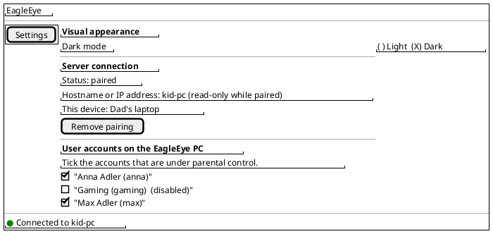
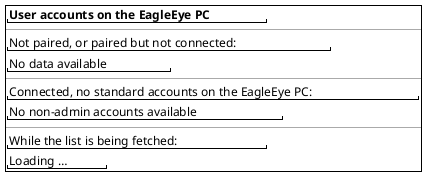
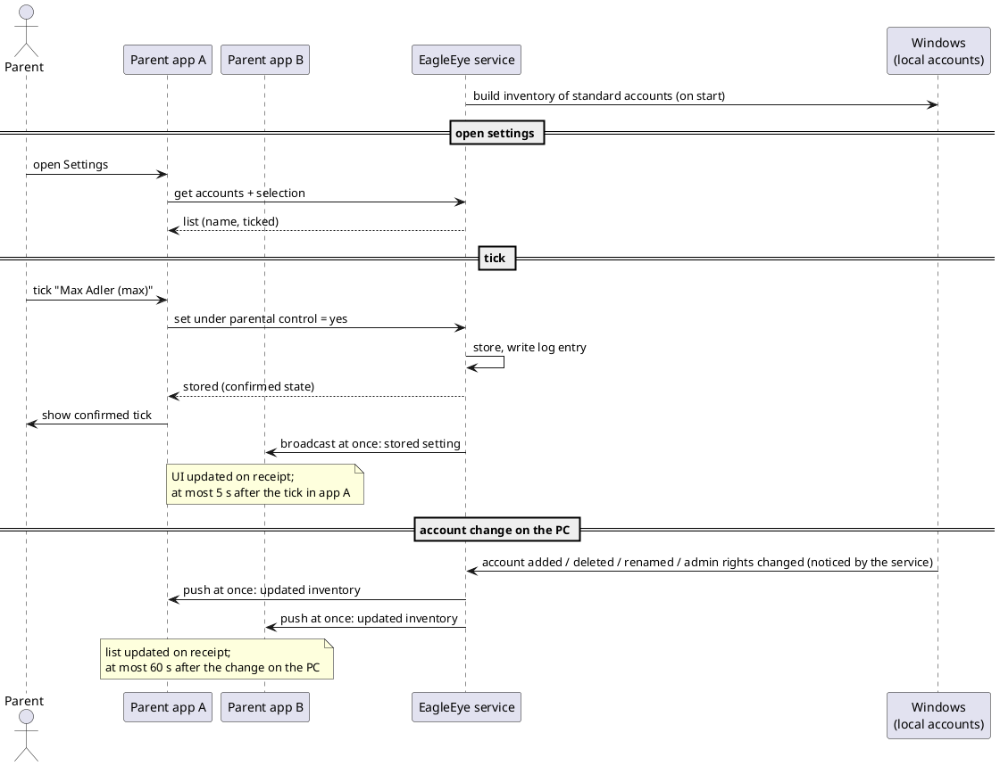

# US-003: Account Inventory and Selection of Accounts under Parental Control

**Status**: Verified/Closed (closed by Michael, 2026-10-07, after `docs/testing/US-003/test-run-01.md`; see `docs/testing/US-003/test-report.md` for ACs not verified manually)
**Created**: 2026-10-07
**Approved**: by Michael, 2026-10-07 (status becomes `Analyzed` when the implementation plan is approved)
**Component(s)**: EagleEye.Service, EagleEye.ParentApp, EagleEye.Shared
**Platform(s)**: Windows (service) · ParentApp Windows

---

## User Story

As a **parent**, I want to see in the parent app the standard (non-admin) user accounts of the EagleEye PC and tick the ones that are under parental control, so that the EagleEye service always knows exactly which of my kids' accounts it has to monitor, and the parent app and the service never disagree about it.

---

## Background

US-001 delivered the service and the tray client on the kid's PC, and US-002 delivered the trusted connection (pairing) between a Windows parent app and the service. Every rule the parent will configure later (allow-lists, budgets, pause windows, statistics) is per kid account (§6 Multi-User Requirements). This story builds the first configuration step on top of that connection: the service keeps an inventory of the standard user accounts on its PC, and the parent decides which of them are **under parental control**.

Until now, the product requirements said that the service monitors **all** standard accounts automatically (FR-SVC-010, MU-013). Michael changed this on 2026-10-07: the parent selects the accounts. The general product requirements get a v1.3 amendment for it (see "Product requirement amendment" below).

This story only stores the selection. Monitoring and enforcement themselves come in later stories; they will use this selection.

References: FR-SVC-010 (v1.3), FR-SVC-030, FR-SVC-031, FR-SVC-053, FR-SVC-070 to FR-SVC-074 (v1.3), FR-SVC-098, FR-SVC-100, FR-APP-012, FR-APP-020, FR-APP-022 (v1.3), FR-APP-081, FR-APP-091, MU-010, MU-013 (v1.3), MU-014, CN-014, NFR-L-010 to NFR-L-012, NFR-R-011.

**Terms used in this story**

- *Service PC*: the Windows 11 PC with `EagleEye.Service` installed (the kid's PC).
- *Account*: a local user account of the service PC that a person can log on with. This includes local accounts and accounts linked to a Microsoft account. Domain and Microsoft Entra ID (work/school) accounts are not part of this story.
- *Admin account*: an account that is a member of the local group "Administrators" ("Administratoren" on German Windows), directly or through another group.
- *Standard account*: an account that is not an admin account (Windows account type "Standard user", German "Standardbenutzer").
- *Built-in accounts*: the accounts Windows creates itself: Administrator, Guest (Gast), DefaultAccount and WDAGUtilityAccount. Also excluded: `defaultuser0`, a technical account that Windows setup sometimes leaves behind.
- *Under parental control*: the parent has ticked the account. Later stories will monitor and enforce rules only for these accounts.
- *Account list*: the new section of the parent app described in this story.

---

## Product requirement amendment (v1.3, proposed with this story)

`02_Implementation/docs/requirements/general-product-requirements.md` gets a v1.3 amendment, to be approved by Michael together with this story:

- **FR-SVC-010** (changed): the service monitors only the standard accounts that the parent has placed under parental control, not all standard accounts.
- **FR-SVC-070, FR-SVC-071** (made precise): the inventory contains standard accounts only; built-in accounts are excluded; the inventory follows changes of the accounts while the service runs.
- **FR-SVC-072 to FR-SVC-074** (new): the service stores per account whether it is under parental control, persists this across restarts, and identifies accounts by their Windows security identifier (SID), not by name.
- **FR-APP-020** (made precise), **FR-APP-022** (new): the parent app shows the inventory and lets the parent tick or untick each account.
- **MU-013** (changed), **§4.3 step 11** (changed): accounts are discovered automatically, and the parent selects which ones are under parental control.

---

## Acceptance Criteria

> **Language of UI texts** (NFR-L-010 to NFR-L-012): all UI texts quoted in these criteria and in the mockups are **English examples**, with the intended German wording in brackets. The parent app shows every text, including error messages, in the Windows display language of the user: German (default) or English. Differences in wording are notes, not Fails (US-002 Decision Q-11).

> **Test setup**: the ACs assume a service PC with at least one admin account (the parent's) and, depending on the AC, zero, one or several standard accounts. Accounts are created, renamed, changed between "Standard user" and "Administrator", disabled and deleted by Michael with the normal Windows tools (*Settings → Accounts → Other users* or *Computer Management → Local Users and Groups*).

### A. Account inventory on the service PC

- [ ] **AC-1**: The service keeps an inventory of all standard accounts of the service PC. An account is listed regardless of whether it is logged on at the moment or has ever been logged on.
- [ ] **AC-2**: Admin accounts are never part of the inventory. This includes the parent's own account and the built-in "Administrator" account.
- [ ] **AC-3**: The built-in accounts Guest, DefaultAccount and WDAGUtilityAccount, and the Windows setup leftover account `defaultuser0`, are never part of the inventory and are never sent to parent apps, even though they are not admin accounts.
- [ ] **AC-4**: Both local accounts and accounts linked to a Microsoft account are part of the inventory, as long as they are standard accounts.
- [ ] **AC-5**: Accounts are identified by their Windows identity (SID), not by their name. When a standard account is renamed, it keeps its tick (AC-15), and the account list shows the new name (AC-19).

### B. Account list in the parent app

- [ ] **AC-6**: The settings page of the Windows parent app has a third section "User accounts on the EagleEye PC" ("Benutzerkonten auf dem EagleEye-PC"), below "Visual appearance" and "Server connection". The navigation menu still has only the "Settings" entry.
- [ ] **AC-7**: When the parent app is not paired, the section shows no accounts and the text "No data available" ("Keine Daten verfügbar").
- [ ] **AC-8**: When the parent app is paired but not connected to the service (e.g. service stopped, PC off), the section shows no accounts and the text "No data available" ("Keine Daten verfügbar"). (See Open Question OQ-5.)
- [ ] **AC-9**: When the parent app is connected and the service PC has no standard accounts (only admin and built-in accounts), the section shows the text "No non-admin accounts available" ("Keine Nicht-Administrator-Konten vorhanden").
- [ ] **AC-10**: When the parent app is connected and the service PC has standard accounts, the section lists each of them in one row with its name (AC-11) and a checkbox "Under parental control" ("Unter Elternkontrolle"). The checkbox shows the selection currently stored in the service. The rows are sorted alphabetically by the shown name, ignoring upper and lower case.
- [ ] **AC-11**: Each row shows the account's full name as set in Windows, followed by the user (logon) name in brackets, e.g. "Max Adler (max)". If the account has no full name, the row shows the user name only, e.g. "max". (See OQ-3.)
- [ ] **AC-12**: When the inventory contains disabled accounts (Windows "Account is disabled"), they are listed like other accounts, with the note "(disabled)" ("(deaktiviert)") after the name, and can be ticked. (See OQ-4.)
- [ ] **AC-13**: When the parent opens the settings page, or the parent app (re)connects to the service while the settings page is open, the section shows the account list and ticks as currently stored in the service. While the data is being fetched, the section shows "Loading …" ("Wird geladen …").

### C. Selecting accounts under parental control

- [ ] **AC-14**: When the parent ticks or unticks an account, the change is sent to the service at once, without a separate "Save" button. Within 5 seconds the service has stored it. The service writes an entry to its log file (`%ProgramData%\EagleEye\logs\EagleEye.Service-NNN.log`, level Information; the `logs` folder can be read by administrators only, not by standard users) that names the account's user name and the new state (under parental control yes/no). The app shows the state as confirmed by the service, and the service broadcasts it to all other connected parent apps (AC-23). (See OQ-1.)
- [ ] **AC-15**: The selection is kept by the service: after closing and restarting the parent app, after restarting the service, after rebooting the service PC and after an update (re-install) of the service, the account list shows the same ticks as before.
- [ ] **AC-16**: When the service cannot store a change (e.g. the connection was lost at the moment of the click), the parent app shows an error message (English example: "The change could not be saved. Please try again."; German: "Die Änderung konnte nicht gespeichert werden. Bitte erneut versuchen.") and the checkbox returns to the state that is stored in the service. The app never shows a tick that differs from the service's stored state for longer than 5 seconds.
- [ ] **AC-17**: The checkboxes can only be changed while the parent app is connected. While the app is not connected, there is nothing to tick (AC-7, AC-8).
- [ ] **AC-18**: An account that appears in the inventory for the first time (a new standard account, or the first inventory after this story is installed) is **not** under parental control: its checkbox is not ticked until the parent ticks it. (See OQ-2.)

### D. Changes of accounts while the service runs

- [ ] **AC-19**: When a standard account is added, deleted or renamed on the service PC, the service pushes the changed inventory at once to **all connected parent apps**, and each of them updates its account list immediately on receipt, without any action of the parent. From the account change on the service PC until the account list in a connected parent app shows the change, at most 60 seconds pass. A parent app that is not connected at the time of the change shows the current inventory as soon as it connects (AC-13).
- [ ] **AC-20**: When a standard account is changed to an admin account, the service pushes this change like in AC-19, and the account disappears from the account list of all connected parent apps; at most 60 seconds pass from the change on the service PC until the account list has changed. The service no longer treats the account as under parental control.
- [ ] **AC-21**: When an admin account is changed to a standard account, the service pushes this change like in AC-19, and the account appears in the account list of all connected parent apps; at most 60 seconds pass from the change on the service PC until the account list has changed. If the account was under parental control before it became an admin account, it is ticked again; otherwise it is not ticked. (See OQ-6.)
- [ ] **AC-22**: When an account under parental control is deleted, the service forgets its selection. If a new account with the same name is created later, it is a different account (new SID) and appears unticked (AC-18).

### E. Several parent apps

> Selection changes always go through the service: a parent app sends its change to the service, the service stores it and then broadcasts the stored setting to all connected parent apps. Parent apps never exchange data with each other directly.

- [ ] **AC-23**: When two paired parent apps A and B are connected at the same time and both show the settings page, and the parent ticks or unticks an account in app A, then app A sends the change to the service, the service stores it and broadcasts the stored setting at once to all connected parent apps, and app B updates its account list immediately on receipt, without any action there. App A shows the state confirmed by the service (AC-14, AC-16). From the tick or untick in app A until app B shows it, at most 5 seconds pass.
- [ ] **AC-24**: When apps A and B change the same account at about the same time, the last change received by the service wins. The service broadcasts each change it stores to all connected parent apps, so that at most 5 seconds after the last change both apps show the same state, which is the state stored in the service. (Recorded by the service log of AC-14.)

### Change Log

| Date | Change | Source |
|---|---|---|
| 2026-10-07 | Story created; product requirements v1.3 amendment proposed | Michael's scope, written by PRO |
| 2026-10-07 | Open questions OQ-1 to OQ-8 answered (proposed defaults accepted); ACs unchanged. Story and requirements v1.3 approved | Michael |
| 2026-10-07 | AC-19 to AC-21: inventory changes are pushed by the service at once to all connected parent apps, which update their list on receipt; the 60-second limit is end-to-end (account change on the PC until the list has changed). Flow overview aligned. Story stays approved. | Michael, change request |
| 2026-10-07 | AC-23, AC-24: selection changes always go through the service (store, then broadcast at once to all connected parent apps; apps update on receipt, never exchange data directly); 5-second limits are end-to-end. AC-14 (confirmed state, broadcast), flow overview, FR-SVC-072 and FR-APP-022 aligned. Story stays approved. | Michael, change request |
| 2026-10-07 | AC-3: `defaultuser0` excluded (ARC Q-4). AC-14: service log moved to the admin-only folder `%ProgramData%\EagleEye\logs\` (ARC Q-2). Terms, FR-SVC-070 and FR-SVC-100 aligned. Story stays approved. | Michael, answers to ARC questions |
| 2026-10-07 | Implementation plan approved; status `Analyzed` | Michael |
| 2026-10-07 | Implemented (version 0.3.0); see `US-003/implementation-report.md`; status `Implemented` | DEV |
| 2026-10-07 | Implemented (0.3.0, patch 0.3.1 for ISSUE-006); test run 01 partly executed; closed by Michael as `Verified/Closed` | Michael |

---

## UI / Interaction Notes

### Settings — paired and connected, standard accounts present (AC-10, AC-11, AC-12)

### Settings — section states (AC-7, AC-8, AC-9, AC-13)

### Flow overview

---

## Out of Scope

- Monitoring and enforcement of any kind (process monitoring, allow-lists, budgets, pause windows, statistics). Ticking an account has no visible effect on the kid's PC in this story.
- Inventory of installed applications (FR-SVC-080 to FR-SVC-082, FR-APP-030 to FR-APP-033).
- Selecting an account to open its own configuration page (FR-APP-021).
- Parent app for Android, iOS and macOS. This story covers the **Windows** parent app only (built and tested on the Windows Developer Machine).
- Domain accounts and Microsoft Entra ID (work/school) accounts.
- Changes to the tray client.
- Creating, deleting or changing Windows accounts from the parent app.
- Technical protection against a kid who pairs their own parent app and unticks their own account (see OQ-7).

---

## Open Questions (answered by Michael, 2026-10-07)

Each question had a proposed default. Michael accepted all of them, so the ACs stay as written.

| ID | Question | Proposed default | Answer |
|---|---|---|---|
| OQ-1 | **How is a change saved?** Immediately on tick/untick, or with a "Save" button for the whole list? | Immediately on each tick/untick, no "Save" button (AC-14). Errors revert the checkbox (AC-16). | Answer (Michael, 2026-10-07): proposed default accepted |
| OQ-2 | **Default for an account that appears for the first time.** Unticked (parent opts in) or ticked (safe side: a new kid account is controlled at once)? A kid cannot create accounts, so new accounts are created by a parent. | Unticked (AC-18). The parent decides explicitly. | Answer (Michael, 2026-10-07): proposed default accepted |
| OQ-3 | **Which name is shown?** Accounts linked to a Microsoft account often have a cut-off user name (e.g. "micha") and a full name ("Michael Adler"). | Full name followed by the user name in brackets; user name only if there is no full name (AC-11). | Answer (Michael, 2026-10-07): proposed default accepted |
| OQ-4 | **Disabled accounts.** Show them (marked "disabled") or hide them? | Show them with "(disabled)" and allow ticking (AC-12), so a temporarily disabled kid account keeps its setting. The built-in accounts are always hidden (AC-3). | Answer (Michael, 2026-10-07): proposed default accepted |
| OQ-5 | **Paired but not connected.** Show "No data available" or the last known list (read-only)? | "No data available" (AC-8), so the app never shows outdated data. | Answer (Michael, 2026-10-07): proposed default accepted |
| OQ-6 | **Account becomes admin and later standard again.** Should the service remember the earlier tick? | Yes, it remembers and restores the tick (AC-21). The account is not treated as under parental control while it is an admin account (AC-20, MU-014). | Answer (Michael, 2026-10-07): proposed default accepted |
| OQ-7 | **Kid pairs their own parent app** (US-002 Decision Q-8, `01_Intend_and_Constraints/questions_and_answers.md` Q10.1: "revisit when configuration stories make it relevant"). This is the first story where a paired app changes configuration: a kid could untick their own account. | Keep it an accepted risk in this story, because the selection has no effect yet. Decide on a protection before the first enforcement story. | Answer (Michael, 2026-10-07): proposed default accepted |
| OQ-8 | **Section name and checkbox label.** | Section "User accounts on the EagleEye PC" ("Benutzerkonten auf dem EagleEye-PC"), checkbox "Under parental control" ("Unter Elternkontrolle"). | Answer (Michael, 2026-10-07): proposed default accepted |

---

## Related

- Prerequisite stories: US-001 (service, tray client, installer), US-002 (Windows parent app, pairing)
- General product requirements: v1.3 amendment (FR-SVC-010, FR-SVC-070 to FR-SVC-074, FR-APP-020, FR-APP-022, MU-013, §4.3) proposed together with this story
- Implementation Plan: `US-003/implementation-plan.md` (added by ARC)
- Issues: `US-003/issues/` (added by TES)
- Manual tests: `docs/testing/US-003/` (added by TES)
