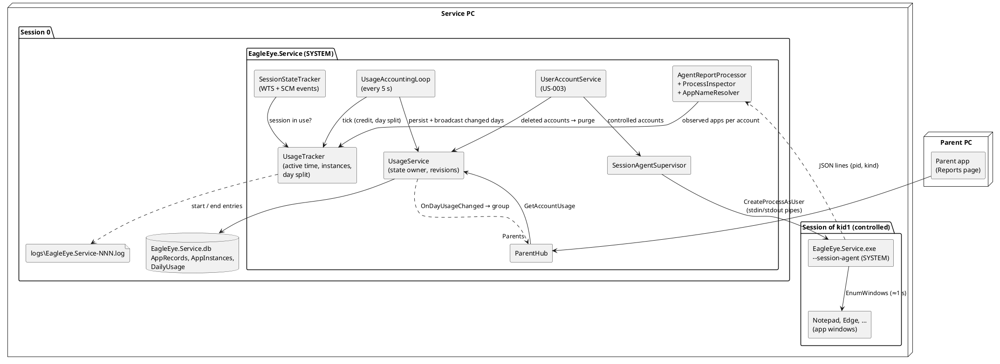
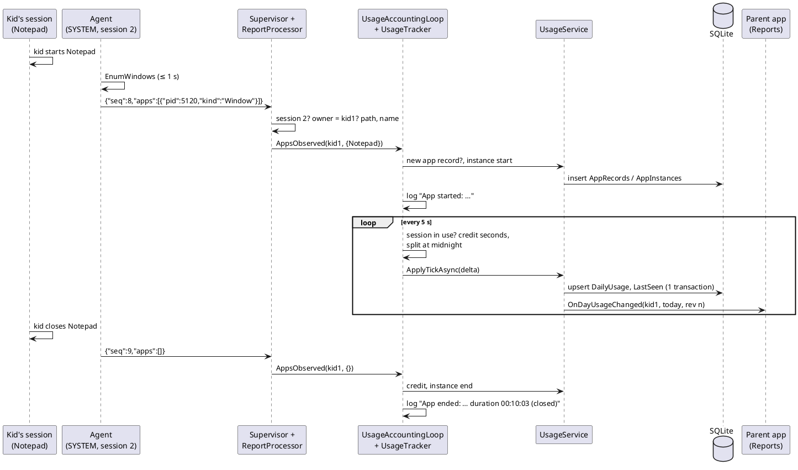

# Implementation Plan: US-004 — App Usage Tracking and Daily Usage Report

**Status**: Draft (for approval by Michael)
**Date**: 2026-10-07
**Author**: ARC
**User story**: `02_Implementation/docs/requirements/user-stories/US-004/user-story.md` (approved 2026-10-07, 27 ACs, OQ-1 to OQ-11 answered with the proposed defaults)
**Requirements**: `02_Implementation/docs/requirements/general-product-requirements.md` v1.4 (approved)
**New ADRs** (status *Proposed — approved with this plan*):
- ADR-011 — Session agent for app observation (`02_Implementation/docs/architecture/decisions/ADR-011-session-agent-for-app-observation.md`)
- ADR-012 — Usage accounting (`02_Implementation/docs/architecture/decisions/ADR-012-usage-accounting.md`)

**Amended**: ADR-005 (Explorer, seconds, identity by path for recording), arc42, coding guidelines; all marked "proposed with the US-004 plan".

---

## Machine Assignment

**Everything runs on the Windows Developer Machine.** US-004 touches Shared, Service, `ParentApp.Core`, the Windows target of the ParentApp and the service installer. Shared contract changes land first, on Windows (ADR-007). The MacBook is not needed.

| Work | Machine |
|---|---|
| This plan, ADR-011, ADR-012, ADR-005 amendment, arc42, coding guidelines (ARC) | Windows Developer Machine (done here) |
| Steps 0 to 11 (DEV): code, unit tests, `build.ps1` / `test.ps1`, installers, smoke check | **Windows Developer Machine** |
| Manual test run (Michael) | Windows Developer Machine as service PC, with the kid accounts `kid1` (controlled) and `kid2` (not controlled) and the parent's admin account. The parent app on the service PC or, better, on the second Windows PC (US-003 Q-6), so the kid's session can be locked and switched without affecting the parent app. |
| MacBook | Not needed. `ParentApp.Core`, `Shared` and their tests stay free of Windows APIs (the window and process code lives in the Windows-only service), so `build.ps1` / `test.ps1` keep working there after the next `git pull`. |

The Android target is built by `build.ps1` on Windows. The new Reports page must compile for Android with zero warnings; there is no Android-specific work and no Android test.

---

## Impact Assessment

| Component | Impact |
|---|---|
| **EagleEye.Shared** | New contract members `IParentHub.GetAccountUsage`, `IParentClientCallback.OnDayUsageChanged`; DTOs `AccountUsageDto`, `DayUsageDto`, `AppUsageDto`. |
| **EagleEye.Service** | **Agent mode** (`--session-agent`, ADR-011): `SessionAgent/` (window scan, app-window rule, protocol). **Monitoring** (`Monitoring/`): sessions (WTS), service lifetime with session and power events, agent launcher and supervisor, process inspector, app-name resolver, agent-report processor. **Statistics** (`Statistics/`, existing empty folder): `UsageTracker` (active time, instances, day split), `UsageService` (state owner of the usage areas), broadcaster, accounting loop (5 s), purge. `Data/`: migration 3, `UsageRepository`. `UserAccounts/`: controlled-account query and deletion hook. `ParentHub`: one method. `Program`: agent-mode branch, DI, start order. |
| **EagleEye.ParentApp.Core** | `IParentHubClient`/`ParentHubClient`: query and callback; `ParentHubGateway`: forwards `DayUsageChanged`. New `Reports/AccountUsageModel`, view models `ReportsViewModel`, `DayUsageViewModel`, `AppUsageRowViewModel`, `UsageDuration`; `MainViewModel`: menu entry "Berichte"; texts. |
| **EagleEye.ParentApp** | New `Views/ReportsView`; `MainPage` switches the content by menu entry; DI. |
| **EagleEye.TrayClient** | None (AC-27). |
| **Installers** | `setup.iss`: after stopping the service, also end remaining agent processes (they are `EagleEye.Service.exe` too) before files are replaced. No new files. Version 0.4.0. Upgrade from 0.3.1 applies migration 3 at the first start. |
| **Scripts** | None. |
| **Version** | `Directory.Build.props` → `0.4.0` (service reports `EagleEye_v0.4`). |

---

## Architecture Changes

Applied in this commit, on the feature branch, as part of what Michael approves with this plan (all marked "proposed with the US-004 plan"):

| Document | Change |
|---|---|
| `docs/architecture/decisions/ADR-011-session-agent-for-app-observation.md` | **New** |
| `docs/architecture/decisions/ADR-012-usage-accounting.md` | **New** |
| ADR-005 | Amendment: recording is not classification; Explorer counted while a File Explorer window is open (OQ-3); seconds; identity by path for recording; display-name order |
| arc42 §5.2 | Monitoring and Statistics components made concrete (session agent, sessions, usage tracker, usage state owner) |
| arc42 §6.2 | New runtime view part "App observation and usage accounting (US-004)" before the enforcement flow |
| arc42 §7, §7.1 | Deployment: session agent process (SYSTEM, in each watched session) |
| arc42 §8.4, §8.6, §8.7 | Tables `AppRecords`, `AppInstances`, `DailyUsage`; retention; time tracking in seconds with the monotonic clock |
| arc42 §8.3 | Usage state areas keyed by account and day (ADR-012 §6) |
| arc42 §9, §11, §12 | ADR-011, ADR-012; risks R-10 (Apps rule differs from Task Manager), R-11 (agent memory); glossary "App", "Session agent", "Active" |
| Coding guidelines §10.1, §12.1 | Folders `SessionAgent/`, `Monitoring/`, `Statistics/`, `ParentApp.Core/Reports/`; service rules for agent mode and Win32 interop |

DEV updates the READMEs of Service, Shared, `ParentApp.Core` and ParentApp (Step 11).

---

## New ADRs Required

- **ADR-011 — Session agent for app observation.** The SYSTEM service in session 0 cannot see windows of user sessions. It starts **its own executable in agent mode (`--session-agent`) as SYSTEM inside each session of a controlled account** (`CreateProcessAsUser` with a duplicated SYSTEM token, `TokenSessionId` set, desktop `WinSta0\Default`). The agent scans top-level windows about once per second with the "Apps" rule (visible, not app-cloaked, unowned and no tool window or `WS_EX_APPWINDOW`, no shell classes; Store apps resolved behind `ApplicationFrameHost`; `explorer.exe` only for `CabinetWClass`). It reports `{pid, kind}` as JSON lines over an inherited anonymous stdout pipe, on change and every 5 s; end of stdin means stop. The kid cannot end it. The tray client was rejected as sensor (runs as the kid, can be ended, unauthenticated channel, AC-27).
- **ADR-012 — Usage accounting.** App = full program path per account (OQ-2), several processes and windows count once. Active = open and an account session in use (WTS `Active`, unlocked). Durations from the monotonic clock with a 15 s gap rule and power events (sleep never counted, clock changes harmless). Day split at local midnight. One transaction every 5 s (crash loss ≤ 5 s). Usage state areas keyed by **account and day** (`DayUsageDto` with per-account revision), query per account, broadcast of changed days at most every 5 s.

---

## API Changes (SignalR Contracts)

*API-first: DEV implements this section first (Step 1). ADR-010 shape, keyed areas per ADR-012 §6.*

### `EagleEye.Shared/Contracts/IParentHub.cs` (changed)

```csharp
/// <summary>
/// Returns the recorded usage of one account (state areas "UsageDay:{sid}:{day}", ADR-012 §6):
/// today (always present, possibly without apps) and every other day of the last 90 days with
/// usage, newest first. Called after every (re)connect and when the parent selects another account.
/// </summary>
/// <param name="accountSid">SID of a standard account of the inventory (US-003), controlled or not.</param>
Task<AccountUsageDto> GetAccountUsage(string accountSid);
```

Not `[AllowUnpaired]`: the default-deny filter rejects unpaired callers (FR-SVC-098). There is no write command; usage is produced by the service only.

### `EagleEye.Shared/Contracts/IParentClientCallback.cs` (changed)

```csharp
/// <summary>
/// The usage of one account on one day changed (ADR-012 §6). Sent to all paired apps at most once
/// per account every 5 s while apps are active, and at local midnight with the new, empty today.
/// Apply only if <see cref="DayUsageDto.Revision"/> is higher than the revision held for that day.
/// </summary>
Task OnDayUsageChanged(DayUsageDto snapshot);
```

### `EagleEye.Shared/Models/` (new)

```csharp
/// <summary>Usage of one app on one day.</summary>
/// <param name="AppId">Stable id of the app record (per account, per program path).</param>
/// <param name="DisplayName">Task Manager's name (AC-8), resolved by the service.</param>
/// <param name="Seconds">Active seconds on that day (FR-SVC-012), ≥ 0.</param>
public sealed record AppUsageDto(long AppId, string DisplayName, long Seconds);

/// <summary>Snapshot of the state area "UsageDay:{AccountSid}:{Day}" (ADR-010 §3, ADR-012 §6).</summary>
/// <param name="Revision">Per-account counter, strictly increasing per day area during one service run.</param>
/// <param name="LastChangeRequestId">Always null (no client writes).</param>
/// <param name="AccountSid">The account.</param>
/// <param name="Day">Local date of the service PC.</param>
/// <param name="ServiceToday">The service PC's local date when the snapshot was made.</param>
/// <param name="Apps">Apps with usage on that day, in any order (the app sorts).</param>
public sealed record DayUsageDto(
    long Revision, Guid? LastChangeRequestId, string AccountSid, DateOnly Day, DateOnly ServiceToday,
    IReadOnlyList<AppUsageDto> Apps);

/// <summary>Query result: today plus every day of the last 90 days with usage, newest first.</summary>
public sealed record AccountUsageDto(string AccountSid, DateOnly ServiceToday, IReadOnlyList<DayUsageDto> Days);
```

`DateOnly` is serialized by `System.Text.Json` as `"yyyy-MM-dd"`. Payload: today about 1 KB; a full query with 90 busy days about 100 KB, once per connect or account change.

---

## Component Design

### Overview



### Decision 1: how the service sees apps in other sessions (AC-1 to AC-6)

**A session agent: the service executable started in agent mode as SYSTEM inside each watched session** (ADR-011). Summary of the weighing (details in the ADR):

| Option | Verdict |
|---|---|
| Service alone in session 0 (process list, GUI-resource counts, name lists) | Rejected: window stations are per session, so the service cannot enumerate the kid's windows. It cannot tell a notification-area program (OneDrive) from an app (AC-5), and cannot find the app behind `ApplicationFrameHost` (AC-3). |
| Tray client as sensor (already in every session, channel to the service exists) | Rejected: it runs **as the kid** and can be ended by the kid (arc42 R-6), so recording would silently stop. Its loopback hub is unauthenticated, so any program could report fake data. AC-27 and AC-5 also keep the tray out of this story. |
| **SYSTEM agent per session (chosen)** | Sees the session's windows; the kid cannot end it; inherited anonymous pipes cannot be reached by other processes; the same executable means no new deliverable and no version skew. Later enforcement (graceful `WM_CLOSE`, ADR-006) needs exactly this foothold in the session. |
| ETW window events, WMI, UI Automation from session 0 | Rejected: undocumented, heavy, or blocked by session isolation. |

**"Apps" group rule** (`AppWindowRule`, pure, ADR-011 §4): visible with non-empty size; not cloaked, or cloaked only by the shell (other virtual desktop); unowned and not `WS_EX_TOOLWINDOW`, or `WS_EX_APPWINDOW`; not a shell class. `ApplicationFrameWindow` → report the process of the child `Windows.UI.Core.CoreWindow` (Store apps such as Calculator under their own name). `explorer.exe` → only `CabinetWClass` windows count, kind `FileExplorer` (AC-4). Minimised windows stay visible in this sense and count (AC-12).

**Grouping (AC-6)**: the service maps every reported PID to its program path. All PIDs with the same path are **one app** of the account. Edge, VS Code and others whose windows belong to one main process are one app anyway; two Notepad processes are one app too.

**Filters in the service** (`AgentReportProcessor`):
- The process must run in the agent's session, and its owner SID must equal the session user's SID. Programs started with other credentials ("Run as administrator" with the parent's password) are not recorded (out of scope).
- Never recorded: `EagleEye.TrayClient.exe`, `EagleEye.Service.exe` (AC-5).
- Only sessions of controlled accounts have an agent at all (AC-1).

### Decision 2: session state "in use" (AC-12)

`SessionStateTracker` keeps per session: `SessionId`, user SID, WTS state, locked flag.
- **Events**: an own `EagleEyeServiceLifetime` (derived from `WindowsServiceLifetime`, `CanHandleSessionChangeEvent = true`, `CanHandlePowerEvent = true`) forwards SCM session changes (`SessionLock`, `SessionUnlock`, `SessionLogon`, `SessionLogoff`, `ConsoleConnect`, `ConsoleDisconnect`, `RemoteConnect`, `RemoteDisconnect`) and power events (`Suspend`, `ResumeSuspend`, `ResumeAutomatic`) at once, as events into the usage queue.
- **Reconciliation**: every tick, `WtsSessionSource` re-reads all sessions (`WTSEnumerateSessions`, `WTSQuerySessionInformation(WTSSessionInfoEx)` for state and lock flag; user SID via `WTSQueryUserToken` + `GetTokenInformation(TokenUser)`). This covers missed notifications and console mode (no SCM events).
- **In use** = state `WTSActive` and not locked. Fast user switching puts the other session into `WTSDisconnected` (not in use). Sleep: the process is suspended; `Suspend` stops crediting, `Resume` restarts it (ADR-012 §3).

### Decision 3: accounting (AC-12 to AC-16)

`UsageTracker` (pure state machine, ADR-012 §2 to §4):
- Per account: open apps (path → PIDs, instance id, display name, `creditedUpTo` monotonic timestamp, carried fraction).
- Inputs (all through one `Channel<UsageEvent>`, consumed by `UsageAccountingLoop`, so no locks): `AppsObserved(sessionId, sid, apps)`, `SessionChanged`, `PowerSuspend`, `PowerResume`, `MonitoringStopped(sid, reason)`, `Tick`.
- Crediting at every tick (5 s) and before every change of the active set. Interval length from `TimeProvider.GetTimestamp`; > 15 s → not credited, logged (gap rule). Day assignment via `DaySplitter` on `[nowLocal − length, nowLocal]` with the service PC's `TimeZoneInfo.Local` (injected for tests).
- Output per tick: `UsageDelta` = seconds per (sid, appId, day), instance starts and ends, "last seen" per open instance.

**Start of recording (AC-2)**: within one tick (≤ 5 s) after the account becomes controlled, the supervisor starts the agent. Its first report opens instances for apps that are already running, counted from that moment. **Stop**: unticked or became admin → `MonitoringStopped(sid, "monitoring stopped")`: credit up to now, end the instances, stop the agent. Both well within 60 s.

**Service stop** (`StopAsync`): credit, end all instances with "service stopping", persist, close the agents' stdin (kill after 2 s if they have not exited). **Service start**: close instances left open by a crash at their `LastSeenUtc` with "service stopped unexpectedly", and write their end log entries (AC-10, AC-15).

### Decision 4: persistence and retention (AC-7, AC-9 to AC-11)

Migration 3, see Data Model. Every tick writes one transaction (`UsageRepository.ApplyAsync(delta)`): upsert `DailyUsage` seconds, update `AppInstances.LastSeenUtc`. App records and instance starts are written at once when they happen.

- **90 days**: at the first tick after local midnight and at start: delete `DailyUsage` with `Day < today − 89` and `AppInstances` with `StartedUtc` older than 90 days (AC-11, AC-19). App records stay (AC-9).
- **Account deleted (AC-9, FR-SVC-047)**: `UserAccountService.RefreshInventoryAsync` (US-003) already knows the set of **all** existing local SIDs after a successful enumeration. It gets a new collaborator `IAccountDataPurger` (implemented by `UsageService`): `PurgeMissingAccountsAsync(allExistingSids)` deletes app records, history and usage of every SID that is no longer on the PC. A failed enumeration never purges (same guard as US-003). This runs ≤ 15 s after the deletion and also catches deletions while the service was stopped (initialization).
- Unticking or becoming admin deletes nothing (AC-2, AC-9).

### Decision 5: usage state areas and pushes (AC-21 to AC-23)

`UsageService` is the state owner (ADR-010 §9, ADR-012 §6):
- `GetAccountUsageAsync(sid)`: SID must be a standard account of the inventory (else `UnknownAccountException`); reads today plus all days with usage within 90 days; each day carries the account's current revision.
- `ApplyTickAsync(delta)`: persists; for each changed (sid, day), revision++ and broadcast `DayUsageDto` (at most once per account per tick).
- Midnight: empty today snapshot for every controlled account.
- Broadcast failure → Warning, no effect on recording.

Lag (AC-22): the service's value is ≤ 5 s behind; the push follows in the same tick; network and UI < 1 s → **displayed lag ≤ about 6 s** (bound 15 s). A new app: the instance start creates the app record and a 0 s row, and is pushed with the next tick → visible ≤ 5 s after the agent's report (agent scan ≈ 1 s) → **≤ about 7 s** (bound 15 s).

Load (AC-25): agent: one `EnumWindows` pass per second (a few hundred windows, < 1 ms), output only on change. Service: process inspection only for PIDs not seen before (cache by PID + creation time), name resolution cached per path, one small SQLite transaction and at most one ~1 KB broadcast per account every 5 s. Expected CPU well below 0.5 % for service + agent together.

### EagleEye.Service — classes

```plantuml
@startuml US-004 Service
skinparam componentStyle rectangle
package "EagleEye.Service" {
  package SessionAgent {
    class SessionAgentHost <<agent mode entry>>
    class WindowEnumerator <<Win32>>
    class WindowInfo <<record>>
    class AppWindowRule <<static>>
    class AppWindowScanner
    class AgentReportPublisher
    class AgentProtocol <<static>>
  }
  package Monitoring {
    class EagleEyeServiceLifetime
    interface ISessionSource
    class WtsSessionSource <<Win32>>
    class SessionStateTracker
    interface IAgentLauncher
    class SessionAgentLauncher <<Win32>>
    class DevSessionAgentLauncher <<Debug only>>
    class SessionAgentSupervisor
    class AgentPlan <<static>>
    interface IProcessInspector
    class Win32ProcessInspector <<Win32>>
    interface IAppMetadataSource
    class Win32AppMetadataSource <<Win32>>
    class AppNameResolver
    class AgentReportProcessor
  }
  package Statistics {
    class UsageEventQueue
    class UsageTracker
    class DaySplitter <<static>>
    class UsageAccountingLoop <<BackgroundService>>
    interface IUsageService
    class UsageService
    interface IUsageBroadcaster
    class UsageBroadcaster
    interface IAccountDataPurger
  }
  package Data {
    interface IUsageRepository
    class UsageRepository
  }
}
SessionAgentHost --> WindowEnumerator
SessionAgentHost --> AppWindowScanner
AppWindowScanner --> AppWindowRule
SessionAgentHost --> AgentReportPublisher
AgentReportPublisher --> AgentProtocol
SessionAgentSupervisor --> IAgentLauncher
SessionAgentSupervisor --> AgentPlan
SessionAgentSupervisor --> AgentReportProcessor : lines
AgentReportProcessor --> IProcessInspector
AgentReportProcessor --> AppNameResolver
AppNameResolver --> IAppMetadataSource
AgentReportProcessor --> UsageEventQueue
EagleEyeServiceLifetime --> UsageEventQueue
UsageAccountingLoop --> UsageEventQueue
UsageAccountingLoop --> SessionStateTracker
SessionStateTracker --> ISessionSource
UsageAccountingLoop --> SessionAgentSupervisor : reconcile
UsageAccountingLoop --> UsageTracker
UsageTracker --> DaySplitter
UsageAccountingLoop --> IUsageService
UsageService ..|> IUsageService
UsageService ..|> IAccountDataPurger
UsageService --> IUsageRepository
UsageService --> IUsageBroadcaster
@enduml
```



| Class | Folder | Responsibility | Tests |
|---|---|---|---|
| `Program` (changed) | root | First statement: `if (args.Contains("--session-agent")) return await SessionAgentHost.RunAsync(…)` — before log folder protection, host or database. Service mode: DI, `EagleEyeServiceLifetime` (only when running as a Windows service), start order (database → accounts → `UsageService.InitializeAsync` (close dangling instances, purge) → host). | manual |
| `SessionAgentHost` | SessionAgent | Agent loop: every 1 s `WindowEnumerator.Enumerate()` → `AppWindowScanner.Scan` → `AgentReportPublisher` (writes a line on change or every 5 s). A background read on stdin; EOF → exit 0. Unexpected exception → stderr, exit 1. | manual (thin) |
| `WindowEnumerator` | SessionAgent | Win32 (`[LibraryImport]`): `EnumWindows`; per window `IsWindowVisible`, `GetWindowRect`, `GetWindow(GW_OWNER)`, `GetWindowLongPtr(GWL_EXSTYLE)`, `DwmGetWindowAttribute(DWMWA_CLOAKED)`, `GetClassName`, `GetWindowThreadProcessId`; for `ApplicationFrameWindow` `EnumChildWindows` to find the `Windows.UI.Core.CoreWindow` with a different PID → `WindowInfo`. | manual |
| `WindowInfo` | SessionAgent | `record (nint Handle, int ProcessId, string ClassName, bool IsVisible, int Width, int Height, bool HasOwner, long ExStyle, int Cloaked, int? HostedProcessId, string ProcessName)` | — |
| `AppWindowRule` | SessionAgent | Pure: `Classify(WindowInfo) → AppWindowKind? (Window, FileExplorer)` and the reported PID (hosted PID for Store frames), ADR-011 §4. | **unit** |
| `AppWindowScanner` | SessionAgent | Pure: windows → distinct `(pid, kind)` set, sorted. | **unit** |
| `AgentReportPublisher` | SessionAgent | Pure with `TimeProvider`: emits when the set changed or 5 s passed; sequence number. | **unit** |
| `AgentProtocol` | SessionAgent | JSON line format (`System.Text.Json` source generation): `Serialize(AgentReport)`, `TryParse(line, out report)`; rejects malformed lines, more than 1 000 entries, unknown kinds. | **unit** |
| `EagleEyeServiceLifetime` | Monitoring | `WindowsServiceLifetime` subclass; `OnSessionChange`, `OnPowerEvent` → `UsageEventQueue`. | manual |
| `ISessionSource` / `WtsSessionSource` | Monitoring | Win32 WTS → `IReadOnlyList<SessionInfo(SessionId, UserSid?, WtsState, IsLocked)>`. | manual |
| `SessionStateTracker` | Monitoring | Applies events and reconciliation snapshots; `IsInUse(sessionId)`, `SessionsOf(sid)`, `AccountInUse(sid)`. | **unit** |
| `IAgentLauncher` / `SessionAgentLauncher` | Monitoring | Win32: duplicate SYSTEM token, set `TokenSessionId`, pipes, `CreateProcessAsUser("<service exe>" --session-agent, desktop `WinSta0\Default`, `CREATE_NO_WINDOW`)` → `IAgentProcess` (`ReadLinesAsync`, `StopAsync`, `Exited`, `ProcessId`). | manual |
| `DevSessionAgentLauncher` | Monitoring | **Debug builds only**: starts the agent as a normal child process in the current session (`Process.Start` with redirected streams), so DEV can smoke-test without SYSTEM rights. Enabled with `EAGLEEYE_DEV_WATCH_SID=<sid>` (that SID is treated as controlled; see Step 9). | manual |
| `AgentPlan` | Monitoring | Pure: `Compute(sessions, controlledSids, runningAgents, now)` → agents to start / stop; back-off 1, 5, 30 s after unexpected exits. | **unit** |
| `SessionAgentSupervisor` | Monitoring | Applies the plan; reads agent lines → `AgentReportProcessor`; logs starts, exits, stderr; a missing heartbeat for 15 s → the agent is restarted and the session's apps are treated as unknown (credit stops, instances stay open). | **unit** (mocked launcher) |
| `IProcessInspector` / `Win32ProcessInspector` | Monitoring | Win32: `OpenProcess(PROCESS_QUERY_LIMITED_INFORMATION)`, `QueryFullProcessImageName`, `ProcessIdToSessionId`, `OpenProcessToken` → owner SID, `GetProcessTimes` → creation time, `GetPackageFullName` → `ProcessFacts`. | manual |
| `IAppMetadataSource` / `Win32AppMetadataSource` | Monitoring | `FileVersionInfo.FileDescription`; package display name via `GetPackagePathByFullName` + manifest `DisplayName` + `SHLoadIndirectString` (`ms-resource:` values). | manual |
| `AppNameResolver` | Monitoring | Pure order (ADR-012 §1): package display name → file description → process name without `.exe`; trims; cache per (path, package). | **unit** |
| `AgentReportProcessor` | Monitoring | Validates PIDs (session, owner SID), applies the never-record list, maps to `ObservedApp(path, processName, displayName, kind, pids)` per account, caches by PID + creation time, enqueues `AppsObserved`. | **unit** |
| `UsageEventQueue` | Statistics | Unbounded `Channel<UsageEvent>` (single reader). | **unit** |
| `DaySplitter` | Statistics | Pure: `(DateTimeOffset endLocal, TimeSpan length, TimeZoneInfo zone)` → parts per local date. | **unit** |
| `UsageTracker` | Statistics | Pure state machine (Decision 3); outputs `UsageDelta` and `InstanceEvent`s; writes the start/end log entries. | **unit** |
| `UsageAccountingLoop` | Statistics | `BackgroundService`: `PeriodicTimer(5 s, TimeProvider)` enqueues `Tick`; consumes the queue: session reconciliation, supervisor reconcile (controlled SIDs from `IUserAccountService`), tracker, `IUsageService.ApplyTickAsync`, midnight purge. Exceptions in one iteration are logged; the loop continues. `StopAsync` performs the service-stop sequence. | **unit** |
| `IUsageService` / `UsageService` | Statistics | State owner (Decision 5), `InitializeAsync` (close dangling instances, purge), `RecordAppAsync`, `StartInstanceAsync`, `EndInstanceAsync`, `ApplyTickAsync`, `GetAccountUsageAsync`, `PurgeMissingAccountsAsync` (as `IAccountDataPurger`), `PurgeOldDataAsync`. One `SemaphoreSlim`, revision per account. | **unit** |
| `IUsageBroadcaster` / `UsageBroadcaster` | Statistics | `OnDayUsageChanged` to group `Parents`. | **unit** |
| `IUsageRepository` / `UsageRepository` | Data | SQL for the three tables (see Data Model). | **unit** (in-memory) |
| `IUserAccountService` (changed) | UserAccounts | New `GetControlledAccountsAsync()` → standard accounts with stored `true` (SID, user name). `RefreshInventoryAsync`/`InitializeAsync` call `IAccountDataPurger.PurgeMissingAccountsAsync(allExistingSids)` after a successful enumeration. | **unit** |
| `ParentHub` (changed) | Communication | `GetAccountUsage(accountSid)`: SID syntax check → `UsageService`; `UnknownAccountException` → `HubException("Unknown account.")`; other → log + `HubException("The usage is not available.")`. | **unit** |

**Log entries** (English, Information unless noted, admin-only `logs\` folder, US-003):

| When | Template |
|---|---|
| Recording starts (AC-2) | `Usage recording started for account {UserName} ({AccountSid}) in session {SessionId}.` |
| Recording stops (AC-2) | `Usage recording stopped for account {UserName} ({AccountSid}): {Reason}.` |
| New app record (AC-7) | `New app for account {UserName}: {DisplayName} ({ProcessName}, {ProgramPath}).` |
| Instance start (AC-10) | `App started: account {UserName}, {DisplayName} ({ProcessName}, {ProgramPath}), instance {InstanceId}.` |
| Instance end (AC-10) | `App ended: account {UserName}, {DisplayName} ({ProcessName}, {ProgramPath}), instance {InstanceId}, duration {Duration} ({Reason}).` — duration `hh:mm:ss` from start to end; reasons `closed`, `monitoring stopped`, `session ended`, `service stopping`, `service stopped unexpectedly` |
| Gap not counted (AC-15, AC-16) | `Usage accounting paused for {Seconds} s (sleep, suspension or delay); this time is not counted.` |
| Agent | `Session agent started in session {SessionId} (process {ProcessId}).` / Warning: `Session agent in session {SessionId} exited with code {ExitCode}; restarting in {Delay}.` / Warning: `Session agent in session {SessionId}: {Message}` (stderr) |
| Purge (AC-9, AC-11) | `Purged usage data older than {CutoffDay}: {DayRows} daily entries, {Instances} history entries.` / `Purged all recorded data of deleted account {AccountSid}: {Apps} apps, {Instances} history entries, {DayRows} daily entries.` |
| Errors | Warning/Error with exception: process inspection failed, name resolution failed (fallback used), persistence failed (data kept in memory and retried next tick) |

### EagleEye.ParentApp.Core

| Class | Responsibility | Tests |
|---|---|---|
| `IParentHubClient` / `ParentHubClient` (changed) | `GetAccountUsageAsync(sid, ct)`; `event Action<DayUsageDto>? DayUsageChanged`, handler registered before `StartAsync`. | manual |
| `IParentHubGateway` / `ParentHubGateway` (changed) | Forwards `DayUsageChanged` like `UserAccountsChanged` (current client, only while connected). | **unit** |
| `Reports/IAccountUsageModel` / `AccountUsageModel` (new) | Client side of the usage areas for **one selected account**: `SelectAccountAsync(sid?)`; `LoadState` (`NotAvailable`, `Loading`, `Ready`); `ServiceToday`; `Days` (one `StateReplica<DayUsageDto>` per day); `Changed`. On `Connected` and on account change: reset, `Loading`, `GetAccountUsage` (15 s timeout); results of an earlier selection or connection are ignored (generation counter). On `DayUsageChanged`: only for the selected account, revision rule per day, creates missing days, then drops days `< ServiceToday − 89` and empty past days. `Disconnected` → `NotAvailable`. | **unit** |
| `ViewModels/ReportsViewModel` (new) | Page state `ReportsState` (`NoData`, `NoControlledAccounts`, `Loading`, `Report`) with its text (AC-20). `Accounts`: controlled accounts from `IUserAccountsModel.Snapshot` (`IsUnderParentalControl`), names and order like US-003 (`AccountDisplayName`). `SelectedAccount`: first account on opening; kept while it is in the list; replaced by the first one when it disappears (AC-17, AC-23). `Days`: `ObservableCollection<DayUsageViewModel>`, today first, then descending (AC-18), merged by date. Dispatches to the UI thread. | **unit** |
| `ViewModels/DayUsageViewModel` (new) | `Day`, `Heading` ("Heute, 07.10.2026" / "06.10.2026": `AppTexts.TodayFormat` + `Day.ToString("d", CultureInfo.CurrentCulture)`), `Rows` (merged by `AppId`), `ShowNoUsageToday` (today without rows, AC-19), `HasRows` (table header only with rows). | **unit** |
| `ViewModels/AppUsageRowViewModel` (new) | `AppId`, `DisplayName`, `Seconds`, `UsageText`. Sort: seconds descending, then name (current culture, ignore case) (AC-18). | **unit** |
| `ViewModels/UsageDuration` (new, static) | `ToHhMm(long seconds)`: rounded down to minutes, `"{h:00}:{m:00}"` (59 s → "00:00", 3 599 s → "00:59", 86 400 s → "24:00") (AC-19, OQ-4). | **unit** |
| `ViewModels/MainViewModel` (changed) | Menu: "Einstellungen" (`settings`), "Berichte" (`reports`) (AC-17). | **unit** |
| `AppTexts` + resx | New keys, see Localization Impact. | **unit** |

### EagleEye.ParentApp (MAUI head)

| Item | Design |
|---|---|
| `Views/ReportsView.xaml` | Page header "Berichte". Row "Konto" + `Picker` (`ItemsSource` = accounts, `ItemDisplayBinding` = display name; hidden unless state `Report` or `Loading`). Status label for `NoData`, `NoControlledAccounts`, `Loading`. Day list (`BindableLayout` in a `ScrollView`): per day a bold heading; if `ShowNoUsageToday` the text "Heute keine Nutzung aufgezeichnet"; if `HasRows` a **table** (lesson of `US-003/issues/ISSUE-006.md`): `Grid` with a bold header row "App" \| "Nutzung (HH:MM)", fixed column widths (360 and 160 device-independent units, so header and rows line up and scale), one row per app, the duration right-aligned, long names wrap. Readable at 150 % scaling and in light and dark mode (ISSUE-004, ISSUE-006). |
| `Views/MainPage.xaml.cs` | Gets `SettingsView` and `ReportsView`; switches `ContentRegion.Content` when `MainViewModel.SelectedItem` changes. |
| `MauiProgram` | `IAccountUsageModel`, `ReportsViewModel`, `ReportsView` (singletons). |

### Runtime: app start, accounting, push



### Installers and scripts

- `installer/windows/setup.iss`: in `PrepareToInstall` and the uninstall step, after `net stop EagleEyeService`, run `taskkill /F /IM EagleEye.Service.exe` (ends agents that are still exiting, so the files can be replaced). The agents normally exit on their own when the service closes their stdin. No new files, no ACL change. Version from `Directory.Build.props`.
- Upgrade 0.3.1 → 0.4.0: migration 3 at the first start; pairings and selections stay.
- `parentapp-setup.iss`, scripts: no change.

---

## Data Model Changes

### Service — `EagleEye.Service.db`, migration 3

```sql
CREATE TABLE AppRecords (                                  -- app inventory, kept without time limit (AC-9)
    AppId         INTEGER PRIMARY KEY AUTOINCREMENT,
    AccountSid    TEXT NOT NULL,
    ProgramPath   TEXT NOT NULL COLLATE NOCASE,            -- identity per account (OQ-2)
    ProcessName   TEXT NOT NULL,                           -- e.g. Code.exe
    DisplayName   TEXT NOT NULL,                           -- AC-8, updated when it changes
    FirstSeenUtc  TEXT NOT NULL,
    LastSeenUtc   TEXT NOT NULL,
    UNIQUE (AccountSid, ProgramPath)
);
CREATE TABLE AppInstances (                                -- history, 90 days (AC-10, AC-11)
    InstanceId    INTEGER PRIMARY KEY AUTOINCREMENT,
    AppId         INTEGER NOT NULL REFERENCES AppRecords (AppId) ON DELETE CASCADE,
    StartedUtc    TEXT NOT NULL,
    LastSeenUtc   TEXT NOT NULL,                           -- updated every tick; end time after a crash
    EndedUtc      TEXT NULL,                               -- NULL while open
    EndReason     TEXT NULL
);
CREATE INDEX IX_AppInstances_StartedUtc ON AppInstances (StartedUtc);
CREATE INDEX IX_AppInstances_Open ON AppInstances (EndedUtc) WHERE EndedUtc IS NULL;
CREATE TABLE DailyUsage (                                  -- 90 days (AC-11, AC-19)
    AppId         INTEGER NOT NULL REFERENCES AppRecords (AppId) ON DELETE CASCADE,
    Day           TEXT NOT NULL,                           -- local date yyyy-MM-dd of the service PC
    Seconds       INTEGER NOT NULL CHECK (Seconds >= 0),
    PRIMARY KEY (AppId, Day)
);
CREATE INDEX IX_DailyUsage_Day ON DailyUsage (Day);
```

- `foreign_keys = ON` is already set by `SqliteDatabase`, so deleting an account's `AppRecords` removes its history and usage (FR-SVC-047).
- Size estimate per account: 20 apps × 90 days ≈ 1 800 usage rows, plus a few thousand history rows. Negligible.
- Migrations 1 and 2 unchanged; forward-only.
- FR-SVC-042 ("separate files per child account"): fulfilled by account-keyed tables in the one service database (ADR-002, ADR-012 Neutral). See Deviations.

### Parent app

No database change; usage is an in-memory replica only (OQ-5 of US-003: no data when not connected).

---

## Localization Impact

*German is the neutral language (`AppTexts.resx`), English the satellite (`AppTexts.en.resx`). Wording from the story (AC-17 to AC-20).*

### Parent app (`ParentApp.Core/Resources/AppTexts*.resx`, new keys)

| Key | German (default) | English | Where / AC |
|---|---|---|---|
| `MenuReports` | Berichte | Reports | menu entry and page header (AC-17) |
| `ReportsAccountLabel` | Konto | Account | label of the account selection (AC-17) |
| `ReportsTodayFormat` | Heute, {0} | Today, {0} | heading of today; `{0}` = date in the user's short date format (AC-18) |
| `ReportsColumnApp` | App | App | table column header 1 (AC-18) |
| `ReportsColumnUsage` | Nutzung (HH:MM) | Usage (HH:MM) | table column header 2 (AC-18) |
| `ReportsNoUsageToday` | Heute keine Nutzung aufgezeichnet | No usage recorded today | today without usage (AC-19) |
| `ReportsNoControlledAccounts` | Keine Konten unter Elternkontrolle. Konten unter Einstellungen auswählen. | No accounts under parental control. Select accounts under Settings. | AC-20 |

Reused keys: `AccountsNoData` ("Keine Daten verfügbar" / "No data available", AC-20), `AccountsLoading` ("Wird geladen …" / "Loading …", AC-20), `AccountDisabledSuffix` (account names, AC-17 via US-003 AC-11/AC-12).

**Table layout per day** (ISSUE-006 lesson: column headers, no repeated labels):

| App | Nutzung (HH:MM) |
|---|---|
| Minecraft Launcher | 01:25 |
| Microsoft Edge | 00:40 |

The header row is shown only when the day has at least one row. Durations are digits only and not translated. Dates use `CultureInfo.CurrentCulture` short date (Windows regional format of the parent's user, e.g. `07.10.2026` or `10/7/2026`; AC-18's "10/07/2026" is an example; format differences are notes, not Fails).

### Service

Log messages stay English (arc42 §8.13). **App display names** come from Windows on the service PC (file description, Store package name) in the **service PC's system language**, e.g. "Editor" on German Windows even if the parent app runs in English (AC-3 names both variants; ADR-012 Negative).

### Tray client, installers

No change.

---

## Implementation Steps

All steps run on the **Windows Developer Machine**, on branch `feature/US-004-app-usage-tracking`. Commit after each step (`US-004: …`) and push.

| Step | Content | Machine |
|---|---|---|
| 0 | Preparation | Windows |
| 1 | Shared: contracts and DTOs (with the hub/client members so the build stays green) | Windows |
| 2 | Service: agent mode (`SessionAgent/`) | Windows |
| 3 | Service: sessions, lifetime, launcher, supervisor (`Monitoring/`) | Windows |
| 4 | Service: process inspector, name resolver, report processor | Windows |
| 5 | Service: migration 3, repository, tracker, usage service, loop, purge hooks, hub method, DI | Windows |
| 6 | ParentApp.Core: client, gateway, model, view models, texts | Windows |
| 7 | ParentApp (MAUI): Reports page, navigation, DI; Windows + Android build | Windows |
| 8 | Installer | Windows |
| 9 | Smoke check (console, Debug launcher) | Windows |
| 10 | Coverage, CPU check | Windows |
| 11 | Documentation and handover | Windows |

### Step 0: Preparation
1. `git fetch`, `git switch feature/US-004-app-usage-tracking`, `git pull`.
2. `Directory.Build.props`: `VersionPrefix` → `0.4.0`.

### Step 1: API-first — EagleEye.Shared
1. `IParentHub.GetAccountUsage`, `IParentClientCallback.OnDayUsageChanged`.
2. `AppUsageDto`, `DayUsageDto`, `AccountUsageDto`.
3. Keep the build green: commit together with a minimal `ParentHub.GetAccountUsage` and the client member (Step 5.8 and 6.1 complete them).

### Step 2: Service — agent mode
1. `WindowInfo`, `AppWindowRule`, `AppWindowScanner`, `AgentProtocol` (+ JSON source-generation context), `AgentReportPublisher`.
2. `WindowEnumerator` (`[LibraryImport]`, `dwmapi`, `user32`).
3. `SessionAgentHost`; `Program` branch for `--session-agent` as the very first statement.
4. Check by hand: run `EagleEye.Service.exe --session-agent` in a console in DEV's own session; open and close Notepad, Calculator, a File Explorer window; the JSON lines appear on stdout; Ctrl+Z/Enter (EOF) ends it.

### Step 3: Service — sessions and agents
1. `SessionInfo`, `ISessionSource`, `WtsSessionSource`, `SessionStateTracker`.
2. `EagleEyeServiceLifetime` (registered only when `WindowsServiceHelpers.IsWindowsService()`).
3. `IAgentLauncher`, `SessionAgentLauncher`, `DevSessionAgentLauncher` (Debug only, `EAGLEEYE_DEV_WATCH_SID`), `AgentPlan`, `SessionAgentSupervisor`.

### Step 4: Service — process facts and names
1. `ProcessFacts`, `IProcessInspector`, `Win32ProcessInspector`.
2. `IAppMetadataSource`, `Win32AppMetadataSource`, `AppNameResolver`.
3. `AgentReportProcessor`.

### Step 5: Service — usage
1. Migration 3; `IUsageRepository`, `UsageRepository`.
2. `UsageEvent` types, `UsageEventQueue`, `DaySplitter`, `UsageTracker`.
3. `IUsageBroadcaster`, `UsageBroadcaster`, `IUsageService`, `UsageService`, `IAccountDataPurger`.
4. `IUserAccountService.GetControlledAccountsAsync`; purge hook in `InitializeAsync`/`RefreshInventoryAsync` (update existing tests).
5. `UsageAccountingLoop` (incl. the service-stop sequence).
6. `ParentHub.GetAccountUsage`.
7. `Program`: DI, start order.

### Step 6: EagleEye.ParentApp.Core
1. `IParentHubClient`/`ParentHubClient`; `ParentHubGateway` forwarding.
2. `Reports/AccountUsageModel`.
3. `UsageDuration`, `AppUsageRowViewModel`, `DayUsageViewModel`, `ReportsViewModel`; `MainViewModel` menu.
4. `AppTexts` + both resx files.

### Step 7: EagleEye.ParentApp (MAUI)
1. `ReportsView`; `MainPage` content switching; `MauiProgram`.
2. `build.ps1`: Windows **and Android**, 0 warnings.

### Step 8: Installer
1. `setup.iss`: end remaining `EagleEye.Service.exe` processes after stopping the service (install, upgrade, uninstall).
2. `package-windows.ps1` → `EagleEye-Setup-0.4.0.exe`, `EagleEye-ParentApp-Setup-0.4.0.exe`.

### Step 9: Smoke check
DEV has no admin rights (US-001 lesson), so the real SYSTEM agent cannot be started by DEV. Smoke check in console mode (Debug build, `EAGLEEYE_DATA_DIR` as in US-002/US-003, plus `EAGLEEYE_DEV_WATCH_SID` = DEV's own SID, which makes the service treat DEV's own account as controlled and start the agent via `DevSessionAgentLauncher` in DEV's session):
1. The Reports page of the installed 0.4.0 parent app (paired with `localhost`) shows DEV's account, Notepad appears within 15 s, the minutes grow, locking the session (Windows+L) stops the counting.
2. The log file in the override folder shows start/end entries.
3. **Also smoke-check the US-003 broadcast between two parent apps on one PC** (two Windows users or a second app instance as in the US-003 report), because US-003's push ACs were never verified manually (`docs/testing/US-003/test-report.md` §5) and US-004 depends on them (AC-22, AC-23).

### Step 10: Coverage and load
1. `build.ps1`, `test.ps1`: 0 warnings, all green, 100 % line and branch coverage for the classes marked **unit** above.
2. CPU: with 10 apps open in the smoke setup, observe `EagleEye.Service.exe` (service and agent) for one minute in Task Manager; record the values in the report.

### Step 11: Documentation and handover
1. READMEs of Service (agent mode, Debug switches), Shared, `ParentApp.Core`, ParentApp.
2. `US-004/implementation-report.md` with deviations and "How to test" (from the Manual Verification Notes); story → `Implemented`; push.

---

## Acceptance Criteria → Steps and Unit Tests

| AC | Implemented by (step) | Unit tests (key) | Manual |
|---|---|---|---|
| AC-1 only controlled accounts | `AgentPlan` (agents only for controlled sessions), `AgentReportProcessor` owner check (3, 4) | plan: no agent for uncontrolled/admin/session 0; processor: foreign owner SID dropped | kid2, parent |
| AC-2 start/stop ≤ 60 s, running apps | supervisor reconcile each tick, `MonitoringStopped` (3, 5) | plan: start on tick after selection, stop after untick/admin; tracker: already-running apps open instances "from now"; stop ends instances "monitoring stopped", data kept | timing |
| AC-3 listed apps incl. Store apps | `AppWindowRule` (Store frame → hosted PID), `AppNameResolver` (package name) (2, 4) | rule: `ApplicationFrameWindow` with CoreWindow child → hosted PID; frame without child skipped; resolver: package name first | each listed app, de/en Windows |
| AC-4 Explorer only with a window | rule: `explorer.exe` only `CabinetWClass` (2) | rule: `CabinetWClass` → FileExplorer; `Shell_TrayWnd`, `Progman`, `WorkerW` → none | yes |
| AC-5 no background/Windows processes | rule (tool windows, owned, cloaked-by-app, shell classes), never-record list (2, 4) | rule: each exclusion; processor: `EagleEye.TrayClient.exe` dropped | OneDrive, tray |
| AC-6 multi-process = one app | grouping by path (4, 5) | processor: two PIDs same path → one app; tracker: two windows/processes → credited once, one instance | VS Code, Edge |
| AC-7 app record | `UsageService.RecordAppAsync`, `UNIQUE(AccountSid, ProgramPath)` (5) | repository: insert once per account+path, case-insensitive path; second account own record | log, DB |
| AC-8 display name | `AppNameResolver` (4) | package → description → `mygame` fallback; whitespace description → fallback | yes |
| AC-9 kept forever, purge on deletion ≤ 60 s | no age purge for `AppRecords`; `PurgeMissingAccountsAsync` from the inventory refresh (5) | usage service: purge deletes cascade; untick deletes nothing; account service: purge hook only after successful enumeration | delete account |
| AC-10 start/end history + log | tracker instance events, `UsageService` (5) | tracker: start, end "closed", reasons; start-up closes dangling instances at `LastSeenUtc`; log templates incl. duration | log |
| AC-11 90 days | `PurgeOldDataAsync` at start and after midnight (5) | repository/service: day 89 kept, day 90 purged; history by start time | DB (optional) |
| AC-12 active definition | `SessionStateTracker`, tracker (3, 5) | locked → no credit; disconnected → no credit; minimised counts (rule: minimised visible); parallel apps both credited | lock, switch user |
| AC-13 ≤ 5 s | 5 s tick (5) | loop: tick every 5 s (`FakeTimeProvider`) | — |
| AC-14 midnight split | `DaySplitter` (5) | 23:59:57 + 5 s → 3 s / 2 s; DST days; instance not split | (optional) |
| AC-15 service down, ≤ 5 s loss | gap rule, power events, start-up handling, per-tick persistence (3, 5) | gap > 15 s not credited; suspend/resume; restart opens new instances; at most one tick unpersisted | stop/start service, sleep |
| AC-16 clock changes | monotonic durations (5) | wall clock jumps ±1 h, time zone change → credited seconds = monotonic elapsed, never negative | change clock (parent) |
| AC-17 menu, picker, first account | `MainViewModel`, `ReportsViewModel` (6, 7) | menu has two entries; controlled accounts only, US-003 order; first selected | yes |
| AC-18 days, headings, table, sort | `ReportsViewModel`, `DayUsageViewModel`, rows (6) | today first, descending; "Heute, …"/"Today, …"; rows by seconds desc then name | yes |
| AC-19 today always, older only with usage, 90 days, 00:00 | model trimming, `UsageDuration` (6) | empty today shown with text; empty past days dropped; > 89 days dropped; 59 s → "00:00" | yes |
| AC-20 empty states | `ReportsViewModel` states (6) | not connected → NoData; no controlled → text; loading; no usage → today text only | yes |
| AC-21 fetch on open/select/reconnect | model `Connected`, `SelectAccountAsync` (6) | fetch on each; stale results ignored | yes |
| AC-22 live ≤ 15 s | tick push, model apply (5, 6) | service: changed day broadcast once per tick, nothing when idle; model: applies higher revision, ignores other accounts | stopwatch |
| AC-23 account list follows | `ReportsViewModel` on `IUserAccountsModel.Changed` (6) | rename updates; untick of selected → first account; last unticked → NoControlledAccounts | yes (depends on US-003 push) |
| AC-24 accuracy 10 min, lock 3 min | whole chain | tracker scenario: 13 min open, 3 min of it locked → 600 s ± one tick | stopwatch |
| AC-25 CPU < 2 % | 1 s scan, caches, 5 s tick (2–5) | publisher: no output without change; processor: inspector called once per PID | Task Manager |
| AC-26 separation per account | per-account tracker state, owner check (4, 5) | two accounts, same path → two records, separate seconds | switch user |
| AC-27 kid notices nothing | agent has no UI (`CREATE_NO_WINDOW`), no tray change | — | yes |

---

## Unit Test Requirements

100 % line and branch coverage for every class marked **unit** in the tables above. **Not unit-tested** (thin Win32 or framework code, verified manually): `SessionAgentHost`, `WindowEnumerator`, `WtsSessionSource`, `EagleEyeServiceLifetime`, `SessionAgentLauncher`, `DevSessionAgentLauncher`, `Win32ProcessInspector`, `Win32AppMetadataSource`, `ParentHubClient`, `Program`, the MAUI view, the installer. Time-dependent tests use `FakeTimeProvider` (monotonic and wall clock move independently in clock-change tests) and an injected `TimeZoneInfo` (e.g. a custom zone with a DST switch). Data tests use in-memory SQLite, including migration 3 on a real version-2 file.

| Class | Test project | Key scenarios |
|---|---|---|
| DTOs | Shared.Tests | construction, equality; JSON round trip with web defaults incl. `DateOnly`, empty app list, null `LastChangeRequestId` |
| `AppWindowRule` | Service.Tests | visible normal window → Window; invisible, zero size → none; cloaked by shell → counts; cloaked by app → none; owned window → none, owned + `WS_EX_APPWINDOW` → counts; tool window → none; shell classes → none; `ApplicationFrameWindow` with hosted PID → hosted PID, without → none; `explorer.exe` `CabinetWClass` → FileExplorer, other explorer classes → none; minimised (visible, iconic) → counts |
| `AppWindowScanner` | Service.Tests | duplicates per PID merged; Store frame and its CoreWindow not double; sorted output |
| `AgentProtocol` | Service.Tests | round trip; malformed JSON, missing fields, unknown kind, negative PID, > 1 000 entries → rejected; empty list valid |
| `AgentReportPublisher` | Service.Tests | first scan emits; unchanged set → nothing until 5 s heartbeat; change emits at once; sequence increases |
| `SessionStateTracker` | Service.Tests | lock/unlock events; disconnect (switch user); logoff removes; reconciliation overrides stale state; account in use if any session in use; unknown session ignored |
| `AgentPlan` | Service.Tests | start for controlled logged-on sessions only (not uncontrolled, admin, session 0, no user); stop when untick/admin/logoff; restart after exit with back-off 1, 5, 30 s; reset after a stable minute |
| `SessionAgentSupervisor` | Service.Tests | launches per plan; lines → processor; stderr → warning; exit → warning + restart; missing heartbeat 15 s → restart; stop closes all on shutdown; launcher failure logged, retried |
| `AppNameResolver` | Service.Tests | package name wins; description; empty/whitespace description → process name without `.exe` (case-insensitive extension); metadata source throws → fallback + warning; cache hit does not call the source again |
| `AgentReportProcessor` | Service.Tests | PID in other session → dropped; other owner → dropped; process gone → dropped; tray/service exe → dropped; two PIDs same path → one app with both PIDs; PID reuse (new creation time) → re-inspected; inspector called once per PID+creation; enqueues `AppsObserved` per account |
| `DaySplitter` | Service.Tests | inside one day; across midnight; exactly at midnight; zero length; DST forward and back (23 h / 25 h days) |
| `UsageTracker` | Service.Tests | open → instance start; close → end "closed"; credit only when in use; AC-24 scenario: Notepad open 13 min, of which 3 min locked → 600 s (± one tick); parallel apps both credited; two windows/processes same app once; across midnight split; gap > 15 s not credited + log; suspend/resume; wall clock ±1 h and time-zone change do not change seconds; monitoring stopped / session ended / service stopping reasons; already-running apps at start counted from now; fractions carried; two accounts separate |
| `UsageEventQueue` | Service.Tests | FIFO, single reader, completes on shutdown |
| `UsageAccountingLoop` | Service.Tests | tick every 5 s; session reconciliation each tick; supervisor reconcile with controlled SIDs; midnight: purge + empty today broadcast once; exception in one iteration logged, loop continues; stop sequence ends instances and persists |
| `UsageRepository`, `ServiceDatabase` | Service.Tests | schema version 3; migration 3 on a version-2 file keeps `PairedDevices` and `AccountSelections`; insert/find app record (path case-insensitive, per account); instance start/last seen/end; open instances query; daily upsert adds seconds; account usage query (today + days with usage, 90-day window); purge by age; purge by account cascades |
| `UsageService` | Service.Tests | initialize closes dangling instances at last seen with reason and log; get usage: unknown SID → exception, today always present, newest first; apply tick: persists, revision per account increments, one broadcast per changed day, none when unchanged; broadcast failure → warning only; persistence failure → kept and retried; midnight snapshot; purge missing accounts only for missing SIDs; concurrency: serialized |
| `UsageBroadcaster` | Service.Tests | sends `OnDayUsageChanged` to `Parents` |
| `UserAccountService` (changed) | Service.Tests | `GetControlledAccountsAsync`: ticked standard only (not admin, not unticked); purge hook called with all SIDs after successful refresh and at initialize; not called on enumeration failure |
| `ParentHub.GetAccountUsage` | Service.Tests | delegation; invalid SID → "Invalid request."; unknown → "Unknown account."; other → logged + "The usage is not available."; unpaired → "Not paired." (filter) |
| `ParentHubGateway` | ParentApp.Tests | `DayUsageChanged` forwarded only from the current client while connected |
| `AccountUsageModel` | ParentApp.Tests | select → Loading → Ready; connect fetches selected; disconnect → NotAvailable; switching account ignores the earlier result; broadcast for other account ignored; revision per day; new day created; days < today − 89 and empty past days dropped; new `ServiceToday` (midnight) moves "today"; fetch failure → NotAvailable, later broadcast → Ready; no selection → nothing fetched |
| `ReportsViewModel`, `DayUsageViewModel`, `AppUsageRowViewModel`, `UsageDuration` | ParentApp.Tests | states and texts de/en; accounts = controlled only, US-003 order and names; first selected; selected removed → first; none left → NoControlledAccounts; days today first then descending; heading "Heute, 07.10.2026" (de-DE) and "Today, 10/7/2026" (en-US); no-usage text only for today; header only with rows; rows sorted by seconds then name; merge keeps instances; HH:MM rounding (0, 59, 60, 3 599, 3 600, 86 400) |
| `MainViewModel` | ParentApp.Tests | two menu entries in order, keys, localized titles |
| `AppTexts` | ParentApp.Tests | every new key in de and en (existing pattern) |

---

## Manual Verification Notes

*For TES. What is observable, and what a test run needs. Not test cases.*

| What | Where / how |
|---|---|
| Artifacts | `03_Delivery/windows/EagleEye-Setup-0.4.0.exe` (service + tray, admin) and `03_Delivery/windows/EagleEye-ParentApp-Setup-0.4.0.exe`. Upgrade over 0.3.1 keeps pairings and selections. |
| Test setup | Service PC with admin account (parent), `kid1` ticked, `kid2` not ticked (US-003). Parent app preferably on the second Windows PC, so the kid's session can be locked and switched freely. A stopwatch (phone). For AC-26 a second controlled account. |
| Session agent | While `kid1` is logged on: Task Manager (as admin) → *Details*: a second `EagleEye.Service.exe` with user name *SYSTEM* and the session ID of `kid1` (column *Sitzungs-ID* can be added). None for `kid2` or the admin session (AC-1). As `kid1`, *Task beenden* on it is refused (*Zugriff verweigert*). Ending it as admin: a new agent appears within 1 to 30 s, with a warning in the log. |
| "Apps" group comparison | Compare the report with Task Manager → *Prozesse* → *Apps* in `kid1`'s session. A Store app (Calculator/Rechner) appears under its own name, not "Application Frame Host" (AC-3). File Explorer counts only while a File Explorer window is open (AC-4). OneDrive in the notification area, the EagleEye tray icon and the Windows processes of AC-5 never appear. If a program is listed that Task Manager puts under *Hintergrundprozesse*, record the program name and whether it had a visible window at that time (known limit, ADR-011 §4). |
| Display names | In the service PC's Windows language (German Windows: "Editor", "Rechner", "Task-Manager", "Windows-Explorer"), also when the parent app runs in English. |
| Timing | Usage in the service is updated every 5 s. The Reports page follows within about 6 s (bound 15 s, AC-22); a new app appears within about 7 s. Ticking `kid1` starts recording within 5 s; unticking stops it within 5 s (AC-2 allows 60 s). Deleting an account purges its data within about 15 s (AC-9 allows 60 s after the service notices it). |
| Locking, switching, sleep | Windows+L: counting stops within about 1 s; unlocking resumes. "Benutzer wechseln" to another account: `kid1`'s apps stop counting (session disconnected); they stay open, and their history instances continue (they are not ended). Sleep/hibernate: not counted; after waking, the log may show "Usage accounting paused for … s". |
| Clock change (AC-16) | As admin: *Einstellungen → Zeit und Sprache → Datum und Uhrzeit*, turn off automatic time, set the clock ±1 h or change the time zone while `kid1` uses Notepad. Today's Notepad value must keep growing in real time; no jump. Afterwards turn automatic time on again. Days follow the new local date. |
| Service log | `%ProgramData%\EagleEye\logs\EagleEye.Service-NNN.log` (admin only). Examples: `App started: account kid1, Editor (Notepad.exe, C:\Program Files\WindowsApps\Microsoft.WindowsNotepad_…\Notepad\Notepad.exe), instance 12.` / `App ended: account kid1, Editor (…), instance 12, duration 00:10:03 (closed).` / `Usage recording started for account kid1 (S-1-5-21-…-1003) in session 2.` |
| Service stop (AC-10, AC-15) | `net stop EagleEyeService` while apps are open → end entries with "(service stopping)"; after `net start` → new "App started" entries for the still-open apps. Killing the service process (Task Manager as admin, *Prozessstruktur beenden*) → at the next start, end entries "(service stopped unexpectedly)" with the last recorded time (≤ 5 s before the kill). |
| Database | `%ProgramData%\EagleEye\EagleEye.Service.db` (admin, SQLite tool): `AppRecords` (one row per account + path, AC-7), `AppInstances` (history), `DailyUsage` (seconds per app and day). The 90-day purge (AC-11) cannot be waited for; it is covered by unit tests. Optional: as admin, back-date a `DailyUsage.Day` value to 91 days ago with a SQLite tool while the service is stopped; after the start it is gone. |
| CPU (AC-25) | Task Manager → *Details*: there are **two** `EagleEye.Service.exe` processes while `kid1` is logged on (service and agent); add both CPU values. Expected well below 1 %. |
| US-003 dependency | US-003's push ACs (AC-19 to AC-24 there) were not verified manually (`docs/testing/US-003/test-report.md` §5). US-004 AC-22 and AC-23 depend on the same mechanism. Recommendation: include TC-003-22 to TC-003-35 (or a subset with two parent apps) in the US-004 run. |
| Not covered by unit tests | Window enumeration and the "Apps" rule against real programs, Store app names, SYSTEM agent start in another session, WTS states and SCM events (lock, switch user, sleep), process inspection across sessions, installer, UI |

---

## Deviations from the Story and Requirements

No AC is changed. Points the plan interprets or adds:

| # | Point | Plan |
|---|---|---|
| D-1 | FR-SVC-042 "separate files per child user account" | One set of account-keyed tables in `EagleEye.Service.db` (ADR-002: one database per component). The separation per account (MU-012, AC-26) is guaranteed by the key. |
| D-2 | AC-10 "every app instance (from the start of an app until it is closed)" | An instance is a continuous period in which the **app** (program path) is open in the account's sessions. Two Notepad processes open at the same time are one instance, consistent with AC-6 "one app". |
| D-3 | AC-10 for crashes | An instance left open by a crash or power loss is ended at the next service start, at its last recorded time, with reason "service stopped unexpectedly"; its log entries are written then. |
| D-4 | AC-12 lock, switch user | The history instance continues while the session is locked or switched away (the app stays open); only usage stops. See Q-3. |
| D-5 | AC-3/AC-5 "as Task Manager lists it" | Implemented by the documented window rule of ADR-011 §4. Task Manager's own rule is not public; rare differences are possible (ADR-011 "Known limits", arc42 R-10). |
| D-6 | AC-27 "the kid notices nothing" | The kid can see a second `EagleEye.Service.exe` (SYSTEM) in Task Manager → *Details*; it has no window and no effect. See Q-2. |
| D-7 | AC-8 display names | Names come from Windows in the service PC's language, not in the parent app's language. |
| D-8 | AC-18 "Today" | "Today" is the service PC's local date (AC-14), also if the parent PC is in another time zone. |
| D-9 | AC-2 / AC-9 timing | Recording starts/stops within ~5 s and account data is purged within ~15 s, well inside the 60 s bounds. |

---

## Open Questions for Michael

Each with a proposed answer. None blocks DEV if the proposal is accepted.

| ID | Question | Proposed answer |
|---|---|---|
| Q-1 | **Memory of the session agent.** Each watched session gets one extra `EagleEye.Service.exe` (SYSTEM) with about 30 to 40 MB of memory (CPU negligible). Acceptable? | Yes. If memory matters later (e.g. many kid sessions on one PC), the agent can become a small Native AOT executable without changing the design (needs the C++ build tools). |
| Q-2 | **Visibility of the agent.** The kid can see the agent in Task Manager → *Details* (user SYSTEM) but cannot end it. Is that compatible with AC-27 ("the kid notices nothing")? | Yes: AC-27 is about effects on the kid (closed, blocked, slowed apps, tray messages); a background process is not a notice. Hiding processes is not possible without malware-like techniques. |
| Q-3 | **History while locked or switched away.** Should an app instance end when the session is locked or switched away (and a new one start on return), or continue as long as the app is open? | Continue (D-4): the history records when an app was open; usage records when it counted. Fewer, more meaningful history entries. |
| Q-4 | **Programs started with other credentials** ("Run as administrator" with the parent's password in the kid's session) are not recorded (story: out of scope). This leaves a gap for later enforcement. | Accept for US-004; revisit with the first enforcement story (it needs the parent's password, so it is a parent decision anyway). |
| Q-5 | **US-003 regression in the US-004 run.** US-003's push ACs were not verified manually; US-004 AC-22/AC-23 depend on them. | TES includes the two-app cases TC-003-22 to TC-003-35 (or a subset) in the US-004 test plan. |

---

*End of Implementation Plan*
