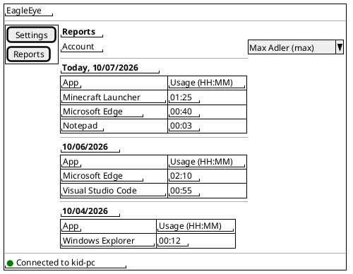
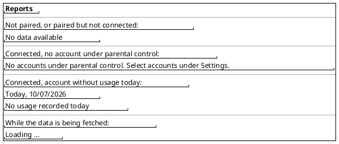
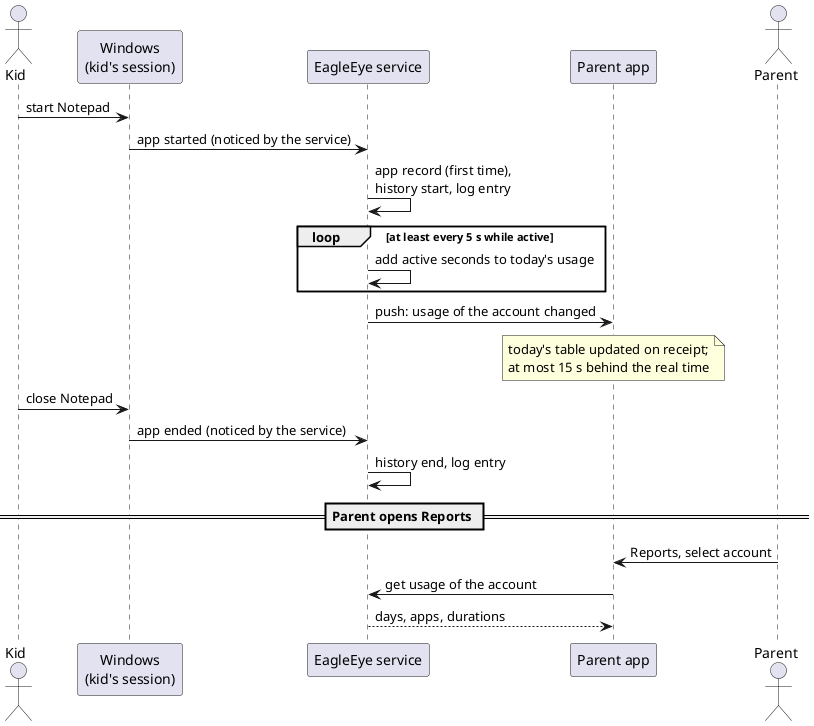

# US-004: App Usage Tracking and Daily Usage Report

**Status**: Analyzed
**Created**: 2026-10-07
**Approved**: by Michael, 2026-10-07 (status becomes `Analyzed` when the implementation plan is approved)
**Component(s)**: EagleEye.Service, EagleEye.ParentApp, EagleEye.Shared
**Platform(s)**: Windows (service) · ParentApp Windows

---

## User Story

As a **parent**, I want the EagleEye service to record which apps each of my kids starts on the EagleEye PC and how long each app is used per day, and I want to see this per kid and per day in the parent app, so that I know what my kids actually do on the PC before I set any limits.

---

## Background

US-003 lets the parent select the accounts that are **under parental control**. This story is the first that uses the selection: the service watches the apps started in the sessions of these accounts, keeps a permanent inventory of the apps each kid has used, records when each app was started and ended, and calculates the daily usage per app. The parent app gets a new menu entry "Reports" that shows the daily usage per account.

This story only observes. It does not limit, block or end any app, and the kid notices nothing. Limits and enforcement (allow-lists, budgets, pause windows) come in later stories and will build on the inventory and the usage recorded here.

All state shown in the parent app follows ADR-010 (`02_Implementation/docs/architecture/decisions/ADR-010-event-driven-state-propagation.md`): the parent app fetches on opening and on (re)connect, and the service pushes changes. The parent app never polls.

References: FR-SVC-010, FR-SVC-012 (v1.4), FR-SVC-013, FR-SVC-040 (v1.4), FR-SVC-041 (v1.4), FR-SVC-042, FR-SVC-043 (v1.4), FR-SVC-044 to FR-SVC-047 (v1.4, new), FR-SVC-053, FR-SVC-072, FR-SVC-100, FR-SVC-103, FR-APP-032, FR-APP-060 (v1.4), FR-APP-081, MU-012, MU-014, NFR-P-010, NFR-R-013, NFR-L-010 to NFR-L-012, §8.6 of arc42 (statistics retention).

**Terms used in this story**

- *Service PC*, *account*, *standard account*, *under parental control*: as in US-003.
- *Controlled account*: an account that is under parental control at the moment (US-003).
- *App*: a program that the user started, by hand or in the user's name (e.g. through Autostart), and that Windows Task Manager lists in the upper group **"Apps"** of the *Processes* tab ("Prozesse" → "Apps"), i.e. a program with a window of its own in the user's session. Programs that Task Manager lists under **"Background processes"** ("Hintergrundprozesse") or **"Windows processes"** ("Windows-Prozesse") are not apps in this story. How the service makes this decision is ARC's choice; the ACs describe the observable result.
- *App record*: the one entry per account and app in the app inventory (AC-7).
- *Active*: the time an app counts as used. Defined in AC-12 (see OQ-1).
- *Usage*: the active time of an app per account per day.
- *HH:MM*: hours and minutes, two digits each, e.g. "01:05" for 1 hour 5 minutes.

---

## Product requirement amendment (v1.4, proposed with this story)

`02_Implementation/docs/requirements/general-product-requirements.md` gets a v1.4 amendment, to be approved by Michael together with this story:

- **FR-SVC-012** (changed): usage is measured in **seconds**, kept up to date at least every 5 seconds, and "active" is defined (AC-12).
- **FR-SVC-040** (changed): daily usage statistics in seconds instead of minutes.
- **FR-SVC-041** (made precise): statistics are also pushed to connected parent apps when they change (ADR-010).
- **FR-SVC-043** (made precise): the 90-day retention applies to the daily usage and to the start/end history; it does not apply to the app inventory.
- **FR-SVC-044** (new): per account, an app inventory that is never purged while the account exists.
- **FR-SVC-045** (new): history of the start and end of every app instance, also written to the service log.
- **FR-SVC-046** (new): only apps (Task Manager's "Apps" group) are recorded; background and Windows processes are not.
- **FR-SVC-047** (new): all recorded data of an account is purged when the account is deleted on the service PC.
- **FR-APP-060** (made precise): usage grouped per account, then per day, newest day first, duration as HH:MM.

---

## Acceptance Criteria

> **Language of UI texts** (NFR-L-010 to NFR-L-012): all UI texts quoted in these criteria and in the mockups are **English examples**, with the intended German wording in brackets. The parent app shows every text, including error messages, in the Windows display language of the user: German (default) or English. Dates are shown in the Windows date format of the user. Differences in wording are notes, not Fails (US-002 Decision Q-11).

> **Test setup**: a service PC with the parent's admin account and at least two standard accounts, e.g. `kid1` (under parental control) and `kid2` (not under parental control); a Windows parent app paired with the service. Times are checked with a stopwatch (e.g. on a phone). A displayed HH:MM value is correct when it equals the stopwatch time rounded **down** to whole minutes, with a tolerance of one minute (AC-24).

> **Service log**: entries are checked in the admin-only log folder `%ProgramData%\EagleEye\logs\` (US-003 AC-14), file `EagleEye.Service-NNN.log`.

### A. Which sessions and which programs are watched

- [ ] **AC-1**: The service watches only the sessions of **controlled accounts**. Apps started by an account that is not under parental control (e.g. `kid2`) or by an admin account (e.g. the parent) are not recorded: no app record, no history, no usage, no log entry.
- [ ] **AC-2**: When the parent ticks an account (US-003), the service starts recording that account's apps within 60 seconds, including apps that were already running at that moment (counted from the moment recording starts). When the parent unticks it, or the account becomes an admin account (US-003 AC-20), the service stops recording within 60 seconds; for apps still running, the end is recorded at that moment (AC-10). Data recorded before stays and stays visible as long as the account is selectable in the report (AC-17, see OQ-9).
- [ ] **AC-3**: The following programs, started by a controlled account, **are** recorded as apps (each under the name shown in brackets, English Windows / German Windows): Notepad ("Notepad" / "Editor"), Paint ("Paint"), Microsoft Edge ("Microsoft Edge"), Calculator ("Calculator" / "Rechner", a Microsoft Store app), Snipping Tool ("Snipping Tool" / "Snipping Tool"), Task Manager ("Task Manager" / "Task-Manager") and a game or other installed desktop program chosen by the tester. A Store app is recorded under its own name, not under a Windows host name such as "Application Frame Host".
- [ ] **AC-4**: File Explorer is recorded as the app "Windows Explorer" ("Windows-Explorer") while at least one File Explorer window is open, as Task Manager shows it in the "Apps" group. The Windows shell itself (taskbar, Start menu, desktop) does not count as usage of Windows Explorer. (See OQ-3.)
- [ ] **AC-5**: Background and Windows processes are **not** recorded, even though they run in the kid's session. Examples that must never appear in the report: Runtime Broker, Search host ("SearchHost"), Shell Experience Host, CTF loader ("ctfmon"), Desktop Window Manager, Console Window Host, Service Host, the EagleEye tray client, and programs that run only as a notification-area (tray) icon without an open window (e.g. OneDrive). A program that is started by Autostart is recorded only while it has a window of its own (Task Manager "Apps" group).
- [ ] **AC-6**: An app that consists of several processes (e.g. Visual Studio Code, shown in Task Manager as "Visual Studio Code (14)", or Microsoft Edge) is **one** app: one app record, one row per day in the report, and its active time is counted once, not once per process or window. Two windows of the same app open at the same time count once.

### B. App inventory and history

- [ ] **AC-7**: The first time a controlled account starts an app, the service creates an **app record** for this account with: the process name as Windows shows it (e.g. `Code.exe`), the display name (AC-8) and the full path of the program file. Each further start of the same app by the same account uses the same record. Two different accounts that use the same app have one record each.
- [ ] **AC-8**: The display name is the name Task Manager shows for the app in the "Apps" group (the program's description from its file information). If the program has no such name, the process name without ".exe" is used (e.g. "mygame" for `mygame.exe`, FR-APP-032). No internet lookup is made.
- [ ] **AC-9**: App records are kept **without time limit** as long as the account exists on the service PC: they survive service restarts, reboots, service updates (re-install) and the unticking of the account. Only when the account is deleted on the service PC does the service purge all data of that account (app records, history, usage), within 60 seconds after the service notices the deletion (US-003 AC-19/AC-22).
- [ ] **AC-10**: For every app instance (from the start of an app until it is closed), the service stores the **start time and end time** in its history, and writes one log entry (level Information) at the start and one at the end. Each entry names the account's user name, the display name, the process name and the program path, and the end entry also gives the duration of the instance. An instance that is open when recording stops (AC-2, service stop, shutdown) is ended at that moment, with the reason in the log entry (e.g. "monitoring stopped", "service stopping").
- [ ] **AC-11**: The history is kept for 90 days, like the daily usage (FR-SVC-043); older entries are purged automatically. The service log files follow the existing rotation (FR-SVC-103). The parent app does not show the history in this story (OQ-8).

### C. Usage calculation

- [ ] **AC-12**: An app counts as **active** while (1) it is open, i.e. it is listed in Task Manager's "Apps" group for the account, and (2) the account's Windows session is the session in use at the PC: signed in, not locked, not in sleep or hibernation, and not a session in the background after "Switch user". Minimised windows count. Several different apps that are open at the same time each count fully. (See OQ-1.)
- [ ] **AC-13**: The service updates the usage of every active app at least every 5 seconds, per account, per app, per day, in seconds. A running app's usage never lags behind the real active time by more than 5 seconds inside the service.
- [ ] **AC-14**: Days follow the local time of the service PC and change at local midnight. When an app is active across midnight, the time before midnight counts for the old day and the time after midnight for the new day. The history instance is not split.
- [ ] **AC-15**: Time in which the service does not run (stopped, PC off, sleep, hibernation) is not counted and is not recorded. When the service starts again and an app of a controlled account is already open, recording continues from that moment: a new history instance starts, and usage is counted from then on. Usage recorded before the stop is kept (NFR-R-013); at most the last 5 seconds before an unexpected stop may be lost.
- [ ] **AC-16**: A change of the system clock or the time zone on the service PC never produces a negative usage, and never adds more usage than real time has passed. (Standard accounts cannot change the system clock; the parent can.)

### D. Reports in the parent app

- [ ] **AC-17**: The navigation menu of the Windows parent app has a new entry "Reports" ("Berichte") next to "Settings" ("Einstellungen"). The Reports page has an account selection "Account" ("Konto") that lists every controlled account, with its name as in US-003 AC-11 and in the same order. When the page opens, the first account in the list is selected. (See OQ-9.)
- [ ] **AC-18**: For the selected account, the page shows the usage per day as a list of days, **today first** and older days below in descending date order. Each day has a heading with the date (English example: "Today, 10/07/2026", "10/06/2026"; German: "Heute, 07.10.2026", "06.10.2026") and below it a table with the column headers "App" ("App") and "Usage (HH:MM)" ("Nutzung (HH:MM)"). Each row is one app (display name, AC-8) with its usage of that day. Rows are sorted by usage, longest first; equal usage by name.
- [ ] **AC-19**: Today is always shown. If the account has no usage today, the today section shows "No usage recorded today" ("Heute keine Nutzung aufgezeichnet"). Older days are shown only if they have usage. Days older than 90 days are not shown (FR-SVC-043). An app with less than one minute of usage on a day is shown with "00:00". (See OQ-6.)
- [ ] **AC-20**: Empty states of the Reports page:
  - not paired, or paired but not connected: no account selection, text "No data available" ("Keine Daten verfügbar"), like US-003 AC-7/AC-8;
  - connected, but no controlled account: text "No accounts under parental control. Select accounts under Settings." ("Keine Konten unter Elternkontrolle. Konten unter Einstellungen auswählen.");
  - connected, account selected, no usage recorded at all: the today section of AC-19 and no older days;
  - while the data is being fetched: "Loading …" ("Wird geladen …").
- [ ] **AC-21**: When the parent opens the Reports page, selects another account, or the parent app (re)connects while the page is open, the page shows the usage as currently stored in the service.
- [ ] **AC-22**: While the Reports page is open and connected, it updates by itself through the service's push (ADR-010), without any action of the parent and without the app polling: for an app that is active, the displayed usage of today follows the real active time with a lag of at most 15 seconds (e.g. a stopwatch passing 3:00 is shown as "00:03" at the latest 15 seconds later). A new app started by the kid appears in today's table within 15 seconds after its start. (See OQ-5.)
- [ ] **AC-23**: When the account list changes (an account is ticked, unticked, renamed, deleted; US-003), the account selection of an open Reports page follows within the time limits of US-003 (AC-19 to AC-24 there). If the selected account disappears from the selection, the page selects the first account of the list, or shows the empty state of AC-20.

### E. Accuracy, load and isolation

- [ ] **AC-24**: Test of accuracy: the kid `kid1` opens Notepad and keeps it open and the session unlocked for 10 minutes, measured with a stopwatch. Then the report shows Notepad today with "00:10" (tolerance: "00:09" to "00:11"). Locking the session (Windows+L) for 3 minutes in between does not add these 3 minutes (AC-12).
- [ ] **AC-25**: Watching does not slow down the PC noticeably: with the kid using 10 apps at the same time, the EagleEye service uses on average less than 2 % CPU in Task Manager ("Details" tab, process `EagleEye.Service.exe`, observed over one minute), and a game or video runs without visible stutter compared to a run with the EagleEye service stopped (NFR-P-010). (See OQ-10.)
- [ ] **AC-26**: Usage of one account is never shown for another account: when `kid1` and a second controlled account both use the same app (e.g. after "Switch user"), each account's report shows only its own usage (MU-012).
- [ ] **AC-27**: The kid notices nothing: no app is closed, blocked or slowed down, and the tray client shows no new message in this story.

### Change Log

| Date | Change | Source |
|---|---|---|
| 2026-10-07 | Story created; product requirements v1.4 amendment proposed | Michael's scope, written by PRO |
| 2026-10-07 | Story approved; OQ-1 to OQ-11 answered (proposed defaults accepted); requirements v1.4 approved. ACs unchanged. | Michael |
| 2026-10-07 | Implementation plan approved (incl. ADR-011 security analysis, ADR-012); status `Analyzed` | Michael |

---

## UI / Interaction Notes

### Reports — connected, account with usage (AC-17, AC-18)

10/05/2026 is missing because there was no usage that day (AC-19).

### Reports — page states (AC-19, AC-20)

### Flow overview

---

## Out of Scope

- Time limits, budgets, pause windows, allow-lists, blocking or closing apps (enforcement), warnings and notifications to the kid or the parent.
- Display of the app inventory as a list of its own, and of the start/end history, in the parent app (the data is recorded; the display comes with later stories, see OQ-8).
- A day total ("screen time") per day (see OQ-7).
- Charts, weekly or monthly summaries, export.
- Parent app for Android, iOS and macOS. This story covers the **Windows** parent app only (built and tested on the Windows Developer Machine).
- Internet lookup of display names (FR-SVC-013, source 3).
- Recording of background processes and services, and of programs that a controlled account runs with another account's rights (e.g. "Run as administrator" with the parent's password).
- Changes to the tray client.

---

## Open Questions (answered by Michael, 2026-10-07)

Each question has a proposed default. If Michael agrees with all defaults, the ACs stay as written.

| ID | Question | Proposed default | Answer |
|---|---|---|---|
| OQ-1 | **What does "active" mean?** (a) the app is **running** (open), whatever the session state; (b) the app is **open and the kid's session is in use** (unlocked, not switched away, PC awake); (c) the app is **in the foreground** (the window the kid is working in); (d) foreground **and** recent keyboard/mouse input. For parental control: (a) counts time when the kid is not even at the PC (locked screen, other user signed in). (c) and (d) count only one app at a time, so the sum of a day never exceeds the time at the PC, but an app that plays music or a video in the background counts nothing, and a game left in the foreground counts fully under (c). (d) needs an idle limit and is harder to check with a stopwatch. | **(b)**, as written in AC-12: open in Task Manager's "Apps" group while the session is in use; minimised windows count; parallel apps each count. Easy to verify with a stopwatch, and robust for later budgets. Foreground-only can be added later as a separate figure if wanted. | Answer (Michael, 2026-10-07): proposed default accepted |
| OQ-2 | **Identity of an app record.** By the full program path, or by the process name? Some apps install each update into a new folder (path changes), and different programs can share a process name (e.g. `launcher.exe`). | **By the full program path** (case-insensitive). An app that moves to a new path after an update gets a second record; the report then shows two rows with the same display name for that day. Revisit when allow-lists come (ADR-005 matches by process name). | Answer (Michael, 2026-10-07): proposed default accepted |
| OQ-3 | **Windows Explorer.** It is in your "Apps" example list, but ADR-005 puts `explorer.exe` on the ignore list (never tracked). Count it? | Count "Windows Explorer" only while a File Explorer window is open (AC-4), like Task Manager. The ignore list of ADR-005 stays for enforcement; ARC aligns ADR-005. | Answer (Michael, 2026-10-07): proposed default accepted |
| OQ-4 | **Rounding of HH:MM.** Round down (59 s → "00:00") or to the nearest minute (30 s → "00:01")? | Round **down**, like a clock (AC-19, AC-24). The service keeps seconds. | Answer (Michael, 2026-10-07): proposed default accepted |
| OQ-5 | **Live update of the open Reports page.** Live while open (pushed by the service), or only on opening, account change and reconnect? | Live, by service push, with at most 15 s lag (AC-22). The push frequency is ARC's choice within this bound. | Answer (Michael, 2026-10-07): proposed default accepted |
| OQ-6 | **Days without usage.** Show them with "No usage recorded", or leave them out? | Leave older days without usage out; always show today (AC-19). | Answer (Michael, 2026-10-07): proposed default accepted |
| OQ-7 | **Day total.** Show a total per day? With parallel counting (OQ-1 b), the sum of all apps can be larger than the time the kid sat at the PC. | No day total in this story. If wanted, a later story adds "time at the PC" (time with at least one app active), which avoids double counting. | Answer (Michael, 2026-10-07): proposed default accepted |
| OQ-8 | **History and inventory in the UI.** You asked for the history store and the inventory, not for their display. | Recorded only (verifiable in the service log, AC-10); no display in this story. | Answer (Michael, 2026-10-07): proposed default accepted |
| OQ-9 | **Which accounts can be selected in Reports?** Only accounts under parental control now, or also accounts that were unticked but have recorded data? | Only accounts under parental control now (AC-17). Data of an unticked account is kept and appears again when the account is ticked again (within the 90-day retention). | Answer (Michael, 2026-10-07): proposed default accepted |
| OQ-10 | **Load limit.** Is "< 2 % CPU on average" a suitable, testable bound for NFR-P-010? | Yes, as in AC-25. | Answer (Michael, 2026-10-07): proposed default accepted |
| OQ-11 | **Retention of the history.** Same 90 days as the daily usage, or forever like the inventory? | 90 days (AC-11). Only the inventory is kept forever. | Answer (Michael, 2026-10-07): proposed default accepted |

---

## Related

- Prerequisite stories: US-001 (service, tray client, installer), US-002 (Windows parent app, pairing), US-003 (accounts under parental control)
- General product requirements: v1.4 amendment (FR-SVC-012, FR-SVC-040, FR-SVC-041, FR-SVC-043, FR-SVC-044 to FR-SVC-047, FR-APP-060) proposed together with this story
- Architecture: ADR-005 (process classification, see OQ-3), ADR-010 (event-driven state propagation)
- Implementation Plan: `US-004/implementation-plan.md` (added by ARC)
- Issues: `US-004/issues/` (added by TES)
- Manual tests: `docs/testing/US-004/` (added by TES)
