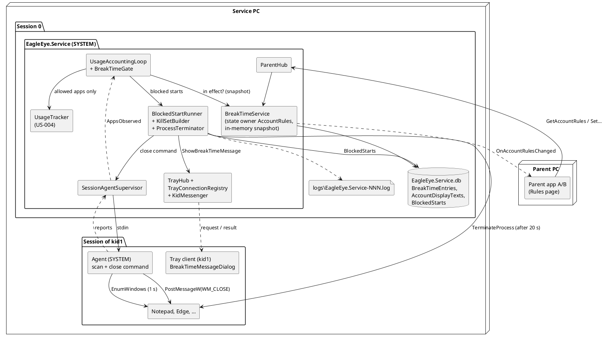
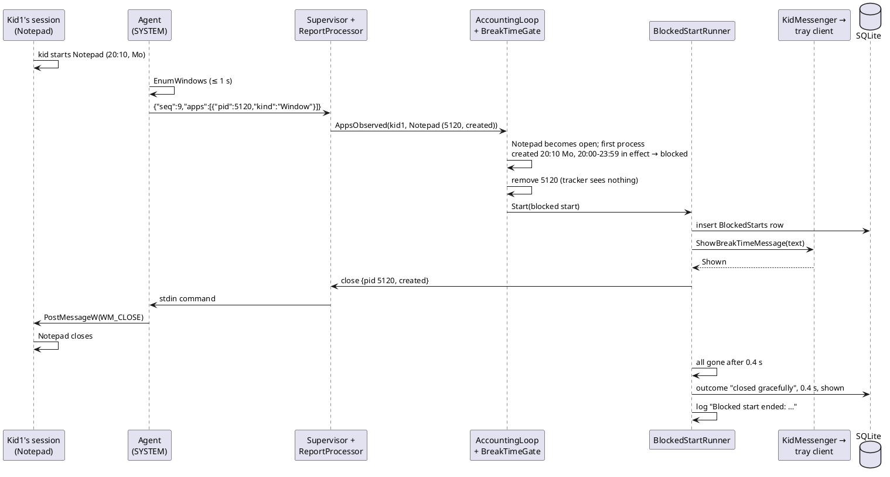

# Implementation Plan: US-005 — Break Times (Ruhezeiten)

**Status**: Approved by Michael (2026-10-10), incl. ADR-013, ADR-014 and the amendments of ADR-003, ADR-005, ADR-006, ADR-011, ADR-012, arc42 and the coding guidelines
**Date**: 2026-10-10
**Author**: ARC
**User story**: `02_Implementation/docs/requirements/user-stories/US-005/user-story.md` (status `Analyzed`, 37 ACs, aligned with this plan's answers by PRO on 2026-10-10)
**Requirements**: `02_Implementation/docs/requirements/general-product-requirements.md` v1.5 (approved; FR-SVC-023 and FR-TRAY-022 adjusted, FR-SVC-026 added with the answers)
**Branch**: `feature/US-005-break-times`
**New ADRs** (Accepted, approved by Michael with this plan, 2026-10-10):
- ADR-013 — Break-time enforcement at app start (`02_Implementation/docs/architecture/decisions/ADR-013-break-time-enforcement-at-app-start.md`)
- ADR-014 — Session-bound tray connections and the kid's message box (`02_Implementation/docs/architecture/decisions/ADR-014-session-bound-tray-messages.md`)

**Amended** (approved with this plan): ADR-003 (tray groups), ADR-005 (ignore list by path), ADR-006 (who closes, who terminates, 20 s, kill set), ADR-011 (command channel, `PostMessageW(WM_CLOSE)`), ADR-012 (blocked processes not counted, time-zone refresh), arc42, coding guidelines.

**Revision 2026-10-10 (Michael's answers, see the Q table)**:
- **Q-1**: a **start is the creation of the app's first process**. The block is decided by that creation time; the window may come later. Further processes or sub-processes of an app that is already open are not new starts (the former trigger T2 is dropped); processes of an app that is being closed go into the running close sequence (story OQ-17). The app is still recognised by its window. The 10 s / 30 s bounds count from the start, or from the first window if that appears more than 10 s later (story AC-22, FR-SVC-023). Reworked: TI-2, TI-3, Decision 3, D-1 to D-3, ADR-013 §3, tests, verification notes. C-5 is resolved.
- **Q-2**: option (a) only, plus every time-zone change (and clock change, when detected) is stored as a **finding** in the service database (story AC-37, FR-SVC-026): table `TimeChangeFindings` in migration 4, 90 days, purged with the account. Removing the right from *Users* is out of scope.
- **Q-3 to Q-9**: accepted as proposed (Q-4 log limiter is part of the design; Q-9: accessibility tools stay blocked).

---

## Technical Issues and Risks

*Michael asked: "let me know if there is any technical issue with the approach." This section answers that, checked against the code on `feature/US-005-break-times` (= 0.4.1) and the architecture. Each item: what the problem is, its impact, and the solution in this plan. Items that need a decision by Michael are linked to the open questions (Q-n) at the end. **Summary: the story is feasible with the existing session agent and service. Two items are real gaps of the story's protection (TI-7 time zone, TI-8 window evasion), and a few ACs can only be met "best effort" because of Windows rules (TI-5 focus, "system-modal"). All items were decided by Michael on 2026-10-10 (Q table) and the story was aligned.***

| # | Issue | Impact | Solution in this plan |
|---|---|---|---|
| **TI-1** | **Who closes and who kills.** ADR-006 lets the service send `WM_CLOSE`, but the service runs in session 0 and **cannot reach windows in the kid's session** (window stations are per session). The session agent can, but ADR-011 §8 forbids it every `PostMessage*`, and it has no command channel yet (stdin is read and ignored, `SessionAgentHost.WaitForEndOfInput`). The agent's token is stripped to `SeChangeNotifyPrivilege`, Administrators deny-only, possibly write-restricted (which variant runs is **still unknown**: TC-004-23 was not executed in the US-004 run). | Without a change, no graceful close is possible; the story's AC-22 step 2 would fail. | **Split the work** (ADR-013 §4, ADR-011 amendment): the **agent** gets one command over its stdin pipe and posts `WM_CLOSE` with `PostMessageW` to the app windows of the named processes (creation time verified first). Posting is not an object access check: UIPI allows System → Medium/AppContainer, and the restricted or write-restricted token does not matter for it. The **service** (full SYSTEM, session 0) terminates with `TerminateProcess`: SYSTEM has full access to the kid's processes by their default DACL and a higher integrity level. The agent never gets terminate rights. **Fallback**: if the agent is down or the post fails, the force step at 20 s still ends the app within 30 s. DEV verifies the post in the smoke check; Michael verifies it with the real SYSTEM agent (Q-8). |
| **TI-2** | **Detection latency.** The agent scans every 1 s and sends a report at once on change (`AgentReportPublisher`); the service processes reports immediately (`UsageAccountingLoop` applies `AppsObserved` at once, not only at the 5 s tick). Typical detection: **1 to 2 s** after the first window appears. Exceptions: right after sign-in the agent is started at the next 5 s tick (+ .NET start ≈ 1 s); after an agent crash it restarts after 1, 5 or 30 s; at boot the service may start later than Autostart apps. | The 10 s bound (AC-22, AC-30; counted from the start, or from the first window if that appears more than 10 s later) holds in normal operation; in the exceptional windows a start can be detected **later than 10 s** (never missed). | The decision uses the **creation time of the app's first process** (ADR-013 §3), not the moment of detection, so an app started in a break while the agent was not yet running is still recognised and closed when its window is first reported. Documented as D-6 (story AC-22 note); TES measures the normal case. |
| **TI-3** | **What is a "start"?** US-004 knows apps (program path) and instances, not "starts". A naïve rule breaks AC-25: after a service or agent restart *every* running app would look new; a second Notepad of an app that is already open is not a new app; a program waiting in the notification area since before the break (Steam, Discord) opens its window during the break; a slow game started at 19:59 shows its window at 20:00:30. | Wrong rule → either running apps are killed after a restart (AC-25 broken) or other inconsistencies. | *Decided by Michael (Q-1)*: **start = creation of the app's first process.** When an app (program path) becomes open for the account (first app window, or found at an agent's (re)start), its start time is the **earliest creation time of the running processes with that program path** in the session; the start is blocked iff an entry was in effect at that time (ADR-013 §3). Further processes of an open app are not starts. Consequences: a restart never blocks apps started before the break; a slow app created at 19:59 is allowed; a program in the notification area since before the break is allowed when it opens its window (accepted bypass, D-1). |
| **TI-4** | **Graceful close semantics.** (a) "Save changes?" prompts: the kid can answer or ignore them. (b) Apps that **hide to the notification area** on close (Steam, Discord, Teams) keep their process. (c) **Browsers** are single-instance and keep background processes (Edge startup boost); a new Edge window of a running Edge is the same process. (d) **Store apps**: the window belongs to `ApplicationFrameHost.exe` (shared by all Store apps of the session!), the app process is e.g. `CalculatorApp.exe` and is often *suspended* rather than ended after its window closes. (e) Apps with a **modal dialog** may ignore `WM_CLOSE`. (f) **`Process.Kill(entireProcessTree: true)`** (ADR-006) ignores session, owner and exemptions, and would also kill an allowed game that a tray-resident launcher started *before* the break (AC-25). | (a), (b), (d), (e) end as "terminated by force" after 20 s instead of "closed gracefully"; (f) as written would kill allowed apps and could hit shared system processes. | `WM_CLOSE` to **every app window** of the processes; for Store apps to the `ApplicationFrameWindow` (never kill the frame host). After 20 s the service recomputes an explicit **kill set** (ADR-013 §5): all processes of the program path in the session + descendants, **minus** other sessions/owners, EagleEye, real Explorer and ApplicationFrameHost, the ignore list, and processes of **other open apps** (keeps the 19:30 game alive). Outcome recorded honestly: "closed gracefully" only if *all* processes of the kill set ended within 20 s. D-7. |
| **TI-5** | **The kid's message box.** (a) Win32 has **no system-modal mode** across processes (`MB_SYSTEMMODAL` only adds topmost); other windows stay clickable. (b) **Focus-stealing rules**: a background process (the tray client) may only take the foreground in documented cases; `SetForegroundWindow`/`MB_SETFOREGROUND` are often refused, the box then flashes in the taskbar without focus (AC-30 "has the keyboard focus"). (c) **Exclusive full-screen** DirectX games are drawn above every window. (d) A Win32 `MessageBox` with OK closes on **Esc**; AC-30 wants OK/Enter only. (e) **Emojis**: GDI (MessageBox, WinForms) renders them monochrome via font fallback; colour needs DirectWrite. (f) The kid can **end the tray client** (R-6). | (a), (b), (c) mean AC-30 can be met only best effort; (d) contradicts AC-30 with `MessageBox`; (e) accepted by AC-31 (monochrome); (f) accepted by OQ-9/AC-33. | Own small topmost WinForms dialog (ADR-014 §3): no close box, Esc/Alt+F4 ignored, Enter = OK, never blocks sign-out, DPI-aware. Focus: `Activate`; if refused, one synthetic Alt press/release + `SetForegroundWindow` (an established workaround); if still refused, the dialog is topmost and normally gets the focus as soon as the blocked app's window closes (≈ 1 s after `WM_CLOSE` for most apps, at the latest at the force step). Borderless and maximised full-screen windows: covered; exclusive full-screen: the dialog appears when the game is closed (≤ 20 s). Wording "system-modal" → "topmost" is C-1 (PRO); behaviour: **Q-5**. |
| **TI-6** | **Server → tray path.** `TrayHub` today knows nothing about the session or user of a connection; the only push (`OnShowPairingCode`) goes to *all* tray clients. The loopback endpoint is unauthenticated: any kid program can connect. SignalR pushes are fire-and-forget, so the service cannot tell "shown" from "tray not running" (AC-33). | Without a change the message would appear in every session (AC-34 broken) and the log could not say whether it was shown. | The **service binds each tray connection to a session itself** (ADR-014 §1): owner PID of the loopback TCP connection (`GetExtendedTcpTable`, IPv4 + IPv6), verified as the installed `EagleEye.TrayClient.exe` by path. The message is a **request with a result** (SignalR client results): `Shown` / `AlreadyOpen`, 3 s timeout; no verified connection → "not shown (tray client not connected)". No delayed message (OQ-9). **Q-6** (a simpler, client-asserted session would be spoofable). |
| **TI-7** | **Time zone bypass.** Break times use the local time of the service PC (OQ-5). **Windows grants every standard user the right "Change the time zone" by default** (`SeTimeZonePrivilege`; Settings → Time & language, or `tzutil /s`). A kid at 20:30 in a 20:00–23:59 break can switch to a zone 12 h earlier and the break is over. arc42 R-7 wrongly said a standard user cannot manipulate the time (true only for the clock). Also: .NET caches `TimeZoneInfo.Local` for the process lifetime, so the service would not even see a legitimate zone change until it restarts. | **High**: a trivial, documented bypass of the whole story for a kid who knows it. | *Decided by Michael (Q-2, story AC-37, FR-SVC-026)*: the accounting tick calls `TimeZoneInfo.ClearCachedData()` every 5 s (changes take effect within 5 s, D-9); every change of the time zone, and every clock jump the service detects (wall clock vs. monotonic clock), is logged as a **Warning** and stored as a **finding** in `TimeChangeFindings` (Decision 8), for a later story to show to the parent. The gap itself stays open; removing the right from *Users* is out of scope (a possible later hardening). arc42 R-7 corrected, R-13. |
| **TI-8** | **Window-based detection can be evaded.** Break times act on *apps* (programs with an app window, AC-23 exempts the rest). A kid with tools (e.g. AutoHotkey) can turn a game's window into a tool or owned window so it drops out of the "Apps" rule (ADR-011 T-10, accepted for US-004 as "observation only"). Programs without an app window (console tools, a script) are never blocked. Apps started before the break keep running (AC-25, by design until the next story). | Medium: needs a tech-savvy kid; the gap is in the story's chosen model, not in the implementation. | Accept for US-005 (**Q-3**); arc42 R-14. Process-based deny-by-default enforcement (ADR-005) comes with allow-lists; ending running apps at the break start comes with the next story (TC-042). |
| **TI-9** | **Usage must stay untouched (AC-24).** The tracker creates the app record, the instance (log "App started"), and a 0-second daily row (which the Reports page shows as "00:00") as soon as it sees an app. | A blocked start would appear on the Reports page. | The decision is made in the accounting loop **before** the tracker: blocked processes are removed from the report until they have exited (ADR-013 §1, ADR-012 amendment). The history of blocked starts stores name, path and process directly (no `AppRecords` row). |
| **TI-10** | **Storage.** New tables for entries, display texts and blocked starts (migration 4 on top of the 0.4.x schema, forward-only). Purge on account deletion is wired through **one** `Lazy<IAccountDataPurger>` (D-9 of US-004), so a second purger cannot be added as is. 90-day purge runs only for usage. | Low. | Migration 4 (Data Model). `UserAccountService` gets `Lazy<IEnumerable<IAccountDataPurger>>` (usage + rules + history). The midnight/start purge also deletes `BlockedStarts` older than 90 days. The history has no foreign keys (entries may be deleted later). |
| **TI-11** | **API and concurrency.** A whole-entry write ("update entry with all values") would let two parents silently revert each other's *different* fields of the same entry; AC-19 wants last-write-wins per value and a rejection when an entry was deleted meanwhile. Validation (end > start, ≥ 1 day) spans two values, so it must be checked against the **stored** state. Contract versioning: a 0.5 parent app against a 0.4 service, and vice versa. | Medium if done with whole-entry writes. | **Field-level write commands** (add, delete, on/off, start or end time, one weekday, display text), validated by the service against the stored entry; a missing entry → `HubException("The entry no longer exists.")` → AC-18 message, the snapshot removes the row (AC-19). Contracts are additive: an old parent app ignores the new callback; a new parent app against an old service gets "method not found" on the Rules page → shown as "The change could not be saved" / no data. Both installers go to **0.5.0** together. |
| **TI-12** | **MAUI on Windows.** (a) No data grid: the table is built from `Grid` rows. (b) **WinUI `CheckBox` has a default minimum width of about 120 px**: nine checkbox columns would make the table ≈ 1 100 units wide and break 150 % scaling (AC-4). (c) **`TimePicker`** does not allow typing on Windows (AC-8 wants typing), shows 12/24 h by locale and has no "23:59 = midnight" meaning. (d) `Unfocused` does not fire when a view is removed (page/account switch) → typed values lost (AC-15). (e) Re-creating rows on every snapshot destroys the focus and the text being typed in another row. (f) WinUI's `TextBox` (MAUI `Editor`) returns line breaks as **`\r`**; the tray needs `\r\n`. (g) `Editor.MaxLength` counts UTF-16 code units: an emoji counts 2 (some 4 to 11). (h) A trash icon must be readable in light and dark mode. Emoji input: the Windows emoji panel (Win + .) and paste work in the WinUI `TextBox`, with colour emojis. | (b), (d), (e) would fail AC-4, AC-15, AC-19 visibly. | (a) `BindableLayout` of `Grid` rows with fixed widths (ISSUE-006 lesson). (b) Handler mapping `MinWidth = 0` for `CheckBox` on Windows. (c) `Entry` + `TimeOfDayText` parser in Core (accepts `7:30`, `07:30`, `730`, `0730`, `7`, `20.00`; always shows `HH:MM`). (d) Explicit `FlushPendingEdits()` before page and account changes. (e) Row view models merged by entry id. (f) Line breaks normalized to `\n` in Shared (`BreakTimeRules.NormalizeLineBreaks`), the tray shows `\r\n`. (g) Limit = 500 UTF-16 code units (D-8, **Q-7**). (h) Two SVG variants via `AppThemeBinding`. Guidelines §16.1 amended. |
| **TI-13** | **Log flooding.** AC-28 wants one log entry per blocked start. A script that starts Notepad in a loop during a break produces thousands of entries and pushes older log lines out of the 3 × 50 MB rotation (ADR-011 T-12). | Low–Medium (evidence loss). | Proposal **Q-4**: like US-004, at most 30 blocked-start log entries per account and app per hour, then one summary line per hour; the **history** (database) keeps every record. |
| **TI-14** | **Display-text sanitizing.** US-004's `DisplayNameSanitizer` removes format characters, including `U+200D` (zero-width joiner) and `U+FE0F` (variation selector), which compound emojis need ("👍🏽", "👨‍👩‍👧"). | Emojis would be broken if the existing sanitizer were reused. | A separate rule in Shared: only line-break normalization, removal of control characters except `\n` and `\t`, rejection of lone surrogates; nothing else is changed (the text is shown "exactly as entered", AC-31). |
| **TI-15** | **Kid pairs an own parent app** (R-8, OQ-15 accepted): with this story it has a real effect — the kid could delete their own break times. | Accepted by Michael (OQ-15). | Every rules change is logged with the account **and the device name** of the parent app that made it (AC-12), so the parent can see it in the log. |

**Story points that could not be met exactly as first written** — all resolved: PRO aligned the story with Michael's answers on 2026-10-10 (commit 2e46634).

| # | Story text (before) | Problem | Resolution |
|---|---|---|---|
| C-1 | FR-TRAY-022, AC-30: "system-modal" | Not available on Windows across processes (TI-5 a). | Story now: topmost dialog, other windows usable, OK/Enter only. |
| C-2 | AC-30: "has the keyboard focus" | Best effort under Windows' foreground lock (TI-5 b). | Story now: focus best effort, at the latest when the blocked app's window closes. |
| C-3 | OQ-5: "a change of the time zone … takes effect at once" | Takes effect within 5 s; and a kid can do it (TI-7). | Story now: within 5 s, logged and stored as a finding (AC-37). |
| C-4 | AC-22: "detects … at the latest 10 seconds after the app's first window appeared" | Not guaranteed right after sign-in, after agent restarts or at boot (TI-2). | Story now: note in AC-22 (such starts are caught afterwards by their creation time). |
| C-5 | AC-25: "An app started at 19:59 is not ended at 20:00" | With "start = first window" a slow app would have been blocked. | Resolved by Q-1 (start = first process). |

---

## Machine Assignment

**Everything runs on the Windows Developer Machine.** US-005 touches Shared, Service (incl. agent mode), TrayClient, `ParentApp.Core`, the Windows target of the ParentApp and the service installer. Shared contract changes land first (Step 1). The MacBook is not needed.

| Work | Machine |
|---|---|
| This plan, ADR-013, ADR-014, amendments of ADR-003/005/006/011/012, arc42, coding guidelines (ARC) | Windows Developer Machine (done here) |
| Steps 0 to 13 (DEV): code, unit tests, `build.ps1` / `test.ps1`, installers, smoke check | **Windows Developer Machine** |
| Manual test run (Michael) | Windows Developer Machine as service PC with the parent's admin account and `kid1`, `kid2` (controlled) and `kid3` (not controlled); parent apps A and B (B preferably on the second Windows PC, as in US-004). |
| MacBook | Not used. `Shared` and `ParentApp.Core` stay free of Windows APIs (all Win32 code is in the Service and the TrayClient), so `build.ps1` / `test.ps1` keep working there after the next `git pull`. |

The Android target is built by `build.ps1` on Windows. The Rules page must compile for Android with zero warnings (the `CheckBox` mapping is `#if WINDOWS`); no Android test.

---

## Impact Assessment

| Component | Impact |
|---|---|
| **EagleEye.Shared** | `IParentHub`: 7 new methods (query + 6 field-level writes); `IParentClientCallback.OnAccountRulesChanged`; `ITrayClientCallback.ShowBreakTimeMessage` (with result). DTOs `AccountRulesDto`, `BreakTimeEntryDto`, `BreakTimeMessageDto`; enums `BreakTimeDays`, `BreakTimeBoundary`, `KidMessageResult`; constants and text rules `BreakTimeRules`. |
| **EagleEye.Service** | **Rules** (new `Rules/`): `BreakTimeService` (state owner `AccountRules:{sid}`, in-memory snapshot), `BreakTimeSchedule`, validation, broadcaster, repository (migration 4). **Enforcement** (new content in `Enforcement/`): `BreakTimeGate`, `BlockedStartRunner`/sequence, `KillSetBuilder`, `EnforcementIgnoreList`, `Win32ProcessTable`, `Win32ProcessTerminator`, history repository and log. **Agent**: close command (stdin), `WindowCloser` (`PostMessageW(WM_CLOSE)`), protocol extension; supervisor sends commands. **Monitoring**: `AgentReportProcessor` passes creation times and the agent run; loop calls the gate and refreshes the time zone. **Communication**: `ParentHub` (7 methods), `TrayHub` (session binding), `TrayConnectionRegistry`, `Win32TcpConnectionOwnerLookup`, `KidMessenger`. **UserAccounts**: several purgers. `Program`: start order (rules loaded before the loop). |
| **EagleEye.TrayClient** | Handler for `ShowBreakTimeMessage` with result; `BreakTimeMessageDialog`, `BreakTimeMessagePresenter` (one at a time), `ForegroundHelper` (Win32); texts. |
| **EagleEye.ParentApp.Core** | Hub client and gateway; `Rules/AccountRulesModel` (replica, writes, timeouts), `Rules/TimeOfDayText`, `Rules/BreakTimeEditRules`; view models `RulesViewModel`, `BreakTimeRowViewModel`; `MainViewModel` menu "Regeln"; shared account-selection helper (extracted from `ReportsViewModel`); texts (de, en). |
| **EagleEye.ParentApp** | New `Views/RulesView`; `MainPage` with three pages and flush on page switch; `MauiProgram` (DI, `CheckBox` mapping); two trash icons. |
| **Installers** | Version 0.5.0. Upgrade 0.4.1 → 0.5.0 applies migration 4 at the first start. No change of Windows rights (Q-2: removing the time-zone right is out of scope). `parentapp-setup.iss`: version only. |
| **Version** | `Directory.Build.props` → `0.5.0` (service reports `EagleEye_v0.5`). |

---

## Architecture Changes

Applied on the feature branch and approved by Michael with this plan (2026-10-10):

| Document | Change |
|---|---|
| `docs/architecture/decisions/ADR-013-break-time-enforcement-at-app-start.md` | **New**: where the decision is made, "in effect", start = first process (creation time), close sequence, kill set, ignore list, history, security notes |
| `docs/architecture/decisions/ADR-014-session-bound-tray-messages.md` | **New**: service-side session binding of tray connections, request with result, the dialog |
| ADR-003 | Note: tray groups `Tray:{userSid}` and `RegisterSession` replaced by ADR-014 |
| ADR-005 | Amendment: first enforcement at app start; ignore list as code, by path |
| ADR-006 | Amendment: agent posts `WM_CLOSE`, service terminates the kill set, fixed 20 s, no `Process.Kill(entireProcessTree)` |
| ADR-011 | Amendment: stdin command channel, `PostMessageW(WM_CLOSE)` as the only allowed message call, no termination in the agent |
| ADR-012 | Amendment: blocked processes never reach accounting; `TimeZoneInfo.ClearCachedData()` per tick; time-change findings |
| arc42 | Header; §5.2 Enforcement, Configuration; §5.4 tray; §6.2.2 new runtime view "Blocked app start" (old 6.2.2 → 6.2.3); §8.3 area `AccountRules`; §8.4 tables (incl. `TimeChangeFindings`); §8.6 retention; §8.8, §8.9 notes; §9 ADR-013/014; §11 R-6, **R-7 corrected**, R-13, R-14; §12 glossary |
| Coding guidelines | §10.1 folders `Service/Rules`, `Service/Enforcement`, `ParentApp.Core/Rules`; §12.2 tray requests with results and acknowledged dialogs; §12.4 agent's `WM_CLOSE` exception, terminating kid processes, agent commands; §16.1 editable tables in MAUI on Windows |

DEV updates the READMEs of Shared, Service, TrayClient, `ParentApp.Core` and ParentApp (Step 13).

---

## New ADRs Required

- **ADR-013 — Break-time enforcement at app start.** The service decides blocked starts in the accounting loop, before usage accounting, from an in-memory copy of the rules, in the local time of the service PC (end 23:59 = midnight, start inclusive, end exclusive). Start = creation of the app's first process: when an app becomes open (first app window, or found at an agent (re)start), the earliest creation time of its running processes decides; further processes of an open app are not starts and join a running close sequence. Close sequence: tray message and history at detection; the **agent** posts `WM_CLOSE`; after **20 s** the **service** terminates the recomputed **kill set** (path or process + descendants, minus exemptions and other open apps). Shipped path-based ignore list.
- **ADR-014 — Session-bound tray connections and the kid's message.** The service identifies the tray client behind each loopback connection (TCP owner process, installed path) and binds it to its session. The message is a request with a result (`Shown` / `AlreadyOpen`, 3 s). The tray shows its own topmost dialog (OK/Enter only, never blocks sign-out, focus best effort).

---

## API Changes (SignalR Contracts)

*API-first: DEV implements this section first (Step 1). ADR-010 shape: snapshot with revision and correlation id, query, broadcast, write commands with `requestId` returning `StateWriteAckDto`.*

### State area `AccountRules:{accountSid}` — `EagleEye.Shared/Contracts/IParentHub.cs` (changed)

```csharp
/// <summary>
/// Returns the break times and the display text of one account (state area "AccountRules:{sid}", ADR-010).
/// Called after every (re)connect and when the parent selects another account on the Rules page.
/// </summary>
/// <param name="accountSid">SID of a standard account of the inventory (US-003), controlled or not.</param>
Task<AccountRulesDto> GetAccountRules(string accountSid);

/// <summary>Adds an entry with the defaults of US-005 AC-7 (off, 20:00–23:59, all days) at the end.
/// Throws <c>HubException</c> when the account already has <see cref="BreakTimeRules.MaxEntriesPerAccount"/> entries.</summary>
Task<StateWriteAckDto> AddBreakTimeEntry(Guid requestId, string accountSid);

/// <summary>Deletes an entry. Throws <c>HubException</c> ("The entry no longer exists.") if it is gone.</summary>
Task<StateWriteAckDto> DeleteBreakTimeEntry(Guid requestId, string accountSid, long entryId);

/// <summary>Switches an entry on or off (AC-14).</summary>
Task<StateWriteAckDto> SetBreakTimeEntryActive(Guid requestId, string accountSid, long entryId, bool isActive);

/// <summary>
/// Sets the start or the end time in minutes after midnight (0 = 00:00, 1439 = 23:59 = "until midnight").
/// Validated against the stored other boundary: the end must be later than the start (AC-10).
/// </summary>
Task<StateWriteAckDto> SetBreakTimeEntryTime(Guid requestId, string accountSid, long entryId, BreakTimeBoundary boundary, int minute);

/// <summary>Ticks or unticks one weekday. At least one day must stay ticked (AC-11).</summary>
Task<StateWriteAckDto> SetBreakTimeEntryDay(Guid requestId, string accountSid, long entryId, DayOfWeek day, bool isSelected);

/// <summary>
/// Sets the display text (FR-APP-052). Line breaks are normalized to "\n". Empty or white space only →
/// the default text is restored (OQ-8). At most <see cref="BreakTimeRules.MaxDisplayTextLength"/> UTF-16 code units.
/// </summary>
Task<StateWriteAckDto> SetDisplayText(Guid requestId, string accountSid, string text);
```

All are paired-only (default-deny filter). Each accepted write produces exactly one new revision and one broadcast, including no-op writes (ADR-010 §2). Last write received wins **per value**. Hub error messages (`HubException`, safe texts): `Invalid request.` (bad SID, minute out of range, text too long or with lone surrogates, `Guid.Empty`), `Unknown account.`, `The entry no longer exists.`, `The end time must be later than the start time.`, `Select at least one day.`, `Too many entries.`, `The change could not be saved.` (storage failure), `The rules are not available.` (query failure). The parent app shows its own localized texts (validation before sending; any rejection → AC-18 text).

### `EagleEye.Shared/Contracts/IParentClientCallback.cs` (changed)

```csharp
/// <summary>
/// The break times or the display text of one account changed (state area "AccountRules:{sid}").
/// Sent to all paired apps including the sender. Apply only if the revision is higher than the one held
/// for that account.
/// </summary>
Task OnAccountRulesChanged(AccountRulesDto snapshot);
```

### `EagleEye.Shared/Contracts/ITrayClientCallback.cs` (changed)

```csharp
/// <summary>
/// Shows the account's display text after a blocked start (FR-TRAY-022, ADR-014). Sent to one verified
/// tray connection of the session. The tray answers at once, without waiting for "OK".
/// </summary>
Task<KidMessageResult> ShowBreakTimeMessage(BreakTimeMessageDto message);
```

Sent from the service with `IHubContext<TrayHub, ITrayClientCallback>.Clients.Client(id)` and a 3 s timeout (client results, .NET 7+; if the strongly typed proxy does not accept a cancellation token in .NET 10, DEV uses `ISingleClientProxy.InvokeAsync<KidMessageResult>` with a `CancellationToken`).

### `EagleEye.Shared/Models/` (new)

```csharp
/// <summary>Weekdays of a break-time entry (bit mask; Monday first as in the UI).</summary>
[Flags]
public enum BreakTimeDays { None = 0, Monday = 1, Tuesday = 2, Wednesday = 4, Thursday = 8, Friday = 16, Saturday = 32, Sunday = 64, All = 127 }

/// <summary>Which boundary of an entry a time write changes.</summary>
public enum BreakTimeBoundary { Start, End }

/// <summary>One break-time entry (TC-010, TC-011).</summary>
/// <param name="EntryId">Stable id; entries are listed in creation order (OQ-11).</param>
/// <param name="IsActive">The switch "An/Aus" (AC-14).</param>
/// <param name="StartMinute">0 … 1438 (00:00 … 23:58).</param>
/// <param name="EndMinute">StartMinute + 1 … 1439; 1439 (23:59) means midnight (TC-011).</param>
/// <param name="Days">At least one day.</param>
public sealed record BreakTimeEntryDto(long EntryId, bool IsActive, int StartMinute, int EndMinute, BreakTimeDays Days);

/// <summary>Snapshot of the state area "AccountRules:{AccountSid}" (ADR-010 §3).</summary>
/// <param name="Revision">Strictly increasing during one service run.</param>
/// <param name="LastChangeRequestId">requestId of the write that produced this revision, or null.</param>
/// <param name="AccountSid">The account.</param>
/// <param name="BreakTimes">Entries in creation order.</param>
/// <param name="DisplayText">The account's text, or the default text (AC-15); line breaks "\n".</param>
/// <param name="IsDefaultDisplayText">True if the parent never changed the text (or reset it).</param>
public sealed record AccountRulesDto(
    long Revision, Guid? LastChangeRequestId, string AccountSid,
    IReadOnlyList<BreakTimeEntryDto> BreakTimes, string DisplayText, bool IsDefaultDisplayText);

/// <summary>The message for the kid's tray client (ADR-014).</summary>
/// <param name="DisplayText">The account's display text at the moment of the blocked start (AC-31).</param>
public sealed record BreakTimeMessageDto(string DisplayText);

/// <summary>The tray client's answer to <c>ShowBreakTimeMessage</c>.</summary>
public enum KidMessageResult { Shown, AlreadyOpen }
```

### `EagleEye.Shared/Constants/BreakTimeRules.cs` (new, static)

`MaxEntriesPerAccount = 20`, `MaxDisplayTextLength = 500` (UTF-16 code units), `LastMinute = 1439`, `DefaultStartMinute = 1200`, `DefaultEndMinute = 1439`, `DefaultDays = BreakTimeDays.All`, `DefaultDisplayText` (the German text of AC-15, exactly, with "😊"), `ToDays(DayOfWeek)`, `NormalizeLineBreaks(string)` (`\r\n`, `\r` → `\n`), `IsValidDisplayText(string)` (length, no lone surrogates, no control characters except `\n`, `\t`), `IsValidTimes(start, end)`.

Payload: at most 20 entries + 500 characters ≈ 3 KB per snapshot.

---

## Component Design

### Overview



### Decision 1: rules as a state area with field-level writes (AC-1 to AC-20)

`BreakTimeService` is the state owner of `AccountRules:{sid}` (ADR-010 §9), one `SemaphoreSlim` for all accounts (writes are rare):
- `InitializeAsync()` loads all entries and texts into an immutable `RulesSnapshot` (dictionary SID → entries + text). Called in `Program` after the account service and before the host starts, so enforcement works from the first report after boot (AC-27).
- Each write: validate (SID syntax in the hub; account must be a standard account of the inventory, controlled or not — rules of unticked accounts are kept and editable through the API, but the app only shows controlled accounts, AC-20), check against the **stored** entry, store in one transaction, replace the snapshot (`Volatile.Write`), revision++, log, broadcast `OnAccountRulesChanged` to `Parents`, return the ack.
- `Current` (snapshot) is read lock-free by the gate; a change applies to the next report (≤ 1 s), well inside AC-26's 5 s.
- The revision is one global in-memory counter (strictly increasing per area, ADR-010 §4).
- `IAccountDataPurger.PurgeMissingAccountsAsync(allExistingSids)`: deletes entries and text of deleted SIDs and updates the snapshot (AC-20).

### Decision 2: evaluation ("in effect", AC-21, TC-014)

`BreakTimeSchedule` (pure): `InEffect(entry, DateTime local)` = active ∧ day ticked ∧ `start ≤ local.TimeOfDay < end'` with `end' = 24:00` for 1439. `FirstInEffect(entries, local)` returns the first entry in creation order (for the history and log). Local time from `TimeProvider` + `LocalTimeZone`; `TimeZoneInfo.ClearCachedData()` at every tick (ADR-012 amendment). DST behaviour as OQ-5 (wall clock).

Each 5 s tick the gate also evaluates every controlled account and logs transitions ("Break time of account kid1 began: 20:00–23:59 (Mo Tu We Th Fr)." / "… ended."). Time-zone and clock changes: Decision 8.

### Decision 3: blocked starts (AC-21 to AC-25, AC-34) — start = first process (Q-1)

`BreakTimeGate` (in `Enforcement/`, called by `UsageAccountingLoop` for every `AppsObserved` of a controlled account, before `tracker.ObserveApps`). State per session: the blocked apps (program path → running close sequence) and their excluded processes. Rules (ADR-013 §3):

| Case | Decision |
|---|---|
| App (path) is **open** for the account (`tracker.IsOpen(sid, path)`, including the 5 s merge window) | Not a start. New processes of it are ignored by the gate (usage as in US-004). |
| App (path) is **being closed** (a close sequence of this account and path is running) | Not a new start: its newly reported window processes are excluded from the report and **added to the running sequence** (extra close command; the kill set covers them at the force step) (story OQ-17). |
| App (path) **becomes open** (first report of an app window of that path; this includes the first report after a service or agent (re)start) | **Start time** = the **earliest creation time of the running processes with that program path** in the session, owned by the account (the app's first process). **Blocked** iff an entry of the account was in effect at that local time (AC-21). Not blocked → passes to the tracker as in US-004. |
| A blocked app's processes | Always excluded from the report until the sequence has ended. |

Cost: the creation times of the reported window processes are already known (processor cache); only if the earliest of them lies in a break does the gate read the process table (`IProcessTable`) to find an older process of the same path (which would make it not a start). Apps of accounts without any active entry skip the check (AC-29).

Consequences (D-1 to D-3): an app running before the break is never blocked, also not after a restart; a slow app whose first process was created at 19:59 is allowed even if its window appears after 20:00; a program waiting in the notification area since before the break is allowed when it opens its window; an app started during a break while the agent was not running is blocked when its window is first reported (detection late, D-6). Each blocked start records its trigger: `app start`, or `found at agent start` (first report of an agent run).

Requires two small extensions: `ObservedApp` carries `(Pid, CreationTime)` per process (the processor already has the creation time), and `AppsObserved` carries the agent run id (supervisor). Exempt from the gate entirely: the real Explorer (`FileExplorer` kind, OQ-3), anything on `EnforcementIgnoreList`; EagleEye's own programs never reach the gate (processor, US-004). Sessions of uncontrolled and admin accounts have no agent (AC-23, AC-34).

Output: `BlockedStart` records → `BlockedStartRunner.Start(…)`, and `BlockedStartRunner.AddProcesses(…)` for processes of an app being closed. The gate never awaits anything.

### Decision 4: close sequence and kill set (AC-22, AC-28, AC-35)

`BlockedStartRunner` runs one `BlockedStartSequence` per blocked start (`Task`, at most 64 in parallel; further ones queue). Steps (ADR-013 §4):

1. t₀: insert the `BlockedStarts` row (outcome `NULL`), log "Blocked start …".
2. In parallel: `IKidMessenger.ShowAsync(sessionId, text)` (≤ 3 s) and `ISessionAgentSupervisor.RequestCloseAsync(sessionId, targets)` (answer ≤ 2 s; no answer → logged at Debug, sequence continues).
3. Wait until every member of the initial kill set has exited or 20 s have passed (handles opened at t₀ with `SYNCHRONIZE | PROCESS_QUERY_LIMITED_INFORMATION | PROCESS_TERMINATE`, creation time checked on the handle).
4. If anything is left: recompute the kill set (`KillSetBuilder` over a fresh `IProcessTable` snapshot), `TerminateProcess` each member, wait ≤ 1 s, up to 3 rounds.
5. Update the row (outcome, seconds until gone, message state), write the result log entry.

Processes added to a running sequence (Decision 3) get their own close command at once; the 20 s limit stays the one of the sequence (they are ended at the latest by its force step; if they appear after the force rounds, one more round runs). The "seconds until gone" count from t₀.

`KillSetBuilder` (pure): input = process table (pid, parent pid, creation time, session, owner SID, image path), the roots (all processes of the program path in the session), the paths of the account's other **open** apps, the ignore list and path policy → output set. Descendants: parent in set ∧ child created after parent. Excluded: other session/owner, EagleEye (install folder), real Explorer, real ApplicationFrameHost, ignore list, processes of other open apps and their descendants.

`EnforcementIgnoreList` (pure): the path list of ADR-013 §6, resolved under `%SystemRoot%` via `ProgramPathPolicy` roots.

**Service stop** (`StopAsync`): the runner terminates the remaining kill sets at once (≤ 2 s total) with outcome `terminated by force (service stopping)`. **Start**: rows with outcome `NULL` get `unknown (service stopped)`.

### Decision 5: the agent's close command (TI-1)

- Service → agent: `{"cmd":"close","id":17,"targets":[{"pid":4711,"created":133420000000000000}]}` (≤ 64 targets, line ≤ 4 KB). Agent → service: `{"closed":{"id":17,"windows":2,"missing":0}}` on stdout, next to the report lines.
- Agent side: the stdin thread parses lines with `AgentCommandReader` (strict, bounded) into a `Channel`; the scan loop waits on "timer or command" and handles a command between scans: `WindowCloser` re-enumerates the windows (`WindowEnumerator`), applies `AppWindowRule`, matches the targets (pid; creation time via `OpenProcess(PROCESS_QUERY_LIMITED_INFORMATION)` + `GetProcessTimes`; for Store apps the `ApplicationFrameWindow` whose `CoreWindow` child belongs to the target), and calls `PostMessageW(hwnd, WM_CLOSE, 0, 0)`. A failed post counts as `missing`.
- Service side: `IAgentProcess.WriteLineAsync(string)`; `SessionAgentSupervisor.RequestCloseAsync` correlates by `id` (`TaskCompletionSource`, 2 s timeout); any stdout line counts as heartbeat. `AgentProtocol` gets `SerializeCloseCommand`, `TryParseCloseAnswer`, and the agent-side `TryParseCommand`.

### Decision 6: tray session binding and message (AC-30 to AC-33, TI-5, TI-6)

- `TrayHub.OnConnectedAsync`: after the loopback check, `ITrayClientIdentifier.Identify(localEndPoint, remoteEndPoint)` → `TrayClientIdentity(sessionId, ownerSid, processId)` or `null`; `TrayConnectionRegistry.Register(connectionId, identity, now)`; `OnDisconnectedAsync` unregisters. Log: "Tray client connected: {ConnectionId} (session {SessionId}, verified)" or "(unverified)".
- `Win32TcpConnectionOwnerLookup`: `GetExtendedTcpTable(AF_INET / AF_INET6, TCP_TABLE_OWNER_PID_CONNECTIONS)`, finds the row whose local endpoint is the client side (the connection's remote endpoint) and whose remote endpoint is the tray port → owner PID. Then `IProcessInspector.Inspect(pid)` and `ProgramPathPolicy`: path = `<install folder>\TrayClient\EagleEye.TrayClient.exe` (Debug: any path ending in `EagleEye.TrayClient.exe`, `#if DEBUG`).
- `KidMessenger.ShowAsync(sessionId, text)`: newest verified connection of the session → `ShowBreakTimeMessage` with 3 s timeout → message state `shown`, `not shown (a message is already open)`, `not shown (tray client not connected)`, `not shown (tray client did not answer)`.
- Tray: `ServiceConnection` registers `On<BreakTimeMessageDto, KidMessageResult>`; `BreakTimeMessagePresenter` decides synchronously (one dialog at a time: `Interlocked` flag) and posts the dialog to the UI thread; returns `Shown` or `AlreadyOpen` at once. `BreakTimeMessageDialog` as ADR-014 §3; text with `\n` → `Environment.NewLine`. `ForegroundHelper` (Win32: `GetForegroundWindow`, `SetForegroundWindow`, `SendInput` Alt down/up, `FlashWindowEx`).

### Decision 8: time-zone and clock findings (AC-37, FR-SVC-026, Q-2)

`TimeChangeMonitor` (pure, with `TimeProvider`; `Enforcement/`), called by the accounting loop at every 5 s tick **after** `TimeZoneInfo.ClearCachedData()`:
- **Time zone**: compares `TimeZoneInfo.Local` with the last tick by `Id`, `BaseUtcOffset` and `SupportsDaylightSavingTime` (the last one catches switching off "adjust for daylight saving time automatically"). Normal DST transitions do not change these values and are not findings. Old/new value text: `"<Id> (UTC±hh:mm[, no DST])"`.
- **Clock**: compares the elapsed wall-clock UTC time with the elapsed monotonic time since the last tick. A difference of more than **30 s** is a clock jump (smaller corrections by Windows time synchronization are ignored). Intervals that contain a suspend/resume or a gap of more than 15 s monotonic time (ADR-012 §3) are not judged. Old/new value: the expected and the actual local time (`yyyy-MM-dd HH:mm:ss`). Standard users cannot change the clock; this mostly catches admin changes and is kept for completeness.
- **Who**: Windows does not report who changed the zone. The finding stores the controlled account whose session was **in use** (WTS active, unlocked) at that tick, if exactly one; otherwise none. It is labelled "session in use at the time", not proof.
- On a finding: Warning in the log (AC-37 wording) and one row in `TimeChangeFindings` (Data Model). The first tick after service start only records the baseline (no finding); a zone change while the service was stopped is therefore not reported (D-15).
- Retention as for `BlockedStarts`: 90 days, purged at start and at midnight; rows with an `AccountSid` are purged with the account (FR-SVC-047). Not shown in the parent app (AC-37).

### EagleEye.Service — classes

```plantuml
@startuml US-005 Service
skinparam componentStyle rectangle
package "EagleEye.Service" {
  package Rules {
    interface IBreakTimeService
    class BreakTimeService
    class RulesSnapshot <<immutable>>
    class BreakTimeSchedule <<static>>
    class BreakTimeChangeLog <<static>>
    interface IAccountRulesBroadcaster
    class AccountRulesBroadcaster
  }
  package Enforcement {
    class BreakTimeGate
    class BlockedStart <<record>>
    interface IBlockedStartRunner
    class BlockedStartRunner
    class KillSetBuilder <<static>>
    class EnforcementIgnoreList
    interface IProcessTable
    class Win32ProcessTable <<Win32>>
    interface IProcessTerminator
    class Win32ProcessTerminator <<Win32>>
    class BlockedStartLog
  }
  package SessionAgent {
    class AgentCommandReader <<static>>
    class WindowCloser <<Win32>>
  }
  package Communication {
    class TrayConnectionRegistry
    interface ITrayClientIdentifier
    class Win32TrayClientIdentifier <<Win32>>
    interface IKidMessenger
    class KidMessenger
  }
  package Data {
    interface IBreakTimeRepository
    class BreakTimeRepository
    interface IBlockedStartRepository
    class BlockedStartRepository
  }
}
BreakTimeService ..|> IBreakTimeService
BreakTimeService --> IBreakTimeRepository
BreakTimeService --> IAccountRulesBroadcaster
BreakTimeService --> RulesSnapshot
BreakTimeGate --> IBreakTimeService : Current
BreakTimeGate --> BreakTimeSchedule
BreakTimeGate --> IBlockedStartRunner
BlockedStartRunner --> KillSetBuilder
BlockedStartRunner --> IProcessTable
BlockedStartRunner --> IProcessTerminator
BlockedStartRunner --> IKidMessenger
BlockedStartRunner --> IBlockedStartRepository
BlockedStartRunner --> BlockedStartLog
KidMessenger --> TrayConnectionRegistry
KillSetBuilder --> EnforcementIgnoreList
@enduml
```



| Class | Folder | Responsibility | Tests |
|---|---|---|---|
| `IBreakTimeService` / `BreakTimeService` | Rules | Decision 1. `InitializeAsync`, `GetAsync(sid)`, `AddEntryAsync`, `DeleteEntryAsync`, `SetActiveAsync`, `SetTimeAsync`, `SetDayAsync`, `SetDisplayTextAsync` (each with `requestId`, device name), `Current`, `PurgeMissingAccountsAsync`. Exceptions `UnknownAccountException`, `EntryNotFoundException`, `RuleValidationException(kind)`, `TooManyEntriesException`. | **unit** |
| `RulesSnapshot` | Rules | Immutable: per SID the entries (creation order) and the text; `For(sid)`. | **unit** |
| `BreakTimeSchedule` | Rules | Pure evaluation (Decision 2). | **unit** |
| `BreakTimeChangeLog` | Rules | Pure: change description for the log ("entry added (off, 20:00–23:59, Mo Tu We Th Fr Sa Su)", "entry 3 changed: on, 20:00–23:59, Mo Tu We Th Fr", "entry 3 deleted", "display text changed", "display text reset to the default"). | **unit** |
| `IAccountRulesBroadcaster` / `AccountRulesBroadcaster` | Rules | `OnAccountRulesChanged` to group `Parents`. | **unit** |
| `IBreakTimeRepository` / `BreakTimeRepository` | Data | SQL for `BreakTimeEntries`, `AccountDisplayTexts`. | **unit** (in-memory) |
| `BreakTimeGate` | Enforcement | Decision 3 + transition logging; `Screen(AppsObserved, userName, Func<string,bool> isOpen)` → filtered `AppsObserved`; `OnTick(controlled)`. | **unit** |
| `TimeChangeMonitor` | Enforcement | Decision 8: `OnTick(sessionsInUse)` → findings; log; store. | **unit** |
| `ITimeChangeFindingRepository` / `TimeChangeFindingRepository` | Data | Insert, purge older than 90 days, purge by SIDs. | **unit** (in-memory) |
| `BlockedStart` | Enforcement | `record` (session, SID, user name, app path, process name, display name, targets `(pid, created)`, trigger, entry, detected UTC, started UTC). | — |
| `IBlockedStartRunner` / `BlockedStartRunner` | Enforcement | Decision 4 with `TimeProvider`; `Start(BlockedStart)`, `StopAsync()`, `CompleteDanglingAsync()` (start-up). | **unit** (fakes) |
| `KillSetBuilder` | Enforcement | Pure kill-set computation (Decision 4). | **unit** |
| `EnforcementIgnoreList` | Enforcement | Pure path list under `%SystemRoot%` (ADR-013 §6). | **unit** |
| `IProcessTable` / `Win32ProcessTable` | Enforcement | `CreateToolhelp32Snapshot` (pid, parent pid) + `IProcessInspector` facts → rows. | manual |
| `IProcessTerminator` / `Win32ProcessTerminator` | Enforcement | `Open(pid, created)` → handle with verified creation time; `WaitAnyExitAsync`, `Terminate`. | manual |
| `BlockedStartLog` | Enforcement | Log templates; limiter: at most 30 blocked-start entries per account and app per hour, then one summary line per hour (Q-4; reuses the `InstanceLogLimiter` logic). | **unit** |
| `IBlockedStartRepository` / `BlockedStartRepository` | Data | Insert, complete, complete dangling, purge older than 90 days, purge by SIDs. | **unit** (in-memory) |
| `AgentProtocol` (changed) | SessionAgent | Close command and answer (Decision 5). | **unit** |
| `AgentCommandReader` | SessionAgent | Agent side: strict, bounded parsing of command lines. | **unit** |
| `WindowCloser` | SessionAgent | Win32: windows of the targets per `AppWindowRule`, creation-time check, `PostMessageW(WM_CLOSE)`. | manual |
| `SessionAgentHost` (changed) | SessionAgent | Commands from stdin into a channel; scan loop waits on timer or command. | manual |
| `IAgentProcess` / `PipeAgentProcess` (changed) | Monitoring | `WriteLineAsync` on stdin. | manual |
| `SessionAgentSupervisor` (changed) | Monitoring | `RequestCloseAsync(sessionId, targets)`; routes answer lines; agent run id in reports. | **unit** |
| `AgentReportProcessor` (changed) | Monitoring | `ObservedApp` with `(pid, created)`; agent run id. | **unit** |
| `UsageAccountingLoop` (changed) | Statistics | Calls the gate before the tracker; `TimeZoneInfo.ClearCachedData()` per tick; gate `OnTick`; purge of blocked starts at midnight; runner stop. | **unit** |
| `UsageTracker` (changed) | Statistics | `IsOpen(sid, path)` (incl. merge window). | **unit** |
| `TrayHub` (changed) | Communication | Identification and registration (Decision 6). | **unit** (fake identifier) |
| `TrayConnectionRegistry` | Communication | Thread-safe session → verified connections; newest. | **unit** |
| `ITrayClientIdentifier` / `Win32TrayClientIdentifier` | Communication | TCP owner lookup + process facts + path check. | manual |
| `IKidMessenger` / `KidMessenger` | Communication | Decision 6; maps results and failures to the message state. | **unit** |
| `ParentHub` (changed) | Communication | 7 methods; validation, mapping of exceptions to safe `HubException` texts; device name for the change log. | **unit** |
| `UserAccountService` (changed) | UserAccounts | `Lazy<IEnumerable<IAccountDataPurger>>`. | **unit** |
| `Program` (changed) | root | DI; start order: database → accounts → usage → `BreakTimeService.InitializeAsync` → `BlockedStartRunner.CompleteDanglingAsync` → host. | manual |

**Log entries** (English, Information unless noted, admin-only `logs\`):

| When | Template |
|---|---|
| Rules change (AC-12) | `Break times of account {UserName} ({AccountSid}) changed by {DeviceName}: {Change}.` |
| Break time begins / ends | `Break time of account {UserName} began: {Start}–{End} ({Days}).` / `… ended.` |
| Time zone changed (TI-7, AC-37) | Warning: `The time zone of the PC changed from {OldZone} to {NewZone}; break times now use the new local time.` (+ ` Session in use: {UserName}.` if known) |
| Clock changed (AC-37) | Warning: `The clock of the PC changed from {Expected} to {Actual}; break times now use the new local time.` |
| Blocked start detected | `Blocked start: account {UserName}, {DisplayName} ({ProcessName}, {ProgramPath}), process {ProcessId}, break time {Start}–{End} ({Days}); closing the app.` |
| Blocked start result (AC-28) | `Blocked start ended: account {UserName}, {DisplayName} ({ProcessName}, {ProgramPath}), break time {Start}–{End} ({Days}): {Outcome}; message {MessageState}.` — outcome `closed gracefully after {Seconds} s` · `terminated by force after 20 s ({Seconds} s until gone)` · `terminated by force (service stopping)`; message `shown` · `not shown (a message is already open)` · `not shown (tray client not connected)` · `not shown (tray client did not answer)` |
| Tray | `Tray client connected: {ConnectionId} (session {SessionId}, verified).` / `… (unverified).` |
| Errors | Warning: close command not answered; a process could not be terminated (with Win32 error); storing a history record failed (the sequence continues). Error: an app could not be ended after 3 rounds. |

### EagleEye.TrayClient

| Class | Responsibility | Tests |
|---|---|---|
| `IServiceConnection` / `ServiceConnection` (changed) | `On<BreakTimeMessageDto, KidMessageResult>(…)` → `IBreakTimeMessagePresenter.Present(text)`. | manual |
| `UI/BreakTimeMessagePresenter` | One dialog at a time (flag set synchronously), posts creation to the UI thread, returns `Shown`/`AlreadyOpen`; flag cleared when the dialog closes. Text conversion `\n` → `\r\n`. | **unit** |
| `UI/BreakTimeMessageDialog` | ADR-014 §3 (topmost, no close box, Esc/Alt+F4 ignored, Enter/OK, shutdown allowed, max width, DPI). | manual |
| `UI/ForegroundHelper` | Win32 foreground attempts (ADR-014 §3). | manual |
| `UI/TrayTexts` + resx | `BreakMessageTitle` ("EagleEye", not translated), `OkButton` ("OK"). | **unit** |

### EagleEye.ParentApp.Core

| Class | Responsibility | Tests |
|---|---|---|
| `IParentHubClient` / `ParentHubClient` (changed) | 7 calls; `event Action<AccountRulesDto>? AccountRulesChanged` registered before `StartAsync`. | manual |
| `IParentHubGateway` / `ParentHubGateway` (changed) | Forwards `AccountRulesChanged` (current client, while connected). | **unit** |
| `Rules/IAccountRulesModel` / `AccountRulesModel` (new) | For **one selected account**: `SelectAccount(sid?)`; `LoadState` (`NotAvailable`, `Loading`, `Ready`); `StateReplica<AccountRulesDto>`; `Changed`. Fetch on `Connected` and on account change (15 s timeout; generation counter ignores stale results); broadcasts only for the selected account, revision rule. Writes (`AddEntryAsync`, `DeleteEntryAsync`, `SetActiveAsync`, `SetTimeAsync`, `SetDayAsync`, `SetDisplayTextAsync`) follow `UserAccountsModel`: pending write with `requestId`, confirmed by snapshot with `LastChangeRequestId` or revision ≥ ack, **write timeout 4 s** (AC-18: ≤ 5 s), failure → `false` + refetch if the outcome is unknown. `Disconnected` → `NotAvailable`. | **unit** |
| `Rules/TimeOfDayText` (new, static) | `TryParse(string, out int minute)`: `H`, `HH`, `H:MM`, `HH:MM`, `HMM`, `HHMM`, separators `:` and `.`, 00:00 … 23:59; `Format(int)` → `HH:MM`. | **unit** |
| `Rules/BreakTimeEditRules` (new, static) | Client validation: end > start against the row's confirmed values (AC-10), at least one day (AC-11), `CanAdd` (< 20). | **unit** |
| `ViewModels/RulesViewModel` (new) | States like Reports (`NoData`, `NoControlledAccounts`, `Loading`, `Rules`) with texts (AC-5, AC-6); accounts = controlled, US-003 names/order, first selected, kept while present (AC-2, AC-20); `Rows` (`ObservableCollection<BreakTimeRowViewModel>` **merged by entry id**, creation order); `ShowNoEntries`; `CanAddEntry` / `AddEntryCommand` (AC-7, OQ-8); `DisplayText` (editable copy) + `CommitDisplayText()` (normalized; unchanged → nothing sent; empty → sent, the service restores the default); `ErrorText` (validation texts AC-9 to AC-11 and AC-18; cleared on the next successful change); `FlushPendingEdits()` (commits a changed time field and the display text; called on page and account change). Incoming snapshots do not overwrite a field that has uncommitted typing (Decision 7). | **unit** |
| `ViewModels/BreakTimeRowViewModel` (new) | `EntryId`, `IsActive`, `StartText`, `EndText`, `Monday` … `Sunday` (bool), commands: toggle (sent at the click; on rejection the checkbox returns), `CommitStart()`/`CommitEnd()` (parse, validate, send; invalid → revert + message), `DeleteCommand`. Knows the confirmed values and whether a field is dirty. | **unit** |
| `ViewModels/ControlledAccountSelection` (new, extracted) | The controlled-account list and selection logic of `ReportsViewModel`, now shared by Reports and Rules (no behaviour change for Reports). | **unit** |
| `ViewModels/MainViewModel` (changed) | Menu "Einstellungen", "Regeln" (`rules`), "Berichte" (AC-1); start page stays Reports when paired. | **unit** |
| `AppTexts` + resx | New keys (Localization). | **unit** |

### Decision 7: editing in place, save on blur, several parent apps (AC-8 to AC-19)

- Checkboxes and trash can: sent at the click; the checkbox shows the requested value while pending, the confirmed one afterwards (ADR-010 §5).
- Time fields: `Entry` (`MaxLength` 5, width 88); committed on `Unfocused` and `Completed` (Enter). Valid and changed → sent; invalid → field returns to the confirmed value + message (AC-9, AC-10). The note of AC-10 ("first change the end time, then the start time") is a consequence of per-field validation.
- Display text: `Editor` (`MaxLength` 500, `AutoSize = TextChanges`, word wrap, min height 100); committed on `Unfocused`, and by `FlushPendingEdits()` before the account selection or the page changes (AC-15).
- Concurrency (AC-19): a snapshot replaces every field that has **no uncommitted typing**; a field being typed in keeps the typed text and is committed on blur (last write wins). A row deleted by another app disappears; if its time field had focus, the commit is rejected (`The entry no longer exists.`) and the app shows the AC-18 message.
- `Unfocused` on Windows also fires when the window loses focus (Alt+Tab); committing then is harmless.

### EagleEye.ParentApp (MAUI head)

| Item | Design |
|---|---|
| `Views/RulesView.xaml` | Page header "Regeln" (`PageHeader`); row "Konto" + `Picker` (as Reports); status label (`NoData`, `NoControlledAccounts`, `Loading`); `SectionHeader` bar "Ruhezeiten" (ISSUE-007 style, accent colour); button "Eintrag hinzufügen" (`IsEnabled` = `CanAddEntry`); header `Grid` and rows (`BindableLayout`) with fixed columns **40 \| 64 \| 88 \| 88 \| 7 × 48** (≈ 620 units incl. spacing; fits a 1 280-unit-wide window at 150 % on a 1 920 px screen; the outer `ScrollView` also scrolls horizontally on narrow windows): trash `ImageButton` (`trash_light.svg` / `trash_dark.svg` via `AppThemeBinding`, `SemanticProperties.Description` "Eintrag löschen"), `CheckBox` "An/Aus", two `Entry` time fields, seven `CheckBox`es with headers "MO" … "SO"; text "Keine Ruhezeiten festgelegt." when there are no rows; label "Anzeige Text:" + `Editor`; error label (`ErrorText`). Only theme colours (AC-4). |
| `Views/RulesView.xaml.cs` | Wires `Unfocused`/`Completed` of the time entries and `Unfocused` of the editor to the row/page view model. |
| `Views/MainPage.xaml.cs` | Three views; before switching away from Rules it calls `RulesViewModel.FlushPendingEdits()`. |
| `MauiProgram` | `IAccountRulesModel`, `RulesViewModel`, `RulesView` (singletons); `#if WINDOWS` `CheckBoxHandler.Mapper.AppendToMapping("EagleEyeNoMinWidth", (h, _) => h.PlatformView.MinWidth = 0)`. |
| `Resources/Images` | `trash_light.svg`, `trash_dark.svg` (simple outline icon, own drawing, no third-party asset). |

### Runtime: blocked start



### Installers and scripts

- `Directory.Build.props` → `0.5.0`; `package-windows.ps1` produces `EagleEye-Setup-0.5.0.exe` and `EagleEye-ParentApp-Setup-0.5.0.exe`.
- `setup.iss`: no new files. Upgrade from 0.4.1 keeps the database; migration 4 at first start (AC-17).

---

## Data Model Changes

### Service — `EagleEye.Service.db`, migration 4

```sql
CREATE TABLE BreakTimeEntries (                       -- per account, no age limit (AC-17, AC-20)
    EntryId      INTEGER PRIMARY KEY AUTOINCREMENT,   -- creation order (OQ-11)
    AccountSid   TEXT NOT NULL,
    IsActive     INTEGER NOT NULL CHECK (IsActive IN (0, 1)),
    StartMinute  INTEGER NOT NULL CHECK (StartMinute BETWEEN 0 AND 1438),
    EndMinute    INTEGER NOT NULL CHECK (EndMinute BETWEEN 1 AND 1439),
    Days         INTEGER NOT NULL CHECK (Days BETWEEN 1 AND 127),   -- BreakTimeDays bit mask
    CreatedUtc   TEXT NOT NULL,
    ChangedUtc   TEXT NOT NULL,
    CHECK (EndMinute > StartMinute)
);
CREATE INDEX IX_BreakTimeEntries_Account ON BreakTimeEntries (AccountSid, EntryId);

CREATE TABLE AccountDisplayTexts (                    -- no row = default text (AC-15, OQ-8)
    AccountSid   TEXT PRIMARY KEY NOT NULL,
    Text         TEXT NOT NULL,                       -- UTF-8, line breaks "\n", ≤ 500 UTF-16 code units
    ChangedUtc   TEXT NOT NULL
);

CREATE TABLE BlockedStarts (                          -- history, 90 days (AC-35, AC-36)
    BlockedStartId   INTEGER PRIMARY KEY AUTOINCREMENT,
    AccountSid       TEXT NOT NULL,
    UserName         TEXT NOT NULL,
    StartedUtc       TEXT NOT NULL,                   -- creation time of the app's process
    StartedLocal     TEXT NOT NULL,                   -- same, local time of the service PC (readability)
    DetectedUtc      TEXT NOT NULL,
    DisplayName      TEXT NOT NULL,
    ProcessName      TEXT NOT NULL,
    ProgramPath      TEXT NOT NULL,
    ProcessId        INTEGER NOT NULL,
    Trigger          TEXT NOT NULL,                   -- "app start" | "found at agent start"
    EntryId          INTEGER NOT NULL,                -- no FK: the entry may be deleted later
    EntryStartMinute INTEGER NOT NULL,
    EntryEndMinute   INTEGER NOT NULL,
    EntryDays        INTEGER NOT NULL,
    Weekday          TEXT NOT NULL,                   -- local weekday of the start, e.g. "Mo"
    Outcome          TEXT NULL,                       -- NULL while running; "closed gracefully" | "terminated by force" |
                                                      -- "terminated by force (service stopping)" | "unknown (service stopped)"
    SecondsUntilGone REAL NULL,                       -- from the close request (detection) until gone
    MessageState     TEXT NULL,                       -- "shown" | "not shown (…)"
    CompletedUtc     TEXT NULL
);
CREATE INDEX IX_BlockedStarts_DetectedUtc ON BlockedStarts (DetectedUtc);
CREATE INDEX IX_BlockedStarts_Account ON BlockedStarts (AccountSid);

CREATE TABLE TimeChangeFindings (                     -- AC-37, FR-SVC-026; 90 days; not shown in the app yet
    FindingId    INTEGER PRIMARY KEY AUTOINCREMENT,
    DetectedUtc  TEXT NOT NULL,
    DetectedLocal TEXT NOT NULL,                      -- local time after the change (readability)
    Kind         TEXT NOT NULL CHECK (Kind IN ('TimeZone', 'Clock')),
    OldValue     TEXT NOT NULL,                       -- e.g. "W. Europe Standard Time (UTC+01:00)" / "2026-10-10 20:30:05"
    NewValue     TEXT NOT NULL,
    SessionId    INTEGER NULL,                        -- session in use at the time, if exactly one controlled one
    AccountSid   TEXT NULL,
    UserName     TEXT NULL
);
CREATE INDEX IX_TimeChangeFindings_DetectedUtc ON TimeChangeFindings (DetectedUtc);
```

- Purge (FR-SVC-043, FR-SVC-047, AC-37): `BlockedStarts` and `TimeChangeFindings` older than 90 days at start and at the first tick after local midnight (with the usage purge); entries, text, history and findings (rows with that `AccountSid`) by SID when the account is deleted (`PurgeMissingAccountsAsync`).
- Size: ≤ 20 entries per account; the history grows by one row (~400 bytes) per blocked start.
- Migrations 1 to 3 unchanged; forward-only.

### Parent app

No database change; the rules are an in-memory replica (OQ-4).

---

## Localization Impact

*German is the neutral language (`AppTexts.resx`), English the satellite (`AppTexts.en.resx`). Wording from the story.*

### Parent app (`ParentApp.Core/Resources/AppTexts*.resx`, new keys)

| Key | German (default) | English | Where / AC |
|---|---|---|---|
| `MenuRules` | Regeln | Rules | menu entry, page title (AC-1, AC-2) |
| `RulesAccountLabel` | Konto | Account | (or reuse `ReportsAccountLabel`) AC-2 |
| `RulesSectionBreakTimes` | Ruhezeiten | Break times | heading bar (AC-2) |
| `RulesAddEntry` | Eintrag hinzufügen | Add new entry | button (AC-2, AC-7) |
| `RulesColumnOnOff` | An/Aus | On/Off | AC-3 |
| `RulesColumnStart` | Start-Zeit | Start time | AC-3 |
| `RulesColumnEnd` | End-Zeit | End time | AC-3 |
| `RulesDayMonday` … `RulesDaySunday` | MO, DI, MI, DO, FR, SA, SO | Mo, Tu, We, Th, Fr, Sa, Su | AC-3 |
| `RulesNoEntries` | Keine Ruhezeiten festgelegt. | No break times defined. | AC-3 |
| `RulesDisplayTextLabel` | Anzeige Text: | Display text: | AC-2 |
| `RulesDeleteEntry` | Eintrag löschen | Delete entry | screen-reader name of the trash button |
| `RulesInvalidTime` | Bitte eine Uhrzeit zwischen 00:00 und 23:59 eingeben. | Enter a time between 00:00 and 23:59. | AC-9 |
| `RulesEndBeforeStart` | Die End-Zeit muss nach der Start-Zeit liegen. | The end time must be later than the start time. | AC-10 |
| `RulesNoDaySelected` | Mindestens ein Tag muss ausgewählt sein. | Select at least one day. | AC-11 |

Reused: `AccountsNoData` ("Keine Daten verfügbar"), `AccountsLoading` ("Wird geladen …"), `ReportsNoControlledAccounts`, `AccountSaveFailed` ("Die Änderung konnte nicht gespeichert werden. Bitte erneut versuchen." = AC-18), `AccountDisabledSuffix`.

The **display text** is never translated; the default text is the German text of AC-15 in every language (OQ-14).

### Tray client (`TrayClient` resources)

| Key | German (default) | English |
|---|---|---|
| `BreakMessageTitle` | EagleEye | EagleEye |
| `OkButton` | OK | OK |

### Service

Log messages stay English (arc42 §8.13). Weekday abbreviations in the log are English ("Mo Tu We …").

---

## Implementation Steps

All steps run on the **Windows Developer Machine**, on branch `feature/US-005-break-times`. Commit after each step (`US-005: …`) and push.

| Step | Content | Machine |
|---|---|---|
| 0 | Preparation | Windows |
| 1 | Shared: contracts, DTOs, `BreakTimeRules` (+ minimal hub/client/tray members so the build stays green) | Windows |
| 2 | Service: migration 4, repositories | Windows |
| 3 | Service: `BreakTimeService`, schedule, change log, broadcaster, hub methods, purgers | Windows |
| 4 | Service: agent close command (protocol, agent host, `WindowCloser`, supervisor) | Windows |
| 5 | Service: gate, kill set, ignore list, process table/terminator, runner, history, loop integration, time-zone refresh | Windows |
| 6 | Service: tray session binding, `KidMessenger` | Windows |
| 7 | TrayClient: message handler, presenter, dialog, foreground helper | Windows |
| 8 | ParentApp.Core: client, gateway, model, parser, view models, texts | Windows |
| 9 | ParentApp (MAUI): Rules page, navigation, `CheckBox` mapping, icons; Windows + Android build | Windows |
| 10 | Installer (version) | Windows |
| 11 | Smoke check | Windows |
| 12 | Coverage, performance | Windows |
| 13 | Documentation and handover | Windows |

### Step 0: Preparation
1. `git fetch`, `git switch feature/US-005-break-times`, `git pull`.
2. `Directory.Build.props`: `VersionPrefix` → `0.5.0`.

### Step 1: API-first — EagleEye.Shared
1. Models and enums (API section), `Constants/BreakTimeRules`.
2. `IParentHub` (7 methods), `IParentClientCallback.OnAccountRulesChanged`, `ITrayClientCallback.ShowBreakTimeMessage`.
3. Keep the build green: minimal `ParentHub` members throwing `HubException("The rules are not available.")`, client stubs; completed in Steps 3, 7, 8.

### Step 2: Service — data
1. Migration 4 in `ServiceDatabase`.
2. `IBreakTimeRepository`/`BreakTimeRepository`, `IBlockedStartRepository`/`BlockedStartRepository`, `ITimeChangeFindingRepository`/`TimeChangeFindingRepository`.

### Step 3: Service — rules state owner
1. `RulesSnapshot`, `BreakTimeSchedule`, `BreakTimeChangeLog`, exceptions.
2. `IAccountRulesBroadcaster`/`AccountRulesBroadcaster`, `IBreakTimeService`/`BreakTimeService`.
3. `ParentHub`: the 7 methods (thin; device name from `ParentConnectionState`).
4. `UserAccountService`: `Lazy<IEnumerable<IAccountDataPurger>>`; register usage, rules, history and findings purgers (update existing tests).
5. `Program`: DI, `BreakTimeService.InitializeAsync` in the start order.

### Step 4: Service — agent close command
1. `AgentProtocol`: command/answer (+ source-generated JSON context entries).
2. Agent: `AgentCommandReader`, `WindowCloser` (`[LibraryImport]` `PostMessageW`, `OpenProcess`, `GetProcessTimes`), `SessionAgentHost` (stdin → channel, scan loop wakes on a command).
3. Service: `IAgentProcess.WriteLineAsync`, `PipeAgentProcess`, `SessionAgentSupervisor.RequestCloseAsync`, answer routing, agent run id.
4. Check by hand (as in US-004 Step 2.4): run `EagleEye.Service.exe --session-agent` in a console, type a close command for a Notepad PID on stdin → Notepad closes (with a "save?" prompt if it has text), the answer line appears.

### Step 5: Service — enforcement
1. `EnforcementIgnoreList`, `KillSetBuilder`, `IProcessTable`/`Win32ProcessTable`, `IProcessTerminator`/`Win32ProcessTerminator`.
2. `AgentReportProcessor`/`ObservedApp`/`AppsObserved` extensions; `UsageTracker.IsOpen`.
3. `BreakTimeGate` (start = first process, Decision 3), `BlockedStart`, `BlockedStartLog` (with the limiter, Q-4), `IBlockedStartRunner`/`BlockedStartRunner` (incl. `AddProcesses`), `TimeChangeMonitor` (Decision 8).
4. `UsageAccountingLoop`: gate before tracker, `OnTick`, `TimeZoneInfo.ClearCachedData()` then `TimeChangeMonitor.OnTick`, purge of `BlockedStarts` and `TimeChangeFindings`, runner stop; `Program`: `CompleteDanglingAsync` at start.

### Step 6: Service — tray binding and message
1. `ITrayClientIdentifier`/`Win32TrayClientIdentifier` (`GetExtendedTcpTable` IPv4/IPv6), `TrayConnectionRegistry`.
2. `TrayHub` changes; `IKidMessenger`/`KidMessenger` (client results, 3 s).

### Step 7: TrayClient
1. `ServiceConnection` handler with result; `BreakTimeMessagePresenter`; `BreakTimeMessageDialog`; `ForegroundHelper`; texts.

### Step 8: EagleEye.ParentApp.Core
1. `IParentHubClient`/`ParentHubClient`, `ParentHubGateway` forwarding.
2. `Rules/AccountRulesModel`, `Rules/TimeOfDayText`, `Rules/BreakTimeEditRules`.
3. `ControlledAccountSelection` (extracted; `ReportsViewModel` uses it), `BreakTimeRowViewModel`, `RulesViewModel`, `MainViewModel` menu.
4. `AppTexts` + both resx files.

### Step 9: EagleEye.ParentApp (MAUI)
1. `RulesView`, `MainPage` (three pages, flush on switch), `MauiProgram` (DI, `CheckBox` mapping), icons.
2. `build.ps1`: Windows **and Android**, 0 warnings.

### Step 10: Installer
1. Versions; `package-windows.ps1` → `EagleEye-Setup-0.5.0.exe`, `EagleEye-ParentApp-Setup-0.5.0.exe`.

### Step 11: Smoke check
DEV has no admin rights. As in US-004: console service (Debug) with `EAGLEEYE_DATA_DIR`, `EAGLEEYE_DEV_WATCH_SID` = DEV's SID, `EAGLEEYE_DEV_PORT_OFFSET=10000`, Debug parent app with the same offset, Debug tray client (verified by name in Debug):
1. Rules page: tick DEV's account, add an entry, switch it on, edit times (incl. `730`, `24:00`, `abc`), days, the display text with "😊 📚 👍" (emoji panel and paste), delete; a second Debug parent app instance (or a reconnect) shows the same state; restart the console service → same state.
2. Entry covering now → start Notepad: dialog with the text and emojis appears topmost; Notepad closes; log lines "Blocked start …" / "… closed gracefully …"; the Reports page does not show Notepad; `BlockedStarts` row (inspect the override database). Notepad with typed text → "save?" prompt → after 20 s "terminated by force". Calculator (Store app). A second start while the dialog is open → no second dialog, "not shown (a message is already open)".
3. Esc and Alt+F4 do not close the dialog; Enter does. Note whether the dialog got the focus at once (DEV's own session: the console window is foreground).
4. Switch the entry off → Notepad starts and is recorded as before.
5. Do **not** change the time zone or lock the session on Michael's workstation.

### Step 12: Coverage and performance
1. `build.ps1`, `test.ps1`: 0 warnings, all green; 100 % line and branch coverage for every class marked **unit**.
2. With an entry not in effect: start 10 apps, check that the service and agent CPU stay as in US-004 (AC-29); record the values.

### Step 13: Documentation and handover
1. READMEs (Shared, Service: agent command, enforcement, Debug notes; TrayClient; Core; ParentApp).
2. `US-005/implementation-report.md` with deviations, the security note required by coding guidelines §12.4 (agent change), and "How to test"; story → `Implemented`; push.

---

## Acceptance Criteria → Steps and Unit Tests

| AC | Implemented by (step) | Unit tests (key) | Manual |
|---|---|---|---|
| AC-1 menu order | `MainViewModel` (8) | three entries in order; start page Reports when paired | yes |
| AC-2 page layout, first account | `RulesViewModel`, `RulesView` (8, 9) | first controlled account selected; accounts as Reports | yes |
| AC-3 table, HH:MM, order, empty text | row VMs, `TimeOfDayText.Format`, merge by id (8) | creation order kept; "09:00"; no entries → text | yes |
| AC-4 colours, 150 % | view, `CheckBox` mapping (9) | — | light/dark, 150 % |
| AC-5 fetch on open/select/reconnect | `AccountRulesModel` (8) | fetch on connect and select; stale results ignored; Loading | yes |
| AC-6 states | `RulesViewModel` (8) | NoData / NoControlledAccounts / Loading texts de/en; disconnect → NoData | yes |
| AC-7 add with defaults | `BreakTimeService.AddEntryAsync` (3) | defaults off, 1200–1439, All; at the end; 21st → rejected; `CanAddEntry` false at 20 | yes |
| AC-8 edit in place, when sent | row VM, view events (8, 9) | checkbox sends at once; time sends on commit only | yes |
| AC-9 invalid time | `TimeOfDayText`, row VM (8) | "24:00", "12:60", "abc", "" → revert + message; "730" → 07:30; "7" → 07:00; "20.00" | yes |
| AC-10 end > start | `BreakTimeEditRules`, service validation (3, 8) | equal / earlier rejected client and service side; concurrent race rejected by service | yes |
| AC-11 ≥ 1 day | same (3, 8) | last day untick → stays ticked + message; service rejects mask 0 | yes |
| AC-12 stored ≤ 5 s, log | service, `BreakTimeChangeLog` (3) | one revision + broadcast + log per write (incl. no-op); texts of the change log; text itself not logged | log |
| AC-13 delete at once | service, row VM (3, 8) | delete → broadcast without the row | yes |
| AC-14 off keeps values | schedule (3) | inactive entry never in effect | yes |
| AC-15 display text, default, save on blur | service, `RulesViewModel` (3, 8) | default when no row; empty → default restored; flush on account switch; unchanged → nothing sent | yes |
| AC-16 emojis | Shared rules, normalizer, tray dialog (1, 7) | surrogate pairs, ZWJ sequences, FE0F kept; lone surrogate rejected; `\r` → `\n` | emoji panel, paste, tray |
| AC-17 persistence | migration 4, `InitializeAsync` (2, 3) | migration on a version-3 file keeps usage, pairings, selections; reload after restart | restart, reboot, re-install |
| AC-18 failure | model write path (8) | rejection/timeout/disconnect → `false`, revert, message; outcome unknown → refetch | disconnect test |
| AC-19 several apps, LWW, deleted entry | broadcast, field-level writes, model (3, 8) | broadcast applied in B; concurrent writes to different fields both kept; write to deleted entry → "no longer exists" → message, row gone; dirty field not overwritten | A + B |
| AC-20 per SID, untick/admin kept, deletion purge | snapshot by SID, gate only for controlled, purger (3, 5) | other SID never affected; untick keeps rows; purge deletes entries, text, history | yes |
| AC-21 in effect | `BreakTimeSchedule` (3) | every example of AC-21; 23:59:30 in effect; Tue 00:00 not; overlap; DST forward/back days; time-zone change | — |
| AC-22 detect ≤ 10 s, close, force at 20 s, gone ≤ 30 s | gate, runner, agent close (4, 5) | runner with fake clock: graceful exit → "closed gracefully"; still running at 20 s → recompute + terminate; 3 rounds; agent not answering → force; processes of a second start while the app is being closed join the running sequence (no own record, OQ-17); a start after the sequence ended → new record | stopwatch |
| AC-23 never ended | kill set, ignore list, gate (5) | Explorer, frame host, EagleEye, other session/owner, ignore list, other open apps excluded; uncontrolled/admin never screened | shell usable |
| AC-24 no usage | gate before tracker (5) | blocked PIDs never reach the tracker; no app record/instance/day row; allowed apps unchanged | Reports page |
| AC-25 running apps keep running | start = first process (5) | app open before break → not blocked; first process 19:59:59 with window at 20:00:30 → allowed; program in the notification area since before the break opens its window → allowed; restart during break → old apps kept, apps started in the break blocked | yes |
| AC-26 change ≤ 5 s | snapshot swap (3) | gate uses the new snapshot on the next report | yes |
| AC-27 without parent app, after restart | rules loaded at start (3) | initialize loads; gate works without hub | reboot |
| AC-28 log per blocked start | `BlockedStartLog` (5) | template fields, outcome and message variants (limiter per Q-4) | log |
| AC-29 no slowdown | in-memory evaluation (3, 5) | — | CPU (Step 12) |
| AC-30 dialog on detection, topmost, OK/Enter | messenger, presenter, dialog (6, 7) | message sent in parallel with the close command | yes |
| AC-31 text as stored, ≤ 5 s after change | snapshot text at detection (3, 5) | text from the snapshot at the moment of the start | yes |
| AC-32 one dialog per session | presenter, newest connection (6, 7) | second request → `AlreadyOpen`; after close → `Shown` again | yes |
| AC-33 tray not connected | messenger (6) | no verified connection / timeout → "not shown (…)"; app closed anyway | end the tray |
| AC-34 per account and session | gate per account, registry per session (5, 6) | kid2 not affected; message only to kid1's session | switch user |
| AC-35 history | repository, runner (2, 5) | all fields; dangling completed at start | DB inspection |
| AC-36 90 days, purge, not shown | purge (2, 5) | day 89 kept, day 90 purged; purge by SID | (optional) |
| AC-37 time-zone findings | `TimeChangeMonitor`, `TimeChangeFindingRepository`, loop (2, 5) | zone id / base offset / DST flag change → Warning + finding; DST transition → nothing; clock jump > 30 s → finding, ≤ 30 s or across suspend → nothing; first tick = baseline only; session in use stored if exactly one; evaluation uses the new zone within one tick; 90-day and per-SID purge | change zone as admin, DB |

---

## Unit Test Requirements

100 % line and branch coverage for every class marked **unit** in the tables above. **Not unit-tested** (thin Win32 or framework code, verified manually): `WindowCloser`, `SessionAgentHost` changes, `PipeAgentProcess`, `Win32ProcessTable`, `Win32ProcessTerminator`, `Win32TrayClientIdentifier`, `BreakTimeMessageDialog`, `ForegroundHelper`, `ServiceConnection`, `ParentHubClient`, `Program`, the MAUI view, the installer. Time-dependent tests use `FakeTimeProvider`/the existing `ManualTimeProvider` and injected zones (`TestZones`, incl. a DST zone and a zone switch). Data tests use in-memory SQLite, including migration 4 on a real version-3 file.

| Class | Test project | Key scenarios |
|---|---|---|
| DTOs, `BreakTimeRules` | Shared.Tests | JSON round trip (web defaults) incl. enums and emoji text; `ToDays` for all 7 days; line-break normalization; text validity (500 units, 501, lone high/low surrogate, controls, `\t`, ZWJ sequence); times validity bounds |
| `BreakTimeSchedule` | Service.Tests | all AC-21 examples; 23:59 = 24:00; inactive; day not ticked; overlap → first in effect by order; DST spring (skipped hour never in effect) and autumn (both passes); zone switch |
| `BreakTimeService` | Service.Tests | initialize loads; get unknown → exception; default text; add (defaults, order, 20 limit); delete (missing → `EntryNotFoundException`); set active/time/day/text with validation against stored values; concurrent writes serialized; each write: one revision, one broadcast (incl. no-op), log line; broadcast failure → warning only; storage failure → exception, snapshot unchanged; empty text → default; purge missing SIDs updates snapshot |
| `BreakTimeChangeLog` | Service.Tests | all change texts; day lists; 23:59 |
| `BreakTimeRepository`, `BlockedStartRepository`, `ServiceDatabase` | Service.Tests | schema version 4; migration 4 on a version-3 file keeps all US-002 to US-004 data; CRUD; checks (end > start, days 1–127) enforced; history insert/complete/dangling/purge by age and SID |
| `BreakTimeGate` | Service.Tests | account without active entry → no check; app becomes open with first process created in a break → blocked; created before the break (also slow window after 20:00, notification-area program) → allowed; older process of the same path found in the process table → allowed; open app's new processes → not a start; app being closed → new window processes excluded and added to the sequence; after the sequence → a new start is blocked again; first report after an agent restart → only apps started in a break blocked (trigger "found at agent start"); start in a break detected after the break ended → still blocked (AC-21: *t* = creation time); merge window reopen → not a start; blocked processes never reach the tracker; Explorer and ignore list never blocked; other account unaffected; transition logs |
| `TimeChangeMonitor` | Service.Tests | see AC-37 row above |
| `TimeChangeFindingRepository` | Service.Tests | insert; purge by age (day 89/90) and by SID; rows without SID kept on account purge |
| `KillSetBuilder` | Service.Tests | path roots in session only; descendants incl. grandchildren; PID reuse (child older than parent) ignored; other session/owner excluded; EagleEye, Explorer, frame host, ignore list excluded; other open app's processes and their descendants excluded (e.g. a game started from a launcher before the break) |
| `EnforcementIgnoreList` | Service.Tests | listed system paths match; same name elsewhere does not; Task Manager and Settings not listed |
| `BlockedStartRunner` | Service.Tests | sequence order (record, message + close in parallel, wait, force); graceful within 20 s; force at exactly 20 s; recompute adds new processes; `AddProcesses` sends a close command and keeps the sequence's 20 s; 3 rounds then error; agent missing → force; message states; history failure → sequence continues; parallel limit; stop → immediate termination and outcome; dangling completion |
| `BlockedStartLog` | Service.Tests | templates; limiter (if Q-4) |
| `AgentProtocol`, `AgentCommandReader` | Service.Tests | command round trip; malformed, too long, > 64 targets, unknown cmd, negative pid → rejected; answer parsing; report and answer lines told apart |
| `SessionAgentSupervisor` (changed) | Service.Tests | command written to the right agent; answer correlated; timeout → null; agent gone → null; answer lines count as heartbeat; run id changes on restart |
| `AgentReportProcessor` (changed) | Service.Tests | creation times passed; run id |
| `UsageAccountingLoop`, `UsageTracker` (changed) | Service.Tests | gate called before tracker; blocked apps never credited; `IsOpen` incl. merge window; midnight purge of history; stop calls runner |
| `TrayConnectionRegistry`, `TrayHub` (changed) | Service.Tests | verified/unverified; newest per session; unregister; non-loopback still rejected |
| `KidMessenger` | Service.Tests | Shown, AlreadyOpen, no connection, timeout, exception → states |
| `ParentHub` (changed) | Service.Tests | each method: delegation, invalid input → "Invalid request.", exceptions → safe texts, unpaired → filter |
| `UserAccountService` (changed) | Service.Tests | all purgers called after a successful enumeration, none on failure |
| `BreakTimeMessagePresenter`, `TrayTexts` | TrayClient.Tests | first → Shown; while open → AlreadyOpen; after close → Shown; `\n` → `\r\n`; texts de/en |
| `ParentHubGateway` | ParentApp.Tests | `AccountRulesChanged` forwarded only from the current client while connected |
| `AccountRulesModel` | ParentApp.Tests | select → Loading → Ready; connect fetches; disconnect → NotAvailable; account switch ignores earlier result; other account's broadcast ignored; revision rule; writes confirmed by own snapshot / higher revision; rejection, timeout (4 s), disconnect → false; refetch on unknown outcome |
| `TimeOfDayText`, `BreakTimeEditRules` | ParentApp.Tests | all accepted and rejected inputs (AC-9 list); format; end > start; ≥ 1 day; 20 limit |
| `RulesViewModel`, `BreakTimeRowViewModel`, `ControlledAccountSelection` | ParentApp.Tests | states and texts de/en; accounts and selection (as Reports); rows merged by id (focus-safe), order kept; add disabled at 20; checkbox pending/confirmed/reverted; time commit valid/invalid/unchanged; dirty field not overwritten by a snapshot; deleted row while editing → message; display text commit, empty, flush on account switch and page switch; error text cleared after success |
| `MainViewModel` | ParentApp.Tests | three menu entries; keys; Reports start page |
| `AppTexts` | ParentApp.Tests | every new key in de and en |

---

## Manual Verification Notes

*For TES. What is observable, and what a test run needs. Not test cases.*

| What | Where / how |
|---|---|
| Artifacts | `03_Delivery/windows/EagleEye-Setup-0.5.0.exe` (service + tray, admin) and `03_Delivery/windows/EagleEye-ParentApp-Setup-0.5.0.exe`. Upgrade over 0.4.1 keeps pairings, selections and usage; migration 4 at first start. Install the parent app 0.5.0 on **both** parent PCs (a 0.4.x parent app has no Rules page). |
| Test setup | As in the story: admin (parent), `kid1`, `kid2` controlled, `kid3` not controlled; parent apps A and B. A stopwatch. To test now: an entry covering the current time for today's weekday, switched on. Times are those of the service PC. |
| Service log | `%ProgramData%\EagleEye\logs\EagleEye.Service-NNN.log` (admin). Examples: `Break times of account kid1 (S-1-5-21-…) changed by Michaels-PC: entry 3 changed: on, 14:00–15:00, Fr.` · `Break time of account kid1 began: 14:00–15:00 (Fr).` · `Blocked start: account kid1, Editor (notepad.exe, C:\Windows\System32\notepad.exe), process 5120, break time 14:00–15:00 (Fr); closing the app.` · `Blocked start ended: account kid1, Editor (…), break time 14:00–15:00 (Fr): closed gracefully after 0.4 s; message shown.` |
| Start = first process (AC-21, AC-25) | The decision uses the **creation time of the app's first process** (Task Manager → Details, column "Startzeit"/"Start time" can be added; `BlockedStarts.StartedLocal`). Examples: an app started at 19:59 with a slow window after 20:00 is **not** blocked; a program in the notification area since before the break (Steam, Discord) opening its window in the break is **not** blocked; starting the same app again while it is being closed gives no second record and no second dialog (OQ-17). Tip: to start an app "just before" a break, use an entry that begins one or two minutes ahead. |
| Timing (AC-22, AC-30) | Measure from the start (or from the moment the app's window appears, if that is more than 10 s later; for ordinary apps both are the same moment). Expected: dialog and "Blocked start" log line within about 1 to 2 s; a well-behaved app (Notepad without text, Paint, Edge without "close all tabs?" prompt) is gone within about 1 s more. Known slower cases: right after `kid1` signs in (the agent starts at the next 5 s tick), and right after the agent was restarted; such starts are still caught (trigger "found at agent start" in the history). |
| Graceful vs. force | "closed gracefully": Notepad, Paint, most desktop apps. "terminated by force after 20 s": Notepad **with typed text** (kid ignores the "save?" prompt), apps that hide to the notification area on close (Steam, Discord, Teams), Edge if "continue running background apps" is on, often Store apps (Calculator) because Windows suspends them. All must be gone ≤ 30 s after the start (or after the window appeared, if later). Note: Steam/Discord are blocked only if *started* in the break. |
| Kill set (AC-22, AC-25) | Edge example: after a blocked Edge start, no `msedge.exe` of `kid1` remains (Task Manager → Details, as admin, column session ID). An allowed app started before the break keeps running, also after a service restart (`Restart-Service EagleEyeService` as admin during the break). |
| Exempt (AC-23) | During a break: Start menu, File Explorer windows, lock (Win+L), sign out, shut down work; the tray icon stays. Task Manager and Settings **are** blocked (OQ-3). |
| Dialog (AC-30 to AC-32) | Title "EagleEye", the text with line breaks and emojis (monochrome is fine), "OK". Topmost over a maximised window and over a borderless full-screen window (e.g. a video in full-screen in a browser started **before** the break). Exclusive full-screen games: the dialog may only appear when the game is gone (known limit). Enter closes it, **Esc and Alt+F4 do not**, the close box is missing. Focus: note whether typing goes to the dialog at once; if not, whether it has the focus once the blocked app is gone (ADR-014 §3). Other windows behind it remain clickable (not "system-modal" in the strict sense, C-1). Sign-out with the dialog open works. A second blocked start while it is open: no second dialog, log "message not shown (a message is already open)". |
| Tray not running (AC-33) | As `kid1`, end `EagleEye.TrayClient.exe` in Task Manager; start Notepad in a break → closed, log "message not shown (tray client not connected)". Restart the tray from the Start menu ("EagleEye Tray") afterwards. Log line `Tray client connected: … (session N, verified)`. |
| Two sessions (AC-34) | `kid1` in a break, switch user to `kid2` (no break): apps start normally; the dialog appears only in `kid1`'s session (visible after switching back). |
| Rules page | Parent app → "Regeln". Validation messages appear below the table. 150 % scaling and light/dark. Two apps: change in A, B follows ≤ 5 s; delete a row in A while B's start-time field is being edited → B shows "Die Änderung konnte nicht gespeichert werden …" and the row disappears. |
| Emojis (AC-16) | Windows key + . (emoji panel) and paste from another program; reopen the page, parent app B, and the kid's dialog. |
| History (AC-35) | As admin, open `%ProgramData%\EagleEye\EagleEye.Service.db` read-only with a SQLite tool (e.g. *DB Browser for SQLite*, or `sqlite3.exe` with `-readonly`; copy the file if it is locked), table `BlockedStarts`: one row per blocked start with `StartedLocal`, `DetectedUtc`, `DisplayName`, `ProcessName`, `ProgramPath`, `EntryStartMinute`/`EntryEndMinute` (e.g. 840/900 = 14:00/15:00), `Weekday`, `Outcome`, `SecondsUntilGone`, `MessageState`. Rules: tables `BreakTimeEntries` (minutes after midnight, `Days` bit mask Mo = 1 … Su = 64) and `AccountDisplayTexts`. The 90-day purge cannot be waited for (unit tests); optional: back-date `DetectedUtc` while the service is stopped. |
| Usage separation (AC-24) | The Reports page does not change for a blocked start; the log has no "App started" line for it. |
| Time zone (TI-7, Q-2) | **Only as admin** and reset afterwards: change the time zone while `kid1` is in a break → within 5 s a Warning "The time zone of the PC changed …" and break times follow the new local time. As `kid1`, `tzutil /s "UTC"` also works (Windows default; the known gap, Q-2) and produces the same Warning and finding. **Findings (AC-37)**: in the same database (see History), table `TimeChangeFindings`: `DetectedLocal`, `Kind` (`TimeZone`/`Clock`), `OldValue`, `NewValue`, and `UserName`/`SessionId` of the controlled session in use at the time (empty if none or several). A zone change while the service is stopped is not reported (D-15). Afterwards reset the zone (`tzutil /s "W. Europe Standard Time"` or as before). |
| Agent token (Q-8) | Please run US-004 TC-004-23 (agent diagnostic line `write-restricted yes/no`) in this run: the agent now posts `WM_CLOSE`, and the answer to which token variant runs is still open. |
| Not covered by unit tests | `PostMessageW` from the SYSTEM agent, process termination across sessions, TCP owner lookup, the dialog (topmost, focus, emojis, DPI), the MAUI page, the installer. |

---

## Deviations from the Story and Requirements

The story was aligned with these points by PRO (2026-10-10). Remaining interpretations and details:

| # | Point | Plan |
|---|---|---|
| D-1 | "Start" (AC-21, AC-22, AC-25; Q-1, now in the story's Terms) | Start = creation of the app's first process, determined when the app becomes open as the earliest creation time of its running processes with that program path. An app is still recognised only by its window, so a start is decided when its first window is reported. A program waiting in the notification area since before the break is not blocked when it opens its window (accepted consequence). |
| D-2 | Further processes of an open app (AC-25, OQ-17) | Not starts. While the app is being closed, new processes of it join the running close sequence (no own record, no second dialog). |
| D-3 | Restarts during a break (AC-25, AC-27) | No special rule needed: apps found at an agent's (re)start are judged by the creation time of their first process like any other (trigger "found at agent start"). |
| D-4 | "with all its processes" (AC-22) | All processes of the program path in the session plus descendants, minus exemptions and processes of other open (allowed) apps. |
| D-5 | "system-modal" (AC-30, FR-TRAY-022) | Topmost dialog, OK/Enter only; other windows remain clickable; focus best effort; exclusive full-screen not covered (C-1, C-2). |
| D-6 | 10 s detection (AC-22) | ≈ 1–2 s normally; longer only right after sign-in, after an agent restart or at boot (caught by D-3; story AC-22 note). |
| D-7 | Outcome | "closed gracefully" only when **all** processes of the kill set are gone within 20 s; apps that hide to the notification area or keep background processes end as "terminated by force". |
| D-8 | 500 characters (OQ-8) | 500 UTF-16 code units (an emoji counts 2 or more), as `Editor.MaxLength` counts. (Q-7) |
| D-9 | Time-zone change (OQ-5, AC-37) | Within 5 s (tick), with a Warning and a finding (now in the story). |
| D-10 | "whether the message was shown" (AC-28, AC-33) | "shown" = the tray client opened the dialog; further variants "already open", "tray client not connected", "did not answer". |
| D-11 | "time of the start" (AC-35) | Process creation time; the detection time is stored too. |
| D-12 | Log (AC-28) | Two lines per blocked start (detection, result); the result line carries all AC-28 data. |
| D-13 | Rules of unticked accounts (AC-20) | The service keeps and accepts them for every standard account of the inventory; the page shows controlled accounts only. |
| D-14 | Service stop during a close sequence | The remaining processes are terminated at once ("terminated by force (service stopping)"). |
| D-15 | Time-zone findings (AC-37) | A change while the service is not running is not reported (the first tick after start is the baseline). The "session in use" is a hint, not proof of who changed it. Clock jumps count only above 30 s. |

---

## Open Questions for Michael (answered 2026-10-10)

| ID | Question | Proposed answer | Answer |
|---|---|---|---|
| Q-1 | **Definition of a start** (TI-3, D-1 to D-3): first app window = start; additional processes of an open app created in a break are blocked; after restarts, process creation times decide. Slow apps started at 19:59 with their window after 20:00 are blocked; programs reopened from the notification area during a break are blocked. | Accept as described. | Focus on the first process started. So first process started = start. Window shoup may delayed and sub processes are not relevant in this aspect. |
| Q-2 | **Time-zone bypass** (TI-7): a kid can change the time zone (Windows default) and escape any break time. | (a) In any case: refresh the zone every 5 s and log each change as a Warning (in the plan). (b) **Add a small story change** (PRO, new AC): the service installer removes "Change the time zone" from *Users* and restores it at uninstall; TES checks that `kid1` cannot change the zone. Alternative: accept the gap for now (only (a)). | lets go with a for now, but let the server store such findings also in its internal database, we may want to present such warnings to the parent app in later stories. |
| Q-3 | **Window-based enforcement can be evaded** (TI-8): tool-window tricks, programs without an app window; apps running before the break keep running (by story). | Accept for US-005; process-based deny-by-default with allow-lists, ending running apps with the next story. | ok |
| Q-4 | **Log flooding** (TI-13): one log entry per blocked start (AC-28) lets a looping script flood the log. | At most 30 blocked-start log entries per account and app per hour, then one summary line per hour; the history keeps every record. | ok |
| Q-5 | **Message dialog behaviour** (TI-5): own topmost dialog instead of the Win32 message box; only OK/Enter close it (Esc/Alt+F4 ignored, sign-out always possible); focus via the Alt-key workaround if Windows refuses; not truly system-modal. | Accept. | ok |
| Q-6 | **Tray identity** (TI-6): the service identifies the genuine tray client behind each loopback connection (TCP owner process + installed path); unverified connections get no kid messages. | Accept (a simpler, client-reported session could be faked by a kid's program and make the log say "shown" wrongly). | ok |
| Q-7 | **Display text limit** (D-8): 500 UTF-16 code units (an emoji counts 2 or more). | Accept. | ok |
| Q-8 | **Agent checks in the US-005 run**: TC-004-23 (which agent token runs, US-004 Q-9) was not executed; the agent now also posts `WM_CLOSE`. | TES includes TC-004-23 and a check that a blocked app is "closed gracefully" (proves the agent's post works under the real SYSTEM token). | ok |
| Q-9 | **Accessibility tools** (On-Screen Keyboard, Narrator, Magnifier) are apps and would be blocked during a break (story: all apps US-004 records). | Keep the story as is (blocked). If Michael wants them exempt, PRO adds them to AC-23 and they go on `EnforcementIgnoreList`. | Keep them blocked for now, we can make exceptions later on |

---

*End of Implementation Plan*
