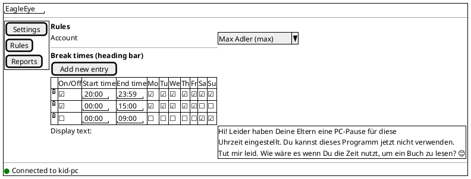
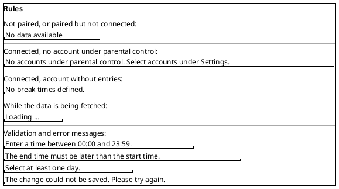
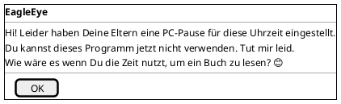
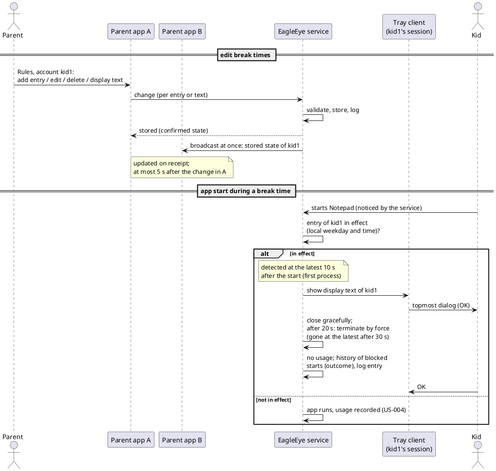

# US-005: Break Times (Ruhezeiten)

**Status**: Implemented (DEV, 2026-10-10; see `US-005/implementation-report.md`)
**Created**: 2026-10-10
**Approved**: by Michael, 2026-10-10, with his tweaks (status becomes `Analyzed` when the implementation plan is approved)
**Component(s)**: EagleEye.Service, EagleEye.TrayClient, EagleEye.ParentApp, EagleEye.Shared
**Platform(s)**: Windows (service and tray client) · ParentApp Windows

---

## User Story

As a **parent**, I want to define per kid account the times of day and the weekdays in which my kid may not use any apps on the EagleEye PC (break times), and I want the kid to see a message of my own when an app is blocked, so that my kids keep their screen-free times without me having to watch them.

---

## Background

US-003 lets the parent select the accounts under parental control, and US-004 records which apps these accounts start and how long they use them. This story is the **first enforcement story**: for each controlled account, the parent defines **break times** ("Ruhezeiten") in a new parent app page "Rules" ("Regeln"). When the kid starts an app during an active break time, the service closes it (first gracefully, then by force; at most 30 seconds from start to gone), the tray client shows the kid a message box with a text chosen by the parent, and the service keeps a history of blocked starts.

The product requirements call break times **pause windows** (TC-010 to TC-013, FR-APP-050, FR-APP-051, FR-SVC-023). This story uses Michael's term *break time* in the UI and makes the pause window requirements precise (see the amendment below). Michael's scope and clarifications are recorded in `02_Implementation/docs/requirements/user-stories/US-005/input/scope.md`, the mock in `02_Implementation/docs/requirements/user-stories/US-005/input/us-005_parentApp.png`.

This story checks **only at app start**. Apps that are already running when a break time begins keep running; ending them, and warning the kid before a break time begins (TC-040 to TC-042), come with the next story ("approaching a usage limitation"), per Michael's clarification 1.

All state in the parent app follows ADR-010 (`02_Implementation/docs/architecture/decisions/ADR-010-event-driven-state-propagation.md`): the parent app fetches on opening and on (re)connect, the service stores every change and broadcasts it to all connected parent apps. The parent app never polls, and parent apps never exchange data directly.

References: FR-SVC-010, FR-SVC-015, FR-SVC-023 (v1.5), FR-SVC-024 (v1.5, new), FR-SVC-025 (v1.5, new), FR-SVC-026 (v1.5, new), FR-SVC-030 to FR-SVC-033 (FR-SVC-032 v1.5), FR-SVC-043 (v1.5), FR-SVC-046, FR-SVC-047 (v1.5), FR-SVC-053, FR-SVC-074, FR-SVC-100, FR-TRAY-022 (v1.5, new), FR-APP-050 (v1.5), FR-APP-051, FR-APP-052 (v1.5, new), FR-APP-081, TC-010, TC-011 (v1.5), TC-012, TC-013, TC-014 (v1.5, new), MU-011, MU-014, NFR-R-011, NFR-R-012, NFR-L-010 to NFR-L-012, NFR-U-012.

**Terms used in this story**

- *Service PC*, *account*, *standard account*, *controlled account*: as in US-003 and US-004.
- *App*: as in US-004 (Terms and AC-3 to AC-6): a program with a window of its own in the user's session, as listed in Task Manager's "Apps" group. Background and Windows processes are not apps.
- *Break time entry* (short: *entry*): one row of the break time table: an on/off switch, a start time, an end time and the weekdays on which it applies. Entries belong to one controlled account.
- *Active entry*: an entry whose switch "On/Off" ("An/Aus") is ticked. An entry that is not active behaves as if it did not exist, but is kept, so that the parent can switch it on later (clarification 2).
- *In effect*: an active entry is in effect at a moment when the weekday is ticked and the time lies within the entry's time range (AC-21).
- *Start* (of an app): the creation of the app's **first process** (plan Q-1, Michael 2026-10-10). The app's window may appear later. Further processes of an app that is already open (sub-processes, a second window or process of the same app) are not new starts.
- *Blocked start*: an app start by a controlled account whose first process was created at a moment when at least one of the account's entries is in effect.
- *Display text*: the message for the kid, one per controlled account (clarification 4).
- *Rules page*: the new page of the parent app described in this story.

---

## Product requirement amendment (v1.5, approved with this story)

`02_Implementation/docs/requirements/general-product-requirements.md` gets a v1.5 amendment, approved by Michael together with this story on 2026-10-10:

- **FR-SVC-023** (changed): during a break time, an app (FR-SVC-046) whose first process the user starts while a break time is in effect (start = creation of the first process) is detected within 10 seconds, then closed gracefully; if it has not closed within 20 seconds, it is terminated by force with all its processes (FR-SVC-021, ADR-006); at most 30 seconds from the start until the app is gone. The tray client shows the account's display text as soon as the block is detected. Ignored processes (FR-SVC-015) are never ended. Apps that are already running when a break time begins are handled by TC-042 (unchanged, later story).
- **FR-SVC-025** (new): the service stores a history of blocked starts in its local database (time, account, app, matching entry, outcome, message shown), retained for 90 days and not counted as usage.
- **FR-SVC-043** (made precise): the 90-day retention also applies to the history of blocked starts.
- **FR-SVC-024** (new): the service stores per account the break time entries and the display text, persists them, serves them to parent apps on request, broadcasts every stored change at once to all connected parent apps (FR-SVC-053), and applies changes to the next app start.
- **FR-SVC-032** (made precise): the configuration per account includes the break time entries and the display text.
- **FR-SVC-047** (made precise): purging the data of a deleted account includes its break time entries, its display text and its history of blocked starts.
- **FR-SVC-026** (new, with the plan answers): the service checks the time zone of the PC regularly; each change of the time zone (and of the clock, where detected) is logged as a Warning and stored as a finding in its local database (time, old and new value, session/account if known); retention and purge as for the history of blocked starts; not shown in the parent app yet.
- **FR-TRAY-022** (new): when an app start is blocked by a break time, the tray client in the kid's session shows the account's display text in a topmost dialog that closes only with "OK" or Enter (not with Esc or Alt+F4); other windows stay usable; the keyboard focus is best effort; exclusive full-screen games may cover it.
- **FR-APP-050** (changed): break times are configured on a "Rules" page per account, as a table of entries (on/off, start time, end time, weekdays), edited in place and saved at once.
- **FR-APP-052** (new): the parent can edit the display text per account; it supports emojis.
- **TC-010** (changed): break times (pause windows) are a list of entries per account; each entry has an on/off switch, a start time, an end time and one or more weekdays.
- **TC-011** (changed): start and end time lie within one day (00:00 to 23:59), the end time is later than the start time, and the end time 23:59 means "until midnight". A break across midnight is entered as two entries (e.g. 20:00 to 23:59 and 00:00 to 07:00).
- **TC-014** (new): an entry is in effect from its start minute (inclusive) to its end minute (exclusive), in the local time and on the local weekday of the service PC.
- **§4.3 step 14** (changed): the example becomes "20:00 to 23:59 and 00:00 to 09:00".

TC-040 to TC-042 (warnings, ending running apps) stay unchanged and come with the next story.

---

## Acceptance Criteria

> **Language of UI texts** (NFR-L-010 to NFR-L-012): all UI texts quoted in these criteria and in the mockups are **English examples**, with the intended German wording in brackets. The parent app and the tray client show every text of their own, including error messages, in the Windows display language of the user: German (default) or English. The **display text** is not translated: it is shown exactly as the parent entered it. Differences in wording are notes, not Fails (US-002 Decision Q-11).

> **Test setup**: a service PC with the parent's admin account and the standard accounts `kid1` and `kid2` (both under parental control) and `kid3` (not under parental control); EagleEye service and tray client installed; two Windows parent apps A and B paired with the service (B e.g. on the second Windows PC). To test without waiting for the evening, the parent creates an entry that covers the current time, e.g. at 14:10 an entry 14:00 to 15:00 for today's weekday. Times are checked against the clock of the service PC.

> **Service log**: entries are checked in the admin-only log folder `%ProgramData%\EagleEye\logs\` (US-003 AC-14), file `EagleEye.Service-NNN.log`.

### A. Rules page in the parent app

- [ ] **AC-1**: The navigation menu of the Windows parent app has a new entry "Rules" ("Regeln") between "Settings" ("Einstellungen") and "Reports" ("Berichte"); the order is Settings, Rules, Reports. The app still opens on Reports when it is paired (ISSUE-007).
- [ ] **AC-2**: The Rules page shows, from top to bottom: the page title "Rules" ("Regeln") in the same style as the other page titles; an account selection "Account" ("Konto") that lists every controlled account, with its name and order as in US-004 AC-17 (the mock lacks it; Michael's addition); the section heading "Break times" ("Ruhezeiten") as a heading bar in the shared style of ISSUE-007 (`02_Implementation/docs/requirements/user-stories/US-004/issues/ISSUE-007.md`); the button "Add new entry" ("Eintrag hinzufügen"); the break time table; the label "Display text:" ("Anzeige Text:") with the edit box of the display text. When the page opens, the first account in the list is selected.
- [ ] **AC-3**: The break time table has the columns: delete (a trash-can icon per row, no header), "On/Off" ("An/Aus", a checkbox), "Start time" ("Start-Zeit"), "End time" ("End-Zeit"), and one checkbox column per weekday from Monday to Sunday: "Mo", "Tu", "We", "Th", "Fr", "Sa", "Su" ("MO", "DI", "MI", "DO", "FR", "SA", "SO"). Each row is one entry of the selected account, showing the values stored in the service, with times as HH:MM (e.g. "20:00", "09:00"). Rows keep their order (OQ-11). An account without entries shows the text "No break times defined." ("Keine Ruhezeiten festgelegt.") instead of rows.
- [ ] **AC-4**: The page uses only the standard colours of the app's light and dark appearance (FR-APP-083) and the accent-coloured heading bar of ISSUE-007; it does not take over the colours of the mock. All texts, checkboxes, time fields and the trash-can icon are readable and usable in light and in dark mode and at 150 % display scaling, without text being cut off.
- [ ] **AC-5**: When the parent opens the Rules page, selects another account, or the parent app (re)connects while the page is open, the table and the display text show what is currently stored in the service for the selected account. Switching the account changes the table **and** the display text (one text per account). While the data is being fetched, the page shows "Loading …" ("Wird geladen …").
- [ ] **AC-6**: States of the Rules page:
  - not paired, or paired but not connected: no account selection, no table, no edit box, text "No data available" ("Keine Daten verfügbar"), as on the other pages (US-003 AC-7/AC-8). Nothing can be edited (OQ-4);
  - connected, but no controlled account: text "No accounts under parental control. Select accounts under Settings." ("Keine Konten unter Elternkontrolle. Konten unter Einstellungen auswählen."), as on Reports (US-004 AC-20);
  - while the data is being fetched: "Loading …" ("Wird geladen …").
  If the connection is lost while the page is open, the page changes to "No data available" within the time the status bar needs to show the lost connection.

### B. Editing entries and the display text

- [ ] **AC-7**: When the parent clicks "Add new entry", a new row is added at the bottom of the table with the values On/Off **not ticked**, start time "20:00", end time "23:59" and all seven days ticked (OQ-11). The new entry is saved in the service at once, like any other change (AC-12).
- [ ] **AC-8**: All values of an entry are edited directly in the table, without an edit dialog and without a "Save" button: On/Off and each weekday by clicking the checkbox, start and end time by typing in the time field. A checkbox change is sent to the service at the click; a time is sent when the parent leaves the field or presses Enter (OQ-12).
- [ ] **AC-9**: A time must be a valid time from "00:00" to "23:59". When the parent enters an invalid time (e.g. "24:00", "12:60", "abc", or an empty field) and leaves the field, nothing is saved, the field returns to the value stored in the service, and the app shows the message "Enter a time between 00:00 and 23:59." ("Bitte eine Uhrzeit zwischen 00:00 und 23:59 eingeben."). Whether the field also accepts shorter input such as "7:30" or "730" is ARC's choice; the stored and displayed value is always HH:MM.
- [ ] **AC-10**: The end time must be later than the start time. When a change would make the end time equal to or earlier than the start time (e.g. start "20:00", end changed to "19:00" or "20:00"; or end "09:00", start changed to "10:00"), nothing is saved, the field returns to the stored value, and the app shows "The end time must be later than the start time." ("Die End-Zeit muss nach der Start-Zeit liegen."). *Note*: to move an entry from 08:00–09:00 to 10:00–11:00, the parent first changes the end time, then the start time.
- [ ] **AC-11**: At least one weekday must stay ticked. When the parent unticks the last ticked day of an entry, the change is not saved, the checkbox stays ticked, and the app shows "Select at least one day." ("Mindestens ein Tag muss ausgewählt sein.").
- [ ] **AC-12**: Every valid change (add, delete, On/Off, time, weekday, display text) is sent to the service at once. Within 5 seconds the service has stored it and writes a log entry (level Information) that names the account's user name and the change (e.g. "entry added", "entry deleted", "entry changed: on, 20:00–23:59, Mo Tu We Th Fr", "display text changed"; the display text itself does not have to be logged). The app shows the state confirmed by the service.
- [ ] **AC-13**: When the parent clicks the trash-can icon of a row, the entry is deleted at once, without a confirmation dialog, and is saved like any other change (AC-12).
- [ ] **AC-14**: An entry whose On/Off is not ticked stays in the table with all its values and can be edited, but it never blocks an app (AC-21). Ticking On/Off again makes it effective with its stored values.
- [ ] **AC-15**: The display text is shown in a multi-line edit box with line wrap. For an account whose text the parent has never changed, the box shows the default text from the mock: "Hi! Leider haben Deine Eltern eine PC-Pause für diese Uhrzeit eingestellt. Du kannst dieses Programm jetzt nicht verwenden. Tut mir leid. Wie wäre es wenn Du die Zeit nutzt, um ein Buch zu lesen? 😊" (the same German text also in an English parent app, OQ-14; English meaning: "Hi! Unfortunately your parents have set a PC break for this time. You can't use this program now. Sorry. How about using the time to read a book? 😊"). The parent can change the text like in any standard edit box; the change is saved when the parent leaves the box (OQ-12), and before the page or the account selection changes. Limits and the empty text: OQ-8.
- [ ] **AC-16**: The display text supports emojis: an emoji entered with the Windows emoji panel (Windows key + . ) or pasted from another program (e.g. "😊", "📚", "👍") is shown in the edit box, stored by the service, shown again after reopening the page and in other parent apps, and shown in the kid's message box (AC-31), each time as the same emoji.
- [ ] **AC-17**: Entries and display text are kept by the service: after closing and restarting the parent app, after restarting the service, after rebooting the service PC and after an update (re-install) of the service, the Rules page shows the same entries and text as before.
- [ ] **AC-18**: When the service cannot store a change (e.g. the connection was lost at the moment of the change), the parent app shows "The change could not be saved. Please try again." ("Die Änderung konnte nicht gespeichert werden. Bitte erneut versuchen.") as in US-003 AC-16, and the table and display text return to the state stored in the service. The app never shows entries or a text that differ from the service's stored state for longer than 5 seconds.

### C. Several parent apps, account changes, storage

- [ ] **AC-19**: When parent apps A and B are connected at the same time and both show the Rules page for the same account, every change made in A (AC-12) appears in B within 5 seconds, without any action there and without B polling. When A and B change the same value at about the same time, the last change received by the service wins, and at most 5 seconds after the last change both apps show the same state. When A deletes an entry that B is editing, B's change is rejected with the message of AC-18 and the entry disappears in B.
- [ ] **AC-20**: Entries and display text are stored per controlled account and identified by the account's Windows identity (SID, FR-SVC-074): the entries of `kid1` are never shown for, or applied to, `kid2`; renaming an account keeps its entries. When an account is unticked or becomes an admin account, its entries and text are **kept** but not applied (MU-014), and the account disappears from the account selection like on Reports (US-004 AC-23); when it is ticked again, the page shows its old entries and text, and they apply again. When the account is **deleted** on the service PC, the service purges its entries and text, within 60 seconds after the service notices the deletion (like US-004 AC-9). A new account with the same name starts with no entries and the default text. (OQ-7)

### D. Enforcement at app start

- [ ] **AC-21**: An entry is **in effect** for a controlled account when it is active, today's weekday is ticked, and the current time *t* satisfies start ≤ *t* < end, where an end time of "23:59" means midnight (24:00). Weekday and time are the local date and time of the service PC (OQ-5, OQ-10). Examples for an active entry 20:00–21:00, Monday only: Monday 19:59:59 not in effect; 20:00:00 in effect; 20:59:59 in effect; 21:00:00 not in effect; Tuesday 20:30 not in effect. An active entry 20:00–23:59, Monday: Monday 23:59:30 in effect; Tuesday 00:00:00 not in effect (unless another entry covers it). When several entries overlap, a start is blocked when at least one entry is in effect (OQ-6). For a start, *t* is the **creation time of the app's first process** (Terms, plan Q-1): a first process created at 20:00:00 or later inside the break is blocked; a first process created at 19:59:59 is allowed, even if its window appears only after 20:00.
- [ ] **AC-22**: When a controlled account starts an app (creates its first process) while at least one of its entries is in effect, the service closes the app in this sequence (OQ-13, ADR-006):
  1. it **detects** the blocked start at the latest **10 seconds** after the start;
  2. it first asks the app to **close gracefully** (as when the user closes its window), so that the app does not damage its data;
  3. if the app has not closed **20 seconds** after that request, the service **terminates it by force, with all its processes** (e.g. all `msedge.exe` processes of the Edge window just started);
  4. at the latest **30 seconds** after the start, the app is gone. Until then the kid may see and use the app; this is accepted (Michael, 2026-10-10).

  *Notes*: the service recognises an app by its window (US-004); for an app whose first window appears more than 10 seconds after its start, the bounds of steps 1 and 4 count from the appearance of the window. Right after sign-in, after a boot, or after a restart of the service's session agent, detection can take longer than 10 seconds (plan C-4, D-6); apps started in a break during that time are still caught and closed afterwards, judged by the creation time of their first process. Further processes of an app that is already open are not new starts (Terms); a second start of the same app during the close sequence is handled by OQ-17. This applies to the same apps that US-004 records (US-004 AC-3 examples: Notepad, Paint, Microsoft Edge, Calculator, Snipping Tool, Task Manager, a game), whether started by hand, from another app, or by Autostart at sign-in.
- [ ] **AC-23**: Never ended by this story: background and Windows processes (US-004 AC-5), the Windows shell and File Explorer windows ("Windows Explorer", OQ-3), the EagleEye tray client, and apps of accounts that are not controlled (e.g. `kid3`) or are admin accounts (MU-014). During a break time the kid can still use the Start menu, lock the PC, sign out and shut down. *Note*: accessibility tools (On-Screen Keyboard, Narrator, Magnifier) are apps and stay blocked during break times (plan Q-9); exceptions may come later.
- [ ] **AC-24**: When no entry is in effect, apps start and can be used as before, and their usage is recorded as in US-004. A blocked start creates no usage and no instance in the usage history of US-004, also not for the up to 30 seconds until the app is gone: the Reports page does not change because of a blocked start. It is recorded in the history of blocked starts instead (AC-35, OQ-2).
- [ ] **AC-25**: Apps that are already running when a break time begins keep running and keep counting usage; only new starts are blocked (Michael's clarification 1; the next story ends them). An app whose first process was created at 19:59 is not blocked, even if its window appears only after 20:00 (plan C-5, Q-1). Likewise, a program that was started before the break and waits in the notification area (e.g. a game launcher) is not blocked when it opens its window during the break; its first process was created before the break.
- [ ] **AC-26**: A change of the entries takes effect for app starts at the latest 5 seconds after the parent app shows the confirmed change. Example: the parent adds an entry that covers the current time and ticks On/Off; 5 seconds later, a start of Notepad by `kid1` is blocked. The parent unticks On/Off; 5 seconds later, Notepad starts normally.
- [ ] **AC-27**: Enforcement does not need a parent app: break times are applied while no parent app is connected or running, after a restart of the service and after a reboot of the service PC (TC-013, NFR-R-011).
- [ ] **AC-28**: For each blocked start, the service writes a log entry (level Information) that names the account's user name, the app's display name, process name and program path, the entry that was in effect (e.g. "break time 20:00–23:59"), the outcome ("closed gracefully" or "terminated by force after 20 s") and whether the message was shown to the kid (AC-33). This log entry is kept in addition to the history of AC-35.
- [ ] **AC-29**: Starting allowed apps outside break times is not noticeably slower than before this story (NFR-P-010).

### E. Message to the kid (tray client)

- [ ] **AC-30**: For each blocked start, the tray client in the session of that account shows a message box with the title "EagleEye", the account's display text, and one button "OK" ("OK"). The message box appears as soon as the block is detected, i.e. within the detection bound of AC-22 (normally at the latest 10 seconds after the start), without waiting for the close sequence of AC-22 to finish (OQ-16). It is a **topmost dialog**: it appears in front of all normal windows, including maximised and borderless full-screen windows; other windows stay usable behind it (it is not system-modal). It closes only with "OK" or Enter, not with Esc or Alt+F4, and never by itself; signing out stays possible. The keyboard focus is **best effort**: the dialog normally gets the focus at once, at the latest when the blocked app's window closes (plan C-2, Q-5). **Exclusive full-screen games** may cover the dialog until the game is closed.
- [ ] **AC-31**: The message box shows the display text exactly as stored for the account at the moment of the blocked start, with its line breaks and emojis (AC-16). An emoji such as "😊" is shown as a recognisable smiley; a monochrome emoji is acceptable. A changed display text is used for blocked starts from at most 5 seconds after the parent app shows the confirmed change. The title and the button follow the kid's Windows display language.
- [ ] **AC-32**: Only one message box is open at a time per session (OQ-1): when the kid starts further apps while the message box is still open, these apps are closed as well (AC-22), but no second message box appears. After "OK", the next blocked start shows a new message box.
- [ ] **AC-33**: When the tray client is not running or not connected to the service at the moment of a blocked start, the app is closed all the same (AC-22, NFR-R-012), no message is shown later, and the log entry of AC-28 says that the message was not shown (OQ-9).
- [ ] **AC-34**: Break times of one account never affect another: while a break time of `kid1` is in effect, `kid2` (controlled, no entry in effect) can start apps normally, e.g. after "Switch user" ("Benutzer wechseln"), and the message box appears only in `kid1`'s session.

### F. History of blocked starts

- [ ] **AC-35**: For each blocked start, the service stores a record in the history of blocked starts in its local database, with: the time of the start, the account (Windows identity and user name), the app's display name, process name and program path, the entry that was in effect (start time, end time, weekday), the outcome ("closed gracefully" or "terminated by force", with the seconds from the close request until the app was gone), and whether the message was shown to the kid (AC-33). The history survives restarts of the service and reboots. *Verification*: the log entry of AC-28 carries the same data; the implementation plan names how TES can additionally inspect the stored records as an administrator.
- [ ] **AC-36**: The history of blocked starts is kept for 90 days like the usage history (FR-SVC-043) and older records are purged automatically; when the account is deleted on the service PC, its records are purged with its other data (AC-20, FR-SVC-047). It counts no usage (AC-24) and is **not shown** in the parent app in this story (OQ-18).

### G. Time-zone findings

- [ ] **AC-37**: The service checks the time zone of the service PC regularly (break times use the local time, OQ-5). Each change of the time zone, and each change of the clock if the service detects it, takes effect for break times within 5 seconds, is written to the service log as a **Warning** (English example: "The time zone of the PC changed from W. Europe Standard Time to Pacific Standard Time; break times now use the new local time."), and is stored as a **finding** in the service's local database with the time, the old and the new time zone (or clock time), and the session or account that made the change if known. The findings are kept for 90 days and purged like the history of blocked starts (AC-36); an account's findings are purged with the account. They are **not shown** in the parent app in this story (a later story may show such warnings). *Background*: Windows lets every standard user change the time zone, so a kid could move out of a break time (plan TI-7, Q-2). *Verification*: the Warning in the service log; as for AC-35, the plan names how TES can inspect the stored findings.

### Change Log

| Date | Change | Source |
|---|---|---|
| 2026-10-10 | Story created; product requirements v1.5 amendment proposed | Michael's scope and clarifications (`US-005/input/scope.md`, mock), written by PRO |
| 2026-10-10 | Story approved; OQ-1 to OQ-18 answered (proposed defaults accepted, tweaks: timing 10 s + 20 s graceful/force, blocked-start history); requirements v1.5 approved. Changed: AC-22 (detect ≤ 10 s, graceful close, force after 20 s, gone ≤ 30 s), AC-24, AC-28, AC-30 (message box on detection), AC-32, AC-33, OQ-2, OQ-13; added: AC-35, AC-36 (history of blocked starts), OQ-16 to OQ-18, FR-SVC-025, FR-SVC-043 and FR-SVC-047 made precise; FR-SVC-023 now follows ADR-006 | Michael (via the Orchestrator), written by PRO |
| 2026-10-10 | Implementation plan approved with answers Q-1 to Q-9; ACs adjusted (start = first process, time-zone findings stored, topmost dialog); status `Analyzed`. Changed: Terms (start, blocked start), AC-21, AC-22, AC-25, AC-30, OQ-5, OQ-13, OQ-16, OQ-17, FR-SVC-023, FR-TRAY-022; added: AC-37 (time-zone findings), FR-SVC-026, note on accessibility tools (AC-23), Out of Scope (time-zone right) | Michael |
| 2026-10-10 | Implemented as version 0.5.0 (installers `EagleEye-Setup-0.5.0.exe`, `EagleEye-ParentApp-Setup-0.5.0.exe`); status `Implemented`. Report: `US-005/implementation-report.md` | DEV |

---

## UI / Interaction Notes

### Rules — connected, account with entries (AC-1 to AC-3, AC-15)

Colours follow the app's light/dark appearance; the heading bar "Break times" uses the accent colour of ISSUE-007. "☑" / "☐" stand for checkboxes, quoted values in the table for editable time fields.

The third entry is switched off: it is kept, but it does not block anything (AC-14).

### Rules — page states and messages (AC-3, AC-6, AC-9 to AC-11, AC-18)

### Message box in the kid's session (AC-30, AC-31)

Topmost dialog in front of all normal windows (not system-modal); closes only with "OK" or Enter.

### Flow overview

---

## Out of Scope

- Apps that are already running when a break time begins: they are not ended in this story (Michael's clarification 1; next story "approaching a usage limitation", TC-042).
- Warnings before a break time begins (TC-040, TC-041), remaining-time display in the tray client.
- Breaks across midnight within one entry (clarification 3); they are entered as two entries.
- A main switch for all break times of an account (clarification 2: the per-entry On/Off is the only switch).
- Allow-lists, per-app budgets, per-app break times (§10), exceptions for single apps.
- Showing blocked starts in the parent app (events, FR-APP-070, or a view of the history of blocked starts) or in the reports (OQ-2, OQ-18). The history is recorded only (AC-35).
- Preventing the app from starting at all: the kid may see and use a blocked app for up to 30 seconds (AC-22).
- Copying entries between accounts, templates, holidays or date-based exceptions.
- Parent app for Android, iOS and macOS. This story covers the **Windows** parent app only (built and tested on the Windows Developer Machine). The Rules page must not block the later mobile layout (FR-APP-080, FR-APP-082).
- Protection against a kid who pairs their own parent app and deletes their own break times (OQ-15).
- Removing the right "Change the time zone" from the Windows group *Users* (installer hardening against the time-zone bypass, plan TI-7, Q-2): a possible later hardening. US-005 only detects, logs and stores time-zone changes (AC-37).

---

## Open Questions (answered by Michael, 2026-10-10)

Each question had a proposed default. Michael accepted all of them, with his tweaks to OQ-2 and OQ-13 (and the resulting OQ-16 to OQ-18). Michael's clarifications 1 to 4 (`US-005/input/scope.md`) are settled and not asked again.

| ID | Question | Proposed default | Answer |
|---|---|---|---|
| OQ-1 | **Several blocked starts in a row.** When the kid starts several apps quickly (or Autostart starts several apps at sign-in during a break time), should every blocked start open its own message box, so that boxes stack up? | **One message box at a time per session** (AC-32). Further blocked starts while it is open are closed (AC-22) without a box, and logged and recorded (AC-28, AC-35); after "OK" the next blocked start shows a box again. | Answer (Michael, 2026-10-10): proposed default accepted |
| OQ-2 | **Are blocked starts recorded?** In the service log, in the app history, and/or in the Reports page (with a usage of about "00:00")? | *Changed by Michael's tweak:* **service log (AC-28) and a history of blocked starts in the service's local database (AC-35)**, because Michael may use the data later. No usage-history instance and no usage, so the Reports page does not change (AC-24). The app may still get its app record in the inventory (US-004 AC-7), which is not visible. Showing blocked attempts to the parent (FR-APP-070, events) is a later story (OQ-18). | Answer (Michael, 2026-10-10): changed as described (blocked-start history added) |
| OQ-3 | **Exemptions.** Do the exclusions of US-004 (background and Windows processes, tray client) stay exempt, and does "Windows Explorer" (File Explorer windows) stay exempt, although US-004 records it as an app? | **Yes, all stay exempt** (AC-23). File Explorer windows are not closed: `explorer.exe` stays on the ignore list for enforcement (ADR-005, US-004 OQ-3), because ending it would end the taskbar and Start menu. All other apps that US-004 records are blocked, including Task Manager and the Windows Settings app. | Answer (Michael, 2026-10-10): proposed default accepted |
| OQ-4 | **Editing while not connected.** Should the parent be able to edit break times offline (shown from a cache, sent later)? | **No.** Not connected → "No data available", nothing can be edited (AC-6), as on the Settings and Reports pages (US-003 OQ-5). The app never shows outdated rules. | Answer (Michael, 2026-10-10): proposed default accepted |
| OQ-5 | **Time base and daylight saving time.** Which clock and which weekday count? | The **local time and local weekday of the service PC** (the kid's PC), not the time of the parent app's device. Entries are wall-clock times: on the day clocks go forward, a break time inside the skipped hour simply does not happen; on the day clocks go back, a break time in the repeated hour applies in both passes. A change of the time zone or clock takes effect within 5 seconds (plan C-3), and each change is logged and stored as a finding (AC-37). | Answer (Michael, 2026-10-10): proposed default accepted; time-zone findings added with the plan answers (Q-2) |
| OQ-6 | **Overlapping entries.** May entries overlap (e.g. 18:00–21:00 and 20:00–23:59 on the same day), or must the app refuse them? | **Allowed, no warning.** A start is blocked when at least one active entry is in effect (AC-21). Duplicates are harmless. | Answer (Michael, 2026-10-10): proposed default accepted |
| OQ-7 | **Account loses controlled status / is deleted.** Keep or delete its rules? | **Unticked or admin: kept, not applied**, shown again when ticked again. **Deleted on the service PC: purged** with the other data of the account, within 60 s after the service notices it (AC-20, as US-004 AC-9, FR-SVC-047). | Answer (Michael, 2026-10-10): proposed default accepted |
| OQ-8 | **Limits and the empty text.** Maximum length of the display text? Line breaks? What if the parent deletes the whole text? Maximum number of entries per account? | Display text: **at most 500 characters** (the box stops accepting more), **line breaks allowed**. An **empty text** (or only spaces) is not stored: when the parent leaves the empty box, the default text of AC-15 is restored and saved. At most **20 entries per account**; at 20, "Add new entry" is disabled. | Answer (Michael, 2026-10-10): proposed default accepted |
| OQ-9 | **Tray client not running** (ended, crashed, not yet started) when an app is blocked: still end the app? Show the message later? | **Still end the app** (enforcement never depends on the tray client, NFR-R-012); **no delayed message**; the log entry says "message not shown" (AC-33). | Answer (Michael, 2026-10-10): proposed default accepted |
| OQ-10 | **Boundaries.** Is the start minute included, the end minute excluded? What does "23:59" mean exactly? | Start **inclusive**, end **exclusive**: entry 20:00–21:00 blocks from 20:00:00 to 20:59:59. End "23:59" means **until 24:00** (clarification 3), so 23:59:30 is blocked. As a consequence, an end of "23:59" cannot mean "until 23:58:59"; "23:58" is the closest alternative. | Answer (Michael, 2026-10-10): proposed default accepted |
| OQ-11 | **New entry and row order.** Which values does "Add new entry" create? Where does the row go, and are rows re-sorted? | New entry: **On/Off not ticked**, **20:00–23:59**, **all seven days ticked** (AC-7), so that adding an entry never blocks the kid by surprise; the parent then adjusts it and switches it on. The row is added **at the bottom**; rows stay in the order of creation and are not re-sorted while editing (no jumping rows). | Answer (Michael, 2026-10-10): proposed default accepted |
| OQ-12 | **When exactly is a typed value saved?** Saving on every keystroke would store half-typed times and texts. | Checkboxes and trash can: **at the click**. Time fields: **when the parent leaves the field or presses Enter**. Display text: **when the parent leaves the edit box**, and before the account selection or the page changes (AC-8, AC-15). Closing the app while typing may lose the unsaved text. | Answer (Michael, 2026-10-10): proposed default accepted |
| OQ-13 | **How fast is "immediately", and how is the app ended?** The service notices apps by their window (US-004, about once per second), so the kid may see the app's window briefly. | *Michael's tweak (replaces the first proposal "ended at once without graceful close, within 5 s"):* **detected within 10 s** after the start (creation of the first process, plan Q-1; counted from the first window if that appears later; longer right after sign-in, boot or an agent restart, AC-22); then a **graceful close**; if the app has not closed **20 s** later, **forced termination** of all its processes; **at most 30 s** from start to gone (AC-22). The kid seeing the app for up to 30 s is acceptable. In line with ADR-006 (graceful, then force). Preventing the start altogether is not required. | Answer (Michael, 2026-10-10): changed as described |
| OQ-16 | **When does the message box appear?** As soon as the block is detected, or only after the app is gone? | **As soon as the block is detected**, i.e. normally at the latest 10 s after the start, while the close sequence still runs (AC-30). The kid learns at once why the app closes. | Proposed by PRO after Michael's tweak; accepted with the approval (2026-10-10) |
| OQ-17 | **Second start of the same app during the close sequence.** The kid starts the same app again while the first instance is still being closed. | *Adjusted to plan Q-1 (start = first process):* while the first instance is still being closed, the app is still open, so the second start's processes are **not a new start**: no own history record, no second message box; they are closed with the running sequence (at the latest by the forced termination of all the app's processes). Once the app is gone, a new start of it is a new blocked start (AC-22, AC-35). | Proposed by PRO after Michael's tweak; accepted with the approval (2026-10-10); adjusted to plan Q-1 (Michael, 2026-10-10) |
| OQ-18 | **History of blocked starts: retention, purge, display, usage.** | **90 days**, like the usage history (FR-SVC-043); **purged with the account** (FR-SVC-047); **not shown in the parent app** in this story (a later story); **no usage time** (AC-24, AC-36). Content as in AC-35. | Michael's proposal (via the Orchestrator), accepted with the approval (2026-10-10) |
| OQ-14 | **Language of the default text.** The default text is German. Should an English parent app or an English kid's Windows get an English default? | **One default text, the German text from the mock**, for every account and language (AC-15). The display text is the parent's own text and is never translated; an English-speaking parent overwrites it once. | Answer (Michael, 2026-10-10): proposed default accepted |
| OQ-15 | **Kid pairs their own parent app.** US-003 OQ-7 kept this as an accepted risk "until the first enforcement story"; this is that story. The pairing code appears in the kid's tray (US-002 Decision Q-8), so a kid could pair a parent app and delete their own break times. | **Keep it an accepted risk in this story** (as decided for US-002 on 2026-10-04: no technical protection for now). Every change is logged with the account name (AC-12), so the parent can see it. A protection (e.g. pairing code only to admins, or a parent PIN) becomes a separate story when Michael wants it. | Answer (Michael, 2026-10-10): proposed default accepted |

---

## Related

- Prerequisite stories: US-001 (service, tray client, installer), US-002 (Windows parent app, pairing), US-003 (accounts under parental control), US-004 (app recording, Reports page; ISSUE-007 heading bar and start page)
- Input: `02_Implementation/docs/requirements/user-stories/US-005/input/scope.md`, `02_Implementation/docs/requirements/user-stories/US-005/input/us-005_parentApp.png`
- General product requirements: v1.5 amendment (FR-SVC-023, FR-SVC-024, FR-SVC-025, FR-SVC-026, FR-SVC-032, FR-SVC-043, FR-SVC-047, FR-TRAY-022, FR-APP-050, FR-APP-052, TC-010, TC-011, TC-014, §4.3 step 14), approved by Michael together with this story on 2026-10-10
- Architecture: ADR-005 (ignore list, OQ-3), ADR-006 (graceful-then-force termination, used for blocked starts with a 20 s timeout, FR-SVC-023 v1.5), ADR-010 (event-driven state propagation), ADR-011 (session agent)
- Next story: approaching a usage limitation (warnings, ending running apps at the start of a break time, TC-040 to TC-042)
- Implementation Plan: `US-005/implementation-plan.md` (added by ARC)
- Issues: `US-005/issues/` (added by TES)
- Manual tests: `docs/testing/US-005/` (added by TES)
